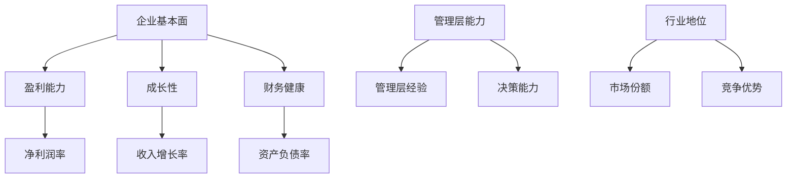
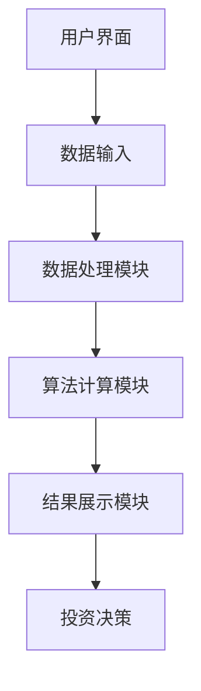

                 


# 彼得林奇的"讲故事"投资法

## 关键词：彼得·林奇，投资法，故事化分析，投资策略，系统设计，算法原理

## 摘要：彼得·林奇的"讲故事"投资法是一种以基本面分析为核心的股票投资方法，通过深入研究公司背景、财务数据和行业地位，构建投资组合。本文从背景、原理、算法、系统设计、实战案例等多个角度详细解析该投资法，为投资者提供深度的分析和实践指导。

---

## 第一部分：背景介绍

### 第1章：彼得林奇"讲故事"投资法概述

#### 1.1 "讲故事"投资法的起源

彼得·林奇是美国著名的职业基金经理，以其独特的"讲故事"投资法闻名。这种方法强调通过深入分析公司的基本面，寻找那些能够持续增长的优秀企业进行投资。林奇的投资理念源于他对市场研究的执着追求，他认为，成功的投资不仅需要分析数字，还需要理解企业的商业模式和行业地位。

#### 1.2 投资法的核心概念

"讲故事"投资法的核心在于通过对企业历史、财务数据、行业地位和管理层能力的全面分析，构建一个"故事"，从而判断企业的未来发展前景。这种方法与传统的技术分析不同，更注重企业的内在价值和长期潜力。

#### 1.3 与其他投资方法的区别

与其他投资方法相比，"讲故事"投资法更注重长期价值，而非短期价格波动。它通过对企业基本面的深入研究，寻找那些被市场低估的优质企业，从而实现长期稳定的收益。

---

## 第二部分：核心概念与联系

### 第2章：彼得林奇投资理念的原理

#### 2.1 投资理念的原理

彼得·林奇的投资理念可以总结为以下几点：

- **企业基本面分析**：通过分析企业的财务报表，评估其盈利能力、成长性和财务健康状况。
- **管理层能力**：关注企业管理层的背景、经验和决策能力，判断其是否能够带领企业持续发展。
- **行业地位**：分析企业在行业中的地位，判断其是否具备竞争优势。

#### 2.2 核心概念对比表

| 投资理念 | 具体内容                   |
|----------|--------------------------|
| 企业基本面 | 收益能力、成长性、财务健康 |
| 管理层能力 | 经验、决策能力             |
| 行业地位   | 市场份额、竞争优势         |

#### 2.3 实体关系图



---

## 第三部分：算法原理讲解

### 第3章：彼得林奇投资模型的算法

#### 3.1 算法原理

彼得·林奇的投资模型可以通过以下步骤进行分析：

1. **收集数据**：获取企业的财务报表、行业数据和管理层信息。
2. **评估基本面**：计算关键指标，如市盈率、市净率、ROE（净资产收益率）等。
3. **判断管理层能力**：分析管理层的背景和决策能力。
4. **行业分析**：评估企业在行业中的地位和竞争优势。
5. **综合评估**：结合以上分析，判断企业的投资价值。

#### 3.2 代码实现

以下是实现上述算法的Python代码示例：

```python
def calculate_roe(net_income, shareholders_equity):
    return net_income / shareholders_equity

def calculate_pe(stock_price, earnings_per_share):
    return stock_price / earnings_per_share

def is_good_management(management_experience, management_decision):
    return management_experience > 5 and management_decision > 7

def main():
    # 示例数据
    net_income = 1000000
    shareholders_equity = 5000000
    stock_price = 50
    earnings_per_share = 5
    management_experience = 10
    management_decision = 8

    # 计算指标
    roe = calculate_roe(net_income, shareholders_equity)
    pe = calculate_pe(stock_price, earnings_per_share)
    management_score = is_good_management(management_experience, management_decision)

    # 综合评估
    if roe > 15 and pe < 15 and management_score:
        print("投资价值高")
    else:
        print("投资价值一般")

if __name__ == "__main__":
    main()
```

#### 3.3 数学模型

彼得·林奇投资模型的关键数学模型包括：

- 净资产收益率（ROE）：$$ROE = \frac{\text{净利润}}{\text{股东权益}}$$
- 市盈率（PE）：$$PE = \frac{\text{股价}}{\text{每股收益}}$$

---

## 第四部分：系统分析与架构设计方案

### 第4章：投资系统分析

#### 4.1 问题场景介绍

在实际投资过程中，投资者需要处理大量的数据和信息。为了提高效率，可以构建一个基于彼得·林奇投资法的投资管理系统。

#### 4.2 系统架构设计

以下是系统的架构设计：



---

## 第五部分：项目实战

### 第5章：实际案例分析

#### 5.1 案例分析

以某公司为例，分析其是否符合彼得·林奇的投资标准。

1. **企业基本面**：计算ROE和PE。
2. **管理层能力**：评估管理层的经验和决策能力。
3. **行业地位**：分析企业在行业中的市场份额和竞争优势。

---

## 第六部分：最佳实践与小结

### 第6章：投资策略的优化与调整

#### 6.1 最佳实践

- 定期更新企业数据和行业分析。
- 结合市场变化及时调整投资策略。
- 保持对企业的持续关注和分析。

#### 6.2 小结

彼得·林奇的"讲故事"投资法通过对企业基本面、管理层能力和行业地位的深入分析，帮助投资者发现具有长期投资价值的企业。这种方法不仅适用于个人投资者，也可以应用于机构投资。

---

## 第七部分：拓展阅读与深入探讨

### 第7章：相关书籍与文献推荐

#### 7.1 拓展阅读

- 《彼得·林奇的选股术》
- 《投资最重要的事》
- 《价值投资入门》

#### 7.2 深入探讨

彼得·林奇的投资法在全球范围内被广泛应用，未来可以通过结合人工智能和大数据技术进一步优化投资策略。

---

## 作者

作者：AI天才研究院/AI Genius Institute & 禅与计算机程序设计艺术 /Zen And The Art of Computer Programming

