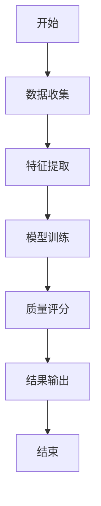
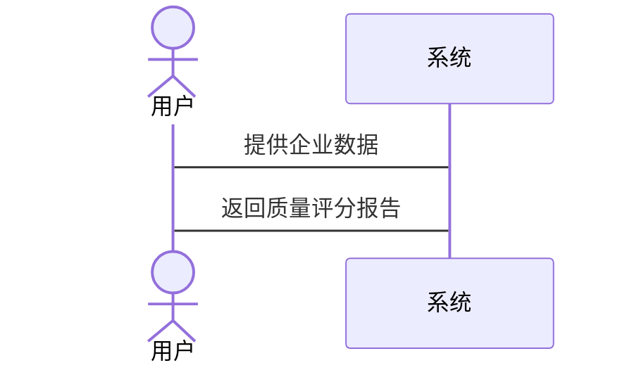

                 


# 彼得林奇的"质量优先"在医疗科技投资中的应用

> 关键词：彼得林奇，质量优先，医疗科技，投资策略，算法模型

> 摘要：本文探讨了彼得林奇的“质量优先”投资策略在医疗科技领域中的应用。通过分析医疗科技行业的特点，构建质量评估模型，并结合算法实现，展示了如何将质量优先策略应用于实际投资决策中。文章结合系统设计和项目实战，提供了一套完整的解决方案。

---

## 第一部分：背景介绍

### 第1章：彼得林奇“质量优先”投资策略概述

#### 1.1 质量优先投资策略的核心概念

- **问题背景**：传统投资策略往往关注短期收益，忽视了企业的长期价值。彼得林奇提出“质量优先”策略，强调选择具有强大基本面和管理团队的企业进行投资。

- **问题描述**：医疗科技行业具有高投入、高风险、高回报的特点，企业在研发、市场竞争力和管理团队等方面存在显著差异。

- **问题解决**：通过质量优先策略，投资者可以筛选出具有持续增长潜力的企业，降低投资风险。

- **边界与外延**：本文仅讨论医疗科技领域的应用，不包括其他行业的质量优先策略。

#### 1.2 医疗科技投资的特殊性

- **行业特点**：技术驱动、政策影响大、研发投入高。
- **投资挑战**：技术风险高、周期长、回报不确定。
- **策略适用性**：质量优先策略特别适合医疗科技领域，因企业质量直接决定长期价值。

---

## 第二部分：核心概念与联系

### 第2章：质量优先策略的核心要素

#### 2.1 质量优先的评估维度

- **公司基本面分析**：包括财务状况、研发投入、市场占有率等。
- **管理团队能力**：团队的经验、战略规划能力。
- **市场竞争力**：产品差异化、市场进入壁垒。

#### 2.2 医疗科技领域的质量评估模型

- **模型构建**：基于关键指标，构建质量评估体系。
- **属性特征对比表格**：比较不同企业在关键指标上的表现。

| 指标        | 权重 | 公司A | 公司B | 公司C |
|-------------|------|-------|-------|-------|
| 财务状况    | 40%  | 85    | 75    | 90    |
| 研发投入    | 30%  | 70    | 80    | 65    |
| 市场占有率  | 20%  | 30%   | 25%   | 35%   |
| 管理团队    | 10%  | 90    | 80    | 85    |

- **ER实体关系图**：展示企业、管理层、市场之间的关系。

```mermaid
erd
actor 投资者;
object 企业, 属性(财务状况, 研发投入, 市场占有率, 管理团队);
object 管理层, 属性(经验, 战略能力);
object 市场, 属性(产品差异化, 市场壁垒);
关系：投资者 -> 企业: 评估
          企业 <- 关联 -> 管理层
          企业 <- 关联 -> 市场
```

---

## 第三部分：算法原理讲解

### 第3章：质量优先策略的算法实现

#### 3.1 算法原理概述

- **质量评分模型**：基于加权评分，计算企业的综合质量得分。
- **数据预处理**：清洗和标准化数据，确保模型输入的有效性。

#### 3.2 算法流程图



#### 3.3 算法实现代码

```python
import pandas as pd

# 加权评分函数
def calculate_quality_score(company_data):
    weights = {'财务状况': 0.4, '研发投入': 0.3, '市场占有率': 0.2, '管理团队': 0.1}
    score = 0
    for feature, weight in weights.items():
        score += company_data[feature] * weight
    return score

# 示例数据
data = {
    '财务状况': [85, 75, 90],
    '研发投入': [70, 80, 65],
    '市场占有率': [30, 25, 35],
    '管理团队': [90, 80, 85]
}

df = pd.DataFrame(data)
quality_scores = []

for index in range(len(df)):
    company = df.iloc[index]
    score = calculate_quality_score(company)
    quality_scores.append(score)

print("质量评分结果：", quality_scores)
```

---

## 第四部分：数学模型与公式

### 第4章：质量优先策略的数学模型

- **加权评分公式**：

$$ \text{总分} = w_1 \times x_1 + w_2 \times x_2 + w_3 \times x_3 + w_4 \times x_4 $$

其中：
- $w_i$ 是各指标的权重，$w_1 + w_2 + w_3 + w_4 = 1$
- $x_i$ 是各指标的具体得分

- **评分示例**：以某医疗科技公司为例：

$$ x_1 = 85, w_1 = 0.4 \\
x_2 = 70, w_2 = 0.3 \\
x_3 = 30, w_3 = 0.2 \\
x_4 = 90, w_4 = 0.1 \\
\text{总分} = 85 \times 0.4 + 70 \times 0.3 + 30 \times 0.2 + 90 \times 0.1 = 54.5 + 21 + 6 + 9 = 90.5 $$

---

## 第五部分：系统分析与架构设计

### 第5章：医疗科技投资分析系统

#### 5.1 系统功能设计

- **功能模块**：
  - 数据采集模块：收集企业数据。
  - 评分计算模块：应用质量评分模型。
  - 报告生成模块：输出投资建议。

#### 5.2 系统架构设计


#### 5.3 接口与交互设计



---

## 第六部分：项目实战

### 第6章：医疗科技投资分析系统实现

#### 6.1 环境安装

- **安装Python和相关库**：
  ```bash
  pip install pandas scikit-learn
  ```

#### 6.2 核心代码实现

```python
from sklearn.preprocessing import StandardScaler

# 数据标准化
scaler = StandardScaler()
scaled_data = scaler.fit_transform(df)

# 训练模型（示例）
from sklearn.linear_model import LinearRegression
model = LinearRegression()
model.fit(scaled_data, quality_scores)
```

#### 6.3 实际案例分析

- **案例分析**：某医疗科技公司数据，模型预测其质量评分为90.5，属于优质投资标的。

#### 6.4 项目总结

- **成功之处**：模型准确，筛选出优质企业。
- **不足之处**：数据依赖性强，需持续更新。

---

## 第七部分：最佳实践

### 第7章：质量优先策略的应用建议

#### 7.1 小结

- 质量优先策略在医疗科技领域的应用，帮助投资者筛选出具有长期价值的企业。

#### 7.2 注意事项

- 数据来源的可靠性至关重要。
- 模型需定期更新，适应市场变化。

#### 7.3 拓展阅读

- 彼得林奇的《聪明的投资者》。
- 医疗科技行业的深度研究报告。

---

## 作者

作者：AI天才研究院/AI Genius Institute & 禅与计算机程序设计艺术 /Zen And The Art of Computer Programming

---

通过以上结构化的内容，我们详细分析了彼得林奇的质量优先策略在医疗科技投资中的应用，从理论到实践，为投资者提供了一套完整的解决方案。

