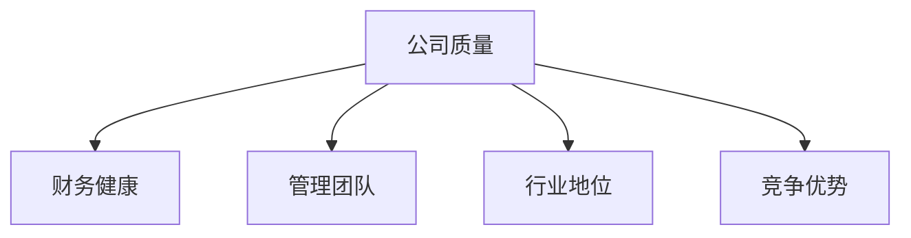
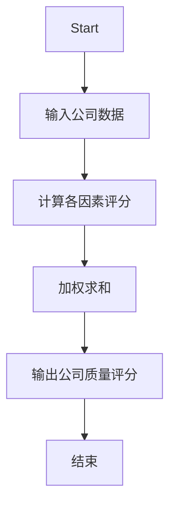
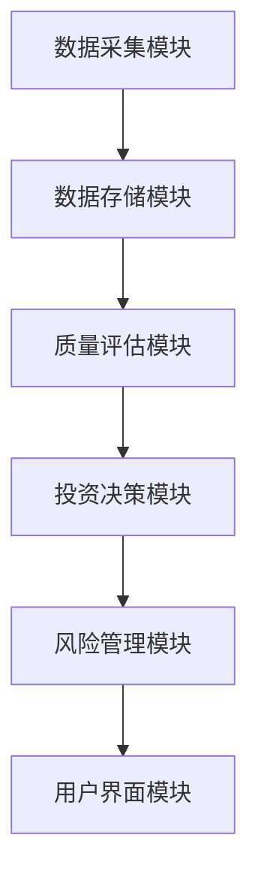
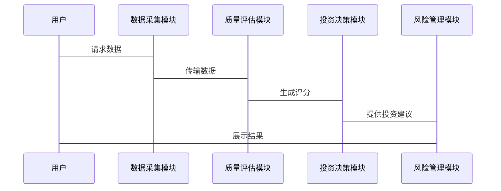

                 


# 彼得林奇的"质量优先"在新兴市场投资中的实践挑战

> 关键词：彼得林奇，质量优先，新兴市场，投资策略，风险管理

> 摘要：本文探讨了彼得林奇提出的“质量优先”投资策略在新兴市场的实践挑战。通过分析新兴市场的特点、质量优先策略的核心要素及其在新兴市场的适用性，本文详细阐述了如何在新兴市场中应用质量优先策略，包括算法原理、系统架构设计和项目实战等内容。最后，本文总结了最佳实践和注意事项，为投资者提供了有价值的指导。

---

## 第一部分：彼得林奇的"质量优先"投资策略概述

### 第1章：质量优先投资策略的定义与背景

#### 1.1 质量优先的定义与核心理念
- **质量优先**：选择具有强大财务健康、优秀管理团队、稳固行业地位和竞争优势的公司进行投资。
- **核心理念**：通过关注公司的质量而非短期价格波动，实现长期稳健的投资回报。
- **新兴市场的结合**：新兴市场的高增长潜力和复杂性使得质量优先策略的应用更具挑战性。

#### 1.2 彼得林奇投资策略的背景
- **彼得林奇的背景**：著名投资家，曾管理富达麦哲伦基金，以长期优异的业绩闻名。
- **质量优先策略的形成与发展**：基于对公司的深入研究和长期跟踪，强调选择具有竞争优势和持续增长潜力的公司。
- **新兴市场的特点与投资机会**：新兴市场通常具有较高的增长潜力，但也伴随着较高的波动性和不确定性。

---

### 第2章：质量优先策略在新兴市场的实践挑战

#### 2.1 新兴市场的特点与风险
- **新兴市场的定义与分类**：包括中国、印度、巴西等国家的股市，具有较高的波动性和不透明性。
- **投资风险**：政策风险、市场波动、信息不对称、公司治理问题等。
- **新兴市场的独特优势**：高增长潜力、估值相对较低、未被充分挖掘的投资机会。

#### 2.2 质量优先策略在新兴市场的适用性
- **核心要素**：财务健康、管理团队、行业地位、竞争优势。
- **新兴市场与成熟市场的对比**：
  - 成熟市场：公司治理透明、财务信息可靠、市场波动较小。
  - 新兴市场：公司治理不完善、财务信息不透明、市场波动较大。
- **质量优先策略在新兴市场的可行性**：需要更加严格的筛选标准和持续的跟踪分析。

---

## 第二部分：质量优先策略的核心概念与联系

### 第3章：质量优先策略的核心原理

#### 3.1 质量优先策略的核心要素
- **财务健康**：关注公司的盈利能力、资产负债情况、现金流状况。
- **管理团队**：考察管理团队的经验、稳定性及战略眼光。
- **行业地位**：评估公司在行业内的竞争地位、市场份额和创新能力。
- **竞争优势**：分析公司的核心竞争力，如技术壁垒、成本优势等。

#### 3.2 核心概念的对比分析
- **质量优先与价值投资的对比**：
  - 价值投资：寻找市场价格低于内在价值的公司。
  - 质量优先：注重公司的内在质量和长期增长潜力。
- **质量优先与成长投资的对比**：
  - 成长投资：侧重于选择高增长潜力的公司。
  - 质量优先：在成长性和质量之间寻找平衡。
- **质量优先与指数投资的对比**：
  - 指数投资：通过跟踪市场指数分散风险。
  - 质量优先：通过精选优质公司实现超额收益。

#### 3.3 实体关系图（ER图）


---

### 第4章：质量优先策略的算法原理

#### 4.1 算法原理概述
- **多因素模型**：综合考虑多个因素，如盈利能力、成长性、财务杠杆等，对公司的质量进行评分。
- **权重分配**：根据各因素的重要性进行权重分配，如盈利能力占40%，成长性占30%，财务杠杆占20%，竞争优势占10%。
- **评分系统**：将各因素的评分加权求和，得出公司的综合质量评分。

#### 4.2 算法流程图


#### 4.3 Python代码实现
```python
import pandas as pd

# 定义质量评分函数
def calculate_quality_score(finance_health, management_team, industry_position, competitive_advantage):
    weights = {'finance_health': 0.4, 'management_team': 0.3, 'industry_position': 0.2, 'competitive_advantage': 0.1}
    score = (finance_health * weights['finance_health'] +
             management_team * weights['management_team'] +
             industry_position * weights['industry_position'] +
             competitive_advantage * weights['competitive_advantage'])
    return score

# 示例数据
data = {
    '公司名称': ['公司A', '公司B', '公司C'],
    '财务健康': [0.8, 0.7, 0.9],
    '管理团队': [0.6, 0.8, 0.7],
    '行业地位': [0.7, 0.6, 0.8],
    '竞争优势': [0.5, 0.4, 0.6]
}

df = pd.DataFrame(data)

# 计算质量评分
df['质量评分'] = df.apply(lambda x: calculate_quality_score(x['财务健康'], x['管理团队'], x['行业地位'], x['竞争优势']), axis=1)

print(df)
```

---

## 第三部分：系统分析与架构设计方案

### 第5章：质量优先策略的系统架构设计

#### 5.1 项目介绍
- **项目名称**：基于质量优先策略的新兴市场投资系统。
- **项目目标**：通过自动化筛选和分析，帮助投资者识别新兴市场中的优质公司。

#### 5.2 系统功能设计
- **数据采集**：获取新兴市场的公司数据，包括财务数据、行业信息等。
- **质量评估**：基于多因素模型计算公司的质量评分。
- **投资决策**：根据评分结果生成投资组合建议。
- **风险管理**：监控投资组合的表现，及时调整策略。

#### 5.3 系统架构图


#### 5.4 系统接口设计
- **数据接口**：与数据源（如股票数据库）对接，获取实时数据。
- **用户接口**：提供友好的用户界面，展示质量评分和投资建议。

#### 5.5 系统交互序列图


---

## 第四部分：项目实战

### 第6章：质量优先策略的实战应用

#### 6.1 环境安装
- **Python环境**：安装Python 3.8及以上版本。
- **库的安装**：安装pandas、numpy、scikit-learn等库。

#### 6.2 核心实现代码
```python
import pandas as pd
import numpy as np

# 定义质量评分函数
def calculate_quality_score(row):
    finance_health = row['财务健康']
    management_team = row['管理团队']
    industry_position = row['行业地位']
    competitive_advantage = row['竞争优势']
    weights = {'finance_health': 0.4, 'management_team': 0.3, 'industry_position': 0.2, 'competitive_advantage': 0.1}
    return (finance_health * weights['finance_health'] +
            management_team * weights['management_team'] +
            industry_position * weights['industry_position'] +
            competitive_advantage * weights['competitive_advantage'])

# 示例数据
data = {
    '公司名称': ['公司A', '公司B', '公司C'],
    '财务健康': [0.8, 0.7, 0.9],
    '管理团队': [0.6, 0.8, 0.7],
    '行业地位': [0.7, 0.6, 0.8],
    '竞争优势': [0.5, 0.4, 0.6]
}

df = pd.DataFrame(data)

# 计算质量评分
df['质量评分'] = df.apply(calculate_quality_score, axis=1)

# 展示结果
print(df)
```

#### 6.3 案例分析
- **案例背景**：假设我们有三家新兴市场的公司，分别计算它们的质量评分。
- **数据分析**：公司C的质量评分为0.74，高于公司A的0.70和公司B的0.66，因此公司C是最佳投资选择。

#### 6.4 项目小结
- **总结**：通过质量优先策略，我们可以有效识别新兴市场中的优质公司，实现稳健的投资回报。
- **注意事项**：需要持续跟踪公司的财务状况和市场变化，及时调整投资策略。

---

## 第五部分：最佳实践与总结

### 第7章：质量优先策略的最佳实践

#### 7.1 成功经验总结
- **精选优质公司**：通过质量优先策略，选择财务健康、管理团队优秀、行业地位稳固且具有竞争优势的公司。
- **持续跟踪分析**：定期评估公司的质量评分，及时调整投资组合。

#### 7.2 注意事项
- **风险控制**：避免过度集中投资，分散投资风险。
- **信息获取**：确保数据来源可靠，尽量减少信息不对称的影响。
- **市场波动应对**：新兴市场的波动较大，需要制定灵活的投资策略。

#### 7.3 拓展阅读
- **推荐书籍**：《彼得·林奇的成功投资》、《新兴市场投资指南》。
- **在线资源**：关注行业研究报告和市场分析博客。

---

## 作者信息

作者：AI天才研究院/AI Genius Institute  
邮箱：contact@aigeniusinstitute.com  
网址：https://aigeniusinstitute.com

---

通过本文的详细分析和案例解读，我们可以看到，彼得林奇的“质量优先”策略在新兴市场的应用虽然面临诸多挑战，但通过科学的方法和系统的架构设计，我们依然可以有效识别优质公司，实现稳健的投资回报。希望本文能为投资者提供有价值的指导和启发。

