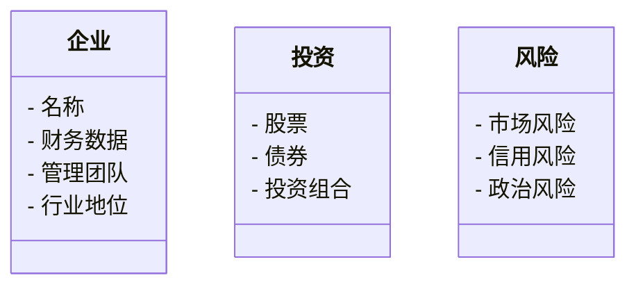
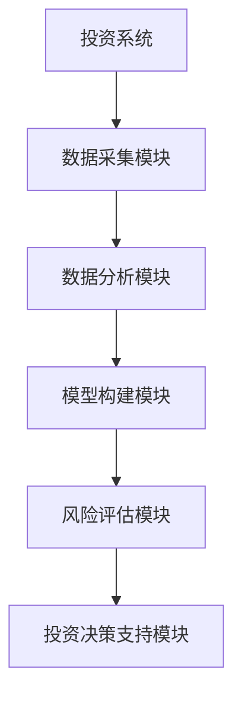
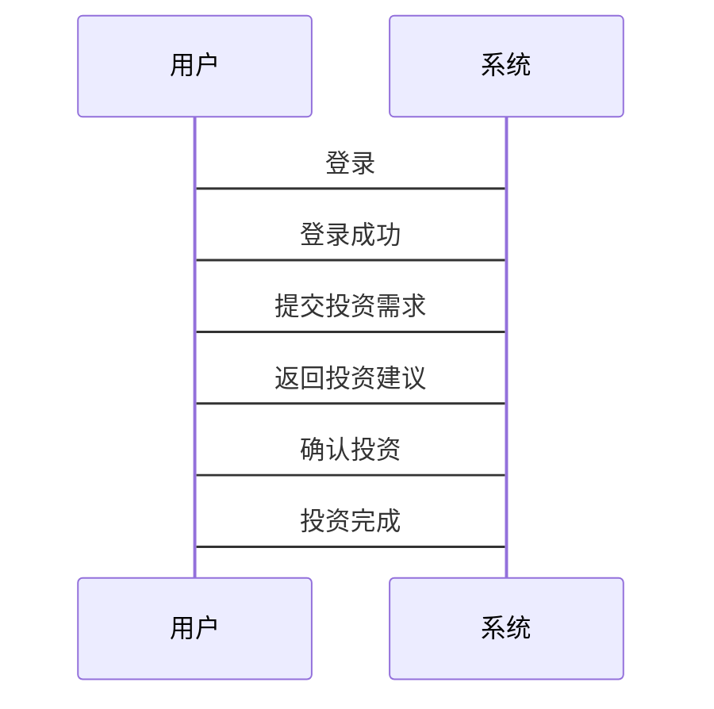

                 


```markdown
# 彼得林奇的"质量优先"在新兴市场的应用挑战

> 关键词：彼得林奇，质量优先，新兴市场，投资策略，风险管理，系统架构

> 摘要：本文深入探讨了彼得林奇的"质量优先"投资策略在新兴市场中的应用挑战。通过分析新兴市场的特殊性，结合实际案例，详细讲解了质量优先策略的核心要素、实施步骤、系统架构设计以及风险管理策略。文章还提供了实战项目指导，帮助读者在实际投资中应用该策略。

---

## 第一部分：彼得林奇的"质量优先"策略概述

### 第1章：彼得林奇"质量优先"策略的核心概念

#### 1.1 "质量优先"策略的定义与特点
- **1.1.1 质量优先策略的核心定义**
  质量优先策略强调在投资决策中，优先选择具备高质量、良好管理和强大竞争优势的企业。这种策略注重企业的基本面分析，尤其是财务健康状况、管理团队和行业地位。

- **1.1.2 质量优先策略的特点**
  - 长期导向：注重企业的长期竞争优势，而非短期市场波动。
  - 选股标准严格：筛选出具备高质量、良好治理结构和可持续盈利能力的企业。
  - 风险控制：通过选择优质企业降低投资组合的整体风险。

- **1.1.3 质量优先策略与传统投资策略的区别**
  - 传统投资策略可能更注重短期收益和市场趋势，而质量优先策略强调长期稳健的投资。
  - 传统策略可能涉及更多技术分析，而质量优先策略更依赖基本面分析。

#### 1.2 质量优先策略的背景与应用
- **1.2.1 投资市场的演变与质量优先策略的提出**
  随着全球资本市场的变化，投资者逐渐意识到单纯追求市场波动带来的收益并不稳定，高质量企业的长期稳健发展成为投资的核心考量。

- **1.2.2 质量优先策略在成熟市场的成功案例**
  在成熟市场中，彼得林奇的策略通过选择具有强大竞争优势和良好治理的企业，取得了显著的投资回报。

- **1.2.3 新兴市场的特殊性与质量优先策略的挑战**
  新兴市场通常具有较高的波动性、信息不对称和政策风险，这使得质量优先策略的实施面临更多挑战。

#### 1.3 本书的研究目标与框架
- **1.3.1 研究目标的设定**
  本文旨在探讨彼得林奇的"质量优先"策略在新兴市场的适用性，并提出相应的优化建议。

- **1.3.2 研究框架的构建**
  本文将从质量优先策略的核心要素、新兴市场的特殊性、策略实施步骤、风险管理等方面展开讨论。

- **1.3.3 研究方法的选择**
  本文将结合理论分析、案例研究和系统设计的方法，全面探讨质量优先策略在新兴市场的应用。

---

## 第二部分：新兴市场的特点与质量优先策略的适用性

### 第2章：新兴市场的特点与质量优先策略的适用性

#### 2.1 新兴市场的定义与特征
- **2.1.1 新兴市场的定义**
  新兴市场是指那些经济快速增长、市场规模较大但尚未完全成熟的国家市场，如中国、印度等。

- **2.1.2 新兴市场的经济特征**
  - 经济增速快，但波动性大。
  - 市场结构不完善，信息不对称问题严重。
  - 政治和经济风险较高。

- **2.1.3 新兴市场的行业分布**
  新兴市场中，科技、消费、金融等行业具有较高的增长潜力。

#### 2.2 新兴市场的投资挑战
- **2.2.1 市场波动性高**
  新兴市场的经济波动较大，容易受到外部环境的影响，导致股价波动剧烈。

- **2.2.2 信息不对称问题**
  新兴市场中，企业信息披露不完善，投资者难以准确评估企业的质量。

- **2.2.3 政治与经济风险**
  新兴市场可能面临政策变化、经济不稳定等风险，这些都会影响企业的经营和投资回报。

#### 2.3 质量优先策略在新兴市场的适用性
- **2.3.1 高质量企业的识别标准**
  - 财务健康状况：企业具备稳定的盈利能力，低负债率，健康的现金流。
  - 管理团队：具备丰富经验和良好声誉的管理团队。
  - 行业地位：企业在行业内具有较高的市场份额和竞争优势。

- **2.3.2 市场波动对质量优先策略的影响**
  新兴市场的波动性可能会影响质量优先策略的效果，但通过长期投资和分散投资可以降低风险。

- **2.3.3 质量优先策略在新兴市场的潜在优势**
  新兴市场的高增长潜力使得高质量企业具备更大的发展空间和投资价值。

---

## 第三部分：质量优先策略的核心要素

### 第3章：质量优先策略的核心要素

#### 3.1 企业质量评估标准
- **3.1.1 财务健康状况**
  - 利润能力：企业的净利润率、毛利率等指标。
  - 负债情况：企业的资产负债率、流动比率等指标。

- **3.1.2 管理团队稳定性**
  - 管理团队的经验和声誉。
  - 管理团队的历史业绩和决策能力。

- **3.1.3 行业地位与竞争优势**
  - 企业在行业中的市场份额。
  - 企业的核心竞争力，如技术创新、品牌影响力等。

#### 3.2 质量优先策略的实施步骤
- **3.2.1 确定投资目标**
  明确投资目标，如追求长期稳健收益。

- **3.2.2 选择高质量企业**
  根据质量评估标准筛选出具备高质量的企业。

- **3.2.3 制定投资组合**
  根据企业的质量、行业分布等因素，合理配置投资组合。

- **3.2.4 监控与调整**
  定期监控投资组合的表现，根据市场变化和企业情况调整投资策略。

---

## 第四部分：系统分析与架构设计

### 第4章：系统分析与架构设计

#### 4.1 系统功能设计
- **4.1.1 领域模型设计**
  使用mermaid图展示系统的领域模型，包括企业、投资、风险等核心概念。



- **4.1.2 系统架构设计**
  使用mermaid图展示系统的架构，包括数据采集、分析、决策支持等功能模块。



#### 4.2 系统接口设计
- **4.2.1 数据接口**
  - 数据来源：企业财务数据、市场数据等。
  - 数据格式：结构化数据，便于系统处理。

- **4.2.2 用户接口**
  - 界面设计：直观友好的用户界面，便于投资者使用。
  - 功能模块：包括数据查询、策略分析、投资组合管理等。

#### 4.3 系统交互设计
- **4.3.1 用户与系统的交互流程**
  - 用户登录系统。
  - 用户输入投资需求。
  - 系统根据质量优先策略生成投资建议。
  - 用户查看投资建议并进行操作。

- **4.3.2 交互流程图**
  使用mermaid序列图展示用户与系统的交互流程。



---

## 第五部分：项目实战

### 第5章：项目实战

#### 5.1 环境安装
- **5.1.1 系统环境要求**
  - 操作系统：Windows 10 或更高版本，或 macOS 10.15 或更高版本。
  - 开发工具：PyCharm 或其他Python开发工具。
  - 依赖库：pandas、numpy、matplotlib等。

- **5.1.2 数据来源**
  - 数据获取：通过API获取新兴市场的股票数据，如Yahoo Finance。

#### 5.2 系统核心实现
- **5.2.1 数据处理模块**
  - 数据清洗：处理缺失值、异常值。
  - 数据转换：将数据转换为适合分析的格式。

- **5.2.2 质量评估模块**
  - 根据质量评估标准对企业进行评分。
  - 使用Python代码实现质量评估算法。

```python
import pandas as pd

def quality_assessment(enterprise_data):
    # 财务健康状况评估
    financial_health = enterprise_data['财务数据'].mean()
    # 管理团队稳定性评估
    management_stability = enterprise_data['管理团队'].mean()
    # 行业地位评估
    industry_position = enterprise_data['行业地位'].mean()
    # 综合评分
    total_score = financial_health * 0.4 + management_stability * 0.3 + industry_position * 0.3
    return total_score

# 示例数据
enterprise_data = pd.DataFrame({
    '财务数据': [0.8, 0.7, 0.9],
    '管理团队': [0.6, 0.8, 0.7],
    '行业地位': [0.7, 0.6, 0.8]
})

# 质量评估
quality_score = quality_assessment(enterprise_data)
print(f"质量评分为：{quality_score}")
```

- **5.2.3 投资组合管理模块**
  - 根据质量评估结果生成投资组合。
  - 使用Python代码实现投资组合优化算法。

```python
import numpy as np

def portfolio_optimization(quality_scores, returns):
    n = len(quality_scores)
    # 使用均值-方差优化模型
    mu = np.mean(quality_scores) * returns
    sigma = np.cov(quality_scores)
    # 计算最优权重
    inv_sigma = np.linalg.inv(sigma)
    w = inv_sigma @ mu
    w = w / np.sum(w)
    return w

# 示例数据
quality_scores = [0.85, 0.75, 0.9]
returns = [0.1, 0.15, 0.1]

# 投资组合优化
weights = portfolio_optimization(quality_scores, returns)
print(f"最优权重为：{weights}")
```

#### 5.3 案例分析与解读
- **5.3.1 案例背景**
  - 选择新兴市场的几个行业，如科技、消费、金融等，进行质量评估和投资组合优化。

- **5.3.2 实战步骤**
  - 数据获取与清洗。
  - 质量评估模块实现。
  - 投资组合优化模块实现。
  - 风险评估与调整。

#### 5.4 项目小结
- **5.4.1 项目成果**
  - 成功实现质量优先策略的投资系统。
  - 提供了在新兴市场中应用质量优先策略的实战指导。

- **5.4.2 项目经验**
  - 数据获取与清洗是关键步骤，需要仔细处理。
  - 系统架构设计需要合理，确保各模块协同工作。
  - 风险管理是投资成功的重要保障，需要持续监控和调整。

---

## 第六部分：结论与展望

### 第6章：结论与展望

#### 6.1 研究结论
- 彼得林奇的"质量优先"策略在新兴市场中具有较高的适用性。
- 新兴市场的特殊性要求投资者在实施质量优先策略时，更加注重企业的财务健康、管理团队和行业地位。

#### 6.2 研究展望
- 进一步研究新兴市场中的风险管理策略。
- 探索质量优先策略与其他投资策略的结合应用。
- 开发更多智能化的投资工具，提高质量优先策略的实施效率。

---

## 作者：AI天才研究院/AI Genius Institute & 禅与计算机程序设计艺术/Zen And The Art of Computer Programming
```

