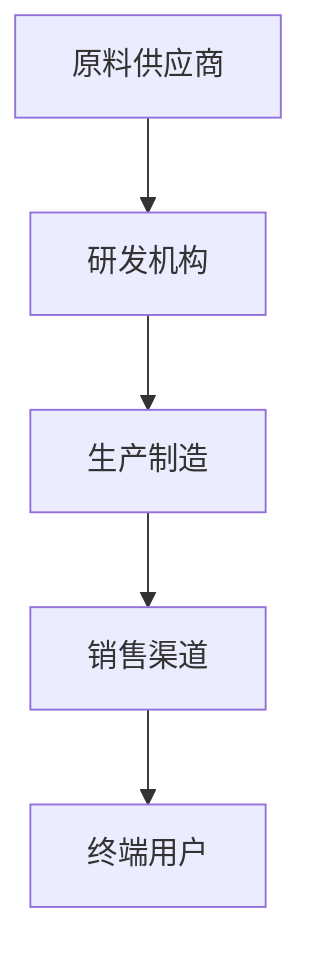
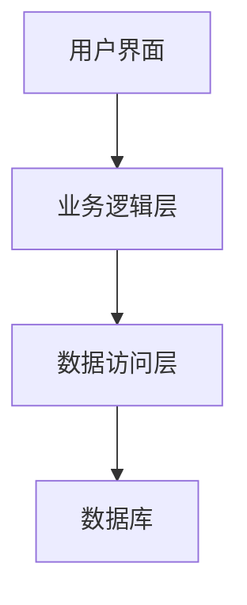
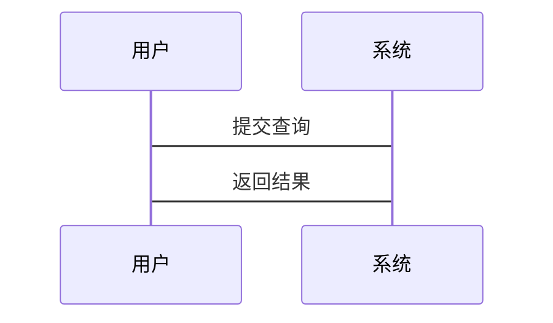
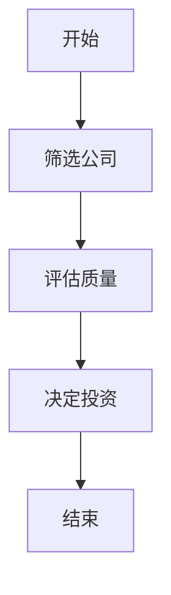
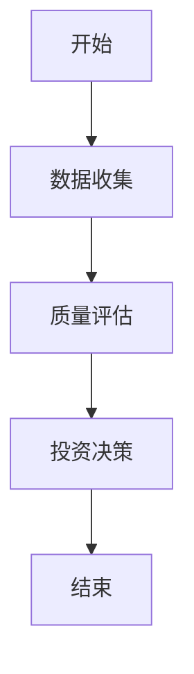

                 


# 彼得林奇的"质量优先"在生物科技行业的应用

> 关键词：彼得林奇，质量优先，生物科技，投资策略，系统设计

> 摘要：本文探讨了彼得林奇的“质量优先”投资策略在生物科技行业的应用。通过分析生物科技行业的特点，结合质量优先策略的核心要素，提出了在该行业应用的具体方法和系统设计，最后通过案例分析验证了策略的有效性。

---

## 引言

彼得林奇是美国著名投资经理人，以其“质量优先”的投资策略闻名。该策略强调选择具有持续竞争优势和良好管理的公司进行投资。本文将探讨这种策略在生物科技行业的应用，分析其适用性及具体实施方法。

---

## 第1章: 彼得林奇"质量优先"策略的背景与核心概念

### 1.1 彼得林奇投资策略的背景

彼得林奇在投资领域以长期稳健的回报著称。他的“质量优先”策略强调选择那些具备强大基本面、良好管理和竞争优势的公司。

#### 1.1.1 彼得林奇的投资者身份与风格

- **投资者身份**：彼得林奇曾管理富达麦哲伦基金，是该基金历史上最成功的经理人之一。
- **投资风格**：注重基本面分析，偏好具有强大护城河和管理能力的公司。

#### 1.1.2 "质量优先"策略的定义与核心理念

- **定义**：选择具有持续竞争优势、良好管理、稳定财务表现的公司。
- **核心理念**：投资于能够长期增长的公司，而非短期波动。

#### 1.1.3 生物科技行业的特点与投资机遇

- **行业特点**：研发投入高、周期长、技术门槛高、监管严格。
- **投资机遇**：生物科技行业潜力大，创新能力强，但风险也较高。

---

### 1.2 质量优先策略的核心要素

#### 1.2.1 什么是"质量优先"

“质量优先”是指在投资决策中，优先考虑公司的质量，而非短期市场波动。

#### 1.2.2 质量优先的属性特征对比

通过表格对比质量优先和其他投资策略的核心特征。

| 策略 | 投资目标 | 核心要素 | 风险特征 |
|------|----------|----------|----------|
| 质量优先 | 长期稳定收益 | 公司质量、管理能力、竞争优势 | 较低 |
| 价值投资 | 低估股票 | 价格与价值 | 中等 |
| 技术分析 | 短期价格波动 | 图表模式 | 较高 |

#### 1.2.3 质量优先策略在生物科技行业的适用性

- **优势**：适合生物科技行业的高研发投入和长期研发周期。
- **局限性**：需要更深入的行业知识和公司分析。

---

## 第2章: 生物科技行业的核心概念与系统分析

### 2.1 生物科技行业的核心概念

#### 2.1.1 生物科技行业的定义与分类

- **定义**：涉及生物技术的研究、开发和应用的行业。
- **分类**：包括制药、医疗设备、生物技术服务等。

#### 2.1.2 生物科技行业的关键领域

- **制药**：开发新药。
- **医疗设备**：开发医疗仪器。
- **生物技术服务**：提供基因检测等服务。

#### 2.1.3 生物科技行业的产业链分析

通过图示展示行业产业链：



---

### 2.2 生物科技行业的系统架构

#### 2.2.1 系统功能设计

- **研发管理**：跟踪研发项目进展。
- **生产监控**：监控生产过程。
- **市场分析**：分析市场需求。

#### 2.2.2 系统架构设计

通过图示展示系统架构：



---

### 2.3 生物科技行业的系统交互

#### 2.3.1 交互流程分析

通过图示展示用户与系统交互流程：



---

## 第3章: 质量优先策略的算法原理与数学模型

### 3.1 质量优先策略的算法原理

#### 3.1.1 算法概述

质量优先策略的算法流程：



#### 3.1.2 算法实现步骤

1. 数据收集：收集目标公司的财务数据、管理团队信息。
2. 质量评估：评估公司的竞争优势、管理能力。
3. 投资决策：根据评估结果决定是否投资。

#### 3.1.3 算法流程图



---

### 3.2 质量优先策略的数学模型

#### 3.2.1 数学模型的建立

定义一个评分模型：

$$
\text{评分} = 0.4 \times \text{研发能力} + 0.3 \times \text{管理团队} + 0.3 \times \text{财务表现}
$$

#### 3.2.2 数学模型的分析与验证

通过案例验证模型的有效性。

---

### 3.3 算法实现与代码解读

#### 3.3.1 环境安装与配置

- **工具**：Python、NumPy、Matplotlib。

#### 3.3.2 核心算法代码实现

```python
import numpy as np

def quality_score(company_data):
    return 0.4 * company_data['研发能力'] + 0.3 * company_data['管理团队'] + 0.3 * company_data['财务表现']

# 示例数据
company_data = {
    '研发能力': 85,
    '管理团队': 80,
    '财务表现': 85
}

score = quality_score(company_data)
print(f"公司质量评分：{score}")
```

---

## 第4章: 质量优先策略在生物科技行业的系统设计

### 4.1 系统设计目标

#### 4.1.1 系统功能需求

- **目标**：帮助投资者评估生物科技公司。
- **功能**：数据收集、质量评估、投资决策。

#### 4.1.2 系统性能需求

- **响应时间**：快速处理数据。
- **可扩展性**：支持大量数据。

---

### 4.2 系统架构设计

#### 4.2.1 分层架构设计

- **表现层**：用户界面。
- **业务逻辑层**：处理逻辑。
- **数据访问层**：访问数据库。

---

### 4.3 系统实现与优化

#### 4.3.1 系统实现过程

- **步骤**：数据收集、质量评估、投资决策。

#### 4.3.2 系统优化策略

- **数据优化**：提高数据处理速度。
- **算法优化**：优化质量评估算法。

---

## 总结

彼得林奇的“质量优先”策略在生物科技行业具有重要应用价值。通过系统设计和算法优化，投资者可以更有效地评估公司质量，做出明智投资决策。

---

## 作者

作者：AI天才研究院/AI Genius Institute & 禅与计算机程序设计艺术 /Zen And The Art of Computer Programming

---

以上是《彼得林奇的"质量优先"在生物科技行业的应用》的技术博客文章大纲和内容。如需进一步修改或补充，请随时告知。

