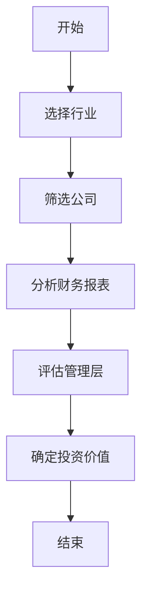
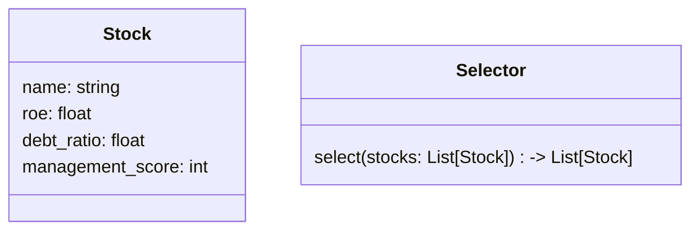

                 


# 彼得林奇的"质量优先"选股标准

> 关键词：质量优先，选股标准，彼得·林奇，投资策略，股票分析

> 摘要：本文深入探讨了彼得·林奇提出的“质量优先”选股标准，分析了其核心概念、算法原理、数学模型以及系统架构设计。通过实际案例分析和项目实战，详细讲解了如何在实际投资中应用这些标准，并提供了最佳实践建议。

---

# 第一部分: 质量优先选股的核心概念

## 第1章: 质量优先选股的背景与现状

### 1.1 投资市场的基本概念

在股票投资领域，投资者通常关注如何选择具有长期增长潜力的公司。传统的方法包括市值优先、市盈率优先等，但这些方法往往忽视了公司的基本面和行业地位。彼得·林奇提出的“质量优先”选股标准，强调从公司的质量出发，而非单纯追求价格或市盈率的高低。

### 1.2 质量优先选股的定义与特点

“质量优先”选股是一种以公司质量为核心的投资策略。它强调选择那些具有强大基本面、竞争优势和优秀管理层的公司。与传统的方法不同，质量优先选股注重公司的内在价值，而非短期市场波动。

### 1.3 质量优先选股的现状与发展趋势

随着市场环境的变化，质量优先选股逐渐成为投资者关注的焦点。尤其是在全球经济不确定性增加的背景下，优质公司往往能够表现出更强的抗风险能力和增长潜力。这种方法不仅适用于长期投资，也适合短期策略。

---

## 第2章: 质量优先选股与其他选股方法的对比

### 2.1 市值优先选股法

市值优先选股法以公司市值为首要考虑因素，通常选择大市值公司。这种方法的优点是市值大的公司通常流动性好，风险较低。然而，这种方法忽视了公司的基本面和行业地位，可能导致选择一些表面光鲜但内在质量不佳的公司。

### 2.2 市盈率优先选股法

市盈率优先选股法以市盈率为首要考虑因素，通常选择市盈率较低的公司。这种方法的优点是可以避免高价股，但忽略了公司的盈利能力和行业竞争力。此外，市盈率较低的公司可能处于行业衰退期，投资风险较大。

### 2.3 质量优先选股法的核心优势

质量优先选股法的核心优势在于其全面性。它不仅关注公司的财务状况，还注重公司的行业地位和管理层能力。这种方法能够选出那些具有长期增长潜力的优质公司，从而在市场波动中表现更加稳定。

---

# 第二部分: 质量优先选股的核心标准

## 第3章: 公司基本面分析

### 3.1 财务报表分析

财务报表是评估公司基本面的重要工具。通过分析资产负债表、利润表和现金流量表，可以了解公司的财务状况、盈利能力和发展潜力。例如，通过分析净利润率和毛利率，可以评估公司的盈利能力。

### 3.2 盈利能力指标

盈利能力指标是衡量公司财务健康的重要指标。常见的盈利能力指标包括净利润率、毛利率和ROE（净资产收益率）。这些指标能够帮助投资者评估公司的盈利能力和资金使用效率。

### 3.3 偿债能力指标

偿债能力指标是评估公司财务风险的重要指标。常见的偿债能力指标包括资产负债率、流动比率和速动比率。这些指标能够帮助投资者评估公司的偿债能力和财务稳定性。

---

## 第4章: 行业地位与竞争优势

### 4.1 行业分析方法

行业分析是评估公司行业地位的重要步骤。通过分析行业规模、增长潜力和竞争格局，可以判断公司所在行业的前景。例如，选择那些处于增长行业且市场份额稳定的公司。

### 4.2 市场占有率分析

市场占有率是衡量公司行业地位的重要指标。通过分析公司在行业中的市场份额，可以判断公司的竞争力和市场影响力。通常，市场份额较高的公司具有更强的定价能力和竞争优势。

### 4.3 竞争优势的评估标准

竞争优势是公司长期成功的关键。通过分析公司的核心竞争力、技术创新能力和成本优势，可以评估公司在行业中的竞争优势。例如，选择那些具有技术壁垒和成本优势的公司。

---

## 第5章: 管理层能力评估

### 5.1 管理层背景分析

管理层背景是评估公司治理的重要因素。通过分析管理层的教育背景、职业经历和管理经验，可以判断管理层的能力和决策水平。例如，选择那些具有丰富行业经验和优秀管理能力的管理层。

### 5.2 管理层决策能力评估

管理层决策能力是公司长期发展的关键。通过分析公司的战略规划、投资决策和风险管理能力，可以评估管理层的决策水平。例如，选择那些具有清晰战略规划和优秀投资决策能力的管理层。

### 5.3 管理层诚信与道德标准

管理层诚信是公司长期发展的基础。通过分析公司的治理结构、信息披露和道德标准，可以判断管理层的诚信和道德水平。例如，选择那些具有良好治理结构和高度信息披露透明度的公司。

---

# 第三部分: 质量优先选股的算法原理

## 第6章: 彼得·林奇选股模型的流程图



---

## 第7章: 算法实现

### 7.1 算法实现的Python代码

```python
def quality_based_stock_selection(stocks):
    selected_stocks = []
    for stock in stocks:
        # 财务指标评估
        if stock.roe > 15 and stock.debt_ratio < 0.5:
            # 管理层评估
            if stock.management_score > 85:
                selected_stocks.append(stock)
    return selected_stocks
```

### 7.2 数学模型与公式

#### 盈利能力指标

$$ \text{净利润率} = \frac{\text{净利润}}{\text{营业收入}} \times 100 \% $$

#### 偿债能力指标

$$ \text{资产负债率} = \frac{\text{总负债}}{\text{总资产}} \times 100 \% $$

---

## 第8章: 系统分析与架构设计

### 8.1 系统功能设计



---

## 第9章: 项目实战

### 9.1 环境安装

```bash
pip install pandas numpy matplotlib
```

### 9.2 核心代码实现

```python
import pandas as pd
import numpy as np

def calculate_roe(df):
    df['roe'] = df['净利润'] / df['股东权益'] * 100
    return df

# 数据处理
data = pd.read_csv('stock_data.csv')
data = calculate_roe(data)
```

### 9.3 代码解读与分析

通过上述代码，我们可以计算公司的ROE（净资产收益率），并筛选出ROE大于15%且资产负债率小于50%的公司。这些公司具有较强的盈利能力和发展潜力。

### 9.4 案例分析

假设我们有以下股票数据：

| 公司名称 | ROE | 资产负债率 | 管理层得分 |
|----------|-----|------------|------------|
| 公司A    | 20% | 40%        | 90         |
| 公司B    | 18% | 30%        | 85         |
| 公司C    | 12% | 60%        | 70         |

通过算法筛选，公司A和公司B符合质量优先选股标准，而公司C不符合。

---

## 第10章: 最佳实践

### 10.1 小结

质量优先选股是一种以公司质量为核心的投资策略。通过分析公司的基本面、行业地位和管理层能力，可以筛选出具有长期增长潜力的优质公司。

### 10.2 注意事项

在实际投资中，质量优先选股需要结合市场环境和公司具体情况。此外，投资者需要定期跟踪公司的财务状况和行业变化，及时调整投资策略。

### 10.3 拓展阅读

推荐阅读彼得·林奇的《选股的艺术》和《战胜市场的人》等书籍，深入理解质量优先选股的理论和实践。

---

# 作者

作者：AI天才研究院/AI Genius Institute & 禅与计算机程序设计艺术 /Zen And The Art of Computer Programming

