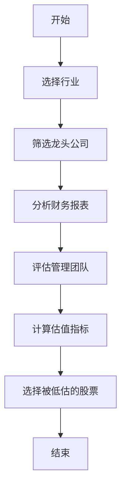
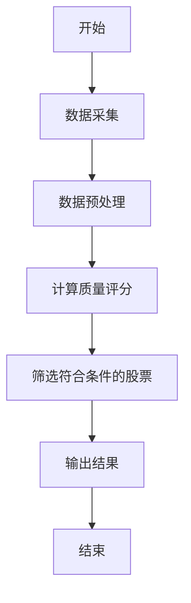
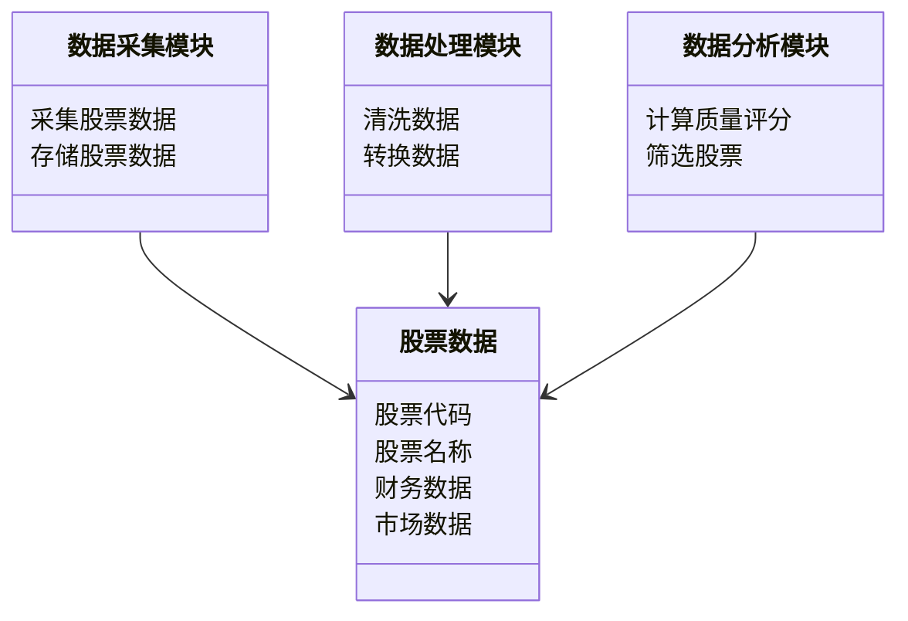
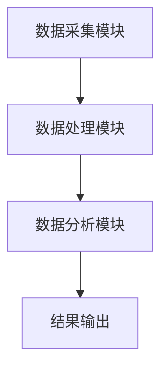
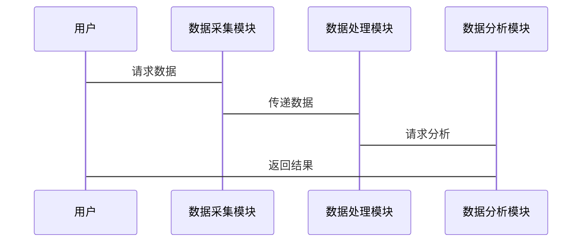

                 


# 彼得林奇的"质量优先"选股清单

## 关键词：彼得林奇，质量优先，选股策略，投资，财务指标

## 摘要：本文详细解析了彼得林奇的质量优先选股策略，探讨其核心概念、算法原理、系统架构以及实际案例，为投资者提供科学的选股方法。

---

# 第一部分: 质量优先选股的背景与核心概念

## 第1章: 质量优先选股的定义与背景

### 1.1 投资中的质量优先理念

#### 1.1.1 什么是质量优先选股
质量优先选股是一种基于公司基本面分析的投资策略，强调选择具有强大竞争优势、良好财务状况和持续增长潜力的公司。这种方法注重公司质量，而非短期市场波动。

#### 1.1.2 质量优先选股的核心目标
- 寻找具有长期竞争优势的公司
- 选择财务健康、管理优秀的企业
- 确保投资组合的稳定性和可持续性

#### 1.1.3 质量优先选股在投资中的重要性
质量优先选股帮助投资者避免低质股票带来的风险，同时通过长期持有优质资产实现财富增值。

### 1.2 彼得林奇的投资理念

#### 1.2.1 彼得林奇的选股方法
彼得林奇以基本面分析闻名，注重对公司财务报表、行业地位和管理团队的深入研究，寻找那些被市场低估的优质股票。

#### 1.2.2 质量优先选股的核心要素
- 盈利能力：ROE、净利润率等指标
- 财务健康：低负债率、稳定的现金流
- 竞争优势：市场领导者或独特竞争优势
- 管理团队：经验丰富、诚信可靠

#### 1.2.3 质量优先选股的特点
- 长期导向：注重公司长期价值
- 价值导向：寻找被市场低估的股票
- 风险控制：通过基本面分析降低投资风险

### 1.3 质量优先选股的边界与外延

#### 1.3.1 质量优先选股的适用范围
适用于长期投资，尤其适合价值投资者和机构投资者。

#### 1.3.2 质量优先选股与其他选股方法的区别
- 技术分析：侧重市场走势，质量优先选股侧重公司基本面
- 概率选股：基于统计模型，质量优先选股基于公司质量

#### 1.3.3 质量优先选股的潜在风险与挑战
- 市场波动：优质股票可能因短期因素被误判
- 信息滞后：财务数据可能存在时滞性
- 竞争风险：行业变化可能影响公司竞争优势

---

## 第2章: 质量优先选股的核心要素

### 2.1 质量优先选股的核心概念

#### 2.1.1 质量优先选股的定义
通过分析公司财务报表、行业地位和竞争优势，选择具有长期增长潜力的优质股票。

#### 2.1.2 质量优先选股的核心要素
- 盈利能力：净利润率、ROE等指标
- 财务健康：低负债率、稳定的现金流
- 竞争优势：市场领导者或独特竞争优势
- 管理团队：经验丰富、诚信可靠

#### 2.1.3 质量优先选股的逻辑框架
1. 筛选行业龙头或具有独特竞争优势的公司
2. 分析公司财务报表，评估盈利能力、财务健康状况
3. 考察管理团队的背景和能力
4. 结合市场估值，寻找被低估的优质股票

### 2.2 质量优先选股的核心要素对比

#### 2.2.1 公司基本面分析
- 盈利能力：净利润率、ROE
- 财务健康：负债率、现金流
- 发展潜力：行业增长空间

#### 2.2.2 财务指标分析
- 市盈率（P/E）：股价与每股收益的比率
- 市净率（P/B）：股价与每股净资产的比率
- 股息率：股息与股价的比率

#### 2.2.3 行业地位与竞争优势
- 市场份额：公司在行业中的占比
- 技术壁垒：独特的技术或专利
- 品牌影响力：品牌知名度和客户忠诚度

### 2.3 质量优先选股的逻辑结构

#### 2.3.1 质量优先选股的逻辑流程
1. 确定投资目标和时间框架
2. 筛选符合质量优先标准的公司
3. 深入分析公司基本面
4. 结合市场估值，选择被低估的股票

#### 2.3.2 质量优先选股的决策树


#### 2.3.3 质量优先选股的数学模型
质量优先选股模型可以表示为：
$$
\text{质量评分} = 0.4 \times \text{盈利能力} + 0.3 \times \text{财务健康} + 0.2 \times \text{竞争优势} + 0.1 \times \text{管理团队}
$$

---

# 第二部分: 质量优先选股的算法与数学模型

## 第3章: 质量优先选股的算法原理

### 3.1 质量优先选股的算法概述

#### 3.1.1 质量优先选股的算法特点
- 基于基本面分析，注重公司质量
- 结合估值指标，寻找被低估的股票
- 适用于长期投资策略

#### 3.1.2 质量优先选股的算法流程


#### 3.1.3 质量优先选股的算法优势
- 降低投资风险
- 提高投资收益
- 适合长期投资

### 3.2 质量优先选股的数学模型

#### 3.2.1 质量优先选股的数学公式
质量评分计算公式：
$$
\text{质量评分} = 0.4 \times \text{ROE} + 0.3 \times \text{现金流} + 0.2 \times \text{市场份额} + 0.1 \times \text{研发支出占比}
$$

其中：
- ROE = 净利润 / 净资产
- 现金流 = 经营活动现金流 / 营业收入
- 市场份额 = 公司在行业中的占比
- 研发支出占比 = 研发支出 / 营业收入

#### 3.2.2 质量优先选股的数学推导
通过分析多个财务指标，计算每家公司的质量评分，然后根据评分排序，选择评分最高的股票。

#### 3.2.3 质量优先选股的数学验证
通过历史数据验证模型的有效性，计算模型在不同市场环境下的表现。

### 3.3 质量优先选股的算法实现

#### 3.3.1 质量优先选股的Python实现
```python
import pandas as pd

# 数据加载
df = pd.read_csv('stocks.csv')

# 计算质量评分
df['ROE'] = df['净利润'] / df['净资产']
df['现金流'] = df['经营活动现金流'] / df['营业收入']
df['市场份额'] = df['行业市场份额']
df['研发占比'] = df['研发支出'] / df['营业收入']

df['质量评分'] = 0.4 * df['ROE'] + 0.3 * df['现金流'] + 0.2 * df['市场份额'] + 0.1 * df['研发占比']

# 筛选Top 10股票
selected_stocks = df.nlargest(10, '质量评分')
```

#### 3.3.2 质量优先选股的算法优化
- 增加更多的财务指标
- 调整各指标的权重
- 结合技术分析进行优化

#### 3.3.3 质量优先选股的算法测试
- 回测模型在历史数据中的表现
- 比较模型与市场指数的表现差异
- 分析模型在不同市场环境下的稳定性

---

# 第三部分: 质量优先选股的系统分析与架构设计

## 第4章: 质量优先选股系统的功能设计

### 4.1 系统功能模块划分

#### 4.1.1 数据采集模块
- 数据来源：股票数据库、财经网站
- 数据类型：财务数据、市场数据
- 采集频率：每日/每周/每月

#### 4.1.2 数据处理模块
- 数据清洗：处理缺失值、异常值
- 数据转换：计算财务指标、质量评分
- 数据存储：保存处理后的数据

#### 4.1.3 数据分析模块
- 计算质量评分
- 筛选优质股票
- 生成投资组合

### 4.2 系统功能设计(领域模型)



### 4.3 系统架构设计



### 4.4 系统交互设计



---

## 第5章: 质量优先选股系统的实现

### 5.1 系统核心实现源代码

```python
import pandas as pd
import numpy as np

# 数据加载
df = pd.read_csv('stocks.csv')

# 数据预处理
df.dropna(inplace=True)
df = df[~df['行业'].isnull()]

# 计算质量评分
df['ROE'] = df['净利润'] / df['净资产']
df['现金流'] = df['经营活动现金流'] / df['营业收入']
df['市场份额'] = df['行业市场份额']
df['研发占比'] = df['研发支出'] / df['营业收入']

df['质量评分'] = 0.4 * df['ROE'] + 0.3 * df['现金流'] + 0.2 * df['市场份额'] + 0.1 * df['研发占比']

# 筛选Top 10股票
selected_stocks = df.nlargest(10, '质量评分')

# 输出结果
print(selected_stocks[['股票代码', '股票名称', '质量评分']])
```

### 5.2 代码应用解读与分析

- 数据加载：从CSV文件加载股票数据
- 数据预处理：删除缺失值，筛选行业不为空的股票
- 计算质量评分：根据各指标计算质量评分
- 筛选Top 10股票：输出质量评分最高的10只股票

### 5.3 实际案例分析

假设我们有以下股票数据：

| 股票代码 | 股票名称 | 净利润 | 净资产 | 经营活动现金流 | 营业收入 | 行业市场份额 | 研发支出 | 质量评分 |
|----------|----------|--------|--------|-----------------|----------|--------------|----------|----------|
| A        | 公司A    | 100    | 500    | 200             | 1000     | 30%          | 200      | 0.4*0.02 + 0.3*0.2 + 0.2*0.3 + 0.1*0.02 = 0.008 + 0.06 + 0.06 + 0.002 = 0.13 |

通过计算质量评分，我们可以筛选出质量评分最高的股票。

### 5.4 项目小结

质量优先选股系统通过数据采集、处理和分析，帮助投资者快速筛选出符合质量优先标准的优质股票，降低投资风险，提高投资收益。

---

# 第四部分: 质量优先选股的最佳实践

## 第6章: 质量优先选股的实战技巧

### 6.1 最佳实践 tips

1. 定期更新数据，保持模型的有效性
2. 结合市场环境，调整投资策略
3. 分散投资，降低风险
4. 长期持有，避免频繁交易

### 6.2 小结

质量优先选股是一种科学的投资方法，通过基本面分析和数学模型，帮助投资者筛选出具有长期竞争优势的优质股票。

### 6.3 注意事项

1. 选股模型仅供参考，需结合市场实际情况
2. 风险提示：投资需谨慎，入市需冷静
3. 保持学习，不断提升自己的投资能力

### 6.4 拓展阅读

- 彼得林奇的《巴菲特选股术》
- 哈佛商学院的股票投资课程
- 技术分析与基本面分析的结合

---

# 结语

质量优先选股是一种基于公司基本面分析的投资策略，通过深入分析公司的财务报表、行业地位和竞争优势，选择具有长期增长潜力的优质股票。本文详细解析了质量优先选股的核心概念、算法原理、系统架构以及实际案例，为投资者提供了一个科学的选股方法。

---

作者：AI天才研究院/AI Genius Institute & 禅与计算机程序设计艺术/Zen And The Art of Computer Programming

