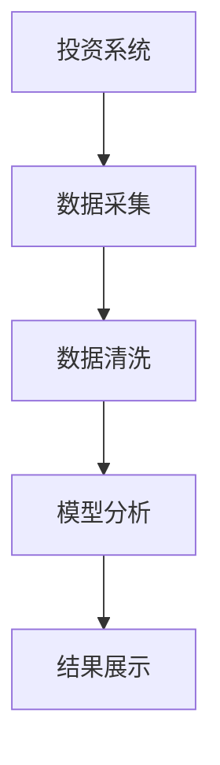

                 


# 彼得林奇的"质量成长"vs"价值重估"在不同市值公司中的应用

## 关键词：彼得林奇、质量成长、价值重估、市值公司、投资策略、股票分析

## 摘要：本文深入探讨了彼得林奇提出的“质量成长”和“价值重估”两种投资策略在不同市值公司中的应用。通过对比分析，揭示了这两种策略在小盘股和大盘股中的具体实施方法，结合数学模型和实际案例，为投资者提供了科学的决策依据。文章结构清晰，内容详实，既有理论分析，又有实践指导，适合不同类型的投资者参考。

---

## 第一部分：背景介绍

### 第1章：彼得林奇与投资策略概述

#### 1.1 彼得林奇的生平与投资理念
彼得·林奇（Peter Lynch）是美国著名的投资经理，以其在富达投资管理公司的卓越表现而闻名。他的投资理念强调长期投资、深入研究和选择优质公司。林奇认为，成功的投资取决于对公司的深入了解，而不是市场的短期波动。

#### 1.2 质量成长与价值重估的定义
- **质量成长**：关注具有强大竞争优势、良好财务状况和持续增长潜力的公司。这类公司通常属于成长型企业，适合长期投资。
- **价值重估**：寻找市场价格低于内在价值的公司，通常是由于市场情绪或周期性波动导致的低估。这类公司适合在市场低迷时买入。

---

## 第二部分：核心概念与联系

### 第2章：质量成长的核心要素

#### 2.1 公司质量评估标准
- 行业地位：公司在行业中的竞争力。
- 财务健康：收入、利润和现金流的稳定性。
- 管理团队：管理者的经验和战略能力。

#### 2.2 成长潜力的衡量指标
- 净利润增长率：$ \text{净利润增长率} = \frac{\text{今年净利润} - \text{去年净利润}}{\text{去年净利润}} \times 100\% $
- 营收增长率：$ \text{营收增长率} = \frac{\text{今年营收} - \text{去年营收}}{\text{去年营收}} \times 100\% $

### 第3章：价值重估的核心要素

#### 3.1 估值指标与市场价格
- 市盈率（P/E）：$ \text{P/E} = \frac{\text{股价}}{\text{每股收益}} $
- 市净率（P/B）：$ \text{P/B} = \frac{\text{股价}}{\text{每股净资产}} $

#### 3.2 公司内在价值计算
- 内在价值公式：$ \text{内在价值} = \frac{\text{净利润}}{\text{资本成本} - \text{增长率}} $

---

## 第三部分：质量成长与价值重估的数学模型

### 第4章：质量成长模型

#### 4.1 公司质量评分公式
$ \text{质量评分} = 0.4 \times \text{ROE} + 0.3 \times \text{营收增长率} + 0.3 \times \text{净利润增长率} $

#### 4.2 成长潜力预测公式
$ \text{成长潜力} = \text{行业平均增长率} \times \text{公司市场份额} $

### 第5章：价值重估模型

#### 5.1 内在价值计算公式
$ \text{内在价值} = \frac{\text{每股收益} \times (1 + \text{增长率})}{\text{资本成本}} $

#### 5.2 市场估值偏离度分析
$ \text{偏离度} = \frac{\text{内在价值} - \text{市场价格}}{\text{市场价格}} \times 100\% $

---

## 第四部分：策略在不同市值公司中的应用

### 第6章：小盘股中的质量成长策略

#### 6.1 小盘股的特点与投资机会
- 市值较小，流动性较低。
- 成长潜力大，适合长期投资。

#### 6.2 投资组合构建
- 选择行业地位稳固、财务健康的小盘股。
- 使用质量评分公式筛选目标公司。

### 第7章：大盘股中的价值重估策略

#### 7.1 大盘股的特点与投资机会
- 市值大，流动性高。
- 市场波动时容易低估。

#### 7.2 重估周期模型
$ \text{重估周期} = \frac{\text{历史平均周期}}{\text{当前市场情绪}} $

---

## 第五部分：系统架构与项目实战

### 第8章：投资系统设计

#### 8.1 系统功能模块
- 数据收集：获取公司财务数据和市场数据。
- 模型分析：应用质量评分和内在价值模型。
- 结果展示：生成投资报告和可视化图表。

#### 8.2 系统架构图


### 第9章：代码实现与案例分析

#### 9.1 环境安装
- Python 3.8+
- NumPy、Pandas、Matplotlib

#### 9.2 核心代码
```python
import pandas as pd
import numpy as np

# 质量评分模型
def quality_score(roe, revenue_growth, net_profit_growth):
    return 0.4 * roe + 0.3 * revenue_growth + 0.3 * net_profit_growth

# 价值重估模型
def intrinsic_value(eps, growth_rate, cost_of_capital):
    return eps * (1 + growth_rate) / cost_of_capital
```

---

## 第六部分：最佳实践与小结

### 第10章：投资策略总结

#### 10.1 小结
- 质量成长策略适合小盘股，关注成长潜力。
- 价值重估策略适合大盘股，关注市场低估。

#### 10.2 注意事项
- 风险控制：分散投资，避免过度集中。
- 市场周期：根据市场情况调整策略。

#### 10.3 拓展阅读
- 《彼得林奇的成功投资》
- 《股票投资策略》

---

## 作者：AI天才研究院/AI Genius Institute & 禅与计算机程序设计艺术/Zen And The Art of Computer Programming

