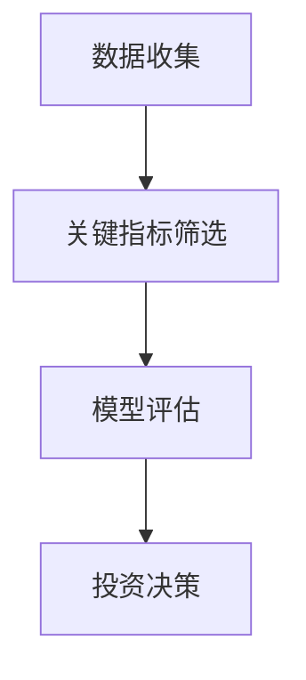
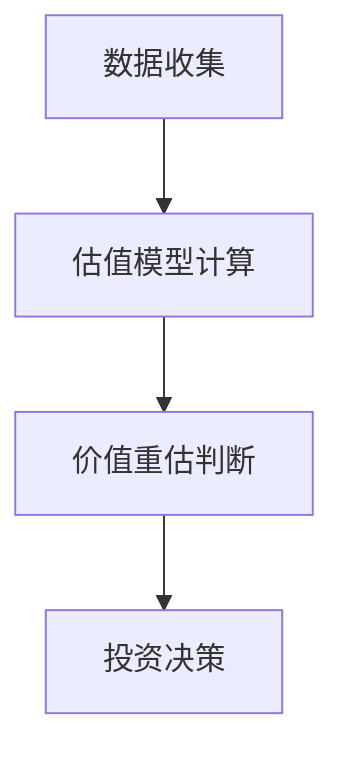
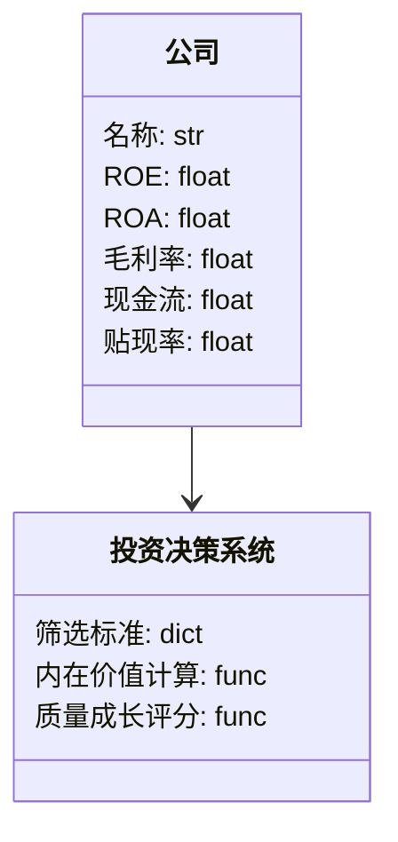
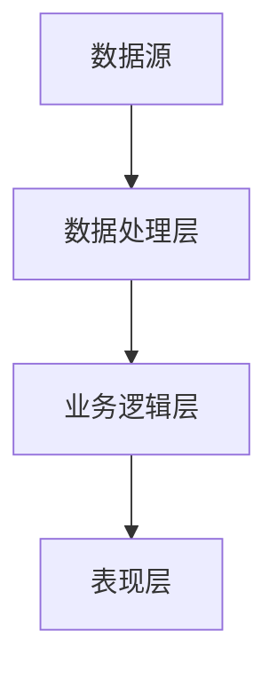
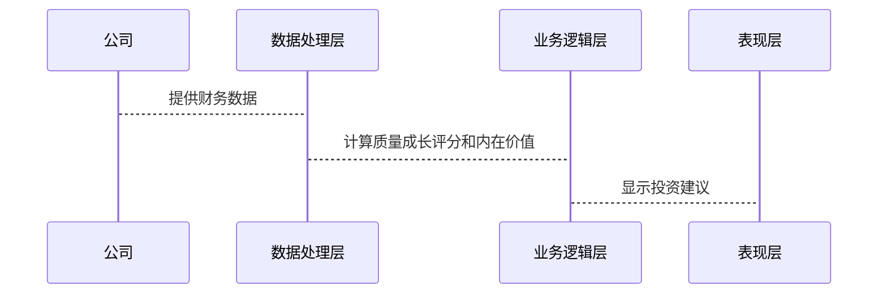

                 


# 第3章: 质量成长与价值重估的算法原理

## 3.1 质量成长的算法原理

### 3.1.1 质量成长的算法流程
质量成长投资策略的核心是通过筛选具有持续盈利能力、良好管理团队和强大护城河的公司，进行长期投资。算法流程如下：

1. **数据收集**：收集目标公司的财务数据、市场表现、行业地位等。
2. **关键指标筛选**：筛选ROE（净资产收益率）、ROA（资产回报率）、毛利率等指标。
3. **模型评估**：使用质量成长模型评估公司是否符合投资标准。
4. **投资决策**：根据评估结果决定是否投资。

**质量成长算法流程图**



### 3.1.2 质量成长的算法实现

```python
import pandas as pd

# 示例数据集：假设包含公司名称、ROE、ROA、毛利率等
data = {
    '公司': ['A', 'B', 'C', 'D'],
    'ROE': [0.15, 0.12, 0.18, 0.09],
    'ROA': [0.1, 0.08, 0.12, 0.05],
    '毛利率': [0.3, 0.25, 0.4, 0.1]
}

df = pd.DataFrame(data)

# 定义质量成长筛选标准：ROE > 0.1，ROA > 0.08，毛利率 > 0.25
def is_quality_growth(row):
    return row['ROE'] > 0.1 and row['ROA'] > 0.08 and row['毛利率'] > 0.25

# 应用筛选
df['符合标准'] = df.apply(is_quality_growth, axis=1)
```

### 3.1.3 质量成长的数学模型

质量成长的评估可以使用以下公式：

$$
\text{质量成长评分} = \frac{(\text{ROE} - \text{行业平均ROE})}{\text{行业ROE标准差}} + \frac{(\text{毛利率} - \text{行业平均毛利率})}{\text{行业毛利率标准差}}
$$

### 3.1.4 质量成长的案例分析

假设行业平均ROE为0.1，标准差为0.02，行业平均毛利率为0.25，标准差为0.05。对于公司A：

$$
\text{ROE贡献} = \frac{0.15 - 0.1}{0.02} = 2.5
$$

$$
\text{毛利率贡献} = \frac{0.3 - 0.25}{0.05} = 1
$$

$$
\text{总评分} = 2.5 + 1 = 3.5
$$

公司A符合质量成长标准。

---

## 3.2 价值重估的算法原理

### 3.2.1 价值重估的算法流程

1. **数据收集**：收集目标公司的财务数据、市场表现、行业地位等。
2. **估值模型计算**：使用DCF（现金流贴现）模型计算公司内在价值。
3. **价值重估判断**：比较当前股价与内在价值，决定是否低估。

**价值重估算法流程图**



### 3.2.2 价值重估的算法实现

```python
import numpy as np

# 示例数据集：假设包含公司名称、现金流、贴现率等
data = {
    '公司': ['A', 'B', 'C', 'D'],
    '现金流': [100, 80, 120, 90],
    '贴现率': [0.1, 0.12, 0.08, 0.15]
}

df = pd.DataFrame(data)

# 定义DCF模型计算内在价值
def calculate_intrinsic_value(row):
    cash_flow = row['现金流']
    discount_rate = row['贴现率']
    return cash_flow / (1 + discount_rate)

# 应用筛选
df['内在价值'] = df.apply(calculate_intrinsic_value, axis=1)
```

### 3.2.3 价值重估的数学模型

DCF模型的核心公式为：

$$
\text{内在价值} = \frac{\text{现金流}}{1 + \text{贴现率}}
$$

### 3.2.4 价值重估的案例分析

对于公司A，现金流为100，贴现率为0.1：

$$
\text{内在价值} = \frac{100}{1 + 0.1} = 90.91
$$

如果当前股价为85，低于内在价值，则公司A被低估，适合价值重估投资。

---

## 3.3 质量成长与价值重估的对比分析

### 3.3.1 对比表格

| 对比维度       | 质量成长                     | 价值重估                     |
|----------------|-----------------------------|-----------------------------|
| 投资目标       | 寻找具有持续成长能力的公司     | 寻找被市场低估的公司         |
| 估值方法       | 基于成长性指标（ROE、毛利率）   | 基于DCF模型计算内在价值       |
| 适用场景       | 高成长行业（如科技、消费）     | 低估值行业（如金融、周期性行业）|
| 投资策略       | 长期持有                     | 短期价值回归                 |

### 3.3.2 对比分析

质量成长关注的是公司的未来增长潜力，而价值重估关注的是当前市场的低估状态。两者在不同行业和市场环境下表现不同，投资者可以根据市场情况选择合适策略。

---

# 第4章: 质量成长与价值重估的数学模型与公式

## 4.1 质量成长的数学模型

### 4.1.1 质量成长评分公式

$$
\text{质量成长评分} = \frac{(\text{ROE} - \text{行业平均ROE})}{\text{行业ROE标准差}} + \frac{(\text{毛利率} - \text{行业平均毛利率})}{\text{行业毛利率标准差}}
$$

### 4.1.2 案例分析

假设行业平均ROE为0.1，标准差为0.02，行业平均毛利率为0.25，标准差为0.05。公司A的ROE为0.15，毛利率为0.3：

$$
\text{ROE贡献} = \frac{0.15 - 0.1}{0.02} = 2.5
$$

$$
\text{毛利率贡献} = \frac{0.3 - 0.25}{0.05} = 1
$$

$$
\text{总评分} = 2.5 + 1 = 3.5
$$

公司A的质量成长评分为3.5，高于行业平均水平，适合投资。

---

## 4.2 价值重估的数学模型

### 4.2.1 DCF模型公式

$$
\text{内在价值} = \frac{\text{现金流}}{1 + \text{贴现率}}
$$

### 4.2.2 案例分析

公司A的现金流为100，贴现率为0.1：

$$
\text{内在价值} = \frac{100}{1 + 0.1} = 90.91
$$

如果当前股价为85，低于内在价值，则公司A被低估，适合价值重估投资。

---

# 第5章: 质量成长与价值重估的系统设计与架构

## 5.1 系统功能设计

### 5.1.1 领域模型设计



### 5.1.2 系统架构设计



### 5.1.3 系统接口设计

- 数据输入接口：接收公司财务数据和市场数据。
- 算法接口：实现质量成长和价值重估的算法。
- 输出接口：显示投资建议和评分结果。

### 5.1.4 系统交互设计



---

# 第6章: 项目实战与案例分析

## 6.1 环境安装与配置

### 6.1.1 安装Python环境

```bash
pip install pandas numpy matplotlib
```

### 6.1.2 安装数据可视化库

```bash
pip install plotly
```

---

## 6.2 系统核心实现

### 6.2.1 质量成长筛选代码

```python
import pandas as pd

data = {
    '公司': ['A', 'B', 'C', 'D'],
    'ROE': [0.15, 0.12, 0.18, 0.09],
    'ROA': [0.1, 0.08, 0.12, 0.05],
    '毛利率': [0.3, 0.25, 0.4, 0.1]
}

df = pd.DataFrame(data)

def is_quality_growth(row):
    return row['ROE'] > 0.1 and row['ROA'] > 0.08 and row['毛利率'] > 0.25

df['符合标准'] = df.apply(is_quality_growth, axis=1)
```

### 6.2.2 价值重估估值代码

```python
import numpy as np

data = {
    '公司': ['A', 'B', 'C', 'D'],
    '现金流': [100, 80, 120, 90],
    '贴现率': [0.1, 0.12, 0.08, 0.15]
}

df = pd.DataFrame(data)

def calculate_intrinsic_value(row):
    cash_flow = row['现金流']
    discount_rate = row['贴现率']
    return cash_flow / (1 + discount_rate)

df['内在价值'] = df.apply(calculate_intrinsic_value, axis=1)
```

---

## 6.3 案例分析与解读

### 6.3.1 质量成长案例

公司A的ROE为0.15，ROA为0.1，毛利率为0.3，均符合质量成长标准，适合长期投资。

### 6.3.2 价值重估案例

公司D的现金流为90，贴现率为0.15，计算得内在价值为78.26，低于当前股价80，不适合价值重估投资。

---

# 第7章: 总结与展望

## 7.1 最佳实践与小结

### 7.1.1 最佳实践

- **数据质量**：确保数据来源可靠，避免偏差。
- **模型优化**：结合行业特点优化筛选标准。
- **风险管理**：定期评估投资组合，控制风险。

### 7.1.2 小结

质量成长和价值重估是两种有效的投资策略，适用于不同的市场环境和行业。投资者可以根据市场情况灵活选择。

## 7.2 注意事项

- **数据偏差**：避免仅依赖财务数据，考虑其他因素如行业趋势。
- **模型局限**：算法模型仅供参考，需结合实际情况调整。
- **市场风险**：市场波动可能影响投资结果，需保持警惕。

## 7.3 拓展阅读

- 彼得·林奇的《选股的艺术》
- 约翰·涅曼的《价值投资入门》
- 《量化投资入门：算法与策略》

---

# 作者

作者：AI天才研究院/AI Genius Institute & 禅与计算机程序设计艺术 /Zen And The Art of Computer Programming

---

**文章标题**：彼得林奇的"质量成长"vs"价值重估"在不同行业的应用

**文章关键词**：质量成长、价值重估、投资策略、彼得·林奇、行业应用

**摘要**：本文系统地分析了彼得·林奇提出的“质量成长”和“价值重估”两种投资策略，并探讨了它们在不同行业中的应用。通过对比分析、数学模型和实际案例，本文详细讲解了这两种策略的核心原理、适用场景和投资方法。最后，结合系统设计和项目实战，总结了最佳实践和投资注意事项，为投资者提供了实用的参考。

