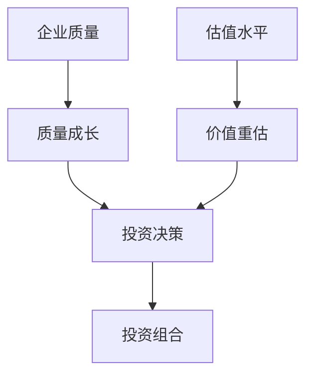
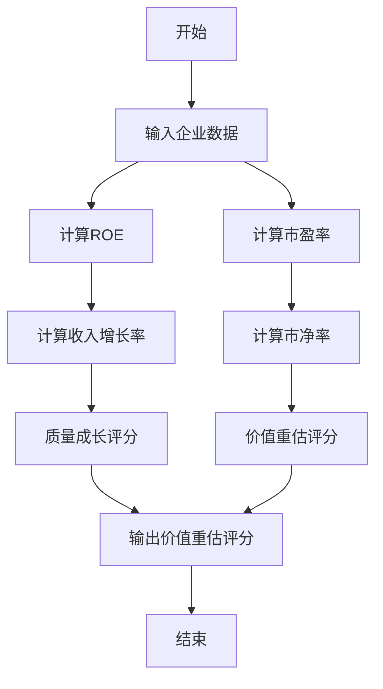
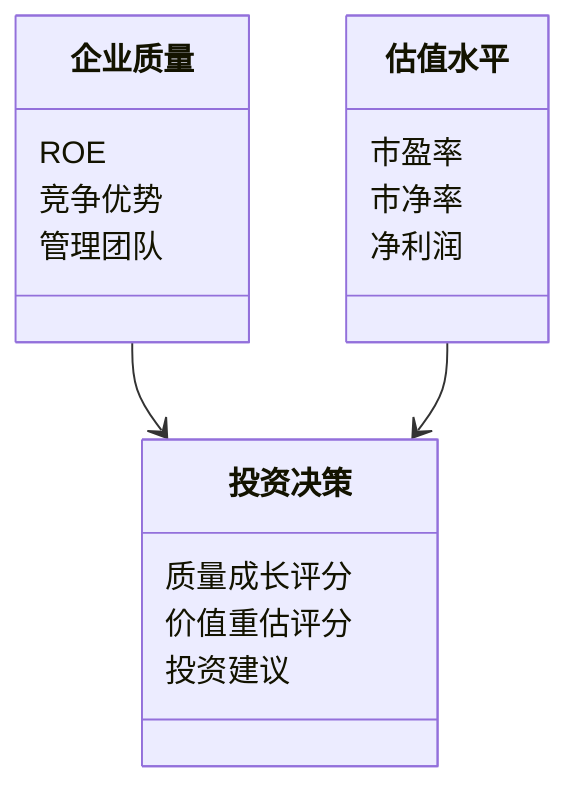
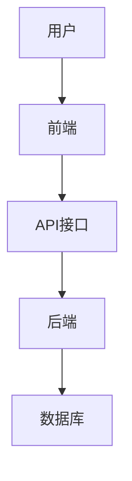
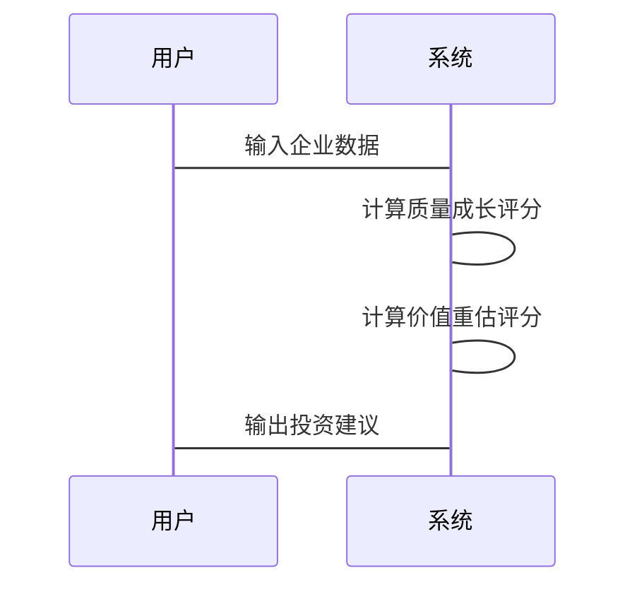

                 


# 彼得林奇的"质量成长"vs"价值重估"在新经济中的平衡

## 关键词：彼得林奇，质量成长，价值重估，投资策略，新经济

## 摘要：  
彼得·林奇是全球著名投资专家，他提出“质量成长”与“价值重估”两种投资策略。本文分析这两种策略在新经济环境下的平衡与应用，探讨其在现代投资中的意义与挑战。通过对比分析、算法原理、系统设计与案例实践，为投资者提供深度见解。

---

# 第一部分: 背景介绍

## 第1章: 彼得林奇的"质量成长"与"价值重估"概述

### 1.1 彼得林奇投资策略的背景

#### 1.1.1 彼得林奇及其投资理念  
彼得·林奇是全球著名投资专家，曾管理富达麦哲伦基金，创造了辉煌的投资业绩。他的投资理念强调长期价值与公司质量，主张通过深入研究企业基本面来选择投资标的。

#### 1.1.2 "质量成长"与"价值重估"的定义  
- **质量成长**：选择具备持续增长潜力、良好管理团队和竞争优势的公司，关注ROE、增长速度等指标。
- **价值重估**：寻找市场价格低于内在价值的公司，关注低市盈率、低市净率等估值指标。

#### 1.1.3 两种策略在投资中的应用  
质量成长适合长期成长型投资，价值重估适合寻找被低估的投资机会。两者结合可平衡短期与长期、成长与估值。

### 1.2 新经济环境下的投资挑战

#### 1.2.1 新经济的特点与变化  
新经济强调技术创新、数字化转型和商业模式创新，企业价值波动大，传统估值方法面临挑战。

#### 1.2.2 传统投资策略的局限性  
- 质量成长可能忽视短期波动。
- 价值重估可能错过新兴成长企业。

#### 1.2.3 质量成长与价值重估的平衡之道  
在新经济中，投资者需结合企业质量、成长潜力与估值水平，动态调整策略。

### 1.3 本书的核心问题与目标

#### 1.3.1 问题背景与问题描述  
探讨如何在新经济中平衡质量成长与价值重估策略，找到最优投资组合。

#### 1.3.2 问题解决的思路与方法  
通过分析、建模与案例研究，提出动态平衡策略。

#### 1.3.3 边界与外延  
- 限定于股票投资领域。
- 不涉及短期投机，强调长期价值。

#### 1.3.4 核心概念与组成要素  
- 企业质量：ROE、管理团队。
- 成长潜力：收入增长率、行业前景。
- 估值水平：市盈率、市净率。

#### 1.3.5 核心逻辑与思路  
动态评估企业质量与估值，结合成长与价值因素，优化投资组合。

### 1.5 本章小结  
彼得林奇的两种策略在新经济中需平衡，需结合企业质量、成长潜力与估值水平，动态调整投资策略。

---

# 第二部分: 核心概念与联系

## 第2章: 质量成长与价值重估的核心概念

### 2.1 质量成长的原理与特征

#### 2.1.1 质量成长的定义与特点  
- 长期投资，关注企业质量。
- 选择ROE高、管理优秀的企业。
- 适合长期持有，耐心等待价值显现。

#### 2.1.2 质量成长的核心要素  
- 企业盈利能力：ROE > 15%。
- 管理团队稳定性。
- 行业竞争优势。

#### 2.1.3 质量成长与传统成长投资的区别  
质量成长注重质量和可持续性，传统成长投资更关注短期增长。

### 2.2 价值重估的原理与特征

#### 2.2.1 价值重估的定义与特点  
- 寻找被低估的股票。
- 低市盈率、低市净率。
- 适合长期持有，等待价值回归。

#### 2.2.2 价值重估的核心要素  
- 市盈率 < 市盈率均值。
- 市净率 < 市净率均值。
- 财务健康状况。

#### 2.2.3 价值重估与传统价值投资的区别  
价值重估更注重动态估值，传统价值投资更注重静态估值。

### 2.3 质量成长与价值重估的对比分析

#### 2.3.1 对比表格：质量成长 vs 价值重估  

| 特性            | 质量成长           | 价值重估          |
|-----------------|-------------------|-------------------|
| 核心关注点       | 企业质量与成长    | 市场估值与价值    |
| 适合场景         | 长期成长股       | 低估股票          |
| 估值方法         | 相对估值           | 绝对估值          |
| 投资期限         | 长期              | 中长期           |

#### 2.3.2 ER实体关系图：质量成长与价值重估的联系  



### 2.4 本章小结  
质量成长与价值重估各有侧重，但相辅相成。投资者需根据市场环境动态调整策略，平衡成长与估值。

---

# 第三部分: 算法原理

## 第3章: 算法原理

### 3.1 质量成长的数学模型

#### 3.1.1 质量成长模型  
$$ \text{质量成长评分} = 0.5 \times \text{ROE} + 0.3 \times \text{收入增长率} + 0.2 \times \text{竞争优势} $$

#### 3.1.2 成长潜力预测  
$$ \text{未来股价} = \text{当前股价} \times (1 + \text{ROE})^n $$

### 3.2 价值重估的数学模型

#### 3.2.1 价值重估模型  
$$ \text{内在价值} = \text{净利润} \times (1 + g)^{-n} $$

#### 3.2.2 估值差异分析  
$$ \text{估值差异} = \text{内在价值} - \text{市场价格} $$

### 3.3 算法流程图  



### 3.4 Python代码实现  

```python
def quality_growth_score(roe, revenue_growth, competitive_edge):
    return 0.5 * roe + 0.3 * revenue_growth + 0.2 * competitive_edge

def value_reestimation_score(pe, pb, net_profit):
    return 0.4 * (pe < pe_mean) + 0.4 * (pb < pb_mean) + 0.2 * (net_profit > 0)
```

---

# 第四部分: 系统分析与架构设计

## 第4章: 系统分析与架构设计

### 4.1 问题场景介绍  
投资者需要一个系统来动态平衡质量成长与价值重估策略，优化投资组合。

### 4.2 系统功能设计  

#### 4.2.1 领域模型  



#### 4.2.2 系统架构  



#### 4.2.3 接口设计  
- 输入：企业基本面数据。
- 输出：投资建议。

#### 4.2.4 交互流程  



---

# 第五部分: 项目实战

## 第5章: 项目实战

### 5.1 环境安装  
安装Python、Pandas、Matplotlib等工具。

### 5.2 核心实现  

```python
import pandas as pd

def calculate_scores(df):
    # 质量成长评分
    df['质量成长评分'] = 0.5 * df['ROE'] + 0.3 * df['收入增长率'] + 0.2 * df['竞争优势']
    # 价值重估评分
    df['价值重估评分'] = 0.4 * (df['市盈率'] < df['市盈率均值']) + 0.4 * (df['市净率'] < df['市净率均值']) + 0.2 * (df['净利润'] > 0)
    return df

# 示例数据
data = {
    'ROE': [0.2, 0.3, 0.1],
    '收入增长率': [0.2, 0.1, 0.3],
    '竞争优势': [0.8, 0.6, 0.7],
    '市盈率': [15, 20, 12],
    '市净率': [2, 3, 1],
    '净利润': [10, 8, 12]
}
df = pd.DataFrame(data)
df['市盈率均值'] = df['市盈率'].mean()
df['市净率均值'] = df['市净率'].mean()

result = calculate_scores(df)
print(result)
```

### 5.3 案例分析  
以某科技公司为例，计算质量成长评分与价值重估评分，输出投资建议。

### 5.4 项目总结  
通过案例分析，验证算法的有效性，总结经验与不足。

---

# 第六部分: 最佳实践与总结

## 第6章: 最佳实践与总结

### 6.1 最佳实践 tips  
- 动态调整策略。
- 结合市场环境。
- 定期评估组合。

### 6.2 小结  
彼得林奇的两种策略在新经济中需动态平衡，投资者应结合企业质量、成长潜力与估值水平，制定合理投资策略。

### 6.3 注意事项  
- 风险提示：市场波动、数据误差。
- 投资者需具备分析能力。

### 6.4 拓展阅读  
推荐相关书籍与研究，鼓励深入学习。

---

# 作者信息

作者：AI天才研究院/AI Genius Institute & 禅与计算机程序设计艺术 /Zen And The Art of Computer Programming

---

通过以上结构，文章详细探讨了彼得林奇的两种投资策略在新经济中的应用，结合理论、算法、系统设计与实战案例，为投资者提供了全面的指导。

