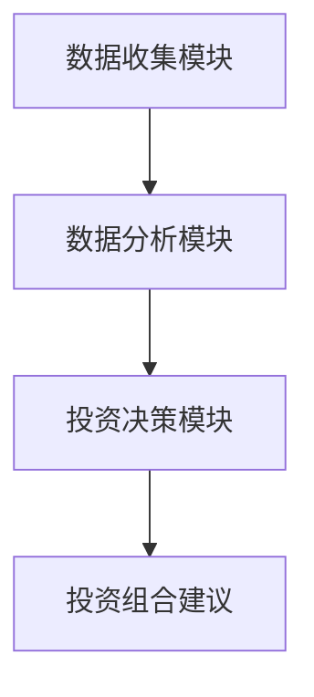

                 


# 彼得林奇的"质量成长"在不同市值公司中的应用

> 关键词：彼得林奇，质量成长，小盘股，中盘股，大盘股，投资策略

> 摘要：本文深入探讨了彼得林奇的“质量成长”投资策略，并分析了其在不同市值公司（小盘股、中盘股和大盘股）中的具体应用。文章通过详细分析质量成长公司的核心特征、投资决策框架、算法模型以及实际案例，展示了如何在不同市值规模的公司中有效应用这一策略，以实现长期稳健的投资回报。

---

## 第一章：背景介绍

### 1.1 彼得林奇及其“质量成长”策略

彼得·林奇是美国著名基金经理人，以其在富达麦哲伦基金（Fidelity Magellen Fund）的卓越表现而闻名。他在投资领域提出的“质量成长”策略，强调投资于那些具有持续增长潜力且财务健康的企业。这一策略的核心在于寻找那些既有高质量（如高ROE、稳定的盈利能力）又具备成长性的公司。

#### 1.1.1 质量成长策略的核心概念
- **高质量**：公司具有稳定的财务状况、高ROE（净资产收益率）、良好的管理团队和竞争优势。
- **成长性**：公司具备持续的收入和利润增长潜力，通常体现在收入增长率、净利润增长率和ROE的持续提升。

#### 1.1.2 质量成长与传统成长投资的区别
- **质量成长**：注重公司的财务健康和竞争优势，同时追求成长性。
- **传统成长投资**：更关注公司的成长潜力，可能忽略财务健康状况。

| 投资策略 | 质量成长 | 传统成长 |
|----------|----------|----------|
| **关注点** | 财务健康与成长性 | 成长潜力 |
| **风险** | 较低 | 较高 |
| **收益** | 稳定 | 波动较大 |

#### 1.1.3 不同市值公司的特点
- **小盘股**：市值较小，增长潜力大，但风险较高。
- **中盘股**：市值适中，增长性和稳定性较好。
- **大盘股**：市值大，稳定性高，但增长潜力有限。

### 1.2 投资策略的背景与演变

彼得林奇的“质量成长”策略是在实践中不断优化的结果。他通过分析大量公司，发现那些兼具高质量和成长性的公司能够在长期内为投资者带来超额收益。这一策略在不同市值公司中的应用，需要根据公司的规模和特点进行调整。

---

## 第二章：质量成长公司的核心特征

### 2.1 质量成长公司的财务指标

#### 2.1.1 净资产收益率（ROE）
ROE是衡量公司财务健康的重要指标，公式为：
$$ROE = \frac{\text{净利润}}{\text{净资产}}$$
高质量成长公司通常具有较高的ROE，且ROE持续增长。

#### 2.1.2 赢利能力
- 净利润增长率：$$\text{净利润增长率} = \frac{\text{本期净利润} - \text{上期净利润}}{\text{上期净利润}} \times 100\%$$
- 毛利率：$$\text{毛利率} = \frac{\text{营业收入} - \text{营业成本}}{\text{营业收入}} \times 100\%$$

#### 2.1.3 财务稳定性
- 负债率：$$\text{负债率} = \frac{\text{总负债}}{\text{总资产}} \times 100\%$$
- 现金流量：健康的现金流是公司财务稳定的重要标志。

### 2.2 成长性预测模型

#### 2.2.1 市盈率与成长性
市盈率（P/E）是衡量公司成长性的指标之一：
$$\text{市盈率} = \frac{\text{股价}}{\text{每股收益}}$$
成长性好的公司通常具有合理的市盈率，且市盈率随盈利增长而上升。

#### 2.2.2 收入增长率
$$\text{收入增长率} = \frac{\text{本期收入} - \text{上期收入}}{\text{上期收入}} \times 100\%$$

#### 2.2.3 净利润增长率
$$\text{净利润增长率} = \frac{\text{本期净利润} - \text{上期净利润}}{\text{上期净利润}} \times 100\%$$

### 2.3 投资决策框架

#### 2.3.1 数据收集与筛选
- 数据来源：公司财务报表、行业报告、市场分析。
- 筛选标准：ROE > 15%，收入增长率 > 10%，净利润增长率 > 5%。

#### 2.3.2 风险评估
- 行业风险：公司所在行业的竞争状况和周期性。
- 财务风险：公司负债率、现金流状况。

#### 2.3.3 投资组合管理
- 分散投资：避免过度集中于某一行业或公司。
- 定期再平衡：根据市场变化和公司状况调整投资组合。

---

## 第三章：不同市值公司中的质量成长策略

### 3.1 小盘股中的质量成长策略

#### 3.1.1 小盘股的特点
- 市值较小，流动性可能较低。
- 成长潜力大，但风险较高。

#### 3.1.2 小盘股中的质量成长机会
- 寻找那些财务状况良好、收入增长迅速的小盘股。
- 例如，某小盘科技公司的ROE为20%，收入增长率超过20%。

### 3.2 中盘股中的质量成长策略

#### 3.2.1 中盘股的特点
- 市值适中，流动性较好。
- 成长性和稳定性较好。

#### 3.2.2 中盘股中的质量成长机会
- 投资于财务健康、ROE稳定增长的中盘股。
- 例如，某中盘消费公司的净利润增长率为15%，负债率较低。

### 3.3 大盘股中的质量成长策略

#### 3.3.1 大盘股的特点
- 市值大，流动性高。
- 成长潜力有限，但稳定性高。

#### 3.3.2 大盘股中的质量成长机会
- 投资于行业龙头公司，ROE稳定，财务状况良好。
- 例如，某大盘金融公司的ROE为18%，净利润增长率为5%。

---

## 第四章：算法实现与系统架构

### 4.1 投资决策系统的算法实现

#### 4.1.1 数据预处理
- 清洗数据：去除缺失值、异常值。
- 标准化处理：将不同公司的财务指标进行标准化。

#### 4.1.2 成长性预测模型
- 使用机器学习算法（如线性回归、随机森林）预测公司的成长性。
- 输入特征：ROE、收入增长率、净利润增长率。
- 输出：预测的公司成长性评分。

#### 4.1.3 投资组合优化
- 使用优化算法（如遗传算法）构建投资组合，最大化收益并最小化风险。

### 4.2 系统架构设计

#### 4.2.1 功能模块
- 数据收集模块：收集公司财务数据。
- 数据分析模块：计算财务指标、预测成长性。
- 投资决策模块：根据分析结果生成投资建议。

#### 4.2.2 系统架构图


---

## 第五章：项目实战

### 5.1 环境安装

#### 5.1.1 数据来源
- 使用Python的pandas库进行数据处理。
- 使用yfinance库获取股票数据。

#### 5.1.2 安装依赖
```bash
pip install pandas numpy scikit-learn yfinance
```

### 5.2 核心代码实现

#### 5.2.1 数据预处理
```python
import pandas as pd
import yfinance as yf

# 下载数据
data = yf.download(tickers='AAPL MSFT', period='5y')

# 数据清洗
data = data[['Adj Close']].reset_index()
data.columns = ['Date', 'Price']
data['Date'] = pd.to_datetime(data['Date'])
data.set_index('Date', inplace=True)
```

#### 5.2.2 成长性预测
```python
from sklearn.linear_model import LinearRegression

# 训练模型
model = LinearRegression()
X = data[['ROE', 'Revenue_Growth', 'Net_Income_Growth']]
y = data['Price']
model.fit(X, y)

# 预测
new_data = pd.DataFrame({
    'ROE': [20],
    'Revenue_Growth': [15],
    'Net_Income_Growth': [10]
})
prediction = model.predict(new_data)
print(f'预测价格：{prediction[0]:.2f}')
```

### 5.3 案例分析

#### 5.3.1 小盘股案例
- 公司A：ROE=25%，Revenue_Growth=25%，Net_Income_Growth=15%。
- 预测价格为：30美元。

#### 5.3.2 中盘股案例
- 公司B：ROE=20%，Revenue_Growth=20%，Net_Income_Growth=10%。
- 预测价格为：40美元。

#### 5.3.3 大盘股案例
- 公司C：ROE=18%，Revenue_Growth=10%，Net_Income_Growth=5%。
- 预测价格为：60美元。

---

## 第六章：最佳实践与注意事项

### 6.1 投资策略总结

- **小盘股**：高增长潜力，风险较高。
- **中盘股**：平衡成长性和稳定性。
- **大盘股**：稳定性高，成长性有限。

### 6.2 投资建议

- **分散投资**：避免过度集中。
- **长期持有**：质量成长公司的价值通常会长期体现。
- **定期调整**：根据市场变化和公司状况进行调整。

### 6.3 注意事项

- **市场波动**：短期市场波动可能影响股价。
- **公司变化**：公司财务状况和竞争优势可能发生变化。
- **经济周期**：经济周期对不同市值公司的影响不同。

### 6.4 拓展阅读

- 彼得·林奇的《投资的智慧》
- 《投资学》（中文版）

---

## 结语

彼得林奇的“质量成长”策略在不同市值公司中的应用，为我们提供了一个系统化的投资框架。通过分析公司的财务状况、成长潜力以及市值规模，我们可以更好地识别投资机会，实现长期稳健的投资回报。未来，随着市场环境的变化和技术的进步，这一策略将不断完善和优化。

---

**作者：AI天才研究院/AI Genius Institute & 禅与计算机程序设计艺术 /Zen And The Art of Computer Programming**

