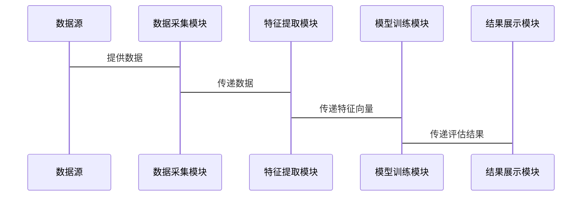

                 


# 彼得林奇的"质量成长"在新经济公司中的应用

> 关键词：彼得林奇，质量成长，新经济公司，投资策略，机器学习，系统架构

> 摘要：本文探讨了彼得·林奇的“质量成长”投资策略在新经济公司中的应用。通过结合投资学理论与现代技术手段，文章详细分析了如何利用质量成长策略筛选和评估新经济公司，并提出了基于机器学习的实现方法。文章内容涵盖策略背景、核心概念、算法原理、系统架构、项目实战等多个方面，旨在为投资者和科技爱好者提供深度的理论与实践指导。

---

## 第一部分: 彼得林奇的"质量成长"投资策略概述

### 第1章: "质量成长"策略的背景与核心概念

#### 1.1 "质量成长"策略的背景

##### 1.1.1 投资学中的"质量成长"概念
在投资学领域，"质量成长"策略是一种以公司质量为核心，同时关注其成长潜力的投资方法。该策略强调选择那些具备优秀基本面、良好管理团队以及持续增长能力的公司。彼得·林奇是该策略的倡导者之一，他通过长期观察和实践，总结出了一套适用于不同经济环境的投资法则。

##### 1.1.2 彼得·林奇的"质量成长"理论
彼得·林奇在其著作中详细阐述了"质量成长"策略的核心思想：首先，投资者应关注公司的财务健康状况，包括利润增长、资产负债情况等；其次，要评估公司的管理能力，包括领导层的战略眼光和执行力；最后，要分析公司的市场地位和竞争优势。

##### 1.1.3 新经济公司的定义与特征
新经济公司主要指那些以科技、互联网、大数据、人工智能等新兴技术为核心业务的公司。这些公司通常具有高增长潜力，但也伴随着高风险。新经济公司的特征包括：轻资产、高技术门槛、依赖创新能力和商业模式的持续优化。

#### 1.2 "质量成长"策略的核心要素

##### 1.2.1 公司质量的核心维度
- **财务健康状况**：包括盈利能力、资产负债率、现金流等指标。
- **管理团队能力**：包括领导层的经验、战略眼光和执行力。
- **市场地位**：包括公司在行业中的排名、市场份额等。

##### 1.2.2 成长潜力的评估标准
- **行业前景**：所在行业的市场规模、增长速度。
- **竞争优势**：公司在技术、产品、成本等方面的优势。
- **创新能力**：公司研发投入和技术成果转化能力。

##### 1.2.3 "质量成长"策略的边界与外延
"质量成长"策略并非适用于所有类型的公司。对于新经济公司而言，需要结合行业特点和公司具体情况，灵活调整评估标准。例如，在评估互联网公司时，需要重点关注用户增长和变现能力；在评估科技公司时，则需关注技术壁垒和产品迭代速度。

---

### 第2章: "质量成长"策略与新经济公司的结合

#### 2.1 新经济公司的特征分析

##### 2.1.1 新经济公司的定义与分类
新经济公司主要涵盖以下几个领域：
- **科技公司**：如人工智能、大数据、云计算等领域的公司。
- **互联网公司**：包括电子商务、社交媒体、搜索引擎等。
- **金融科技公司**：如区块链、数字货币、在线支付等。
- **共享经济公司**：如共享单车、共享办公空间等。

##### 2.1.2 新经济公司的增长模式
新经济公司通常具有以下增长模式：
- **技术创新驱动**：通过技术研发和产品创新实现增长。
- **用户增长驱动**：通过扩大用户基数和提升用户粘性实现增长。
- **模式创新驱动**：通过商业模式创新（如订阅制、平台经济）实现增长。

##### 2.1.3 新经济公司的竞争优势
新经济公司的竞争优势主要体现在以下几个方面：
- **技术门槛高**：通过技术研发形成竞争壁垒。
- **用户粘性大**：通过产品和服务创新提升用户粘性。
- **数据驱动决策**：通过大数据分析优化运营和决策。

#### 2.2 "质量成长"策略在新经济公司中的应用

##### 2.2.1 "质量成长"策略的核心要素与新经济公司的匹配
- **财务健康状况**：新经济公司往往需要较高的研发投入和资本支持，因此财务健康状况是评估其持续成长能力的重要指标。
- **管理团队能力**：新经济公司通常依赖创新能力和快速响应能力，因此管理团队的能力尤为重要。
- **市场地位**：新经济公司需要在竞争激烈的市场中占据一定的市场份额，才能实现持续成长。

##### 2.2.2 新经济公司中"质量成长"的实现路径
- **选择优质赛道**：优先选择行业前景广阔、增长潜力大的领域。
- **关注技术创新**：选择具备技术壁垒和创新能力的公司。
- **评估管理团队**：选择经验丰富、战略清晰的管理团队。
- **关注财务健康**：选择财务稳健、具备持续融资能力的公司。

##### 2.2.3 新经济公司中"质量成长"的案例分析
以某知名互联网公司为例，分析其在"质量成长"策略下的表现：
- **行业前景**：互联网行业市场规模持续增长，具有广阔的发展空间。
- **竞争优势**：公司具备强大的技术实力和用户基础。
- **管理团队**：公司领导层具有丰富的行业经验和创新能力。
- **财务状况**：公司财务健康，具备持续研发投入的能力。

---

### 第3章: "质量成长"策略的数学模型与算法原理

#### 3.1 "质量成长"策略的数学模型

##### 3.1.1 公司质量的量化指标
- **财务指标**：如净利润增长率、ROE（净资产收益率）、现金流等。
- **管理能力指标**：如团队稳定性、创新能力等。
- **市场指标**：如市场份额、品牌价值等。

##### 3.1.2 成长潜力的数学表达
成长潜力可以通过以下数学模型进行量化：
$$ \text{成长潜力} = \alpha \times \text{行业增长率} + \beta \times \text{技术创新能力} + \gamma \times \text{管理团队能力} $$
其中，$\alpha$、$\beta$、$\gamma$为权重系数，具体数值可以根据实际情况调整。

##### 3.1.3 综合评分模型的构建
综合评分模型可以表示为：
$$ \text{综合评分} = \sum_{i=1}^{n} w_i \times x_i $$
其中，$w_i$为各个评估指标的权重，$x_i$为对应指标的得分。

#### 3.2 基于机器学习的"质量成长"策略实现

##### 3.2.1 数据预处理与特征提取
- **数据清洗**：去除缺失值和异常值。
- **特征选择**：从财务、管理、市场等多个维度提取特征。

##### 3.2.2 算法选择与模型训练
推荐使用随机森林或支持向量机（SVM）进行模型训练。以下是随机森林的实现步骤：
1. 数据预处理：将数据集分为训练集和测试集。
2. 特征选择：选择对目标变量影响较大的特征。
3. 模型训练：使用随机森林算法进行训练。
4. 模型评估：通过准确率、召回率等指标评估模型性能。

##### 3.2.3 模型评估与优化
- **评估指标**：准确率、精确率、召回率、F1分数。
- **优化方法**：调整模型参数、增加特征工程、尝试不同的算法。

---

### 第4章: 系统分析与架构设计方案

#### 4.1 系统功能设计

##### 4.1.1 数据采集模块
- **功能**：从公开数据源（如公司财报、新闻报道）采集数据。
- **实现**：使用爬虫技术或API接口获取数据。

##### 4.1.2 特征提取模块
- **功能**：对采集的数据进行特征提取，生成评估指标。
- **实现**：通过数据预处理和特征工程生成特征向量。

##### 4.1.3 模型训练模块
- **功能**：使用机器学习算法训练"质量成长"评估模型。
- **实现**：选择合适的算法（如随机森林）进行模型训练。

##### 4.1.4 结果展示模块
- **功能**：将模型输出结果以可视化形式展示。
- **实现**：使用图表库（如Matplotlib）生成可视化报告。

#### 4.2 系统架构设计

##### 4.2.1 系统架构图


##### 4.2.2 关键模块交互图


---

### 第5章: 项目实战

#### 5.1 环境安装

##### 5.1.1 安装Python和相关库
- 安装Python：[官方网站](https://www.python.org/)
- 安装库：`pip install numpy pandas scikit-learn matplotlib`

#### 5.2 核心代码实现

##### 5.2.1 数据预处理代码
```python
import pandas as pd
import numpy as np

# 读取数据
data = pd.read_csv('company_data.csv')

# 删除缺失值
data = data.dropna()

# 去除异常值
Q1 = data.quantile(0.25)
Q3 = data.quantile(0.75)
IQR = Q3 - Q1
data = data[~((data < (Q1 - 1.5 * IQR)) | (data > (Q3 + 1.5 * IQR))).any(axis=1)]
```

##### 5.2.2 模型训练代码
```python
from sklearn.ensemble import RandomForestClassifier
from sklearn.model_selection import train_test_split
from sklearn.metrics import accuracy_score

# 数据分割
X = data.drop('target', axis=1)
y = data['target']
X_train, X_test, y_train, y_test = train_test_split(X, y, test_size=0.2)

# 模型训练
model = RandomForestClassifier()
model.fit(X_train, y_train)

# 模型评估
y_pred = model.predict(X_test)
print('准确率:', accuracy_score(y_test, y_pred))
```

##### 5.2.3 结果可视化代码
```python
import matplotlib.pyplot as plt

# 绘制特征重要性图
importances = model.feature_importances_
indices = np.argsort(importances)[::-1]

plt.figure(figsize=(10, 6))
plt.title('特征重要性')
plt.bar(range(X.shape[1]), importances[indices], align='center')
plt.xticks(range(X.shape[1]), indices)
plt.ylabel('重要性')
plt.show()
```

#### 5.3 项目总结
通过以上代码实现，我们可以清晰地看到各个特征对公司质量的贡献程度。在实际应用中，可以根据模型输出的结果，结合行业动态和公司具体情况，进一步优化投资策略。

---

## 第六章: 最佳实践与小结

### 6.1 投资策略建议
- **行业选择**：优先选择具备广阔增长空间的行业。
- **公司筛选**：结合财务、管理、市场等多维度指标进行筛选。
- **持续跟踪**：定期评估公司表现，及时调整投资组合。

### 6.2 注意事项
- **数据质量**：确保数据来源可靠，避免因数据问题导致误判。
- **模型优化**：根据实际情况不断优化模型，提升评估准确性。
- **风险控制**：合理分散投资，降低单一投资的风险。

### 6.3 未来研究方向
- **多模型融合**：尝试将多种机器学习模型结合，提升评估效果。
- **动态评估**：开发实时评估系统，及时捕捉市场变化。
- **跨领域应用**：将质量成长策略应用于更多领域，如医疗、教育等。

---

## 作者

作者：AI天才研究院/AI Genius Institute & 禅与计算机程序设计艺术/Zen And The Art of Computer Programming

---

**本文为AI天才研究院原创，转载请注明出处。**

