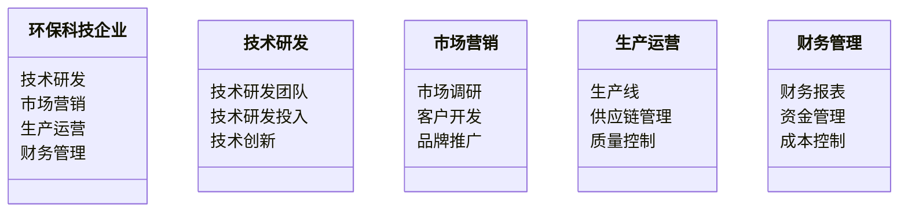
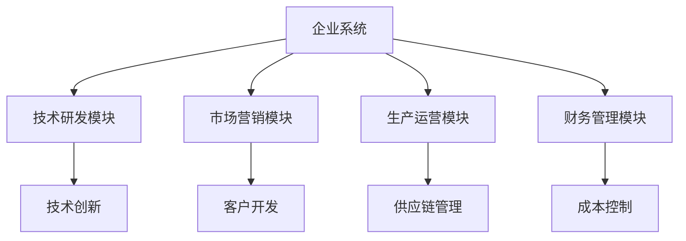
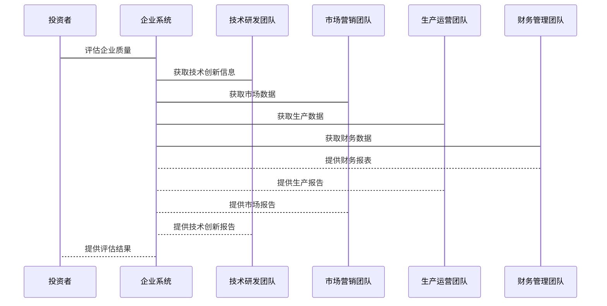

                 

# 彼得林奇的"质量成长"在环保科技企业中的应用

---

## 关键词：彼得林奇，质量成长，环保科技企业，投资策略，企业评估

---

## 摘要：

本文探讨了彼得林奇的“质量成长”投资理念在环保科技企业中的应用。首先，我们介绍了彼得林奇的投资哲学和质量成长理念的核心要素。接着，我们分析了环保科技企业的特点，包括其商业模式、竞争优势和行业趋势。随后，我们详细阐述了如何将质量成长理念应用到环保科技企业的评估和投资策略中，包括评估指标、投资逻辑和风险管理。最后，我们通过具体案例分析了这一理念的实际应用效果。

---

## 正文：

### 第一部分：彼得林奇“质量成长”投资理念概述

#### 第1章：彼得林奇与“质量成长”投资理念

##### 1.1 彼得林奇的背景与投资风格

###### 1.1.1 彼得林奇的生平简介

彼得·林奇（Peter Lynch）是美国著名的投资专家，曾任富达麦哲伦基金的经理。他在投资领域有着卓越的成就，以其独特的投资策略和长期的市场观察闻名。彼得林奇的投资哲学强调长期持有优质股票，避免频繁交易，注重企业基本面分析。

###### 1.1.2 彼得林奇的投资哲学

彼得林奇的投资哲学可以概括为“买入并持有”。他认为，成功的投资不仅仅是选择正确的股票，更重要的是长期关注企业的成长和变化。他主张投资者应该选择那些具有强大竞争优势、良好管理团队和持续增长潜力的企业。

###### 1.1.3 “质量成长”投资理念的核心思想

“质量成长”理念的核心是寻找那些具有高质量、稳定增长潜力的企业。这些企业通常在行业中具有领先地位，具备强大的竞争优势和持续的增长能力。彼得林奇强调，投资者应该关注企业的内在质量，而不是短期市场波动。

##### 1.2 “质量成长”投资理念的定义与特点

###### 1.2.1 质量成长的定义

“质量成长”指的是选择那些具有高质量、稳定增长潜力的企业进行投资。这种投资策略注重企业的内在质量，包括盈利能力、管理团队、市场地位和技术优势等。

###### 1.2.2 质量成长的核心要素对比表格

以下是质量成长与其它投资策略的核心要素对比：

| 投资策略       | 质量成长 | 价值投资 | 成长投资 |
|----------------|----------|-----------|----------|
| 核心目标       | 高质量、稳定增长 | 低估值、高内在价值 | 高增长潜力 |
| 投资期限       | 中长期 | 长期 | 中短期 |
| 关注点         | 盈利能力、竞争优势 | 估值、现金流 | 增长率、市场份额 |

###### 1.2.3 质量成长与其它投资策略的差异

质量成长策略与价值投资和成长投资的主要区别在于，质量成长既关注企业的内在质量，也关注其未来的增长潜力。与价值投资相比，质量成长更注重企业的基本面和长期竞争优势；与成长投资相比，质量成长更注重企业的质量和稳定性。

#### 第2章：环保科技企业的核心特征与竞争优势

##### 2.1 环保科技企业的定义与分类

###### 2.1.1 环保科技企业的定义

环保科技企业是指专注于环境保护、清洁能源、节能减排等领域的科技公司。这些企业通过技术创新和商业模式创新，致力于解决环境问题，推动可持续发展。

###### 2.1.2 环保科技企业的主要分类

环保科技企业可以分为以下几类：

1. **清洁能源企业**：如太阳能、风能等可再生能源公司。
2. **环保技术企业**：如污水处理、废气处理等环保技术公司。
3. **绿色交通企业**：如电动汽车、智能交通系统等企业。
4. **循环经济企业**：如资源回收、废弃物再利用等公司。

###### 2.1.3 各类环保科技企业的特点对比

以下是各类环保科技企业的特点对比：

| 企业类型       | 清洁能源 | 环保技术 | 绿色交通 | 循环经济 |
|----------------|----------|-----------|-----------|-----------|
| 核心技术       | 可再生能源技术 | 污染处理技术 | 智能交通技术 | 资源回收技术 |
| 市场潜力       | 高 | 中 | 高 | 中 |
| 技术门槛       | 高 | 高 | 中 | 中 |

##### 2.2 环保科技企业的商业模式与盈利模式

###### 2.2.1 环保科技企业的商业模式

环保科技企业的商业模式主要包括以下几种：

1. **技术授权模式**：企业通过授权技术使用费获得收入。
2. **产品销售模式**：企业通过销售环保产品获得收入。
3. **服务模式**：企业通过提供环保服务（如污染治理、资源回收等）获得收入。
4. **订阅模式**：企业通过提供环保技术的订阅服务获得收入。

###### 2.2.2 盈利模式的多样性与创新性

环保科技企业的盈利模式具有多样性和创新性。例如，一些企业通过提供环保解决方案，将技术、产品和服务相结合，形成了一种综合性的盈利模式。此外，一些企业还通过政府补贴、碳交易等新兴方式获得额外收益。

##### 2.3 环保科技企业的竞争优势分析

###### 2.3.1 技术优势

环保科技企业的核心竞争优势在于其技术实力。企业通过技术创新，不断提高产品的性能和成本效益，从而在市场中占据领先地位。

###### 2.3.2 市场优势

随着全球对环境保护的重视，环保科技企业面临的市场机会不断增加。特别是在中国，政府政策的大力支持为环保科技企业提供了广阔的发展空间。

###### 2.3.3 资源优势

一些环保科技企业由于其独特的资源获取能力，能够获得更多的政策支持、资金投入和市场机会，从而形成竞争优势。

#### 第3章：质量成长理念在环保科技企业的具体应用

##### 3.1 环保科技企业的行业趋势分析

###### 3.1.1 全球环保科技行业的现状与趋势

全球环保科技行业正处于快速发展阶段。随着环保意识的增强和政策的支持，环保科技企业迎来了前所未有的发展机遇。

###### 3.1.2 中国环保科技行业的政策支持与市场潜力

在中国，环保科技行业得到了政府的大力支持。政策的倾斜和市场的潜力为环保科技企业的成长提供了有力保障。

###### 3.1.3 行业趋势对质量成长理念的影响

环保科技行业的快速发展为质量成长理念的应用提供了良好的环境。企业通过技术创新和市场拓展，不断实现高质量的增长。

##### 3.2 环保科技企业的质量成长评估体系

###### 3.2.1 企业质量评估的核心指标

以下是企业质量评估的核心指标：

| 指标类别       | 财务指标 | 市场指标 | 技术指标 |
|----------------|----------|-----------|-----------|
| 具体指标       | 净利润增长率、ROE | 市场占有率、客户满意度 | 技术研发投入、专利数量 |

###### 3.2.2 成长性评估的关键因素

成长性评估的关键因素包括企业的收入增长率、市场份额增长率、技术进步速度等。

###### 3.2.3 质量与成长的综合评估模型

以下是质量与成长的综合评估模型：

![mermaid]
graph TD
A[企业质量评估] --> B[财务指标]
A --> C[市场指标]
A --> D[技术指标]
B --> E[净利润增长率]
B --> F[ROE]
C --> G[市场占有率]
C --> H[客户满意度]
D --> I[技术研发投入]
D --> J[专利数量]

##### 3.3 环保科技企业的投资逻辑与案例分析

###### 3.3.1 投资逻辑的构建

投资逻辑的构建需要综合考虑企业的财务状况、市场地位、技术实力和成长潜力。

###### 3.3.2 典型案例分析

以某环保科技企业为例，分析其投资逻辑。例如，假设某企业在污水处理技术上具有领先地位，市场占有率高，且财务状况良好，具备持续增长的潜力。

###### 3.3.3 投资逻辑的验证与优化

通过实际市场表现，验证投资逻辑的有效性，并根据市场变化进行优化。

#### 第4章：环保科技企业的质量成长投资策略

##### 4.1 投资策略的制定与实施

###### 4.1.1 投资策略的制定原则

制定投资策略时，需要遵循以下原则：

1. **长期投资**：注重企业的长期成长潜力。
2. **分散投资**：避免过度集中，降低风险。
3. **动态调整**：根据市场变化和企业表现进行动态调整。

###### 4.1.2 投资策略的实施步骤

投资策略的实施步骤包括：

1. **筛选企业**：根据质量成长评估体系，筛选出符合条件的企业。
2. **构建投资组合**：根据企业特点和市场状况，构建投资组合。
3. **长期持有**：避免频繁交易，注重企业的长期成长。

###### 4.1.3 投资策略的动态调整

根据市场变化和企业表现，定期评估投资组合，并进行必要的调整。

##### 4.2 投资组合理论与实践

###### 4.2.1 投资组合理论的介绍

投资组合理论强调通过分散投资来降低风险，同时追求最大化的收益。

###### 4.2.2 投资组合的构建与优化

根据企业的质量成长评估结果，构建投资组合，并通过定期评估进行优化。

###### 4.2.3 投资组合的风险管理

通过分散投资、设置止损等方式，有效管理投资组合的风险。

### 第二部分：环保科技企业的系统分析与架构设计

#### 第5章：系统分析与架构设计方案

##### 5.1 环保科技企业的系统功能设计

###### 5.1.1 领域模型类图

以下是环保科技企业的领域模型类图：

##### 5.2 系统架构设计

###### 5.2.1 系统架构图

以下是环保科技企业的系统架构图：

##### 5.3 系统接口设计

系统接口设计需要考虑企业内部各部门之间的协作，以及与外部合作伙伴的接口。

##### 5.4 系统交互序列图

以下是系统交互序列图：

### 第三部分：项目实战与最佳实践

#### 第6章：项目实战

##### 6.1 环保科技企业投资案例分析

###### 6.1.1 环保科技企业的投资环境

环保科技企业的投资环境包括政策支持、市场需求、技术发展等多个方面。

###### 6.1.2 投资策略的选择与实施

根据企业的特点和市场环境，选择合适的投资策略，并进行实施。

###### 6.1.3 投资结果与分析

通过对实际案例的分析，验证投资策略的有效性，并总结经验教训。

##### 6.2 投资组合管理与风险管理

###### 6.2.1 投资组合管理的策略与技巧

通过合理配置资产，分散投资风险，优化投资组合。

###### 6.2.2 风险管理的实施与监控

建立风险管理机制，定期评估和监控，及时发现和应对潜在风险。

#### 第7章：最佳实践与总结

##### 7.1 投资策略的总结与反思

通过对项目的总结和反思，找出投资策略的优缺点，为未来投资提供参考。

##### 7.2 投资风险管理的经验与教训

总结风险管理的经验与教训，提出改进措施，降低未来投资风险。

##### 7.3 未来投资趋势的展望

根据市场变化和技术发展，展望未来环保科技企业的投资趋势。

---

## 作者：AI天才研究院/AI Genius Institute & 禅与计算机程序设计艺术 /Zen And The Art of Computer Programming

---

通过以上内容，我们系统地探讨了彼得林奇的“质量成长”理念在环保科技企业中的应用。从理论分析到实际操作，从系统设计到项目实战，我们为读者提供了全面的指导和深入的见解。希望本文能够帮助投资者更好地理解和应用质量成长理念，实现长期稳健的投资回报。

