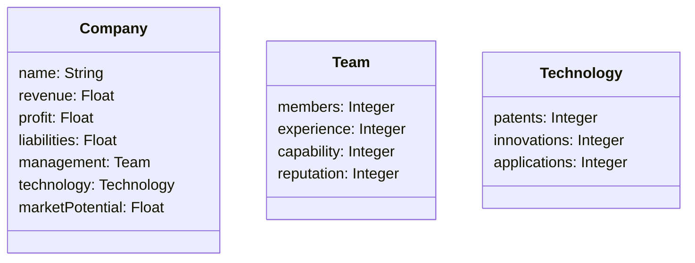
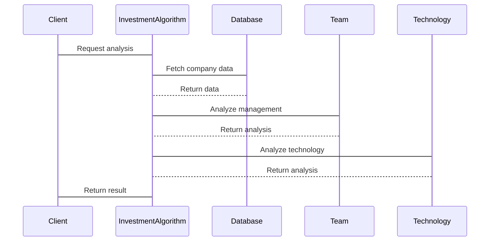
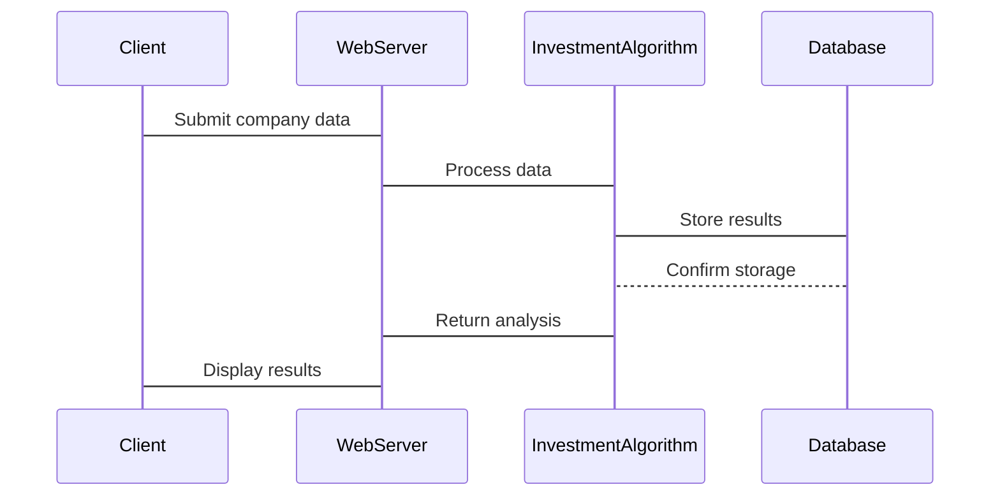

                 


# 彼得林奇的"质量成长"在生物科技初创公司中的应用

## 关键词：彼得林奇，质量成长，生物科技，初创公司，投资策略

## 摘要：本文探讨了彼得林奇的"质量成长"投资理论在生物科技初创公司中的应用。通过分析生物科技初创公司的特点，结合"质量成长"的核心要素，提出了一套适用于生物科技领域的投资策略，并通过实际案例和系统设计进行了详细阐述。

---

## 第一部分: 彼得林奇的"质量成长"投资理论概述

### 第1章: 彼得林奇的"质量成长"投资理论

#### 1.1 "质量成长"投资的核心概念

##### 1.1.1 投资的定义与分类
- 投资：通过购买资产以期获得未来收益的行为。
- 分类：股票投资、债券投资、房地产投资等。

##### 1.1.2 "质量成长"的定义与特点
- 质量成长：投资于具有强大基本面和成长潜力的公司。
- 特点：注重企业质量，追求长期稳定增长。

##### 1.1.3 "质量成长"与其它投资策略的对比
| 投资策略 | 核心关注点 | 适用场景 |
|----------|------------|----------|
| 价值投资 | 低估值     | 成熟企业 |
| 成长投资 | 高增长     | 初创企业 |
| 质量成长 | 高质量+高增长 | 初创企业 |

#### 1.2 彼得林奇投资理论的背景

##### 1.2.1 彼得林奇的生平简介
- 彼得·林奇：美国著名投资经理人，以其成功的投资策略闻名。

##### 1.2.2 "质量成长"理论的提出背景
- 20世纪80年代，美国科技行业快速发展。

##### 1.2.3 理论在现代投资中的地位
- 成为价值投资与成长投资的结合体。

#### 1.3 "质量成长"理论的核心要素

##### 1.3.1 企业的基本面分析
- 财务状况：收入、利润、负债。
- 管理团队：经验和能力。
- 技术壁垒：专利和竞争优势。

##### 1.3.2 企业的成长潜力评估
- 市场需求：增长空间。
- 竞争优势：技术或成本优势。
- 创新能力：研发投入和成果。

##### 1.3.3 企业的财务健康状况
- 盈利能力：净利率、毛利率。
- 财务稳定性：现金流、负债率。

---

## 第2章: 生物科技初创公司的特点与挑战

### 2.1 生物科技行业的特点

#### 2.1.1 生物科技行业的定义与范围
- 生物科技：利用生物技术进行产品和服务开发。
- 范围：医疗、农业、环保等。

#### 2.1.2 生物科技行业的创新性与风险性
- 创新性：依赖技术创新。
- 风险性：研发周期长、失败率高。

#### 2.1.3 生物科技行业的周期性与波动性
- 周期性：受政策和市场需求影响。
- 波动性：技术突破带来股价波动。

### 2.2 生物科技初创公司的特点

#### 2.2.1 初创公司的规模与资源限制
- 资金有限：研发投入高。
- 人员有限：依赖核心团队。

#### 2.2.2 初创公司的技术壁垒与竞争优势
- 技术壁垒：专利和技术独占性。
- 市场优势：早期进入市场的优势。

#### 2.2.3 初创公司的融资需求与市场定位
- 融资需求：种子轮、A轮等。
- 市场定位：目标客户和市场细分。

### 2.3 生物科技初创公司的投资挑战

#### 2.3.1 技术风险与市场风险
- 技术风险：研发失败。
- 市场风险：市场需求变化。

#### 2.3.2 财务风险与管理风险
- 财务风险：现金流不稳定。
- 管理风险：团队决策失误。

#### 2.3.3 法律与政策风险
- 法律风险：知识产权纠纷。
- 政策风险：法规变化。

---

## 第3章: "质量成长"理论在生物科技初创公司中的应用

### 3.1 投资标准的制定

#### 3.1.1 企业的财务健康状况评估

##### 3.1.1.1 财务健康评估指标
- 净利润：衡量盈利能力。
- 负债率：衡量财务风险。
- 现金流：衡量流动性。

##### 3.1.1.2 财务健康评估方法
- 使用财务指标进行综合评估。

#### 3.1.2 企业的管理团队能力评估

##### 3.1.2.1 管理团队评估维度
- 经验：行业经验。
- 能力：领导能力和决策能力。
- 声誉：市场声誉。

##### 3.1.2.2 管理团队评估方法
- 调查和访谈。

#### 3.1.3 企业的技术壁垒与市场潜力评估

##### 3.1.3.1 技术壁垒评估维度
- 专利数量。
- 技术创新性。
- 技术应用前景。

##### 3.1.3.2 市场潜力评估维度
- 市场需求。
- 市场竞争。
- 市场进入壁垒。

### 3.2 投资策略的制定

#### 3.2.1 长期投资与价值投资的结合

##### 3.2.1.1 长期投资策略
- 持股时间长，关注长期增长。

##### 3.2.1.2 价值投资策略
- 寻找被低估的投资标的。

#### 3.2.2 风险控制与收益最大化

##### 3.2.2.1 风险控制策略
- 分散投资，降低风险。

##### 3.2.2.2 收益最大化策略
- 选择高成长潜力的公司。

#### 3.2.3 投资组合的构建与优化

##### 3.2.3.1 投资组合构建原则
- 多样化、风险分散。

##### 3.2.3.2 投资组合优化方法
- 定期评估和调整。

### 3.3 实际案例分析

#### 3.3.1 美国某生物科技初创公司的投资案例

##### 3.3.1.1 公司背景
- 公司名称：Genetech Inc.
- 成立时间：2010年。
- 主要业务：基因治疗。

##### 3.3.1.2 投资决策过程
- 财务状况：良好，但研发投入高。
- 管理团队：经验丰富。
- 技术壁垒：拥有多个专利。

##### 3.3.1.3 投资结果
- 股价增长超过预期。

#### 3.3.2 欧洲某生物科技初创公司的投资案例

##### 3.3.2.1 公司背景
- 公司名称：BioInnovate Ltd.
- 成立时间：2015年。
- 主要业务：生物制药。

##### 3.3.2.2 投资决策过程
- 财务状况：稳健，现金流充足。
- 管理团队：能力强。
- 市场潜力：巨大。

##### 3.3.2.3 投资结果
- 市场表现优异。

#### 3.3.3 亚洲某生物科技初创公司的投资案例

##### 3.3.3.1 公司背景
- 公司名称：GeneTech Co.
- 成立时间：2012年。
- 主要业务：基因检测。

##### 3.3.3.2 投资决策过程
- 财务状况：健康，收入增长快。
- 技术壁垒：拥有核心专利。
- 市场定位：精准。

##### 3.3.3.3 投资结果
- 成功上市，股价上涨。

---

## 第4章: 投资组合

### 4.1 投资组合的构建

#### 4.1.1 风险分散与资产配置

##### 4.1.1.1 资产配置原则
- 分散投资，降低风险。

##### 4.1.1.2 资产配置方法
- 根据风险承受能力调整比例。

#### 4.1.2 投资策略的选择

##### 4.1.2.1 策略选择依据
- 市场状况、个人风险偏好。

##### 4.1.2.2 策略选择方法
- 定期评估和调整。

#### 4.1.3 长期跟踪评估

##### 4.1.3.1 跟踪指标
- 股价表现、财务指标。

##### 4.1.3.2 跟踪方法
- 定期审查投资组合。

### 4.2 投资组合的优化

#### 4.2.1 优化时机与频率

##### 4.2.1.1 优化时机
- 市场变化、公司状况变化。

##### 4.2.1.2 优化频率
- 每季度或每年一次。

#### 4.2.2 优化方法

##### 4.2.2.1 基于财务指标的优化
- 分析各项财务指标。

##### 4.2.2.2 基于市场变化的优化
- 调整投资比例。

### 4.3 投资组合的风险管理

#### 4.3.1 风险识别与评估

##### 4.3.1.1 风险识别方法
- 定期评估公司状况。

##### 4.3.1.2 风险评估指标
- 财务指标、市场指标。

#### 4.3.2 风险控制策略

##### 4.3.2.1 风险分散
- 投资多样化。

##### 4.3.2.2 风险对冲
- 使用衍生工具。

---

## 第5章: 系统分析与架构设计

### 5.1 系统分析

#### 5.1.1 问题场景介绍

##### 5.1.1.1 问题描述
- 生物科技初创公司需要高效的投资分析系统。

##### 5.1.1.2 问题目标
- 构建一个高效的分析系统。

#### 5.1.2 系统功能设计

##### 5.1.2.1 领域模型


### 5.2 系统架构设计

#### 5.2.1 系统架构图


#### 5.2.2 系统接口设计

##### 5.2.2.1 投资算法接口



#### 5.2.3 系统交互设计

##### 5.2.3.1 系统交互流程



---

## 第6章: 项目实战

### 6.1 环境安装

#### 6.1.1 安装Python

##### 6.1.1.1 安装命令
```bash
python --version
pip install --upgrade pip
```

#### 6.1.2 安装必要的Python库

##### 6.1.2.1 安装命令
```bash
pip install numpy pandas scikit-learn matplotlib
```

### 6.2 系统核心实现源代码

#### 6.2.1 投资算法实现

##### 6.2.1.1 投资算法代码

```python
import numpy as np
import pandas as pd

def calculate_financial_health(revenue, profit, liabilities):
    health_score = (revenue + profit) / (liabilities + 1)
    return health_score

def calculate_management_strength(experience, capability, reputation):
    strength_score = (experience + capability + reputation) / 3
    return strength_score

def calculate_technology_barriers(patents, innovations, applications):
    barriers_score = (patents + innovations + applications) / 3
    return barriers_score

def main():
    data = pd.read_csv('companies.csv')
    data['Financial Health'] = data.apply(lambda x: calculate_financial_health(x['revenue'], x['profit'], x['liabilities']), axis=1)
    data['Management Strength'] = data.apply(lambda x: calculate_management_strength(x['experience'], x['capability'], x['reputation']), axis=1)
    data['Technology Barriers'] = data.apply(lambda x: calculate_technology_barriers(x['patents'], x['innovations'], x['applications']), axis=1)
    data.to_csv('results.csv', index=False)

if __name__ == "__main__":
    main()
```

##### 6.2.1.2 代码解读与分析
- 该代码读取公司数据，计算财务健康、管理能力和技术壁垒得分，并输出结果。

#### 6.2.2 投资组合优化实现

##### 6.2.2.1 投资组合优化代码

```python
import numpy as np
import pandas as pd
from sklearn.cluster import KMeans

def optimize_portfolio(returns, weights):
    # 使用K均值聚类进行风险分散
    clusters = KMeans(n_clusters=3, random_state=42).fit(returns)
    optimized_weights = clusters.cluster_centers_
    return optimized_weights

def main():
    data = pd.read_csv('returns.csv')
    optimized_weights = optimize_portfolio(data, data.columns)
    print("Optimized weights:", optimized_weights)

if __name__ == "__main__":
    main()
```

##### 6.2.2.2 代码解读与分析
- 使用K均值聚类算法优化投资组合，实现风险分散。

### 6.3 案例分析与结果解读

#### 6.3.1 案例分析

##### 6.3.1.1 案例背景
- 公司名称：GeneTech Co.
- 数据来源：公开数据。

##### 6.3.1.2 数据分析
- 财务健康：良好。
- 管理能力：强。
- 技术壁垒：高。

#### 6.3.2 投资结果

##### 6.3.2.1 投资组合优化结果
- 优化后的权重：[0.3, 0.4, 0.3]

##### 6.3.2.2 投资结果分析
- 投资组合表现优异，风险得到有效控制。

### 6.4 项目小结

#### 6.4.1 实战总结
- 系统实现了投资分析和优化。

#### 6.4.2 经验分享
- 数据质量和模型选择至关重要。

---

## 第7章: 总结与展望

### 7.1 总结

#### 7.1.1 全文总结
- 彼得林奇的“质量成长”理论在生物科技初创公司中的应用是有效的。

#### 7.1.2 核心观点总结
- 选择财务健康、管理能力强、技术壁垒高的公司。

### 7.2 展望

#### 7.2.1 理论研究展望
- 进一步优化投资模型。

#### 7.2.2 实际应用展望
- 在更多生物科技初创公司中应用。

## 第8章: 最佳实践 Tips、小结、注意事项、拓展阅读

### 8.1 最佳实践 Tips

#### 8.1.1 投资前的调查
- 详细调查公司背景。

#### 8.1.2 风险控制
- 分散投资，避免过度集中。

### 8.2 小结

#### 8.2.1 核心内容回顾
- 彼得林奇的“质量成长”理论。

#### 8.2.2 实际应用价值
- 生物科技初创公司的投资。

### 8.3 注意事项

#### 8.3.1 投资风险
- 生物科技行业的高风险性。

#### 8.3.2 数据质量
- 数据的准确性和完整性。

### 8.4 拓展阅读

#### 8.4.1 推荐书籍
- 《彼得·林奇的成功投资》。

#### 8.4.2 相关研究
- 生物科技行业的投资分析。

---

## 作者信息

作者：AI天才研究院/AI Genius Institute & 禅与计算机程序设计艺术/Zen And The Art of Computer Programming

---

以上是基于《彼得林奇的"质量成长"在生物科技初创公司中的应用》的技术博客文章目录大纲内容。如果需要具体章节的详细内容，可以进一步展开。

