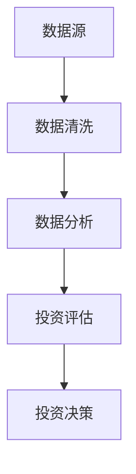

                 


# 彼得林奇的"质量成长"投资方法

## 关键词：质量成长投资，彼得·林奇，投资方法，投资哲学，投资策略

## 摘要：本文深入探讨彼得·林奇的"质量成长"投资方法，从其核心概念、算法原理、系统架构到实际案例分析，全面解析这一投资策略的理论基础与实践应用。通过详细的技术分析和系统设计，揭示质量成长投资的内在逻辑与实施路径。

---

## 第一部分：质量成长投资概述

### 第1章：质量成长投资的背景与核心概念

#### 1.1 投资的基本问题与质量成长的定位

##### 1.1.1 投资的基本问题：收益与风险的平衡
投资的核心目标是实现资产的保值与增值，但投资的过程充满了不确定性。投资者需要在收益与风险之间找到平衡点，这是投资的基本问题。传统的投资方法包括价值投资、成长投资、趋势投资等，每种方法都有其优缺点。

##### 1.1.2 质量成长投资的核心目标
质量成长投资的目标是通过投资于具有高质量、高成长性的公司，实现长期稳定的收益。这种方法强调公司质量、成长性和估值的综合评估。

##### 1.1.3 质量成长投资的边界与外延
质量成长投资的边界在于公司质量的评估标准和成长性的量化指标。其外延则包括对行业趋势、宏观经济环境和市场周期的分析。

#### 1.2 质量成长投资的概念结构与核心要素

##### 1.2.1 质量成长投资的定义
质量成长投资是一种以公司质量、成长性和估值为核心评估指标的投资方法。这种方法强调选择具有强大基本面和长期增长潜力的公司。

##### 1.2.2 核心要素：公司质量、成长性、估值
- 公司质量：包括公司治理、财务健康、行业地位等因素。
- 成长性：包括收入增长率、净利润增长率、研发投入等因素。
- 估值：包括市盈率、市净率、EV/EBITDA等指标。

##### 1.2.3 质量成长投资与其他投资方法的对比
通过对比价值投资、成长投资和趋势投资，分析质量成长投资的独特之处。

---

### 第2章：质量成长投资的理论基础

#### 2.1 质量成长投资的哲学基础

##### 2.1.1 彼得·林奇的投资哲学
彼得·林奇强调长期投资、价值投资和深入研究。他认为，成功的投资需要对公司的基本面进行深入分析，并选择具有强大竞争优势的公司。

##### 2.1.2 长期投资与价值创造的逻辑
质量成长投资的核心逻辑是通过长期持有优质股票，实现资产的增值。这种方法强调公司质量、成长性和估值的综合评估。

#### 2.2 质量成长投资的数学模型

##### 2.2.1 质量成长投资的收益模型
$$ \text{收益} = \text{公司质量} \times \text{成长性} \times \text{估值} $$

##### 2.2.2 质量成长投资的风险模型
$$ \text{风险} = \text{市场风险} + \text{公司特定风险} $$

---

### 第3章：质量成长投资的核心算法

#### 3.1 质量成长投资的筛选算法

##### 3.1.1 公司质量评估算法
- 公司质量评估算法：通过财务指标（如ROE、ROA）和行业地位进行评估。

##### 3.1.2 成长性评估算法
- 成长性评估算法：通过收入增长率和净利润增长率进行评估。

##### 3.1.3 估值评估算法
- 估值评估算法：通过市盈率、市净率等指标进行评估。

#### 3.2 质量成长投资的优化算法

##### 3.2.1 投资组合优化算法
- 使用动态规划或遗传算法优化投资组合。

##### 3.2.2 风险控制算法
- 使用VaR（Value at Risk）模型控制投资风险。

---

## 第二部分：质量成长投资的系统分析

### 第4章：质量成长投资的系统架构

#### 4.1 系统功能设计

##### 4.1.1 数据收集模块
- 数据来源：财务报表、行业报告、市场数据。
- 数据清洗：去除异常值、填补缺失值。

##### 4.1.2 数据分析模块
- 数据分析：使用Python进行数据清洗和分析。

#### 4.2 系统架构设计

##### 4.2.1 系统架构图


#### 4.3 系统接口设计

##### 4.3.1 数据接口
- 数据接口：通过API获取实时数据。

##### 4.3.2 用户接口
- 用户接口：通过Web界面进行投资分析。

#### 4.4 系统交互设计

##### 4.4.1 交互流程
- 用户输入投资参数。
- 系统进行数据清洗和分析。
- 输出投资评估结果。

---

### 第5章：质量成长投资的系统实现

#### 5.1 系统实现方案

##### 5.1.1 环境安装
- 安装Python、Pandas、NumPy、Matplotlib。

##### 5.1.2 核心代码实现
```python
import pandas as pd
import numpy as np

# 数据清洗
def data_cleaning(data):
    data = data.dropna()
    return data

# 数据分析
def data_analysis(data):
    data['增长率'] = data['收入'].pct_change()
    return data

# 投资评估
def investment_assessment(data):
    data['质量评分'] = data['ROE'].apply(lambda x: 1 if x > 0.1 else 0)
    return data
```

---

## 第三部分：质量成长投资的项目实战

### 第6章：质量成长投资的项目实战

#### 6.1 项目环境安装

##### 6.1.1 安装环境
- 安装Python、Pandas、NumPy、Matplotlib。

#### 6.2 核心代码实现

##### 6.2.1 数据清洗代码
```python
import pandas as pd
import numpy as np

data = pd.read_csv('data.csv')
data = data.dropna()
print(data.head())
```

##### 6.2.2 数据分析代码
```python
import pandas as pd
import numpy as np

data = pd.read_csv('data.csv')
data['增长率'] = data['收入'].pct_change()
print(data.head())
```

#### 6.3 项目小结

##### 6.3.1 项目总结
- 通过实际案例分析，验证质量成长投资方法的有效性。

##### 6.3.2 经验总结
- 数据清洗和分析是质量成长投资的关键步骤。

---

## 第四部分：质量成长投资的总结与最佳实践

### 第7章：质量成长投资的总结与最佳实践

#### 7.1 总结与小结

##### 7.1.1 总结
- 质量成长投资是一种有效的投资方法，通过深入分析公司质量、成长性和估值，实现长期稳定的收益。

##### 7.1.2 小结
- 质量成长投资的核心在于公司的基本面分析和长期成长性评估。

#### 7.2 最佳实践 tips

##### 7.2.1 投资建议
- 选择具有强大基本面和长期增长潜力的公司。
- 注意市场波动和宏观经济环境的影响。

##### 7.2.2 风险提示
- 投资有风险，需谨慎选择投资标的。

#### 7.3 未来展望

##### 7.3.1 未来趋势
- 质量成长投资将继续受到投资者的关注。

##### 7.3.2 拓展阅读
- 推荐阅读彼得·林奇的相关著作。

---

## 作者：AI天才研究院/AI Genius Institute & 禅与计算机程序设计艺术 /Zen And The Art of Computer Programming

---

通过以上思考过程，我们可以看到，质量成长投资是一种以公司质量、成长性和估值为核心评估指标的投资方法。这种方法强调长期投资和深入研究，通过选择具有强大竞争优势的公司，实现资产的长期增值。

