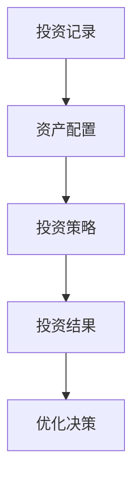
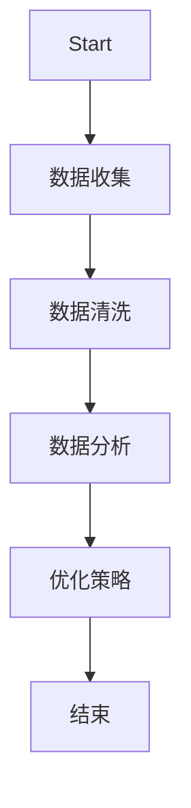
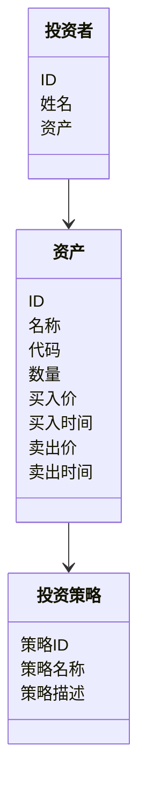
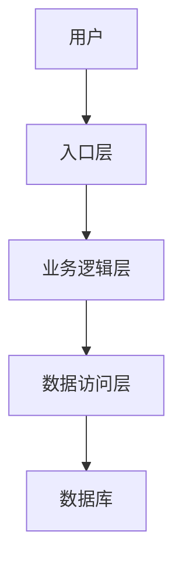

                 


# 彼得林奇的"跟踪记录"投资法

> 关键词：彼得林奇，投资法，跟踪记录，投资策略，数据驱动

> 摘要：本文深入探讨了彼得林奇的“跟踪记录”投资法，从其核心理念、算法原理到系统架构，再到实战案例，全面解析了如何通过持续记录和分析投资行为来优化决策。文章结合技术与投资的视角，为读者提供了从理论到实践的详细指南。

---

## 第1章: 背景介绍与核心概念

### 1.1 彼得林奇的投资理念

#### 1.1.1 投资的定义与重要性
投资是将资金投入某一领域以期获得收益的行为，其本质是通过资源配置实现财富增值。在现代金融体系中，投资不仅关乎资金的运用，更涉及对市场、资产和风险的深刻理解。

#### 1.1.2 “跟踪记录”投资法的定义
“跟踪记录”投资法是由彼得·林奇提出的一种基于持续记录和分析投资行为的方法。它强调通过系统性地记录每一次投资决策的细节，分析其结果，从而优化未来的投资策略。

#### 1.1.3 核心思想与原则
- **持续性**：记录每一次投资的买入、卖出时间和金额。
- **可追溯性**：确保记录的完整性和准确性，以便分析。
- **数据驱动决策**：通过数据分析优化投资策略。

### 1.2 核心概念与联系

#### 1.2.1 核心概念原理
“跟踪记录”法的核心在于通过记录投资行为，分析其背后的逻辑和结果。通过对历史数据的分析，投资者可以识别成功的模式，避免重复犯错。

#### 1.2.2 核心概念属性对比表
| 核心概念 | 跟踪记录法 | 传统定投法 | 随机型投资 |
|----------|------------|------------|------------|
| 核心理念 | 数据驱动的持续优化 | 定期定额投资 | 随机决策 |
| 优势 | 提高决策效率，降低风险 | 稳定性高，操作简单 | 灵活性高，风险可控 |
| 劣势 | 需要持续记录与分析 | 需要长期坚持 | 需要较强市场敏感度 |

#### 1.2.3 实体关系图


---

## 第2章: 算法原理与数学模型

### 2.1 算法原理

#### 2.1.1 数据收集与处理
- **数据来源**：包括历史投资记录、市场数据等。
- **数据清洗**：处理缺失值和异常值。
- **数据存储**：使用数据库或CSV文件存储。

#### 2.1.2 数据分析与决策
- **趋势分析**：通过时间序列分析识别投资模式。
- **收益计算**：计算每笔投资的收益和亏损。
- **策略优化**：基于数据分析结果调整投资策略。

#### 2.1.3 算法流程图


#### 2.1.4 数学模型
- **收益计算公式**：
  $$ 收益率 = \frac{卖出价 - 买入价}{买入价} \times 100\% $$
- **年化收益率**：
  $$ 年化收益率 = \left(1 + \frac{总收益}{初始投资}\right)^{\frac{1}{n}} - 1 $$

---

## 第3章: 系统分析与架构设计

### 3.1 系统功能设计

#### 3.1.1 领域模型


#### 3.1.2 系统架构设计


#### 3.1.3 系统接口设计
- **用户界面**：数据录入、查询、分析、可视化。
- **数据接口**：与第三方数据源对接（如API）。

---

## 第4章: 项目实战与代码实现

### 4.1 环境安装

```bash
pip install pandas numpy matplotlib
```

### 4.2 核心代码实现

```python
import pandas as pd
import matplotlib.pyplot as plt

# 数据记录
class InvestmentRecord:
    def __init__(self):
        self.records = []

    def record_purchase(self, asset, quantity, price):
        self.records.append({
            '类型': '买入',
            '资产': asset,
            '数量': quantity,
            '价格': price,
            '时间': pd.Timestamp.now()
        })

    def record_sale(self, asset, quantity, price):
        self.records.append({
            '类型': '卖出',
            '资产': asset,
            '数量': quantity,
            '价格': price,
            '时间': pd.Timestamp.now()
        })

    def analyze(self):
        df = pd.DataFrame(self.records)
        # 计算收益
        buys = df[df['类型'] == '买入']
        sells = df[df['类型'] == '卖出']
        profits = []
        for buy in buys.itertuples():
            sell = sells[sells['资产'] == buy.Asset].iloc[-1] if not sells[sells['资产'] == buy.Asset].empty else None
            if sell:
                profit = sell.价格 * sell.数量 - buy.价格 * buy.数量
                profits.append(profit)
        return profits

# 示例用法
ir = InvestmentRecord()
ir.record_purchase('股票A', 100, 50)
ir.record_sale('股票A', 100, 60)
print(ir.analyze())  # 输出收益
```

### 4.3 实战案例分析

#### 4.3.1 案例背景
假设投资者在2023年投资了股票A和债券B，分别记录了买入和卖出的时间及价格。

#### 4.3.2 数据分析
通过分析历史数据，发现股票A在特定时间段内表现优于债券B。

#### 4.3.3 投资决策
根据数据分析结果，调整投资组合，增加股票A的持仓比例。

---

## 第5章: 最佳实践与小结

### 5.1 最佳实践

#### 5.1.1 定期回顾投资记录
建议每月回顾一次投资记录，分析收益和亏损原因。

#### 5.1.2 结合其他分析方法
将跟踪记录法与其他投资分析方法（如技术分析、基本面分析）结合使用。

#### 5.1.3 注意数据安全
保护投资记录数据，防止信息泄露。

### 5.2 小结

彼得林奇的“跟踪记录”投资法通过持续记录和分析投资行为，帮助投资者优化决策。本文从理论到实践，详细阐述了该方法的应用，为投资者提供了一种系统化的投资工具。

---

## 作者信息

作者：AI天才研究院/AI Genius Institute & 禅与计算机程序设计艺术 /Zen And The Art of Computer Programming

---

通过以上详细目录，我们可以看到，彼得林奇的“跟踪记录”投资法不仅是一种投资策略，更是一种系统化的数据驱动方法。它结合了技术与投资的视角，为投资者提供了一种从理论到实践的完整解决方案。

