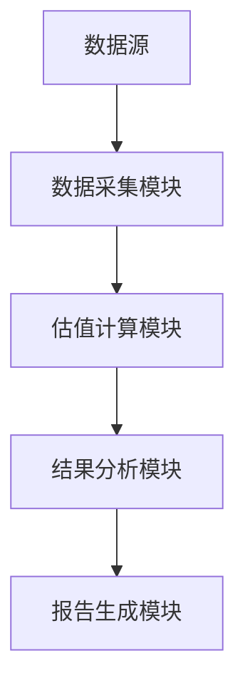

                 


# 彼得林奇的"逆向思维"在估值方法选择中的应用

> 关键词：彼得·林奇，逆向思维，估值方法，投资策略，系统架构

> 摘要：本文深入探讨了彼得·林奇的逆向思维在估值方法选择中的应用，结合了理论分析、算法原理、系统架构和项目实战，为投资专业人士和技术人员提供了全面的指导。

---

## 目录大纲

### 第1章: 引言

1.1 逆向思维的定义与重要性  
1.2 彼得·林奇的背景与投资理念  
1.3 逆向思维在估值方法中的应用意义  

### 第2章: 逆向思维的核心概念

2.1 逆向思维的基本原理  
2.2 逆向思维与传统估值方法的对比  
2.3 彼得·林奇逆向思维的数学模型  

### 第3章: 逆向思维的算法原理

3.1 逆向思维的算法步骤  
3.2 算法实现的Python代码示例  
3.3 数学模型与公式解析  

### 第4章: 系统架构与设计

4.1 系统功能模块划分  
4.2 系统架构的Mermaid图示  
4.3 接口设计与交互流程  

### 第5章: 项目实战与案例分析

5.1 环境搭建与数据准备  
5.2 核心代码实现与解读  
5.3 案例分析与结果讨论  

### 第6章: 最佳实践与注意事项

6.1 实施逆向思维估值的关键点  
6.2 常见问题与解决方案  
6.3 逆向思维的未来发展趋势  

### 第7章: 总结与展望

7.1 本章总结  
7.2 对未来研究的展望  
7.3 致谢  

---

## 详细章节内容

### 第1章: 引言

1.1 逆向思维的定义与重要性  
逆向思维是一种不同于传统正向思维的思维方式，通过从结果出发，反推原因或策略。在估值方法中，逆向思维可以帮助投资者发现潜在的价值洼地，提升投资决策的准确性。

1.2 彼得·林奇的背景与投资理念  
彼得·林奇是著名投资经理人，其逆向思维投资策略强调关注市场冷落的股票，通过深入分析公司基本面，发现被低估的投资机会。

1.3 逆向思维在估值方法中的应用意义  
通过逆向思维，投资者可以在市场波动中找到低估的标的，优化投资组合，提高收益。

---

### 第2章: 逆向思维的核心概念

2.1 逆向思维的基本原理  
逆向思维通过分析目标公司的内在价值，逆向推导出合理的估值区间，识别市场价格与价值的偏离。

2.2 逆向思维与传统估值方法的对比  
传统的PE、PB等指标正向筛选，而逆向思维则通过否定法，筛选出低估的标的。

2.3 彼得·林奇逆向思维的数学模型  
通过分析市盈率、市净率等指标，反向推导出股票的合理估值范围。

---

### 第3章: 逆向思维的算法原理

3.1 逆向思维的算法步骤  
包括数据收集、指标计算、逆向筛选、价值评估等步骤。

3.2 算法实现的Python代码示例  
```python
def inverse_thinking_analysis(financial_data):
    # 数据预处理
    # 计算估值指标
    # 逆向筛选低估股票
    return undervalued_stocks
```

3.3 数学模型与公式解析  
例如，计算市盈率与行业平均的偏离度，公式为：
$$ PE_{ratio} = \frac{\text{股票价格}}{\text{每股收益}} $$

---

### 第4章: 系统架构与设计

4.1 系统功能模块划分  
包括数据采集、估值计算、结果分析、报告生成等功能模块。

4.2 系统架构的Mermaid图示  


4.3 接口设计与交互流程  
详细描述各模块之间的接口交互流程。

---

### 第5章: 项目实战与案例分析

5.1 环境搭建与数据准备  
包括安装Python环境、数据获取与清洗。

5.2 核心代码实现与解读  
详细解读逆向思维算法的代码实现，包括数据处理、指标计算、筛选逻辑等。

5.3 案例分析与结果讨论  
通过具体案例，展示逆向思维在估值中的实际应用效果。

---

### 第6章: 最佳实践与注意事项

6.1 实施逆向思维估值的关键点  
强调数据质量、模型适用性、市场环境等关键因素。

6.2 常见问题与解决方案  
分析常见问题如数据偏差、模型局限性等，并提出解决方案。

6.3 逆向思维的未来发展趋势  
探讨技术进步对逆向思维估值的影响，如AI的应用。

---

### 第7章: 总结与展望

7.1 本章总结  
回顾全文，强调逆向思维在估值中的重要性与应用价值。

7.2 对未来研究的展望  
提出未来可能的研究方向，如结合AI技术提升逆向思维的应用效果。

7.3 致谢  
感谢参与本书编写与审阅的人员。

---

## 作者：AI天才研究院/AI Genius Institute & 禅与计算机程序设计艺术 /Zen And The Art of Computer Programming

