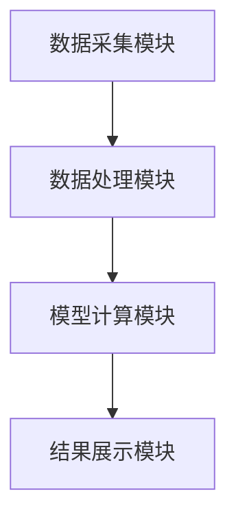

                 


# 彼得林奇的"逆向思维"在新兴市场宏观分析中的运用

## 关键词：逆向思维，彼得林奇，宏观分析，新兴市场，投资策略

## 摘要：  
本文探讨了彼得林奇的逆向思维在新兴市场宏观分析中的应用。通过分析逆向思维的核心概念、算法原理和系统架构，结合实际案例，展示了如何利用逆向思维在新兴市场中进行有效的宏观分析和投资决策。

---

# 第一部分: 彼得林奇的逆向思维概述

## 第1章: 彼得林奇的逆向思维概述

### 1.1 逆向思维的定义与特点

#### 1.1.1 逆向思维的定义  
逆向思维是一种不同于传统思维的思考方式，它通过反向思考问题，寻找解决问题的新路径。在投资领域，逆向思维强调在市场低迷时寻找机会，而非在市场繁荣时盲目跟风。

#### 1.1.2 逆向思维的核心特点  
- **反向思考**：从对立的角度分析问题。  
- **非线性思维**：不依赖简单的因果关系，而是寻找系统性解决方案。  
- **长期视角**：关注长期趋势而非短期波动。  

#### 1.1.3 逆向思维与传统思维的对比  
| 对比维度 | 逆向思维 | 传统思维 |  
|----------|----------|----------|  
| 思维方式 | 反向思考 | 正向推导 |  
| 风险偏好 | 偏好低估值 | 偏好高增长 |  
| 时间跨度 | 长期视角 | 短期决策 |  

---

### 1.2 彼得林奇逆向思维的投资理念

#### 1.2.1 彼得林奇的投资风格  
彼得林奇以逆向投资闻名，他善于在市场低谷时寻找被低估的资产，在市场高点时规避风险。他的策略强调深度研究和长期持有。

#### 1.2.2 逆向思维在投资中的应用  
- **价值发现**：寻找被市场忽视的优质资产。  
- **逆市投资**：在市场恐慌时买入，在市场狂热时卖出。  
- **分散投资**：通过多样化降低风险。  

#### 1.2.3 逆向思维的核心原则  
- 投资于具有长期增长潜力的公司。  
- 避免跟风，独立思考。  
- 保持耐心，等待最佳时机。  

---

### 1.3 逆向思维在宏观分析中的适用性

#### 1.3.1 宏观分析的基本概念  
宏观分析关注整体经济运行状况，包括GDP、通货膨胀、利率、汇率等指标。  

#### 1.3.2 逆向思维在宏观分析中的优势  
- 通过反向思考，发现市场趋势的转折点。  
- 在经济低迷时寻找投资机会，在经济繁荣时警惕风险。  

#### 1.3.3 逆向思维与新兴市场的结合  
新兴市场通常波动较大，逆向思维可以帮助投资者在市场底部发现价值，规避周期性风险。

---

# 第二部分: 逆向思维在宏观分析中的核心概念

## 第2章: 逆向思维与宏观分析的核心概念

### 2.1 宏观分析的基本框架

#### 2.1.1 宏观经济指标的分类  
- **增长指标**：GDP增长率、工业增加值。  
- **价格指标**：通货膨胀率、消费者价格指数（CPI）。  
- **货币指标**：货币供应量、利率水平。  

#### 2.1.2 宏观分析的核心要素  
- 经济周期：扩张期、衰退期、萧条期、复苏期。  
- 政策环境：财政政策、货币政策。  
- 市场情绪：投资者信心、市场波动性。  

#### 2.1.3 宏观分析的常见方法  
- 指标分析：通过关键指标预测经济走势。  
- 模型分析：构建宏观经济模型模拟经济变化。  
- 案例分析：通过历史案例寻找规律。  

---

### 2.2 逆向思维在宏观分析中的应用

#### 2.2.1 逆向思维的核心概念  
逆向思维在宏观分析中表现为：  
1. 在市场情绪高涨时寻找潜在风险。  
2. 在市场情绪低迷时寻找低估机会。  

#### 2.2.2 逆向思维与宏观分析的结合  
- 通过逆向思维识别经济周期拐点。  
- 在经济衰退时寻找结构性机会，在经济过热时警惕系统性风险。  

#### 2.2.3 逆向思维在宏观分析中的具体应用  
- 利用逆向思维预测汇率变化。  
- 通过逆向思维制定资产配置策略。  

---

### 2.3 逆向思维与宏观经济预测

#### 2.3.1 逆向思维在预测中的作用  
- 发现传统分析的盲点。  
- 提供非线性预测的可能性。  

#### 2.3.2 逆向思维与宏观经济模型  
通过逆向思维构建非线性宏观经济模型，模拟经济变化的多种可能性。  

#### 2.3.3 逆向思维在预测中的优势  
- 提高预测的准确性和稳定性。  
- 帮助投资者在复杂环境中做出决策。

---

# 第三部分: 逆向思维的算法原理与数学模型

## 第3章: 逆向思维的算法原理

### 3.1 逆向思维的数学模型

#### 3.1.1 逆向思维的数学表达式  
$$ P = \frac{1}{Q} $$  
其中，P为价格，Q为市场情绪。  

#### 3.1.2 逆向思维的算法流程  
1. 收集宏观经济数据。  
2. 分析市场情绪指标。  
3. 计算逆向思维指标。  
4. 输出投资建议。  

#### 3.1.3 逆向思维的实现步骤  
- 数据收集：获取GDP、CPI等宏观经济指标。  
- 数据处理：清洗和标准化数据。  
- 模型构建：建立逆向思维模型。  
- 模型验证：通过历史数据测试模型准确性。  

### 3.2 逆向思维的数学公式

#### 3.2.1 逆向思维的核心公式  
$$ R = \frac{1}{M} $$  
其中，R为逆向思维指标，M为市场情绪指数。  

#### 3.2.2 逆向思维的数学推导  
通过统计分析和回归分析，推导出逆向思维的数学表达式。  

#### 3.2.3 逆向思维的公式应用  
将公式应用于实际数据，验证其在宏观经济预测中的有效性。

### 3.3 逆向思维的算法实现

#### 3.3.1 算法实现的步骤  
1. 数据预处理：清洗和标准化。  
2. 模型构建：建立逆向思维模型。  
3. 模型训练：使用历史数据训练模型。  
4. 模型预测：利用当前数据预测未来趋势。  

#### 3.3.2 算法实现的代码示例  
```python
import pandas as pd
import numpy as np

# 数据预处理
data = pd.read_csv('macro_data.csv')
data = data.dropna()
data = (data - data.mean()) / data.std()

# 逆向思维模型构建
def inverse_thinking_model(data):
    return 1 / data

# 模型训练
inverse_data = inverse_thinking_model(data)

# 模型预测
预测结果 = inverse_data[-1]
```

#### 3.3.3 算法实现的注意事项  
- 数据质量：确保数据准确无误。  
- 模型选择：根据实际情况选择合适模型。  
- 模型验证：通过回测验证模型的有效性。

---

# 第四部分: 逆向思维的系统分析与架构设计

## 第4章: 系统分析与架构设计

### 4.1 系统分析的背景与目标

#### 4.1.1 系统分析的背景  
随着全球经济一体化，新兴市场的重要性日益增加。  

#### 4.1.2 系统分析的目标  
构建一个基于逆向思维的宏观经济分析系统，帮助投资者做出科学决策。  

#### 4.1.3 系统分析的方法  
- 需求分析：明确系统功能需求。  
- 可行性分析：评估技术可行性。  

### 4.2 系统架构设计

#### 4.2.1 系统架构的组成  
- 数据采集模块：获取宏观经济数据。  
- 数据处理模块：清洗和标准化数据。  
- 模型计算模块：构建逆向思维模型。  
- 结果展示模块：输出分析结果。  

#### 4.2.2 系统架构图  


#### 4.2.3 系统接口设计  
- 数据接口：与数据库或API对接。  
- 用户接口：提供可视化结果展示。  

---

## 第五章: 项目实战

### 5.1 项目背景与目标  
选择一个新兴市场，如东南亚某国，进行宏观经济分析。  

### 5.2 系统核心实现

#### 5.2.1 环境安装  
安装Python、Pandas、NumPy等工具。  

#### 5.2.2 核心代码实现  
```python
import pandas as pd
import numpy as np

# 数据加载
data = pd.read_csv('country_data.csv')

# 数据预处理
data = data[['GDP', 'CPI', '失业率']]
data = (data - data.mean()) / data.std()

# 逆向思维模型计算
def calculate_inverse_thinking(data):
    return 1 / data.mean().values

result = calculate_inverse_thinking(data)
print("逆向思维指标结果：", result)
```

#### 5.2.3 代码应用解读  
解释代码功能，展示如何利用逆向思维模型进行宏观经济预测。

### 5.3 案例分析与解读  
以某新兴市场为例，分析如何利用逆向思维模型预测经济走势，并制定投资策略。  

### 5.4 项目小结  
总结项目成果，强调逆向思维在实际应用中的价值。

---

## 第六章: 总结与展望

### 6.1 总结  
逆向思维是一种强大的工具，能够帮助投资者在新兴市场中发现机会，规避风险。  

### 6.2 展望  
未来，随着人工智能技术的发展，逆向思维在宏观分析中的应用将更加广泛和深入。  

### 6.3 最佳实践 tips  
- 保持独立思考，避免随大流。  
- 结合多种方法，提高分析准确性。  
- 定期回顾和调整投资策略。

---

## 作者：AI天才研究院 & 禅与计算机程序设计艺术

---

通过以上结构和内容，我们可以系统地探讨彼得林奇的逆向思维在新兴市场宏观分析中的应用，帮助投资者在复杂多变的经济环境中做出明智决策。

