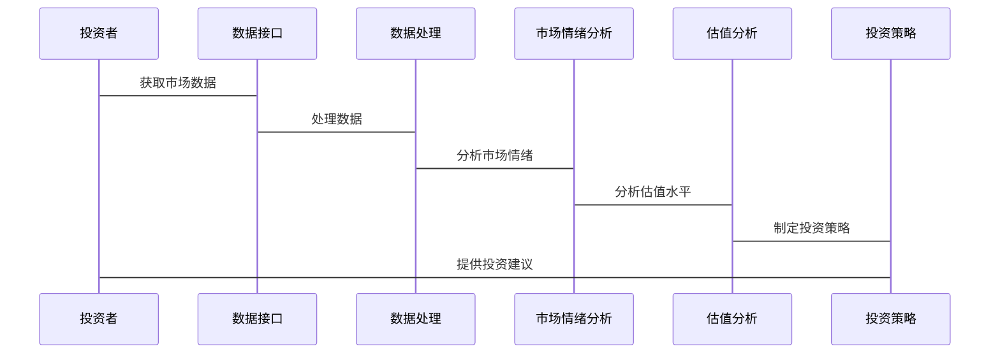

                 


# 彼得林奇的"逆向思维"在牛熊市的应用

> **关键词**：彼得林奇、逆向思维、牛熊市、投资策略、风险管理、决策模型  
> **摘要**：本文深入探讨了彼得林奇的“逆向思维”在股票投资中的应用，特别是其在牛熊市周期中的独特策略。通过分析逆向思维的核心原理、算法模型和实际案例，本文揭示了如何在市场波动中利用逆向思维制定有效的投资决策，帮助投资者在复杂市场环境中实现稳健收益。

---

# 第一部分：彼得林奇的“逆向思维”概述

## 第1章：彼得林奇与逆向思维的背景介绍

### 1.1 彼得林奇的生平与投资理念

#### 1.1.1 彼得林奇的早期经历
彼得·林奇（Peter Lynch）是美国著名的投资家和基金经理，被誉为“共同基金之王”。他出生于1942年，曾在波士顿学院学习英语，后转学到波士顿大学，主修历史和英语。毕业后，他在富达投资集团（Fidelity Investments）开始了自己的职业生涯，最初是作为一名普通的证券分析师。

#### 1.1.2 彼得林奇的投资哲学
彼得林奇的投资哲学以“逆向思维”为核心，主张在市场恐慌时买入，在市场狂热时卖出。他认为，市场的波动性和投资者情绪的极端化为逆向投资者提供了套利机会。他的投资策略强调长期持有优质股票，并在市场低迷时寻找被低估的公司。

#### 1.1.3 彼得林奇的代表作与核心观点
彼得林奇的代表作《彼得林奇的成功投资》（*Beating the Street*）中，他详细阐述了逆向思维在投资中的应用。他认为，投资者应关注市场周期，在牛市中保持谨慎，在熊市中积极寻找机会。

### 1.2 逆向思维的定义与特点

#### 1.2.1 逆向思维的定义
逆向思维是一种与传统思维相反的思维方式，强调在市场情绪极端化时采取相反的行动。例如，在市场极度悲观时买入，在市场极度乐观时卖出。

#### 1.2.2 逆向思维的核心要素
- **市场情绪分析**：逆向思维的关键在于识别市场情绪的极端化，如过度乐观或过度悲观。
- **估值分析**：逆向投资者注重对公司基本面的深入分析，寻找被市场低估的股票。
- **时间窗口**：逆向思维强调在特定时间窗口内采取行动，通常在市场底部或顶部附近。

#### 1.2.3 逆向思维与传统投资思维的区别
传统投资思维往往跟随市场趋势，而逆向思维则在趋势反转时采取行动。传统投资者可能在市场上涨时追涨，在市场下跌时恐慌卖出，而逆向投资者则在市场下跌时寻找买入机会，在市场上涨时寻找卖出时机。

---

## 第2章：逆向思维在牛熊市中的应用背景

### 2.1 牛市与熊市的定义与特点

#### 2.1.1 牛市的特征与形成机制
牛市是指市场整体呈现上涨趋势，投资者情绪乐观，资金大量流入股市。牛市的形成通常与经济复苏、企业盈利增长和低利率环境有关。

#### 2.1.2 熊市的特征与形成机制
熊市是指市场整体呈现下跌趋势，投资者情绪悲观，资金大量流出股市。熊市的形成通常与经济衰退、企业盈利下降和高利率环境有关。

#### 2.1.3 牛熊市周期的规律
牛熊市周期是市场波动的自然规律，通常经历以下几个阶段：
1. **牛市周期**：市场情绪乐观，股票价格上涨。
2. **牛市顶部**：市场情绪达到极端乐观，股价开始回调。
3. **熊市周期**：市场情绪悲观，股票价格持续下跌。
4. **熊市底部**：市场情绪达到极端悲观，股价触底反弹。

### 2.2 逆向思维在牛熊市中的作用

#### 2.2.1 逆向思维在牛市中的应用
在牛市中，市场情绪过于乐观，投资者可能忽视潜在风险。逆向思维提醒投资者在市场顶部附近保持谨慎，避免追高。

#### 2.2.2 逆向思维在熊市中的应用
在熊市中，市场情绪过于悲观，许多优质股票被市场低估。逆向思维建议投资者在市场底部附近积极买入，抓住反弹机会。

#### 2.2.3 逆向思维在牛熊市转换中的应用
逆向思维的核心在于识别市场周期的转折点。当市场从牛市转向熊市时，逆向投资者会提前布局防御性股票；当市场从熊市转向牛市时，逆向投资者会积极布局进攻性股票。

---

# 第二部分：逆向思维的核心概念与联系

## 第3章：逆向思维的核心概念与原理

### 3.1 逆向思维的核心概念

#### 3.1.1 逆向思维的核心要素
- **市场情绪**：逆向思维的核心在于识别市场情绪的极端化。
- **估值水平**：逆向思维强调对公司基本面和估值的深入分析。
- **时间窗口**：逆向思维注重在特定时间窗口内采取行动。

#### 3.1.2 逆向思维的逻辑结构
逆向思维的逻辑结构可以分为以下几个步骤：
1. **识别市场情绪**：通过分析市场指数、投资者行为和媒体情绪，判断当前市场情绪是否处于极端化状态。
2. **分析估值水平**：通过市盈率（P/E）、市净率（P/B）等指标，判断股票是否被市场低估或高估。
3. **制定投资策略**：根据市场情绪和估值水平，制定相应的投资策略，如在市场底部买入，在市场顶部卖出。

#### 3.1.3 逆向思维与投资决策的关系
逆向思维通过分析市场情绪和估值水平，帮助投资者在市场周期中制定更科学的投资决策，避免盲目跟随市场趋势。

### 3.2 逆向思维与投资策略的联系

#### 3.2.1 逆向思维在资产配置中的作用
逆向思维可以帮助投资者在资产配置中动态调整股票和债券的比例。例如，在市场底部增加股票配置，在市场顶部增加债券配置。

#### 3.2.2 逆向思维与风险管理的关系
逆向思维强调在市场极端化时采取相反行动，从而降低投资组合的波动性和风险。

#### 3.2.3 逆向思维与长期投资目标的结合
逆向思维不仅关注短期市场波动，还注重长期投资目标的实现。通过在市场底部买入优质股票，投资者可以在长期获得超额收益。

---

## 第4章：逆向思维与市场情绪的关系

### 4.1 市场情绪的定义与分类

#### 4.1.1 市场情绪的分类
市场情绪可以分为以下几种：
- **乐观情绪**：市场参与者普遍乐观，认为市场将继续上涨。
- **悲观情绪**：市场参与者普遍悲观，认为市场将继续下跌。
- **中性情绪**：市场参与者情绪较为平稳，市场呈现区间波动。

#### 4.1.2 市场情绪的波动规律
市场情绪通常呈现周期性波动，与市场周期密切相关。例如，在牛市中市场情绪逐渐从谨慎转向乐观，在熊市中市场情绪逐渐从乐观转向悲观。

#### 4.1.3 市场情绪与投资者行为的关系
市场情绪会影响投资者行为。当市场情绪过于乐观时，投资者可能过度买入；当市场情绪过于悲观时，投资者可能过度卖出。

### 4.2 逆向思维与市场情绪的互动

#### 4.2.1 市场情绪对逆向思维的影响
市场情绪的极端化为逆向思维提供了机会。例如，当市场情绪过于悲观时，逆向投资者会寻找买入机会。

#### 4.2.2 逆向思维对市场情绪的调节作用
逆向思维通过引导投资者理性分析市场，有助于调节市场情绪的极端化。

#### 4.2.3 逆向思维在市场情绪极端情况下的应用
在市场情绪极端乐观时，逆向投资者会寻找卖出机会；在市场情绪极端悲观时，逆向投资者会寻找买入机会。

---

# 第三部分：逆向思维的算法原理与数学模型

## 第5章：逆向思维的算法原理

### 5.1 逆向思维的决策模型

#### 5.1.1 基于逆向思维的决策流程
逆向思维的决策流程可以分为以下几个步骤：
1. **市场情绪分析**：通过分析市场指数、投资者行为和媒体情绪，判断当前市场情绪是否处于极端化状态。
2. **估值分析**：通过市盈率、市净率等指标，判断股票是否被市场低估或高估。
3. **制定投资策略**：根据市场情绪和估值水平，制定相应的投资策略，如在市场底部买入，在市场顶部卖出。

#### 5.1.2 逆向思维的逻辑框架
逆向思维的逻辑框架可以表示为：
$$
\text{投资决策} = f(\text{市场情绪}, \text{估值水平})
$$

#### 5.1.3 逆向思维的数学表达
逆向思维的数学表达可以表示为：
$$
\text{投资策略} = \begin{cases}
\text{买入} & \text{如果市场情绪处于底部} \\
\text{卖出} & \text{如果市场情绪处于顶部}
\end{cases}
$$

### 5.2 逆向思维的数学模型

#### 5.2.1 逆向思维的数学公式
逆向思维的数学公式可以表示为：
$$
\text{投资收益} = \text{买入价} - \text{卖出价}
$$
其中，买入价和卖出价分别对应市场底部和顶部的价格。

#### 5.2.2 逆向思维的变量关系
逆向思维的变量关系可以表示为：
$$
\text{市场情绪} \rightarrow \text{估值水平} \rightarrow \text{投资决策}
$$

#### 5.2.3 逆向思维的模型验证
逆向思维的模型验证可以通过历史数据分析来完成。例如，通过分析过去几次熊市和牛市中的市场情绪和估值水平，验证逆向思维在实际投资中的有效性。

---

## 第6章：逆向思维的数学模型与实际应用

### 6.1 逆向思维的数学模型

#### 6.1.1 逆向思维的数学表达式
逆向思维的数学表达式可以表示为：
$$
\text{投资收益} = \sum_{i=1}^{n} (\text{卖出价}_i - \text{买入价}_i)
$$
其中，$n$ 表示交易次数。

#### 6.1.2 逆向思维的变量分析
逆向思维的变量分析包括市场情绪、估值水平和投资策略。市场情绪和估值水平是输入变量，投资策略是输出变量。

#### 6.1.3 逆向思维的模型优化
逆向思维的模型优化可以通过引入更多的变量和参数来实现，例如引入宏观经济指标和行业基本面数据，提高模型的预测精度。

### 6.2 逆向思维的实际应用案例

#### 6.2.1 彼得林奇的经典案例
彼得林奇在20世纪80年代管理的麦哲伦基金（Fidelity Magellan）就是逆向思维的成功案例。他在市场底部买入被低估的股票，在市场顶部卖出高价股票，实现了长期的超额收益。

#### 6.2.2 逆向思维在实际投资中的应用
投资者可以通过分析市场情绪和估值水平，制定逆向思维的投资策略。例如，在市场底部买入优质股票，在市场顶部卖出高价股票。

---

# 第四部分：系统分析与项目实战

## 第7章：逆向思维的系统分析

### 7.1 问题场景介绍
逆向思维的系统分析需要解决以下问题：
1. 如何识别市场情绪的极端化？
2. 如何判断股票的估值水平？
3. 如何制定逆向思维的投资策略？

### 7.2 系统功能设计

#### 7.2.1 领域模型
领域模型可以表示为：
$$
\text{系统输入} \rightarrow \text{市场情绪分析} \rightarrow \text{估值分析} \rightarrow \text{投资策略}
$$

#### 7.2.2 系统架构设计
系统架构设计可以表示为：
$$
\text{市场数据} \rightarrow \text{数据处理} \rightarrow \text{市场情绪分析} \rightarrow \text{估值分析} \rightarrow \text{投资策略}
$$

### 7.3 系统架构图
```mermaid
graph TD
    A[市场数据] -> B[数据处理]
    B -> C[市场情绪分析]
    C -> D[估值分析]
    D -> E[投资策略]
```

### 7.4 系统接口设计
系统接口设计包括以下内容：
- 数据接口：获取市场数据（如指数、个股价格）。
- 分析接口：执行市场情绪分析和估值分析。
- 投资策略接口：制定逆向思维的投资策略。

### 7.5 系统交互图


---

## 第8章：项目实战

### 8.1 环境安装
为了实现逆向思维的系统分析，投资者需要安装以下工具：
1. 数据分析工具：如Python、R。
2. 数据可视化工具：如Matplotlib、Tableau。
3. 交易执行工具：如交易软件或API。

### 8.2 系统核心实现源代码

#### 8.2.1 市场情绪分析
```python
import pandas as pd
import numpy as np

def market_sentiment_analysis(prices, window=20):
    # 计算相对强弱指数（RSI）
    rsi = pd.Series(prices).rolling(window).apply(lambda x: (x[-1] - x.mean())/x.std(), raw=True)
    # 判断市场情绪
    if rsi > 70:
        return "过度乐观"
    elif rsi < 30:
        return "过度悲观"
    else:
        return "中性"
```

#### 8.2.2 估值分析
```python
def valuation_analysis(prices, pe_ratio, pb_ratio):
    # 判断估值水平
    if pe_ratio < 15 and pb_ratio < 1:
        return "低估"
    elif pe_ratio > 25 and pb_ratio > 3:
        return "高估"
    else:
        return "合理"
```

#### 8.2.3 投资策略制定
```python
def investment_strategy(market_sentiment, valuation):
    if market_sentiment == "过度悲观" and valuation == "低估":
        return "买入"
    elif market_sentiment == "过度乐观" and valuation == "高估":
        return "卖出"
    else:
        return "观望"
```

### 8.3 代码应用解读与分析
通过上述代码，投资者可以实现市场情绪分析、估值分析和投资策略制定。例如，在市场情绪为“过度悲观”且估值水平为“低估”时，投资者可以采取买入策略。

### 8.4 实际案例分析
以2020年新冠疫情引发的市场崩盘为例，逆向思维的系统分析可以指导投资者在市场底部买入优质股票，抓住反弹机会。

### 8.5 项目小结
通过逆向思维的系统分析，投资者可以更好地应对市场波动，制定科学的投资策略。

---

## 第9章：逆向思维的总结与展望

### 9.1 总结
逆向思维是一种有效的投资策略，通过分析市场情绪和估值水平，帮助投资者在牛熊市周期中制定科学的投资决策。

### 9.2 展望
未来，逆向思维可以通过引入更多的数据和算法，进一步提高其预测精度和实际应用效果。

---

# 作者：AI天才研究院  
邮箱：contact@aitianji.com  
微信公众号：AI天才研究院  
官方网站：https://www.aitianji.com

