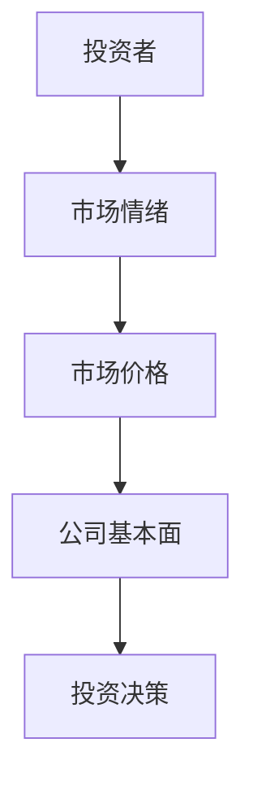
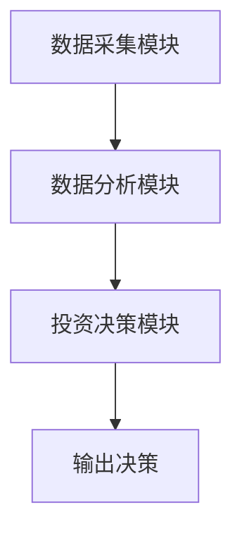

                 


# 彼得林奇的"逆向思维"投资技巧

> 关键词：彼得林奇，逆向思维，投资技巧，价值投资，市场周期，风险管理

> 摘要：本文深入分析了彼得林奇的逆向思维投资技巧，探讨了其在投资策略中的核心地位，结合实际案例和数学模型，详细解读了如何通过逆向思维在市场波动中捕捉投资机会。

---

# 第一部分: 逆向思维投资的背景与核心理念

## 第1章: 逆向思维投资的定义与背景

### 1.1 逆向思维投资的定义
逆向思维在投资领域中，是指在市场处于低迷或恐慌时，投资者选择买入优质资产，而在市场繁荣或乐观时，选择卖出或保持谨慎。这种策略与传统的顺势投资相反，强调在非理性中寻找理性。

#### 1.1.1 逆向思维的定义
逆向思维是一种通过反向思考问题本质的思维方式。在投资领域，逆向思维强调关注市场的非理性行为，寻找价格与价值的偏离点。

#### 1.1.2 投资中的逆向思维
投资中的逆向思维不仅仅是等待市场下跌时买入，而是更深层次地分析市场周期、公司基本面和行业趋势，寻找被市场忽视的投资机会。

#### 1.1.3 彼得林奇逆向思维的起源
彼得·林奇是逆向思维投资的代表人物之一，他的投资理念源于对市场周期的深刻理解以及对公司基本面的深入分析。他认为，市场的波动性为投资者提供了以更低价格买入优质资产的机会。

---

### 1.2 彼得林奇的投资理念

#### 1.2.1 彼得林奇的生平简介
彼得·林奇是美国著名基金经理，曾任富达麦哲伦基金的经理，创造了年均22%的回报率。他的成功源于对市场周期的深刻理解以及对公司基本面的深入分析。

#### 1.2.2 彼得林奇的投资风格
彼得林奇的投资风格以逆向思维为核心，注重价值发现和风险控制。他强调在市场恐慌时买入优质资产，在市场狂热时保持冷静。

#### 1.2.3 彼得林奇的成功案例
彼得林奇在20世纪80年代的投资成功案例包括可口可乐、IBM等，这些公司在市场低迷时被低估，而在市场繁荣时被高估，为投资者提供了巨大的利润空间。

---

### 1.3 逆向思维与市场周期

#### 1.3.1 市场周期的定义与特征
市场周期是指市场从繁荣到衰退再到复苏的循环过程。逆向思维投资强调在市场底部买入，在市场顶部卖出。

#### 1.3.2 逆向思维在市场周期中的应用
在市场底部时，投资者可以通过逆向思维寻找被低估的资产；在市场顶部时，投资者可以通过逆向思维寻找风险较高的投资标的。

#### 1.3.3 逆向思维与市场情绪的关系
逆向思维投资的成功关键在于对市场情绪的准确判断。当市场情绪过于乐观时，投资者应保持谨慎；当市场情绪过于悲观时，投资者应积极寻找机会。

---

### 1.4 逆向思维与其他投资策略的对比

#### 1.4.1 逆向思维与趋势跟踪
趋势跟踪策略强调顺势而为，而逆向思维策略则强调逆势而为。两者在市场周期的不同阶段有不同的表现。

#### 1.4.2 逆向思维与价值投资
价值投资强调寻找被市场低估的资产，逆向思维投资则强调在市场低估时买入，两者在本质上是一致的。

#### 1.4.3 逆向思维与技术分析
技术分析注重市场的价格走势，而逆向思维投资注重市场的价格与价值的偏离。两者结合可以提高投资决策的准确性。

---

## 第2章: 逆向思维投资的核心原理

### 2.1 逆向思维的原理

#### 2.1.1 市场情绪分析
市场情绪是逆向思维投资的重要依据。当市场情绪过于乐观时，投资者应保持谨慎；当市场情绪过于悲观时，投资者应积极寻找机会。

#### 2.1.2 价值与价格的偏离
逆向思维投资的核心在于寻找价格与价值的偏离。当价格低于价值时，投资者应买入；当价格高于价值时，投资者应卖出。

#### 2.1.3 逆向思维的数学模型
逆向思维投资的数学模型可以通过以下公式表示：
$$ \text{投资价值} = \frac{\text{公司未来现金流}}{\text{折现率}} $$
当市场价格低于投资价值时，投资者应买入；当市场价格高于投资价值时，投资者应卖出。

---

### 2.2 彼得林奇的逆向思维框架

#### 2.2.1 公司基本面分析
彼得林奇强调对公司基本面的深入分析，包括公司的财务状况、行业地位和竞争优势。

#### 2.2.2 行业分析与竞争地位
彼得林奇认为，行业分析和竞争地位是判断公司投资价值的重要因素。他倾向于投资那些行业地位稳固、竞争优势明显的公司。

#### 2.2.3 财务指标的逆向评估
彼得林奇通过财务指标的逆向评估来判断公司的投资价值。例如，他倾向于投资那些市盈率低于行业平均水平的公司。

---

### 2.3 逆向思维与风险管理

#### 2.3.1 风险的定义与分类
风险是指投资收益的不确定性。逆向思维投资中的风险主要包括市场风险、流动性风险和信用风险。

#### 2.3.2 逆向思维中的风险管理
逆向思维投资中的风险管理强调在市场低迷时控制风险，在市场繁荣时分散风险。

#### 2.3.3 彼得林奇的风险控制策略
彼得林奇通过分散投资和严格的风险控制来降低投资风险。他倾向于投资那些风险可控、回报稳定的投资标的。

---

### 2.4 核心概念对比表

| 概念 | 逆向思维 | 价值投资 | 技术分析 |
|------|----------|----------|----------|
| 核心 | 价格与价值的偏离 | 资产的内在价值 | 市场价格走势 |
| 优势 | 把握市场非理性波动 | 发现低估资产 | 判断市场趋势 |
| 劣势 | 市场波动性较大 | 需要深入分析 | 需要技术分析能力 |

---

### 2.5 逆向思维的ER实体关系图



---

## 第3章: 逆向思维投资的算法原理

### 3.1 逆向思维的算法流程

#### 3.1.1 数据采集
投资者需要采集市场的历史数据，包括市场价格、成交量、行业指数等。

#### 3.1.2 数据分析
通过数据分析，投资者可以判断市场的价格与价值的偏离程度。

#### 3.1.3 投资决策
根据分析结果，投资者可以做出买入或卖出的决策。

---

### 3.2 逆向思维的数学模型

#### 3.2.1 投资价值计算
$$ \text{投资价值} = \frac{\text{公司未来现金流}}{\text{折现率}} $$

#### 3.2.2 市场价格比较
当市场价格低于投资价值时，投资者应买入；当市场价格高于投资价值时，投资者应卖出。

---

### 3.3 逆向思维的Python代码实现

```python
import pandas as pd
import numpy as np

# 假设我们有一个包含公司基本面数据的DataFrame
df = pd.DataFrame({
    '公司名称': ['公司A', '公司B', '公司C'],
    '市盈率': [15, 20, 25],
    '市净率': [1.5, 2.0, 2.5],
    'ROE': [10, 15, 20]
})

# 计算投资价值
def calculate_investment_value(row):
    # 假设折现率为10%
    return row['ROE'] / 0.1

df['投资价值'] = df.apply(calculate_investment_value, axis=1)

# 判断是否买入
df['是否买入'] = df['市盈率'] < df['投资价值']

print(df)
```

---

## 第4章: 逆向思维投资的系统分析与架构设计

### 4.1 系统功能设计

#### 4.1.1 数据采集模块
数据采集模块负责采集市场的历史数据，包括市场价格、成交量、行业指数等。

#### 4.1.2 数据分析模块
数据分析模块通过对数据的分析，判断市场的价格与价值的偏离程度。

#### 4.1.3 投资决策模块
投资决策模块根据分析结果，做出买入或卖出的决策。

---

### 4.2 系统架构设计



---

## 第5章: 逆向思维投资的项目实战

### 5.1 环境安装

#### 5.1.1 安装必要的工具
投资者需要安装Python、Pandas、NumPy等工具。

### 5.2 核心代码实现

#### 5.2.1 数据分析代码
```python
import pandas as pd
import numpy as np

# 假设我们有一个包含公司基本面数据的DataFrame
df = pd.DataFrame({
    '公司名称': ['公司A', '公司B', '公司C'],
    '市盈率': [15, 20, 25],
    '市净率': [1.5, 2.0, 2.5],
    'ROE': [10, 15, 20]
})

# 计算投资价值
def calculate_investment_value(row):
    # 假设折现率为10%
    return row['ROE'] / 0.1

df['投资价值'] = df.apply(calculate_investment_value, axis=1)

# 判断是否买入
df['是否买入'] = df['市盈率'] < df['投资价值']

print(df)
```

---

### 5.3 项目小结

通过本项目的实战，投资者可以掌握逆向思维投资的核心技巧，包括数据采集、数据分析和投资决策等。

---

## 第6章: 逆向思维投资的最佳实践

### 6.1 小结

逆向思维投资是一种有效的投资策略，通过在市场低迷时买入，在市场繁荣时卖出，投资者可以实现长期稳定的收益。

### 6.2 注意事项

投资者在使用逆向思维投资时，需要注意市场波动性较大，投资风险较高。

### 6.3 拓展阅读

推荐阅读彼得·林奇的《彼得林奇的成功投资法则》等书籍，深入理解逆向思维投资的精髓。

---

# 结语

通过本文的分析，读者可以全面理解彼得林奇的逆向思维投资技巧，掌握其在投资策略中的核心地位，并通过实际案例和数学模型，深入解读如何通过逆向思维在市场波动中捕捉投资机会。

---

# 作者：AI天才研究院/AI Genius Institute & 禅与计算机程序设计艺术 /Zen And The Art of Computer Programming

---

