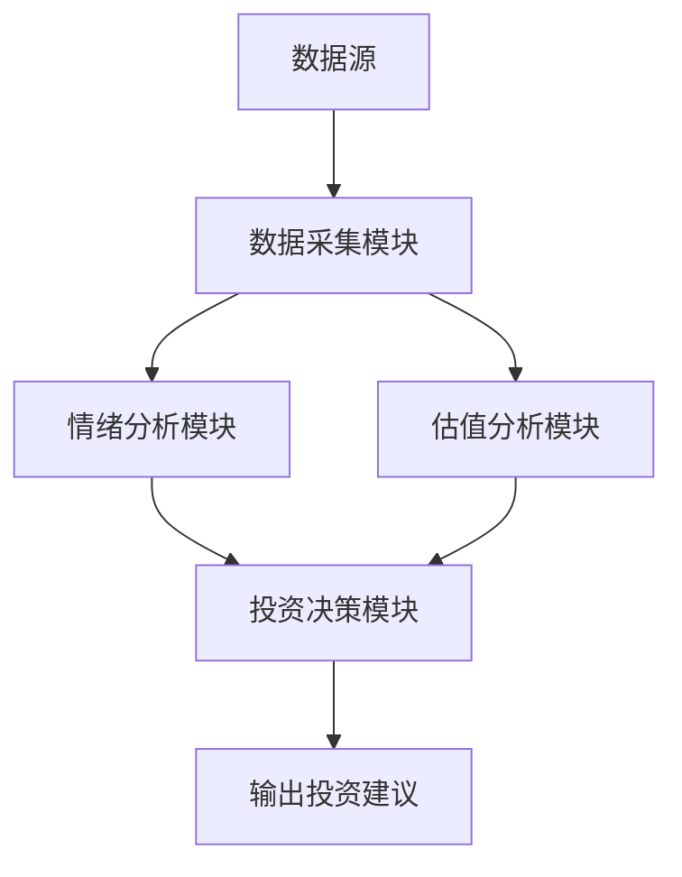

                 


# 彼得林奇的"逆向投资"在市场恐慌时期的操作策略

> 关键词：逆向投资，彼得林奇，市场恐慌，投资策略，风险管理

> 摘要：本文详细探讨了彼得林奇的逆向投资策略在市场恐慌时期的运用，从理论基础到具体操作，结合实例分析，帮助投资者在市场恐慌中把握投资机会，制定有效的投资策略。

---

## 引言

市场恐慌是投资领域中常见却又极具挑战性的现象。当市场陷入恐慌，投资者往往会被情绪所左右，做出非理性的决策。然而，正是在这样的市场环境下，逆向投资策略展现出其独特的优势。本文将深入探讨彼得林奇的逆向投资理念，分析其在市场恐慌时期的具体操作策略，并结合实际案例，为投资者提供实用的指导。

---

## 第一部分: 逆向投资的背景与基础

### 第1章: 逆向投资的核心概念

#### 1.1 逆向投资的定义与背景

逆向投资是一种与市场情绪相反的投资策略。当市场情绪高涨时，投资者倾向于高估资产价值；而当市场恐慌时，投资者往往低估资产价值。逆向投资者则在市场恐慌时买入，市场狂热时卖出。

#### 1.2 彼得林奇与逆向投资

彼得·林奇是逆向投资的代表人物之一。他强调长期投资、深入研究和价值发现。他认为，市场的短期波动为投资者提供了以合理价格买入优质资产的机会。

#### 1.3 市场恐慌时期的定义与特征

市场恐慌是指投资者对市场未来走势产生极度悲观情绪，导致大量抛售资产，进而引发市场价格大幅下跌。恐慌时期的特征包括市场流动性下降、投资者情绪低落、资产价格被低估等。

---

### 第2章: 逆向投资的核心思想与策略

#### 2.1 彼得林奇的选股策略

彼得林奇选股的核心是寻找基本面良好、估值合理的公司。他强调对公司进行深入研究，关注财务数据和行业趋势。

- **财务指标分析**：重点关注市盈率（P/E）、市净率（P/B）、股息率等指标。
- **行业选择**：选择具有长期增长潜力的行业，如消费、科技等。
- **安全边际**：确保买入价格低于公司内在价值。

#### 2.2 逆向投资的长期视角

逆向投资的核心在于长期视角。市场恐慌只是短期现象，优质资产的长期价值终将体现。

#### 2.3 安全边际与价值评估

安全边际是指买入价格与公司内在价值之间的差距。逆向投资者通过寻找安全边际高的资产，降低投资风险。

---

## 第二部分: 市场恐慌时期的投资者行为分析

### 第3章: 市场恐慌时期的投资者行为

#### 3.1 投资者的非理性行为

市场恐慌时期，投资者往往表现出非理性行为，如恐慌性抛售、从众心理等。

- **从众行为**：投资者盲目跟随市场趋势，导致价格过度波动。
- **过度反应**：投资者对负面信息反应过度，忽视潜在机会。

#### 3.2 市场恐慌对投资者决策的影响

市场恐慌影响投资者的决策，使其倾向于短期行为，忽视长期价值。

#### 3.3 如何克服市场恐慌中的恐惧

- **建立正确的投资心态**：理性看待市场波动，避免情绪化决策。
- **提高投资知识与技能**：通过学习增强判断力。
- **制定并坚持投资计划**：避免因情绪波动而改变投资策略。

---

## 第三部分: 逆向投资的具体操作策略

### 第4章: 逆向投资的具体操作步骤

#### 4.1 确定市场恐慌的信号

- **市场情绪指标**：通过市场指数波动、成交量变化等指标判断市场恐慌程度。
- **行业估值分析**：比较行业平均估值与历史平均水平，寻找低估行业。

#### 4.2 选择优质资产

- **基本面分析**：重点选择财务健康、管理优秀的企业。
- **估值分析**：确保买入价格低于内在价值。

#### 4.3 制定投资计划

- **资产配置**：根据市场情况调整资产配置，分散投资风险。
- **分批买入**：避免一次性投入，逐步建仓，降低风险。

### 第5章: 逆向投资的算法与系统设计

#### 5.1 逆向投资算法

**算法步骤**：
1. 数据采集：收集市场数据，包括价格、成交量、财务指标等。
2. 情绪指标计算：通过算法计算市场情绪指数。
3. 估值分析：计算资产的内在价值。
4. 投资决策：根据情绪指数和估值分析，决定是否买入或卖出。

**Python代码示例**：
```python
import pandas as pd
import numpy as np

def calculate_market_sentiment(data):
    # 计算市场情绪指标（示例：使用波动率）
    volatility = data['price'].std()
    return 'bearish' if volatility > data['price'].mean() else 'bullish'

def main():
    # 数据加载
    data = pd.read_csv('market_data.csv')
    sentiment = calculate_market_sentiment(data)
    print(f"Market sentiment: {sentiment}")

if __name__ == "__main__":
    main()
```

#### 5.2 系统架构设计

**系统功能模块**：
- 数据采集模块：收集市场数据。
- 情绪分析模块：计算市场情绪指标。
- 估值分析模块：评估资产价值。
- 投资决策模块：制定投资策略。

**系统架构图**：


---

### 第6章: 项目实战

#### 6.1 环境安装

- **工具安装**：安装Python、Pandas、NumPy等工具。
- **数据源获取**：从可靠数据源获取市场数据。

#### 6.2 核心代码实现

```python
import pandas as pd
import numpy as np

def calculate_market_sentiment(data):
    # 计算市场情绪指标（示例：使用波动率）
    volatility = data['price'].std()
    return 'bearish' if volatility > data['price'].mean() else 'bullish'

def calculate_value_ratio(data):
    # 计算估值比率（示例：使用市盈率）
    pe_ratio = data['price'] / data['earnings']
    return pe_ratio.mean()

def main():
    data = pd.read_csv('market_data.csv')
    sentiment = calculate_market_sentiment(data)
    print(f"Market sentiment: {sentiment}")
    print(f"Average PE Ratio: {calculate_value_ratio(data)}")

if __name__ == "__main__":
    main()
```

#### 6.3 案例分析

**案例**：2020年新冠疫情引发的市场恐慌。

- **数据分析**：许多优质企业股价被低估。
- **投资策略**：买入被低估的股票，长期持有。

---

## 第四部分: 总结与最佳实践

### 第7章: 总结与最佳实践

#### 7.1 投资心态的重要性

保持冷静，避免情绪化决策。

#### 7.2 风险管理

合理配置资产，分散投资风险。

#### 7.3 长期视角

耐心持有优质资产，等待价值回归。

#### 7.4 进一步阅读

推荐阅读彼得林奇的《击败市场的智慧》等书籍。

---

## 作者

作者：AI天才研究院/AI Genius Institute & 禅与计算机程序设计艺术 /Zen And The Art of Computer Programming

---

通过本文的详细分析，读者可以深入了解彼得林奇的逆向投资策略，并在市场恐慌时期制定有效的投资计划。希望本文能为投资者提供有价值的指导，帮助他们在复杂多变的市场中把握投资机会。

