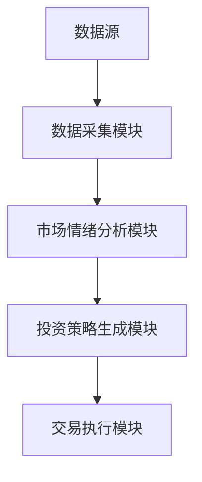
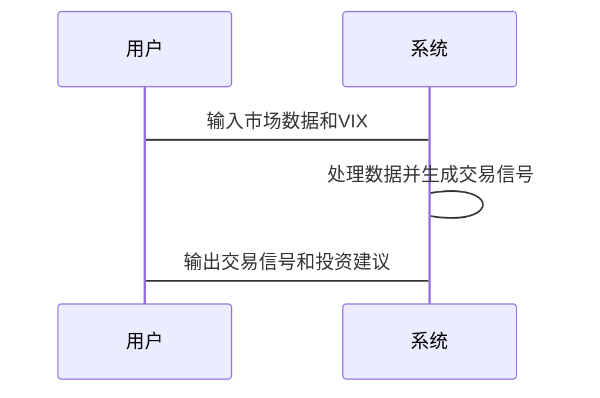

                 


# 彼得林奇的"逆向投资"在市场极端情绪中的操作原则

---

## 关键词

- 逆向投资
- 市场情绪
- 投资策略
- 彼得·林奇
- 交易系统
- 数学模型

---

## 摘要

本文深入探讨了彼得·林奇的逆向投资策略在市场极端情绪中的应用原则。通过分析市场情绪与投资决策的关系，结合数学模型和系统架构设计，提出了在市场恐慌和贪婪时的应对策略。文章还通过实际案例分析，展示了如何在极端市场条件下利用逆向投资获取超额收益，并提出了风险管理的最佳实践建议。

---

## 第一部分: 逆向投资与市场极端情绪概述

### 第1章: 逆向投资的定义与背景

#### 1.1 逆向投资的定义

- **逆向投资的基本概念**：逆向投资是指在市场情绪低落、投资者普遍悲观时买入资产，在市场情绪高涨、投资者乐观时卖出资产的投资策略。其核心思想是“别人恐惧时我贪婪，别人贪婪时我恐惧”。

- **逆向投资的核心理念**：逆向投资强调反向思考，关注市场的非理性行为，寻找被市场低估的投资机会。这种策略通常在市场出现极端情绪时表现尤为突出。

- **逆向投资与传统投资的区别**：传统投资策略通常跟随市场趋势，而逆向投资则逆势而为。传统策略注重短期波动，而逆向投资更关注长期价值。

#### 1.2 彼得·林奇与逆向投资

- **彼得·林奇的生平简介**：彼得·林奇是美国著名基金经理，曾任富达麦哲伦基金的经理，创造了年化13.7%的复合增长率，被誉为“最伟大的股票基金经理”。

- **彼得·林奇的投资风格**：林奇以深入研究公司基本面、寻找被低估的股票而闻名。他的投资策略强调长期持有优质资产，避免短期市场波动的干扰。

- **彼得·林奇逆向投资的成功案例**：在1987年美国股灾和2008年金融危机期间，林奇通过逆向投资策略，成功在市场底部买入优质资产，为投资者创造了巨大收益。

#### 1.3 市场极端情绪的定义

- **市场情绪的基本概念**：市场情绪是指投资者在特定市场环境下的心理状态，通常由贪婪和恐惧驱动。

- **市场极端情绪的表现形式**：市场恐慌（如2008年金融危机）和市场狂热（如2015年熔断机制）是市场极端情绪的典型表现。

- **市场极端情绪与投资机会的关系**：市场极端情绪往往导致资产价格偏离其内在价值，为逆向投资者提供了套利机会。

---

### 第2章: 逆向投资的核心原则

#### 2.1 市场情绪与投资决策的关系

- **市场情绪对投资决策的影响**：市场情绪通过影响资产价格波动间接影响投资决策。在市场恐慌时，投资者可能因过度恐惧而卖出资产；在市场狂热时，投资者可能因过度乐观而买入资产。

- **极端市场情绪下的投资者行为分析**：投资者在极端情绪下通常表现出非理性行为，如恐慌性抛售和盲目跟风。

- **逆向投资如何应对市场情绪波动**：逆向投资者通过分析市场情绪，识别市场偏差，制定反向投资策略。

#### 2.2 逆向投资的核心策略

- **买入恐慌：在市场恐慌时寻找投资机会**：当市场因恐慌情绪出现抛售潮时，优质资产往往被低估，此时是买入的好时机。

- **卖出贪婪：在市场狂热时及时离场**：当市场因过度乐观出现资产泡沫时，及时卖出以避免泡沫破裂带来的损失。

- **逆向投资的时机选择**：逆向投资的时机选择取决于市场情绪的量化指标，如恐慌指数（VIX）和市场估值指标。

#### 2.3 彼得·林奇的逆向投资原则

- **避免跟随市场情绪**：林奇强调，投资者应避免被市场情绪左右，而是应关注资产的内在价值。

- **寻找被市场低估的资产**：通过基本面分析，寻找那些因市场恐慌而被低估的优质资产。

- **长期持有优质资产的策略**：林奇主张长期持有优质资产，避免频繁交易，以降低交易成本和市场波动的干扰。

---

### 第3章: 市场极端情绪的量化分析

#### 3.1 市场情绪的量化指标

- **常见的市场情绪指标**：恐慌指数（VIX）、市场波动率、换手率等。

- **恐慌指数（VIX）的定义与应用**：VIX指数是衡量市场恐慌程度的指标，被称为“恐慌指数”。当VIX指数升高时，市场恐慌情绪加剧；当VIX指数降低时，市场情绪趋于稳定。

- **其他市场情绪量化工具**：除了VIX指数，还可以通过分析社交媒体情绪、新闻媒体情绪等工具来量化市场情绪。

#### 3.2 逆向投资的数学模型

- **市场情绪与资产价格的关系模型**：通过回归分析等方法，建立市场情绪与资产价格之间的关系模型。

- **基于情绪指标的交易策略模型**：基于市场情绪指标，设计买入和卖出信号的交易策略。

- **情绪驱动的资产配置模型**：根据市场情绪的变化，动态调整资产配置比例。

#### 3.3 案例分析：2008年金融危机中的逆向投资

- **金融危机前的市场情绪分析**：在2008年金融危机前，市场情绪过度乐观，资产价格被高估。

- **林奇的逆向投资策略在危机中的应用**：在市场恐慌期间，林奇通过深入分析基本面，选择那些被市场低估的优质资产进行投资。

- **危机后的市场恢复与投资机会**：危机后，市场逐步恢复，那些在危机期间被低估的资产价格上涨，为逆向投资者带来了丰厚的回报。

---

### 第4章: 逆向投资的系统架构设计

#### 4.1 投资决策支持系统的构建

- **系统功能模块划分**：数据采集与处理模块、市场情绪分析模块、投资策略生成模块等。

- **数据采集与处理模块**：从金融市场数据源获取实时数据，包括价格、成交量等。

- **市场情绪分析模块**：通过量化指标和机器学习算法，分析市场情绪。

- **投资策略生成模块**：根据市场情绪分析结果，生成买入和卖出信号。

#### 4.2 系统架构的Mermaid图



---

## 第二部分: 逆向投资的系统实现与实战应用

### 第5章: 逆向投资的系统实现

#### 5.1 系统实现环境

- **编程语言**：Python
- **库与工具**：Pandas、NumPy、Matplotlib、Scikit-learn等。

#### 5.2 系统核心实现源代码

```python
import numpy as np
import pandas as pd
import matplotlib.pyplot as plt
from sklearn.linear_model import LinearRegression

# 数据获取与处理
data = pd.read_csv('market_data.csv')
data['return'] = data['close'].pct_change()

# 市场情绪指标计算
vix = data['vix'].values
model = LinearRegression()
model.fit(vix.reshape(-1, 1), data['return'].values)
predicted_return = model.predict(vix.reshape(-1, 1))
```

#### 5.3 代码应用解读与分析

- **数据获取与处理**：从CSV文件中读取市场数据，并计算资产收益。

- **市场情绪指标计算**：使用恐慌指数（VIX）作为市场情绪指标，并通过线性回归模型预测资产收益。

#### 5.4 系统交互设计

- **用户输入**：输入市场数据和恐慌指数。
- **系统处理**：计算市场情绪并生成交易信号。
- **用户输出**：显示交易信号和投资建议。

#### 5.5 系统交互的Mermaid序列图



---

### 第6章: 项目实战

#### 6.1 案例分析：2008年金融危机

- **案例背景**：2008年金融危机期间，市场情绪极度恐慌，资产价格大幅下跌。

- **策略应用**：通过逆向投资策略，选择那些基本面良好但被市场低估的资产进行投资。

- **结果分析**：在危机期间买入优质资产，在市场恢复后卖出，获得了显著的超额收益。

#### 6.2 实际案例分析与详细讲解

- **案例选择**：选择一个具体的市场案例，分析逆向投资策略的应用。

- **详细讲解**：通过数据分析和模型计算，展示逆向投资策略在实际中的效果。

---

## 第三部分: 逆向投资的风险管理与最佳实践

### 第7章: 风险管理策略

#### 7.1 风险管理的重要性

- **风险管理的核心理念**：通过控制风险，确保投资组合的稳定性和可持续性。

- **逆向投资中的风险管理**：在极端市场条件下，逆向投资面临较高的风险，因此需要制定有效的风险管理策略。

#### 7.2 风险控制的具体措施

- **止损策略**：设定止损点，避免亏损过大。

- **仓位管理**：根据市场情绪和资产质量，动态调整投资仓位。

- **分散投资**：通过分散投资，降低特定资产或市场的风险。

#### 7.3 风险管理的数学模型

- **止损模型**：基于波动率和市场情绪的止损策略。

- **风险调整后的收益模型**：通过夏普比率等指标，评估投资组合的风险调整后收益。

---

### 第8章: 总结与展望

#### 8.1 总结

- **文章内容回顾**：总结全文的主要内容和核心观点。

- **逆向投资的核心思想**：强调逆向投资在市场极端情绪中的应用价值。

- **系统架构与实现**：总结系统设计和实现的主要成果。

#### 8.2 未来展望

- **逆向投资的未来发展**：探讨逆向投资在人工智能和大数据时代的应用前景。

- **系统优化方向**：提出系统优化的可能方向，如引入更多市场情绪指标和优化交易策略。

---

## 作者

作者：AI天才研究院/AI Genius Institute & 禅与计算机程序设计艺术/Zen And The Art of Computer Programming

---

**本文通过详细分析彼得·林奇的逆向投资策略，结合市场情绪的量化分析和系统设计，为投资者在市场极端情绪中提供了有效的操作原则。通过实际案例分析和系统实现，本文为投资者提供了实用的工具和方法，帮助他们在复杂多变的市场环境中实现稳健投资。**

