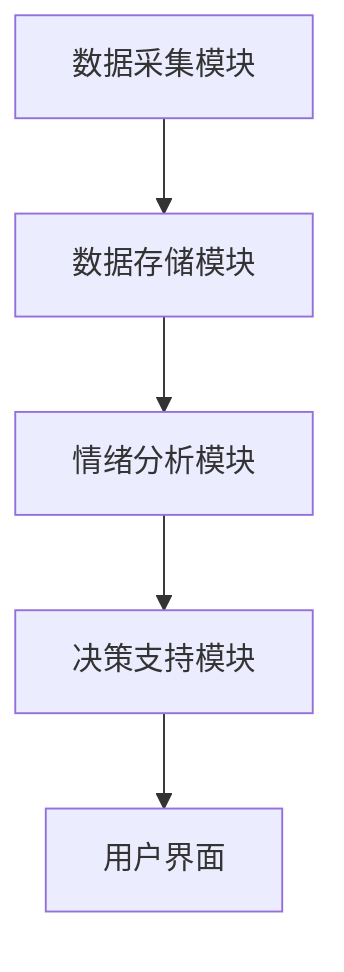

                 


# 彼得林奇的"逆向投资"心理准备

> 关键词：逆向投资，彼得林奇，心理准备，投资心理，市场情绪分析

> 摘要：本文从彼得林奇的逆向投资理念出发，深入分析逆向投资的心理准备，包括投资者的心理机制、认知偏差、情绪管理等方面。通过结合实际案例和数学模型，详细讲解如何在市场波动中保持理性，制定有效的投资策略。同时，本文还探讨了逆向投资的技术实现，包括市场情绪分析算法和决策支持系统的构建，为投资者提供理论和实践的双重指导。

---

## 第一部分: 逆向投资的背景与核心理念

### 第1章: 逆向投资的定义与背景

#### 1.1 逆向投资的定义与核心概念

- 1.1.1 逆向投资的定义  
逆向投资是一种投资策略，强调在市场低迷时买入，市场高涨时卖出，与市场情绪相反。其核心在于识别市场非理性行为，并在市场底部布局。

- 1.1.2 逆向投资与传统投资的区别  
传统投资往往跟随市场趋势，而逆向投资则反其道而行之，强调逆市场情绪操作。传统投资注重短期波动，而逆向投资更关注长期价值。

- 1.1.3 逆向投资的哲学基础  
逆向投资的哲学基础来源于市场非理性行为和价值回归理论。它认为市场情绪波动会导致价格偏离价值，逆向投资者通过识别这种偏差获利。

#### 1.2 彼得林奇与逆向投资

- 1.2.1 彼得林奇的个人经历  
彼得林奇是美国著名基金经理，以其成功的投资业绩闻名。他强调基本面分析和长期投资，逆向投资理念在其职业生涯中得到了广泛应用。

- 1.2.2 彼得林奇对逆向投资的贡献  
彼得林奇通过实践证明了逆向投资的有效性，特别是在市场恐慌时买入优质资产，在市场狂热时卖出部分头寸。

- 1.2.3 彼得林奇投资理念的核心要素  
彼得林奇强调基本面分析、分散投资和长期持有。他通过逆向投资在市场低迷时买入低估资产，市场高涨时逐步卖出高位资产。

#### 1.3 逆向投资的历史演变

- 1.3.1 逆向投资的历史背景  
逆向投资理念起源于早期的价值投资理论，但在20世纪80年代后，随着市场波动加剧，逆向投资逐渐成为一种独立的投资策略。

- 1.3.2 逆向投资在不同时期的表现  
在市场繁荣时期，逆向投资表现不佳，但在市场崩盘时，逆向投资往往能够捕捉到市场底部的机会。

- 1.3.3 逆向投资的现代发展  
现代逆向投资结合了量化分析和行为金融学，通过算法识别市场情绪，优化投资决策。

---

## 第二部分: 逆向投资的心理准备

### 第2章: 投资者心理分析

#### 2.1 投资者心理特征

- 2.1.1 投资者心理特征  
投资者通常受到贪婪和恐惧的驱动，情绪波动会影响决策。

- 2.1.2 情绪波动对投资决策的影响  
市场上涨时，投资者容易过度乐观；市场下跌时，投资者容易过度悲观。

- 2.1.3 逆向思维的培养  
逆向思维要求投资者在市场狂热时保持冷静，在市场恐慌时保持理性。

#### 2.2 逆向投资的心理机制

- 2.2.1 恐惧与贪婪的平衡  
逆向投资者需要在恐惧和贪婪之间找到平衡，避免被市场情绪左右。

- 2.2.2 认知偏差的克服  
投资者常见的认知偏差包括确认偏差、过度自信和从众心理，这些偏差会影响投资决策。

- 2.2.3 心理定 anchors的建立  
逆向投资者需要建立心理锚点，帮助自己在市场波动中保持冷静。

#### 2.3 彼得林奇的逆向投资心理准备

- 2.3.1 彼得林奇的自我认知方法  
彼得林奇通过基本面分析和长期观察，识别市场的非理性行为。

- 2.3.2 彼得林奇的心理调节技巧  
彼得林奇强调情绪管理，避免被市场短期波动影响。

- 2.3.3 彼得林奇的决策框架  
彼得林奇通过分散投资和长期持有，降低市场波动对心理的影响。

---

## 第三部分: 逆向投资的核心概念与联系

### 第3章: 逆向投资的核心概念与联系

#### 3.1 逆向投资的核心概念

- 3.1.1 市场情绪分析  
市场情绪分析是逆向投资的重要工具，通过识别市场情绪波动，找到投资机会。

- 3.1.2 市场周期性  
逆向投资者需要识别市场周期，判断当前市场所处的阶段。

- 3.1.3 价值回归理论  
逆向投资基于价值回归理论，认为市场波动会导致价格偏离价值。

#### 3.2 逆向投资的心理机制

- 3.2.1 投资者心态对比表  
| 心态 | 市场表现 | 投资决策 |
|------|----------|----------|
| 恐惧 | 下跌     | 抛售     |
| 贪婪 | 上涨     | 追涨     |

- 3.2.2 心理因素关系图  


---

## 第四部分: 逆向投资的算法原理

### 第4章: 逆向投资的算法原理

#### 4.1 市场情绪分析算法

- 4.1.1 算法流程  
1. 数据采集：收集市场数据，包括价格、成交量等。  
2. 情绪指标计算：计算市场情绪指数，例如恐慌指数。  
3. 情绪分类：根据情绪指数，将市场分为恐慌、正常、贪婪等状态。

- 4.1.2 情绪指数计算公式  
$$ 情绪指数 = \frac{收盘价 - 开盘价}{开盘价} \times 100 $$

- 4.1.3 情绪分类算法  
```python
def classify_mood(close, open_price):
    mood_index = ((close - open_price) / open_price) * 100
    if mood_index < -5:
        return "恐慌"
    elif -5 <= mood_index < 5:
        return "正常"
    else:
        return "贪婪"
```

---

## 第五部分: 逆向投资的系统设计

### 第5章: 系统设计与实现

#### 5.1 系统功能设计

- 5.1.1 系统功能模块  
1. 数据采集模块：采集市场数据。  
2. 情绪分析模块：计算市场情绪指数。  
3. 决策支持模块：提供逆向投资建议。

- 5.1.2 系统架构图  


---

## 第六部分: 项目实战

### 第6章: 项目实战与案例分析

#### 6.1 项目环境安装

- 6.1.1 安装Python库  
```bash
pip install pandas numpy matplotlib
```

#### 6.2 核心代码实现

- 6.2.1 情绪分析代码  
```python
import pandas as pd
import numpy as np

def calculate_mood_index(data):
    mood_index = data['close'] / data['open'] - 1
    return mood_index

data = pd.DataFrame({
    'open': [100, 105, 98],
    'close': [105, 110, 95]
})
mood_index = calculate_mood_index(data)
print(mood_index)
```

#### 6.3 案例分析

- 6.3.1 案例分析：2020年市场崩盘  
在2020年新冠疫情引发的市场崩盘中，逆向投资者在市场恐慌时买入，市场恢复后获得收益。

---

## 第七部分: 总结与最佳实践

### 第7章: 总结与最佳实践

#### 7.1 心理准备的技巧

- 1. 建立心理锚点  
   投资者需要设定心理锚点，帮助自己在市场波动中保持冷静。

- 2. 识别认知偏差  
   投资者需要识别并克服认知偏差，避免影响投资决策。

#### 7.2 投资决策的注意事项

- 1. 分散投资  
   通过分散投资降低风险，避免过度集中。

- 2. 长期持有  
   逆向投资需要耐心，长期持有优质资产。

#### 7.3 拓展阅读

- 1. 彼得林奇的《彼得林奇的成功投资》  
- 2. 行为金融学相关书籍

---

## 作者：AI天才研究院/AI Genius Institute & 禅与计算机程序设计艺术 /Zen And The Art of Computer Programming

---

这篇博客通过结合彼得林奇的逆向投资理念和心理准备，帮助投资者在市场波动中保持理性，制定有效的投资策略。通过技术手段和系统设计，提供理论和实践的双重指导，帮助读者在投资中获得成功。

