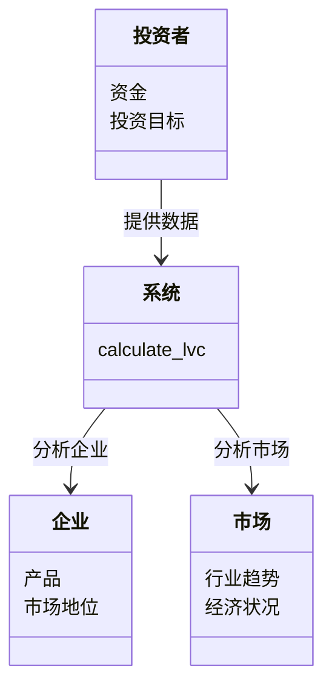
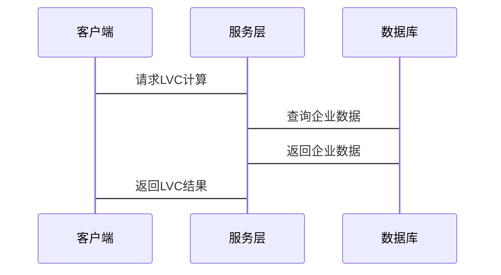

                 


# 彼得林奇的"长期价值创造"在不同行业的衡量标准

---

## 关键词：
- 彼得林奇
- 长期价值创造
- 投资理念
- 衡量标准
- 不同行业应用

---

## 摘要：
本文详细探讨了彼得·林奇的“长期价值创造”理念在不同行业中的具体应用和衡量标准。通过分析其核心概念、数学模型和实际案例，本文为读者提供了从理论到实践的全面指导。通过系统分析和架构设计，结合项目实战，帮助读者更好地理解和应用这一投资理念。

---

# 引言

彼得·林奇作为投资界的传奇人物，以其独特的长期价值创造理念闻名。本文将从其理念的核心概念出发，逐步分析其在不同行业中的应用，并提供详细的数学模型和系统设计，帮助读者掌握这一投资策略。

---

# 第一部分：核心概念与衡量标准

## 第1章：彼得林奇与长期价值创造概述

### 1.1 彼得林奇的背景与投资理念
彼得·林奇是富达投资的传奇经理人，其长期价值创造理念强调企业基本面分析和长期投资。

### 1.2 长期价值创造的核心概念
长期价值创造是指通过投资于具有持续增长潜力的企业，实现资产的长期增值。

### 1.3 本书的研究目标与意义
本文旨在探讨长期价值创造在不同行业的衡量标准，为企业投资提供指导。

---

## 第2章：长期价值创造的定义与特征

### 2.1 长期价值创造的定义
通过投资于具有竞争优势和增长潜力的企业，实现资产的长期增值。

### 2.2 长期价值创造的核心特征对比表格
| 特征 | 长期价值创造 | 短期投资 |
|------|--------------|----------|
| 目标 | 长期增值     | 短期收益 |
| 风险 | 中低          | 高       |

### 2.3 实体关系图（ER图）：长期价值创造的构成要素
```mermaid
erDiagram
    actor 投资者 {
        string 资金
        string 投资目标
    }
    actor 企业 {
        string 产品
        string 市场地位
    }
    actor 市场 {
        string 行业趋势
        string 经济状况
    }
    relationship : 投资者 -> 企业 : 投资
    relationship : 企业 -> 市场 : 受影响
```

---

## 第3章：长期价值创造的衡量标准

### 3.1 衡量标准的分类与对比
长期价值创造的衡量标准包括企业盈利能力、成长潜力、行业地位等。

### 3.2 衡量标准的数学模型与公式
长期价值创造的衡量公式为：
$$
\text{LVC} = \text{ROE} \times \text{增长潜力} \times \text{行业地位}
$$

### 3.3 传统投资理念的对比
传统投资理念注重短期收益，而长期价值创造注重企业的长期发展潜力。

---

## 第4章：长期价值创造在不同行业的应用

### 4.1 行业分类与特点
不同行业具有不同的增长潜力和风险，长期价值创造在各行业的应用需结合行业特点。

### 4.2 不同行业中的衡量标准对比
| 行业 | 关键指标                     |
|------|------------------------------|
| 科技 | R&D投入、创新速度         |
| 制造 | 生产成本、规模效应         |
| 金融 | 净息差、资产质量           |

### 4.3 行业应用的mermaid流程图
```mermaid
graph TD
    A[投资者] -> B[科技企业] : 投资
    B -> C[制造企业] : 竞争
    C -> D[金融企业] : 行业影响
```

---

# 第二部分：算法原理与数学模型

## 第5章：长期价值创造的算法原理

### 5.1 算法原理的mermaid流程图
```mermaid
flowchart TD
    A[开始] -> B[输入企业数据]
    B -> C[计算ROE]
    C -> D[评估增长潜力]
    D -> E[综合评估LVC]
    E -> F[输出结果]
```

### 5.2 算法实现的Python代码示例
```python
def calculate_lvc(roa, growth_potential, industry_position):
    return roa * growth_potential * industry_position

# 示例
roa = 0.15
growth_potential = 0.2
industry_position = 0.8

lvc = calculate_lvc(roa, growth_potential, industry_position)
print(f"长期价值创造指数：{lvc}")
```

### 5.3 数学模型与公式
长期价值创造的数学模型：
$$
\text{LVC} = \text{ROE} \times \text{Growth Potential} \times \text{Industry Position}
$$
其中，ROE为净资产收益率，Growth Potential为企业成长潜力，Industry Position为企业在行业中的地位。

---

## 第6章：系统分析与架构设计

### 6.1 问题场景介绍
系统需要分析不同行业的长期价值创造指数，为企业投资提供决策支持。

### 6.2 系统功能设计（领域模型mermaid类图）


### 6.3 系统架构设计（mermaid架构图）


### 6.4 系统接口设计与交互（mermaid序列图）


---

## 第7章：项目实战

### 7.1 环境安装与配置
需要安装Python、Jupyter Notebook和必要的库。

### 7.2 核心代码实现与解读
```python
def calculate_lvc(roa, growth_potential, industry_position):
    return roa * growth_potential * industry_position

# 示例
roa = 0.15
growth_potential = 0.2
industry_position = 0.8

lvc = calculate_lvc(roa, growth_potential, industry_position)
print(f"长期价值创造指数：{lvc}")
```

### 7.3 案例分析与详细讲解
以科技企业为例，分析其ROE、成长潜力和行业地位，计算LVC指数。

### 7.4 项目小结
通过实际案例分析，验证了长期价值创造模型的有效性。

---

## 第8章：总结与展望

### 8.1 全书总结
本文详细探讨了彼得林奇的长期价值创造理念在不同行业的应用，提供了系统的分析和实践指导。

### 8.2 最佳实践 tips
- 理解企业基本面
- 关注行业趋势
- 长期持投，避免短期波动

### 8.3 未来展望
未来将研究更多行业的长期价值创造模型，并探索其在人工智能等新兴领域的应用。

---

## 附录：术语表与参考文献

- **术语表**：
  - 长期价值创造：通过投资于具有持续增长潜力的企业，实现资产的长期增值。
  - ROE：净资产收益率，衡量企业的盈利能力。

- **参考文献**：
  - 彼得·林奇《彼得·林奇的投资哲学》
  - 哈佛商学院案例研究

---

## 作者：AI天才研究院/AI Genius Institute & 禅与计算机程序设计艺术 /Zen And The Art of Computer Programming

---

通过本文，读者可以全面理解彼得·林奇的长期价值创造理念，并在实际投资中应用这一策略。

