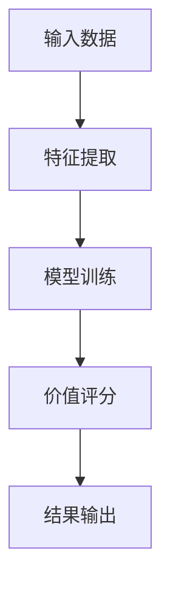
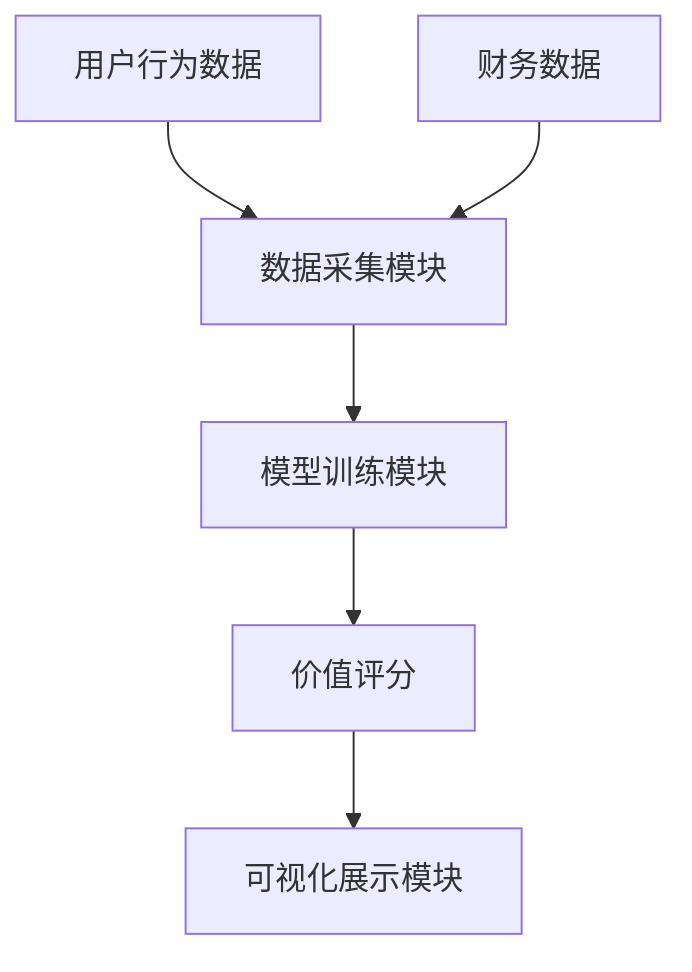
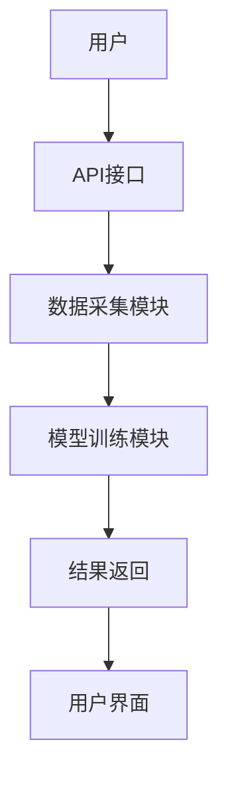

                 


# 彼得林奇的"长期价值创造"在平台型公司中的新指标

> 关键词：彼得林奇，长期价值创造，平台型公司，新指标，投资理念，价值驱动，量化模型

> 摘要：本文探讨了彼得林奇的长期价值创造理念在平台型公司中的应用，提出了一套新的价值评估指标。通过分析平台型公司的特点，结合长期价值创造的核心要素，构建了量化模型和系统架构，为平台型公司提供了可持续发展的新思路。

---

## 第一部分：背景介绍

### 第1章：彼得林奇的长期价值创造理论

#### 1.1 投资的长期视角

彼得·林奇是全球著名投资专家，他强调投资的长期视角，认为价值创造的核心在于企业是否能够持续为股东和用户创造价值。他主张通过深入研究企业的基本面，选择那些具有长期增长潜力的企业进行投资。

#### 1.2 平台型公司的定义与特点

平台型公司是以互联网技术为基础，通过构建平台连接多方参与者（如用户、商家、开发者等）的企业。其特点包括：

- **双边市场**：平台连接两个或多个群体，通过匹配供需实现价值。
- **网络效应**：用户数量的增加会增强平台的价值。
- **数据驱动**：通过收集和分析数据，优化用户体验和商业模式。

#### 1.3 长期价值创造与平台型公司的结合

平台型公司需要通过长期价值创造来实现可持续发展。这不仅要求公司在短期内实现盈利，还要关注用户满意度、市场份额的扩展以及社会价值的提升。

---

## 第二部分：核心概念与联系

### 第2章：长期价值创造的核心要素

#### 2.1 长期价值创造的内涵

长期价值创造是指通过持续优化产品和服务，提升用户和股东的长期利益。在平台型公司中，这表现为用户体验的提升、市场份额的扩大以及品牌价值的增强。

#### 2.2 平台型公司的价值驱动因素

| 因素         | 描述                                   |
|--------------|----------------------------------------|
| 用户价值     | 用户满意度、用户留存率、用户增长       |
| 股东价值     | 股东回报率、股价稳定性、公司市值       |
| 创新能力     | 技术创新、产品迭代速度                 |
| 网络效应     | 用户数量的增加对平台价值的放大效应       |

#### 2.3 新指标的构建逻辑

新的价值评估指标需要综合考虑用户价值和股东价值，同时引入创新能力和网络效应等维度。

---

## 第三部分：算法原理与数学模型

### 第3章：长期价值创造的量化模型

#### 3.1 算法原理

量化模型的核心在于将长期价值创造的关键指标转化为可量化的数据，并通过加权评分的方式得出综合价值评分。



#### 3.2 数学模型与公式

##### 价值评分公式

$$ \text{价值评分} = \alpha \times \text{用户价值} + \beta \times \text{股东价值} $$

其中，$\alpha$ 和 $\beta$ 是权重系数，通常根据具体行业和公司情况调整。

##### 权重分配

$$ \alpha + \beta = 1 $$

---

## 第四部分：系统分析与架构设计

### 第4章：系统架构设计

#### 4.1 问题场景介绍

平台型公司需要通过系统架构设计，实现长期价值创造的量化评估和优化。

#### 4.2 系统功能设计

| 功能模块         | 描述                                   |
|------------------|----------------------------------------|
| 数据采集模块     | 收集用户行为数据、财务数据等           |
| 模型训练模块     | 构建量化模型，计算价值评分             |
| 可视化展示模块   | 展示评估结果，帮助管理层决策           |

#### 4.3 系统架构图



#### 4.4 接口设计与交互



---

## 第五部分：项目实战

### 第5章：环境安装与核心代码实现

#### 5.1 环境安装

需要安装Python、数据处理库（Pandas、NumPy）以及可视化工具（Matplotlib）。

#### 5.2 核心代码实现

```python
import pandas as pd
import numpy as np
import matplotlib.pyplot as plt

# 示例数据
data = {
    '用户价值': [80, 70, 90, 60],
    '股东价值': [75, 85, 65, 95],
}
df = pd.DataFrame(data)

# 权重分配
alpha = 0.6
beta = 0.4

# 价值评分计算
df['价值评分'] = alpha * df['用户价值'] + beta * df['股东价值']

print(df)
```

#### 5.3 实际案例分析

以某平台型公司为例，计算其价值评分，并分析如何通过优化用户价值和股东价值来提升整体评分。

---

## 第六部分：总结与展望

### 第6章：最佳实践与小结

#### 6.1 最佳实践 tips

- 定期评估价值评分，及时调整权重和模型。
- 关注用户反馈，持续优化用户体验。
- 结合行业特点，灵活调整评估指标。

#### 6.2 小结

本文提出了彼得林奇的长期价值创造理念在平台型公司中的新指标，通过量化模型和系统架构设计，为平台型公司提供了可持续发展的新思路。

#### 6.3 注意事项

- 数据的准确性和完整性是模型评估的基础。
- 模型的应用需要结合具体行业特点和公司实际情况。

#### 6.4 拓展阅读

推荐阅读《彼得·林奇的投资智慧》和《平台型公司的价值评估》等相关书籍。

---

## 作者

作者：AI天才研究院/AI Genius Institute & 禅与计算机程序设计艺术/Zen And The Art of Computer Programming

