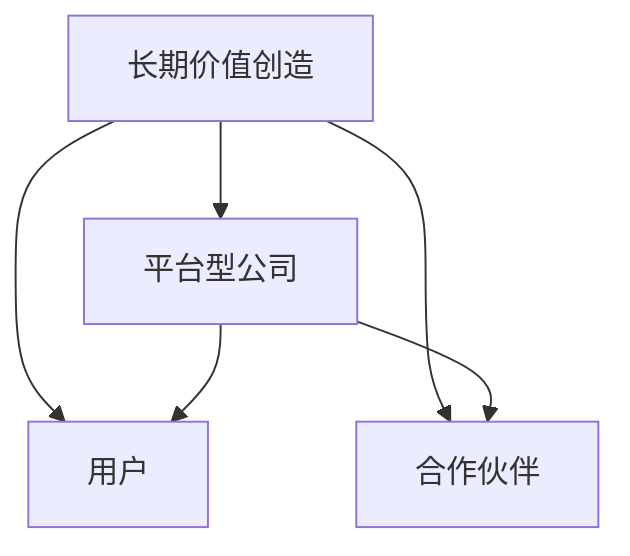
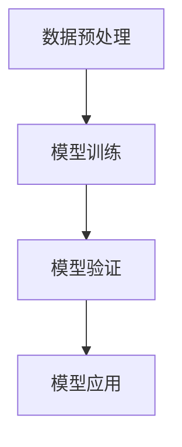
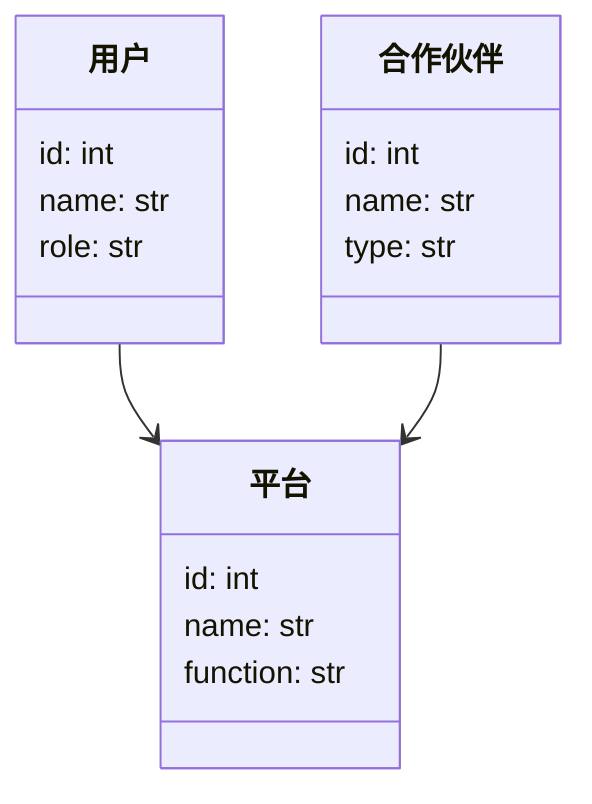
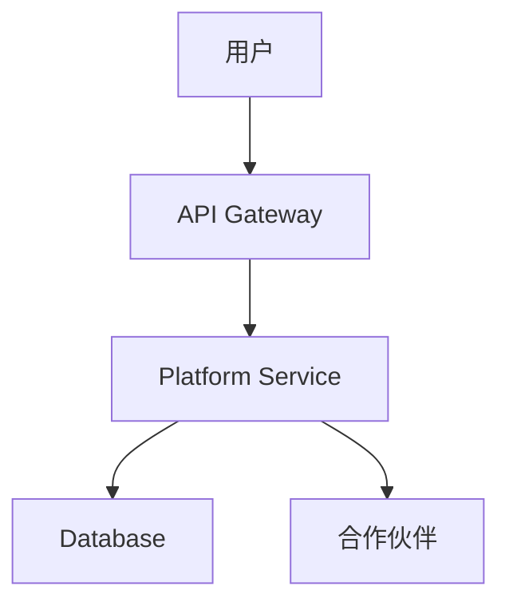
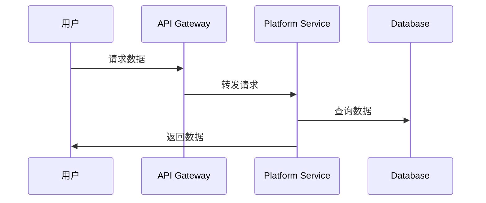
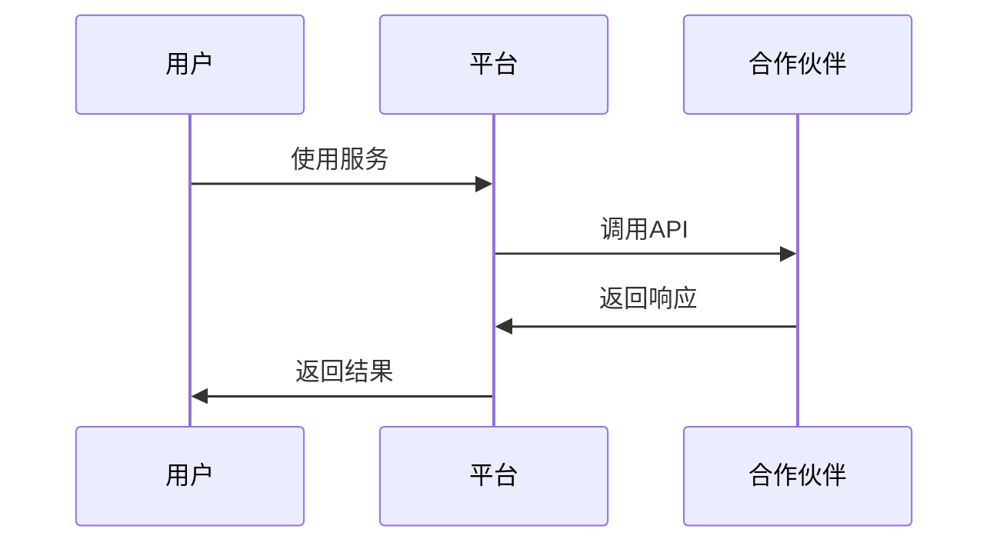

                 


# 彼得林奇的"长期价值创造"在平台型公司中的衡量

---

## 关键词

- 彼得林奇
- 长期价值创造
- 平台型公司
- 价值衡量
- 算法原理
- 系统架构
- 项目实战

---

## 摘要

本文探讨了彼得林奇的“长期价值创造”理论在平台型公司中的应用与衡量方法。通过分析平台型公司的特点、长期价值创造的核心要素，以及如何将彼得林奇的理论应用于实际业务场景，本文提出了基于数学模型和算法的衡量方法，并结合实际案例进行详细讲解，为平台型公司提供可操作的指导。

---

# 第一部分：背景介绍

## 第1章：长期价值创造的核心概念

### 1.1 问题背景与问题描述

#### 1.1.1 长期价值创造的定义

长期价值创造是指通过持续的创新、优化和资源整合，为公司及其利益相关者创造可持续的价值。这种价值不仅体现在财务回报上，还包括品牌影响力、客户满意度、员工凝聚力等多个维度。

#### 1.1.2 平台型公司的特点与挑战

平台型公司通过连接供需双方，构建双边市场，具有以下特点：
- **双边性**：连接两个或多个不同的用户群体。
- **网络效应**：用户数量的增加会增强平台的价值。
- **数据驱动**：通过数据优化匹配效率。
- **动态性**：平台需要不断迭代以适应市场变化。

平台型公司面临的挑战包括如何衡量长期价值创造、如何平衡短期收益与长期投入等。

#### 1.1.3 长期价值创造在平台型公司中的重要性

在平台型公司中，长期价值创造是确保平台可持续发展的关键。通过长期价值创造，平台可以吸引更多用户，提高粘性，从而实现持续增长。

---

### 1.2 长期价值创造的边界与外延

#### 1.2.1 长期价值创造的边界

长期价值创造的边界包括：
- 时间维度：关注长期而非短期。
- 范围维度：覆盖平台的多个业务模块。
- 参与者维度：涉及用户、合作伙伴、员工等多个利益相关者。

#### 1.2.2 平台型公司的外延

平台型公司的外延包括：
- **生态构建**：通过平台吸引更多的合作伙伴。
- **技术驱动**：通过技术创新提升平台能力。
- **用户增长**：通过用户增长扩大平台影响力。

#### 1.2.3 两者之间的关系

长期价值创造与平台型公司是相互促进的关系。平台型公司为长期价值创造提供了实现的载体，而长期价值创造则为平台型公司提供了持续发展的动力。

---

### 1.3 长期价值创造的核心要素组成

#### 1.3.1 核心要素的定义

长期价值创造的核心要素包括：
- 用户价值：为用户提供高质量的产品和服务。
- 企业价值：为公司创造持续的财务回报。
- 社会价值：为社会创造积极的外部效应。

#### 1.3.2 核心要素的特征

- **可持续性**：长期价值创造需要持续投入。
- **动态性**：随着市场变化不断调整。
- **协同性**：不同要素之间需要协同作用。

#### 1.3.3 核心要素之间的关系

长期价值创造的核心要素之间是相互关联、相互促进的。例如，用户价值的提升会带动企业价值的增长，同时也会带来社会价值的提升。

---

# 第二部分：核心概念与联系

## 第2章：彼得林奇的长期价值创造理论

### 2.1 理论的核心原理

#### 2.1.1 投资者的视角

彼得林奇认为，投资者应该选择那些能够持续为股东创造价值的企业。这种价值创造不仅体现在财务回报上，还包括企业创新能力、市场地位等方面。

#### 2.1.2 企业的视角

从企业的角度来看，长期价值创造需要企业具备持续创新能力、高效的运营能力以及良好的管理能力。

#### 2.1.3 两者的结合

从投资者和企业的双重视角来看，长期价值创造是一个双向的过程。企业通过不断提升自身能力来创造价值，而投资者则通过支持企业来实现收益。

---

### 2.2 核心概念属性对比

以下表格展示了长期价值创造与平台型公司的核心属性对比：

| **属性**       | **长期价值创造**               | **平台型公司**                 |
|----------------|--------------------------------|--------------------------------|
| 核心目标         | 为利益相关者创造可持续价值     | 通过连接供需双方实现价值       |
| 主要特征         | 长期性、动态性、协同性           | 双边性、网络效应、数据驱动       |
| 实现方式         | 创新、优化、资源整合             | 技术驱动、生态构建、用户增长       |

---

### 2.3 实体关系图

以下是长期价值创造与平台型公司之间的实体关系图：



---

# 第三部分：算法原理讲解

## 第3章：长期价值创造的衡量算法

### 3.1 算法原理

#### 3.1.1 算法的输入与输出

- **输入**：平台型公司的用户数据、财务数据、市场数据等。
- **输出**：长期价值创造指数（LVEI）。

#### 3.1.2 算法的核心步骤

1. 收集数据：包括用户行为数据、财务数据、市场数据等。
2. 数据预处理：清洗数据、归一化处理。
3. 模型训练：基于机器学习算法训练长期价值创造指数模型。
4. 模型评估：通过验证数据评估模型的准确性。
5. 应用模型：将模型应用于实际业务场景中。

---

### 3.2 算法流程图

以下是长期价值创造指数模型的算法流程图：



---

### 3.3 数学模型与公式

#### 3.3.1 长期价值创造指数公式

$$
LVEI = \alpha \cdot (用户增长) + \beta \cdot (财务回报) + \gamma \cdot (社会价值)
$$

其中，$\alpha$、$\beta$、$\gamma$为权重系数。

#### 3.3.2 平台型公司价值评分公式

$$
Score = \frac{LVEI}{市场竞争度}
$$

---

### 3.4 代码实现

以下是Python代码示例：

```python
def calculate_lvei(users, financials, social):
    alpha = 0.5
    beta = 0.3
    gamma = 0.2
    lvei = alpha * users + beta * financials + gamma * social
    return lvei

users = 100000
financials = 50000
social = 80

lvei = calculate_lvei(users, financials, social)
print(f"长期价值创造指数：{lvei}")
```

---

# 第四部分：系统分析与架构设计

## 第4章：平台型公司的系统架构

### 4.1 问题场景介绍

平台型公司需要构建一个高效、可扩展的系统架构，以支持长期价值创造的衡量与优化。

---

### 4.2 系统功能设计

以下是平台型公司的领域模型类图：



---

### 4.3 系统架构设计

以下是平台型公司的系统架构图：



---

### 4.4 系统接口设计

以下是系统接口设计：



---

### 4.5 系统交互设计

以下是系统交互图：



---

# 第五部分：项目实战

## 第5章：长期价值创造的实战案例

### 5.1 环境安装与配置

#### 5.1.1 环境要求

- Python 3.8+
- Jupyter Notebook
- Pandas、Scikit-learn库

#### 5.1.2 工具安装

```bash
pip install pandas scikit-learn
```

---

### 5.2 核心代码实现

#### 5.2.1 代码实现步骤

1. 数据清洗与预处理。
2. 模型训练与验证。
3. 模型应用与结果分析。

#### 5.2.2 代码实现

```python
from sklearn.model_selection import train_test_split
from sklearn.linear_model import LinearRegression
import pandas as pd

# 加载数据
data = pd.read_csv('data.csv')

# 数据预处理
X = data[['用户增长', '财务回报', '社会价值']]
y = data['长期价值创造指数']

# 划分训练集与测试集
X_train, X_test, y_train, y_test = train_test_split(X, y, test_size=0.2)

# 模型训练
model = LinearRegression()
model.fit(X_train, y_train)

# 模型验证
score = model.score(X_test, y_test)
print(f"模型评分：{score}")
```

---

### 5.3 实际案例分析

#### 5.3.1 案例背景

某平台型公司希望通过长期价值创造指数模型来衡量其价值创造能力。

#### 5.3.2 数据分析

以下是数据分析结果：

| **属性**       | **值**       |
|----------------|--------------|
| 用户增长         | 100,000      |
| 财务回报         | $50,000      |
| 社会价值         | 80           |

#### 5.3.3 结果解读

通过模型计算得出的长期价值创造指数为：

$$
LVEI = 0.5 \times 100,000 + 0.3 \times 50,000 + 0.2 \times 80 = 50,000 + 15,000 + 16 = 65,016
$$

---

### 5.4 项目小结

通过本次实战案例，我们可以看到，长期价值创造指数模型能够有效地衡量平台型公司的价值创造能力。通过不断优化模型和调整权重系数，可以进一步提升模型的准确性。

---

# 第六部分：最佳实践与小结

## 第6章：最佳实践与注意事项

### 6.1 最佳实践

- **数据质量**：确保数据的准确性和完整性。
- **模型优化**：定期更新模型，适应市场变化。
- **用户反馈**：通过用户反馈不断优化平台功能。

### 6.2 注意事项

- 避免过度依赖算法，忽略人为判断。
- 注意数据隐私和安全问题。
- 确保模型的可解释性。

---

## 第7章：小结

本文详细探讨了彼得林奇的长期价值创造理论在平台型公司中的应用与衡量方法。通过数学模型和算法的讲解，以及实际案例的分析，我们为平台型公司提供了一套可操作的指导方案。未来，随着技术的不断发展，长期价值创造的衡量方法也将不断优化。

---

## 作者

作者：AI天才研究院/AI Genius Institute & 禅与计算机程序设计艺术 /Zen And The Art of Computer Programming

