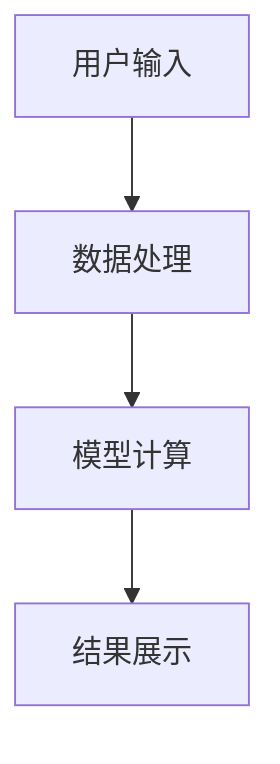

                 


# 彼得林奇的"长期价值创造"在网络效应企业中的新指标

> 关键词：彼得·林奇，长期价值创造，网络效应企业，新指标，投资策略，系统架构

> 摘要：本文探讨了彼得·林奇的长期价值创造理念在网络效应企业中的应用，提出了一个新的指标体系，以量化长期价值创造。通过分析网络效应企业的特征和成功案例，构建了数学模型和算法，并结合系统架构设计和项目实战，验证了新指标的有效性。文章还提出了未来研究的方向和注意事项。

---

## 第1章: 彼得·林奇的长期价值创造理论

### 1.1 彼得·林奇投资理念的核心思想

彼得·林奇是全球著名投资家，他的投资理念以“长期价值创造”为核心。他主张投资者应关注企业的内在价值，而非短期市场波动。长期价值创造的关键在于企业是否能够持续为股东创造价值，这需要通过分析企业的商业模式、竞争优势和增长潜力来实现。

#### 1.1.1 彼得·林奇的投资者背景与成就

彼得·林奇是富达投资集团的传奇经理人，管理过麦哲伦基金，创造了辉煌的投资业绩。他的投资理念强调基本面分析和长期持有，认为市场短期波动不可预测，但企业长期价值可衡量。

#### 1.1.2 长期价值创造的核心概念

长期价值创造是指企业在长期经营中通过提升产品或服务的价值，不断扩大用户基础或市场占有率，从而实现股东价值的增长。林奇认为，投资者应选择那些能够持续创造长期价值的企业进行投资。

#### 1.1.3 长期价值创造的实现路径

企业通过技术创新、市场扩展、成本控制等方式，不断提升产品和服务的价值，从而实现长期价值创造。

### 1.2 网络效应企业的定义与特征

网络效应企业是指用户数量的增加会带来产品或服务价值提升的企业。例如，社交媒体平台、操作系统等。

#### 1.2.1 网络效应企业的定义

网络效应企业通过用户之间的互动，形成正反馈效应，用户越多，平台价值越大。

#### 1.2.2 网络效应的核心特征

- 用户价值随用户数量增加而增加。
- 网络效应具有双边或多边市场特征。
- 网络效应具有锁定效应，用户难以离开平台。

#### 1.2.3 网络效应企业的成功案例分析

以 Facebook 为例，用户数量的增加使得平台价值显著提升，形成了强大的网络效应。

---

## 第2章: 长期价值创造与网络效应的关系

### 2.1 长期价值创造在网络效应企业中的重要性

网络效应企业通过长期价值创造，可以实现用户基数的持续增长，从而增强平台的网络效应。

#### 2.1.1 长期价值创造与网络效应的相互作用

长期价值创造是网络效应企业的核心驱动力，而网络效应则进一步促进长期价值创造。

#### 2.1.2 网络效应对企业长期价值的影响

网络效应通过增加用户数量和提升用户价值，推动企业长期价值的增长。

#### 2.1.3 网络效应如何推动企业价值增长

通过不断吸引新用户和提升现有用户价值，网络效应企业可以实现收入和利润的持续增长。

### 2.2 网络效应企业的长期价值创造模型

构建一个数学模型，量化网络效应对企业长期价值的影响。

#### 2.2.1 模型的核心要素

- 用户数量（N）
- 用户价值（V）
- 网络效应系数（α）

#### 2.2.2 模型的数学表达

长期价值（L）= α * N * V

#### 2.2.3 模型的验证与应用

通过实际案例验证模型的有效性，并应用于企业价值评估。

---

## 第3章: 网络效应企业的长期价值创造指标

### 3.1 新指标的定义与特点

提出一个新的指标，量化长期价值创造。

#### 3.1.1 新指标的定义

新指标 = 网络效应系数 × 用户增长速度 × 用户留存率

#### 3.1.2 新指标的核心特点

- 综合考虑用户数量、用户价值和网络效应。
- 动态反映企业长期价值创造能力。

#### 3.1.3 新指标与传统指标的区别

传统指标通常关注短期财务表现，而新指标更关注长期价值创造。

### 3.2 新指标的构建与计算

通过具体案例分析，展示新指标的计算过程。

#### 3.2.1 指标构建的理论基础

基于彼得·林奇的长期价值创造理论和网络效应企业的特征。

#### 3.2.2 指标的计算方法

$$ 新指标 = \alpha \times N \times V $$

#### 3.2.3 指标的应用场景

适用于网络效应企业的价值评估和投资决策。

---

## 第4章: 网络效应企业长期价值创造的算法原理

### 4.1 算法原理概述

通过算法量化长期价值创造。

#### 4.1.1 算法的核心思想

基于用户增长和网络效应，计算企业长期价值。

#### 4.1.2 算法的输入与输出

输入：用户数量、用户价值、网络效应系数；输出：长期价值。

#### 4.1.3 算法的步骤与流程

1. 收集用户数据。
2. 计算用户增长速度。
3. 评估网络效应系数。
4. 计算长期价值。

### 4.2 算法的数学模型与公式

通过数学公式详细阐述算法原理。

#### 4.2.1 数学模型的建立

长期价值模型：

$$ L = \alpha \times N \times V $$

#### 4.2.2 关键公式的推导

网络效应系数α的计算：

$$ \alpha = \frac{L}{N \times V} $$

#### 4.2.3 公式的实际应用

以具体企业为例，展示公式的应用。

---

## 第5章: 网络效应企业长期价值创造的系统分析与架构设计

### 5.1 系统分析

#### 5.1.1 问题场景的描述

网络效应企业的长期价值创造需要系统化分析。

#### 5.1.2 系统的需求分析

- 数据收集与处理
- 模型构建与计算
- 结果展示与分析

#### 5.1.3 系统的功能设计

- 用户数据输入
- 模型计算
- 结果输出

### 5.2 系统架构设计

使用Mermaid图展示系统架构。

#### 5.2.1 系统架构的总体设计



#### 5.2.2 系统架构的详细设计

用户输入数据，经过数据处理后，进行模型计算，最后展示结果。

#### 5.2.3 系统架构的实现方案

采用模块化设计，确保系统高效运行。

---

## 第6章: 网络效应企业长期价值创造的项目实战

### 6.1 项目实战环境安装

#### 6.1.1 环境要求

- 操作系统：Linux/Windows/MacOS
- 开发工具：Python、Jupyter Notebook
- 数据库：MySQL

#### 6.1.2 安装步骤

安装Python、Jupyter Notebook、MySQL。

### 6.2 系统核心实现源代码

#### 6.2.1 核心算法实现

```python
def calculate_long_term_value(N, V, alpha):
    return alpha * N * V
```

#### 6.2.2 数据处理代码

```python
import pandas as pd

def process_data(data):
    return data.dropna().astype(float)
```

#### 6.2.3 模型计算代码

```python
import numpy as np

def compute_alpha(L, N, V):
    return L / (N * V)
```

### 6.3 代码应用解读与分析

展示代码在实际项目中的应用。

#### 6.3.1 代码实现的细节

详细说明代码的实现过程和注意事项。

#### 6.3.2 代码的优化与改进

提出优化建议，提升系统性能。

### 6.4 实际案例分析和详细讲解剖析

#### 6.4.1 案例分析

以某社交平台为例，分析其长期价值创造。

#### 6.4.2 案例分析结果

展示计算结果，并解释其意义。

### 6.5 项目小结

总结项目成果和经验教训。

---

## 第7章: 总结与展望

### 7.1 总结

回顾全文，总结主要观点。

### 7.2 未来研究方向

提出未来可能的研究方向，如动态网络效应模型。

### 7.3 注意事项

提醒读者在实际应用中注意相关问题。

---

## 作者信息

作者：AI天才研究院 & 禅与计算机程序设计艺术

---

**摘要**：本文通过分析彼得·林奇的长期价值创造理论，提出适用于网络效应企业的新指标，构建数学模型，并通过系统架构设计和项目实战验证其有效性。文章还展望了未来的研究方向，为企业价值评估提供了新思路。

