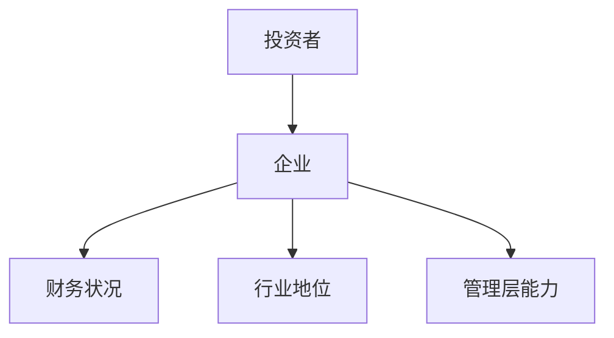
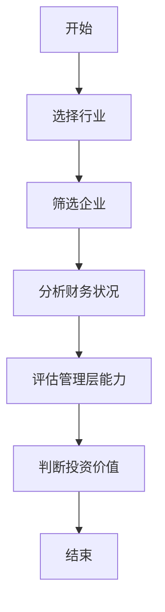
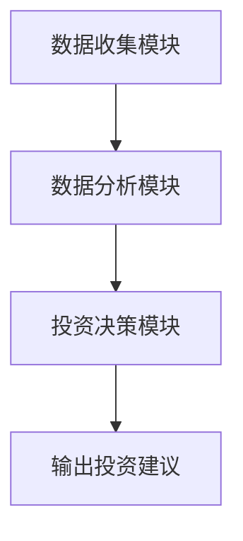

                 


# 彼得林奇的"长期价值创造"投资理念

## 关键词：彼得林奇，长期价值创造，投资理念，价值投资，投资策略，财务分析

## 摘要：彼得·林奇是全球著名的价值投资者，他的“长期价值创造”投资理念强调通过深入研究企业基本面，选择具有持续竞争优势和良好管理的公司进行长期投资，以实现财富的稳定增长。本文将从背景介绍、核心概念、算法原理、数学模型、系统架构设计、项目实战等多个维度，全面解析这一投资理念，并结合实际案例进行详细分析，帮助读者更好地理解和应用这一理念。

---

## 第一部分: 彼得林奇的"长期价值创造"投资理念概述

### 第1章: 彼得林奇与长期价值创造概述

#### 1.1 彼得林奇的生平与投资理念

##### 1.1.1 彼得林奇的生平简介
- 彼得·林奇（Peter Lynch）是美国著名的价值投资者，曾任富达麦哲伦基金（Fidelity Magellan Fund）的经理，管理资产规模曾高达140亿美元。
- 他以长期价值创造的投资理念闻名，强调通过深入研究企业基本面，选择具有持续竞争优势和良好管理的公司进行投资。

##### 1.1.2 彼得林奇的投资哲学
- 林奇的投资哲学的核心是“长期价值创造”。
- 他强调投资者应关注企业的内在价值，而非市场的短期波动。
- 他认为，成功的投资需要对企业进行深入研究，包括财务状况、行业地位、管理层能力等。

##### 1.1.3 长期价值创造的核心理念
- 长期价值创造是指通过投资于具有持续竞争优势和良好管理的企业，实现资产的长期增值。
- 林奇认为，投资者应选择那些能够在未来持续创造价值的企业，而非仅仅关注短期收益。

#### 1.2 长期价值创造的定义与背景

##### 1.2.1 长期价值创造的定义
- 长期价值创造是指通过投资于具有持续竞争优势和良好管理的企业，实现资产的长期增值。
- 这种投资理念强调企业内在价值的持续增长，而非短期市场波动。

##### 1.2.2 长期价值创造的背景与意义
- 在20世纪80年代，美国股市经历了多次波动，许多投资者盲目追求短期收益。
- 林奇提出长期价值创造的理念，旨在引导投资者关注企业的内在价值，避免短期波动的干扰。
- 这一理念的意义在于帮助投资者在长期投资中实现稳定收益，减少短期波动对投资决策的干扰。

##### 1.2.3 长期价值创造与短期投资的对比
- 短期投资关注市场的短期波动，追求快速获利。
- 长期价值创造关注企业的内在价值，追求长期稳定的收益。
- 对比发现，长期价值创造更注重企业的基本面分析，而短期投资更注重市场的技术分析。

#### 1.3 彼得林奇投资理念的核心要素

##### 1.3.1 投资的三个核心要素
- **企业基本面分析**：包括财务状况、行业地位、管理层能力等。
- **长期价值判断**：选择能够在未来持续创造价值的企业。
- **风险控制**：通过分散投资和深入研究降低风险。

##### 1.3.2 长期价值创造的三重维度
- **企业内在价值**：企业的财务状况、盈利能力、竞争优势。
- **管理层能力**：管理层的决策能力和企业战略。
- **行业环境**：行业的竞争状况、发展趋势等。

##### 1.3.3 核心要素的相互关系与整体架构
- 企业内在价值是基础，管理层能力和行业环境是影响企业价值的关键因素。
- 三者相互关联，共同构成长期价值创造的整体架构。

---

## 第二部分: 长期价值创造的核心概念与联系

### 第2章: 核心概念的原理与联系

#### 2.1 长期价值创造的原理

##### 2.1.1 价值创造的内在逻辑
- 企业的内在价值取决于其未来的盈利能力。
- 通过深入分析企业的财务状况和行业环境，可以判断企业的未来盈利能力。
- 投资者应选择那些能够持续创造价值的企业进行投资。

##### 2.1.2 投资者与企业价值的关系
- 投资者通过购买企业股票，成为企业的部分所有者。
- 投资者的收益来源于企业的盈利增长和股价的上涨。
- 投资者应关注企业的长期发展，而非短期股价波动。

##### 2.1.3 长期价值创造的系统性分析
- 长期价值创造需要系统性地分析企业的基本面。
- 系统性分析包括对企业财务状况、行业地位、管理层能力的全面评估。
- 通过系统性分析，可以识别出具有长期价值创造潜力的企业。

#### 2.2 核心概念的对比分析

##### 2.2.1 不同投资理念的核心要素对比
| 投资理念         | 核心要素                           |
|------------------|------------------------------------|
| 短期投资         | 市场波动、技术分析                 |
| 长期价值创造     | 企业基本面、内在价值、管理层能力   |

##### 2.2.2 长期价值创造与其他投资策略的对比
- 短期投资关注市场波动，风险较高。
- 长期价值创造关注企业基本面，风险较低，收益稳定。
- 对比发现，长期价值创造更注重企业的内在价值，而短期投资更注重市场的技术分析。

##### 2.2.3 核心概念的ER实体关系图


---

## 第三部分: 长期价值创造的算法原理

### 第3章: 投资决策的算法原理

#### 3.1 投资决策的流程图


---

## 第四部分: 长期价值创造的数学模型

### 第4章: 长期价值创造的数学模型

#### 4.1 核心财务指标的数学公式

##### 4.1.1 市盈率（P/E）的计算公式
$$ P/E = \frac{\text{股价}}{\text{每股净利润}} $$

##### 4.1.2 市净率（P/B）的计算公式
$$ P/B = \frac{\text{股价}}{\text{每股净资产}} $$

##### 4.1.3 净资产收益率（ROE）的计算公式
$$ ROE = \frac{\text{净利润}}{\text{净资产}} $$

#### 4.2 投资价值评估的数学模型
- 通过对企业财务指标的综合评估，判断企业的投资价值。
- 结合市盈率、市净率、ROE等指标，综合评估企业的内在价值。

---

## 第五部分: 系统分析与架构设计

### 第5章: 投资决策系统的架构设计

#### 5.1 系统功能设计

##### 5.1.1 数据收集模块
- 收集企业的财务数据、行业数据等。
- 数据来源包括企业财报、行业报告等。

##### 5.1.2 数据分析模块
- 对企业财务数据进行分析，计算市盈率、市净率等指标。
- 分析企业的行业地位、竞争优势等。

##### 5.1.3 投资决策模块
- 根据分析结果，判断企业的投资价值。
- 输出投资建议。

#### 5.2 系统架构设计


---

## 第六部分: 项目实战

### 第6章: 长期价值创造的项目实战

#### 6.1 环境安装
- 需要安装数据分析工具，如Excel、Python等。

#### 6.2 系统核心实现源代码
```python
import pandas as pd

def calculate_pe(stock_price, eps):
    return stock_price / eps

def calculate_pb(stock_price, book_value_per_share):
    return stock_price / book_value_per_share

def calculate_roe(net_income, equity):
    return net_income / equity

# 示例数据
stock_price = 100
eps = 2.5
book_value_per_share = 5
net_income = 10
equity = 50

# 计算指标
pe = calculate_pe(stock_price, eps)
pb = calculate_pb(stock_price, book_value_per_share)
roe = calculate_roe(net_income, equity)

print(f"市盈率: {pe}")
print(f"市净率: {pb}")
print(f"净资产收益率: {roe}")
```

#### 6.3 代码应用解读与分析
- 通过代码计算企业的市盈率、市净率和净资产收益率。
- 根据计算结果，判断企业的投资价值。

#### 6.4 实际案例分析
- 选择具体企业，分析其财务指标。
- 根据分析结果，判断是否具有长期价值创造潜力。

#### 6.5 项目小结
- 通过项目实战，验证长期价值创造理念的应用。
- 总结经验，改进投资策略。

---

## 作者：AI天才研究院/AI Genius Institute & 禅与计算机程序设计艺术 /Zen And The Art of Computer Programming

