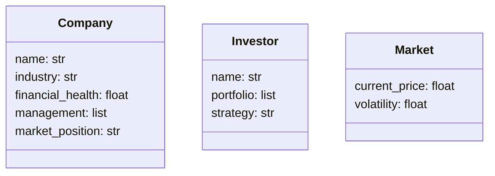
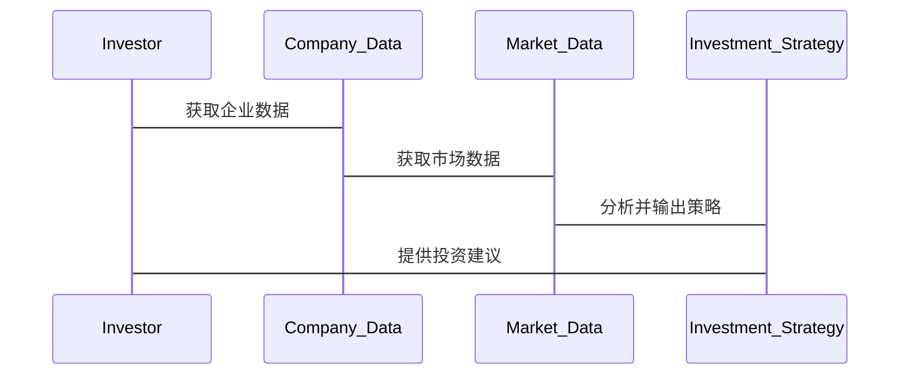

                 


# 彼得林奇的"长期价值创造"评估体系

## 关键词：彼得·林奇，长期价值创造，投资评估，价值投资，投资策略

## 摘要：本文深入探讨了彼得·林奇提出的"长期价值创造"评估体系，分析其核心概念、算法原理、系统架构及实际应用。通过详细讲解评估体系的构建方法和实战案例，帮助读者掌握如何在投资决策中实现长期价值创造。

---

# 第一章: 引言

## 1.1 彼得·林奇及其投资理念
### 1.1.1 彼得·林奇的生平简介
彼得·林奇（Peter Lynch）是美国著名的投资经理，曾管理富达麦哲伦基金，创造了年化29%的惊人回报率。他以深入的行业研究和对公司基本面的分析著称。

### 1.1.2 林奇的投资哲学与长期价值创造
林奇强调长期持有优质股票，寻找那些能够持续创造价值的企业。他提出了“长期价值创造”的理念，关注企业的内在价值和竞争优势。

### 1.1.3 本书的目的与意义
本文旨在解析林奇的评估体系，帮助投资者理解和应用其理念，实现长期投资价值。

---

## 1.2 长期价值创造的核心概念
### 1.2.1 什么是长期价值创造
长期价值创造是指通过投资于能够持续提升内在价值的企业，实现资本的长期增长。

### 1.2.2 长期价值创造的关键要素
- 行业地位
- 财务健康
- 管理团队
- 市场前景

### 1.2.3 长期价值创造的边界与外延
- 投资范围：股票、基金等
- 时间跨度：长期持有的策略

---

## 1.3 本书结构与学习方法
### 1.3.1 书籍章节安排
- 引言
- 背景分析
- 核心概念
- 算法原理
- 系统架构
- 项目实战
- 总结展望

### 1.3.2 学习方法与注意事项
- 理论与实践结合
- 定期复盘与调整

---

# 第二章: 长期价值创造的背景与问题背景

## 2.1 长期价值创造的背景分析
### 2.1.1 当前投资环境的变化
市场波动加剧，传统估值方法失效。

### 2.1.2 经济周期与长期价值创造
经济周期影响企业盈利，长期价值创造关注企业内在增长。

### 2.1.3 投资者行为与市场波动
投资者短期行为加剧市场波动，长期价值创造强调长期持有。

---

## 2.2 问题背景与问题描述
### 2.2.1 投资者面临的挑战
- 短期波动干扰
- 信息过载

### 2.2.2 长期价值创造的核心问题
如何识别和投资于真正具有长期价值的企业。

### 2.2.3 传统投资评估体系的局限性
传统估值法忽视了企业内在增长能力。

---

## 2.3 问题解决与长期价值创造
### 2.3.1 长期价值创造的解决方案
采用基本面分析，关注企业核心竞争力。

### 2.3.2 林奇评估体系的核心思想
投资于具有竞争优势的企业，长期持有。

### 2.3.3 长期价值创造的实现路径
- 深入研究企业基本面
- 选择优秀管理层
- 长期持有优质股票

---

# 第三章: 长期价值创造的核心概念与联系

## 3.1 核心概念原理
### 3.1.1 长期价值创造的定义
通过投资于能够持续提升内在价值的企业，实现资本的长期增长。

### 3.1.2 林奇评估体系的核心要素
- 行业地位：企业是否在行业中占据优势
- 财务健康：盈利能力、现金流是否健康
- 管理团队：管理层能力与战略
- 市场前景：行业增长潜力

### 3.1.3 长期价值创造的数学模型
$$ V = \text{企业内在价值} = \text{净利润} \times \text{合理市盈率} $$

---

## 3.2 核心概念属性特征对比表格
| 核心概念 | 属性 | 描述 |
|----------|------|------|
| 行业地位 | 竞争优势 | 行业龙头 |
| 财务健康 | 净利润 | 持续增长 |
| 管理团队 | 能力 | 高效执行 |
| 市场前景 | 增长潜力 | 高 |

---

## 3.3 ER实体关系图架构
```mermaid
erDiagram
    investor --> stock : 持有
    stock --> company : 股权
    company --> industry : 所属行业
    company --> management : 管理团队
    company --> financial_health : 财务状况
    investor --> market : 投资环境
```

---

# 第四章: 长期价值创造的算法原理

## 4.1 算法原理概述
### 4.1.1 算法的核心思想
通过基本面分析，评估企业的内在价值。

### 4.1.2 算法的数学模型
$$ \text{内在价值} = \sum_{t=1}^{n} \frac{\text{现金流}_t}{(1 + r)^t} $$
其中，r为折现率，现金流为企业的未来现金流。

---

## 4.2 算法实现
### 4.2.1 算法步骤
1. 收集企业财务数据。
2. 评估行业地位。
3. 计算内在价值。
4. 确定安全边际。

### 4.2.2 代码实现
```python
def calculate_intrinsic_value(enterprise):
    cash_flows = [enterprise.cash_flow_t1, enterprise.cash_flow_t2, enterprise.cash_flow_t3]
    discount_rate = 0.1
    intrinsic_value = sum([cf / (1 + discount_rate)**t for t, cf in enumerate(cash_flows, start=1)])
    return intrinsic_value
```

---

## 4.3 算法应用案例
### 4.3.1 案例分析
以某科技公司为例，计算其内在价值，并与市场价格对比，确定是否具备投资价值。

---

# 第五章: 长期价值创造的系统分析与架构设计

## 5.1 系统功能设计
### 5.1.1 领域模型


---

## 5.2 系统架构设计
### 5.2.1 架构图


---

## 5.3 系统交互设计
### 5.3.1 交互序列图


---

# 第六章: 长期价值创造的项目实战

## 6.1 环境安装
安装Python和相关库（如pandas、numpy）。

## 6.2 核心实现
### 6.2.1 数据收集
从公开数据源获取企业财务数据。

### 6.2.2 模型实现
实现内在价值计算函数。

## 6.3 案例分析
分析某企业，展示如何应用林奇评估体系进行投资决策。

---

## 6.4 总结与反思
项目实现过程中需要注意的问题，如数据的准确性和模型的适用性。

---

# 第七章: 总结与展望

## 7.1 总结
### 7.1.1 核心要点回顾
- 核心概念
- 算法原理
- 系统架构

### 7.1.2 项目成果
通过实战掌握了林奇评估体系的应用方法。

## 7.2 展望
### 7.2.1 未来方向
结合AI技术，优化评估模型。

### 7.2.2 总结与建议
持续学习，不断优化投资策略。

---

## 最佳实践 tips
- 定期复盘，调整投资策略。
- 保持学习，更新评估模型。

## 小结
通过本文的学习，读者能够掌握彼得·林奇的长期价值创造评估体系，并将其应用于实际投资中。

## 注意事项
- 投资有风险，需谨慎决策。
- 数据来源需可靠。

## 拓展阅读
- 《彼得·林奇的投资成功之路》
- 其他投资经典书籍

---

# 作者：AI天才研究院/AI Genius Institute & 禅与计算机程序设计艺术 /Zen And The Art of Computer Programming

---

