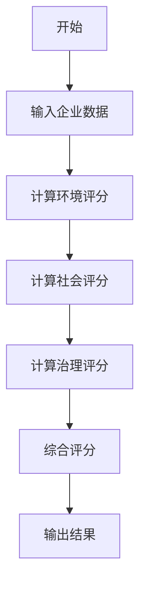
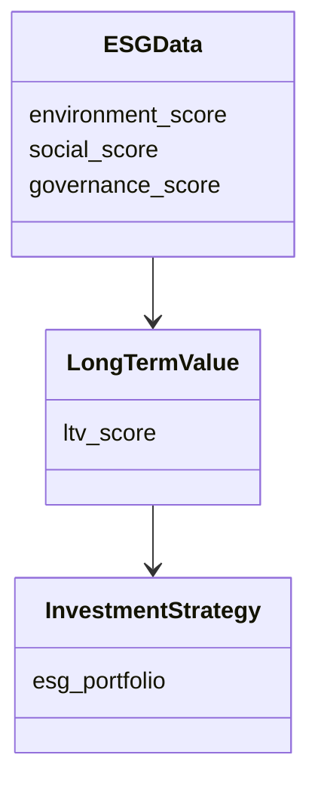
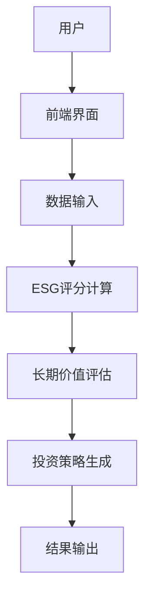

                 


# 彼得林奇的"长期价值"在ESG投资中的体现

## 关键词
- 彼得林奇
- 长期价值投资
- ESG投资
- 环境、社会、治理
- 投资策略

## 摘要
本文探讨了彼得林奇的长期价值投资理念在ESG投资中的体现。通过分析ESG投资的核心框架、长期价值投资的策略，以及两者的结合方式，文章详细阐述了如何将ESG因素整合到长期投资决策中。从理论到实践，文章提供了系统的分析和具体的实现方法，帮助投资者更好地理解和应用这一投资策略。

---

# 第一章: 长期价值投资的定义与核心理念

## 1.1 长期价值投资的定义
### 1.1.1 投资的定义与分类
- 投资：通过购买资产以获得未来收益的行为。
- 分类：包括短期投资和长期投资，长期投资关注资产的长期价值和稳定性。

### 1.1.2 长期价值投资的核心理念
- **长期价值投资**：以企业的内在价值为核心，关注企业的基本面、财务状况和管理能力。
- **彼得林奇的策略**：寻找具有持续竞争优势和良好管理的企业，长期持有，获得稳定收益。

## 1.2 ESG投资的定义与发展
### 1.2.1 ESG投资的定义
- **环境（Environmental）**：关注企业的碳排放、资源利用效率等环境表现。
- **社会（Social）**：关注企业在社会责任、员工福利、社区贡献等方面的表现。
- **治理（Governance）**：关注企业的公司治理结构、董事会效率、透明度等。

### 1.2.2 ESG投资的发展历程
- **背景**：随着环保意识和社会责任的增强，ESG投资逐渐成为主流。
- **现状**：越来越多的投资者将ESG因素纳入投资决策，推动企业可持续发展。

## 1.3 长期价值投资与ESG投资的联系
### 1.3.1 共同点
- 都关注企业的长期表现和可持续性。
- 重视企业的基本面和管理能力。

### 1.3.2 区别
- **目标**：长期价值投资关注企业的内在价值，ESG投资关注企业的外部影响。
- **策略**：长期价值投资注重企业盈利能力，ESG投资注重企业的社会和环境责任。

---

# 第二章: ESG投资框架

## 2.1 ESG投资的框架概述
### 2.1.1 ESG评分体系的建立
- **评分方法**：基于环境、社会和治理三个维度，对企业的ESG表现进行评分。
- **评分标准**：采用量化指标，如碳排放强度、员工满意度、董事会多样性等。

### 2.1.2 ESG投资策略的制定
- **策略类型**：筛选高ESG评分的企业，构建投资组合。
- **风险管理**：通过分散投资降低ESG风险，如避免高碳排放企业。

## 2.2 长期价值投资在ESG中的具体体现
### 2.2.1 环境因素
- **长期价值视角**：关注企业的资源利用效率和环保投入，确保企业的可持续发展。
- **案例分析**：以新能源企业为例，分析其环境表现对长期价值的影响。

### 2.2.2 社会因素
- **长期价值视角**：关注企业的社会责任履行情况，如员工福利、社区贡献。
- **案例分析**：以消费品企业为例，分析其社会责任对品牌价值的影响。

### 2.2.3 治理因素
- **长期价值视角**：关注企业的治理结构和透明度，确保管理效率和决策透明。
- **案例分析**：以科技企业为例，分析其治理结构对长期价值的影响。

---

# 第三章: 算法原理讲解

## 3.1 ESG评分算法
### 3.1.1 算法概述
- **输入**：企业环境、社会、治理指标数据。
- **输出**：企业ESG综合评分。

### 3.1.2 算法流程图


### 3.1.3 代码实现
```python
def calculate_esg_score(environment, social, governance):
    # 环境评分权重为40%，社会评分权重为30%，治理评分权重为30%
    total_score = environment * 0.4 + social * 0.3 + governance * 0.3
    return total_score

# 示例数据
environment = 85  # 环境评分，满分100
social = 75       # 社会评分，满分100
governance = 80   # 治理评分，满分100

score = calculate_esg_score(environment, social, governance)
print(f"ESG综合评分：{score}")
```

## 3.2 长期价值评估模型
### 3.2.1 模型概述
- **模型目标**：评估企业的长期价值，预测未来现金流。
- **公式**：
  $$ \text{长期价值} = \sum_{t=1}^{n} \frac{\text{现金流}_t}{(1 + r)^t} $$
  其中，$r$为折现率，$n$为预测年数。

### 3.2.2 代码实现
```python
def calculate_long_term_value(cash_flows, discount_rate, years):
    ltv = 0
    for t in range(years):
        ltv += cash_flows[t] / (1 + discount_rate) ** (t + 1)
    return ltv

# 示例数据
cash_flows = [100, 120, 150, 180]  # 每年的现金流
discount_rate = 0.08                # 折现率
years = 4                           # 预测年数

ltv = calculate_long_term_value(cash_flows, discount_rate, years)
print(f"长期价值：{ltv}")
```

---

# 第四章: 系统分析与架构设计

## 4.1 项目介绍
### 4.1.1 项目背景
- 开发一个基于ESG投资的长期价值评估系统。

## 4.2 系统功能设计
### 4.2.1 领域模型


### 4.2.2 系统架构设计


## 4.3 接口设计
- **输入接口**：接收企业ESG数据。
- **输出接口**：输出ESG评分和长期价值评估结果。

---

# 第五章: 项目实战

## 5.1 环境安装
```bash
pip install numpy pandas matplotlib
```

## 5.2 核心代码实现
```python
import pandas as pd

def main():
    # 示例数据
    data = {
        '公司': ['A', 'B', 'C'],
        '环境': [85, 70, 90],
        '社会': [75, 85, 65],
        '治理': [80, 70, 90]
    }
    df = pd.DataFrame(data)
    
    # 计算ESG评分
    df['ESG评分'] = df['环境'] * 0.4 + df['社会'] * 0.3 + df['治理'] * 0.3
    
    # 计算长期价值
    cash_flows = [100, 120, 150, 180]
    discount_rate = 0.08
    ltv = sum(cash_flows[t] / (1 + discount_rate) ** (t + 1) for t in range(4))
    
    print("ESG评分结果：")
    print(df[['公司', 'ESG评分']])
    print(f"\n长期价值：{ltv}")

if __name__ == "__main__":
    main()
```

---

# 第六章: 最佳实践

## 6.1 小结
- 彼得林奇的长期价值投资理念与ESG投资密切相关。
- 通过量化ESG评分和长期价值评估，投资者可以更科学地进行投资决策。

## 6.2 注意事项
- 数据来源和准确性是关键。
- 模型需定期更新和调整。

## 6.3 拓展阅读
- 推荐阅读《彼得林奇的成功投资》和《ESG投资指南》。

---

# 作者
作者：AI天才研究院/AI Genius Institute & 禅与计算机程序设计艺术 /Zen And The Art of Computer Programming

