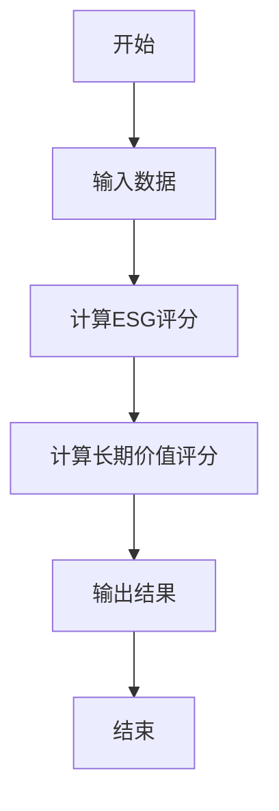
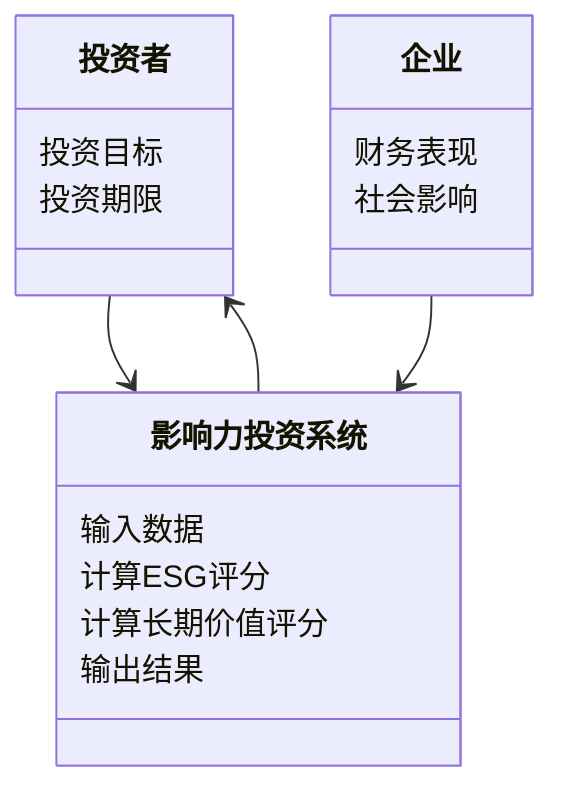
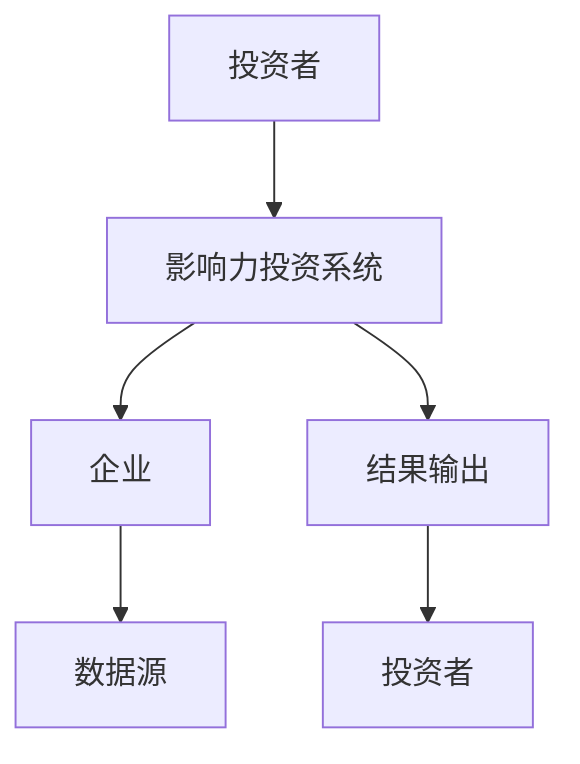
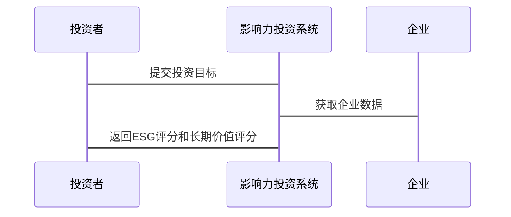

                 


# 彼得林奇的"长期价值"在影响力投资中的新定义与衡量

## 关键词： 影响力投资， 彼得林奇， 长期价值， ESG， 可持续投资

## 摘要： 本文探讨了彼得·林奇的长期价值理念在影响力投资中的新定义与衡量方法。通过分析影响力投资的核心概念、算法原理、系统架构设计及实际案例，本文详细阐述了如何将长期价值与影响力投资相结合，为投资者提供了新的视角和实践指南。

---

# 第1章: 影响力投资的背景与概念

## 1.1 影响力投资的起源与发展

### 1.1.1 影响力投资的定义与核心理念
影响力投资是一种将社会和环境影响力作为核心考量的投资策略，旨在通过投资实现财务回报和社会价值的双重目标。其核心理念包括：
- **社会价值**：关注投资对社会的积极影响，如教育、医疗、环保等领域。
- **财务回报**：追求与传统投资相当或更高的回报。
- **可持续性**：注重投资的长期可持续性，而非短期收益。

### 1.1.2 影响力投资与传统投资的差异
传统投资主要关注财务回报，而影响力投资则将社会和环境因素纳入决策过程。两者的差异体现在以下几个方面：
- **目标**：传统投资以财务回报为核心，影响力投资兼顾社会价值。
- **风险评估**：传统投资注重财务风险，影响力投资还需考虑社会和环境风险。
- **衡量标准**：传统投资以收益和风险指标为主，影响力投资引入ESG（环境、社会、治理）等指标。

### 1.1.3 影响力投资的全球发展趋势
近年来，影响力投资在全球范围内迅速发展，主要得益于以下因素：
- **全球关注可持续发展**：联合国可持续发展目标（SDGs）为影响力投资提供了方向。
- **投资者意识提升**：越来越多的投资者意识到社会责任的重要性。
- **政策支持**：各国政府和国际组织出台相关政策支持影响力投资。

## 1.2 彼得林奇的长期价值理念

### 1.2.1 彼得林奇投资哲学的核心思想
彼得·林奇是全球著名投资专家，其长期价值理念强调：
- **基本面分析**：关注企业的财务状况、管理团队和行业地位。
- **长期持有**：避免短期波动，长期持有优质资产。
- **价值投资**：寻找被市场低估的企业进行投资。

### 1.2.2 长期价值在传统投资中的应用
在传统投资中，长期价值理念帮助投资者识别具有持续增长潜力的企业，注重企业的核心竞争力和管理能力。

### 1.2.3 长期价值与影响力投资的结合
影响力投资将长期价值理念与社会价值相结合，强调企业在实现财务回报的同时，对社会和环境产生积极影响。

## 1.3 影响力投资的衡量标准

### 1.3.1 ESG（环境、社会、治理）指标
ESG指标是影响力投资的重要衡量工具，包括：
- **环境（E）**：企业的环保表现，如碳排放、能源使用等。
- **社会（S）**：企业对社会的贡献，如社会责任、员工福利等。
- **治理（G）**：企业的治理结构和透明度。

### 1.3.2 其他影响力评估指标
除了ESG，影响力投资还涉及其他指标，如：
- **影响力投资评级**：对企业的社会影响力进行评级。
- **可持续发展报告**：企业发布的可持续发展报告，展示其社会和环境表现。

### 1.3.3 影响力投资的评级体系
影响力投资的评级体系包括多种指标和方法，如：
- **联合国可持续发展目标（SDGs）**：将投资与SDGs对齐。
- **第三方评级机构**：如MSCI、晨星等机构提供ESG评级。

---

# 第2章: 影响力投资的核心概念与联系

## 2.1 长期价值与影响力投资的关系

### 2.1.1 长期价值在影响力投资中的新定义
在影响力投资中，长期价值被重新定义为：企业在实现财务回报的同时，对社会和环境产生可持续的积极影响。

### 2.1.2 影响力投资对长期价值的重新诠释
影响力投资强调企业不仅要创造经济价值，还要创造社会价值，这使得长期价值的内涵更加丰富。

### 2.1.3 长期价值与影响力投资的协同效应
长期价值理念与影响力投资的结合，使得投资者能够在追求财务回报的同时，实现社会价值，从而实现双重目标。

## 2.2 核心概念的属性对比

### 2.2.1 影响力投资的核心属性
- **社会价值**：投资对社会的积极影响。
- **财务回报**：投资的财务收益。
- **可持续性**：投资的长期可持续性。

### 2.2.2 长期价值的核心属性
- **财务稳定性**：企业的财务健康状况。
- **管理能力**：企业的管理团队和能力。
- **行业地位**：企业在行业中的地位和竞争力。

### 2.2.3 两者属性的对比分析
通过对比分析，可以看出影响力投资与长期价值理念在核心属性上的异同，从而更好地理解两者的关系。

## 2.3 ER实体关系图架构

### 2.3.1 实体关系图的构建
通过ER图，我们可以清晰地展示影响力投资和长期价值理念之间的关系。

```mermaid
erDiagram
    actor 投资者 {
        <属性> 投资目标
        <属性> 投资期限
    }
    actor 企业 {
        <属性> 财务表现
        <属性> 社会影响
    }
    relation 投资关系 {
        <关联> 投资者 -> 企业
        <关联> 企业 -> 投资者
    }
```

### 2.3.2 实体关系图的分析
通过ER图，我们可以更好地理解影响力投资和长期价值理念之间的关系。

### 2.3.3 实体关系图对影响力投资的启示
ER图展示了影响力投资和长期价值理念之间的关系，为投资者提供了清晰的分析框架。

---

# 第3章: 影响力投资的算法原理

## 3.1 影响力投资评估模型

### 3.1.1 模型的构建与原理
影响力投资评估模型基于长期价值理念，结合ESG指标，构建了一个综合评估体系。

### 3.1.2 模型的输入与输出
- **输入**：企业的财务数据、社会影响数据、治理数据。
- **输出**：企业的长期价值评分、影响力投资评级。

### 3.1.3 模型的优缺点分析
- **优点**：综合考虑了财务和非财务因素，能够全面评估企业的长期价值。
- **缺点**：模型的复杂性较高，需要大量数据支持。

## 3.2 算法流程图

### 3.2.1 算法流程图的绘制


### 3.2.2 算法流程图的解读
通过流程图，我们可以清晰地了解算法的执行步骤。

### 3.2.3 算法流程图的应用场景
算法流程图可以应用于影响力投资的评估和决策过程中。

## 3.3 算法实现

### 3.3.1 Python源代码实现
```python
def calculate_esg(company_data):
    # 计算ESG评分
    esg_score = company_data['环境'] * 0.4 + company_data['社会'] * 0.3 + company_data['治理'] * 0.3
    return esg_score

def calculate_long_term_value(esg_score, financial_data):
    # 计算长期价值评分
    ltv_score = esg_score * 0.5 + financial_data['ROE'] * 0.3 + financial_data['增长率'] * 0.2
    return ltv_score

# 示例数据
company_data = {
    '环境': 0.8,
    '社会': 0.7,
    '治理': 0.9
}
financial_data = {
    'ROE': 15,
    '增长率': 10
}

# 计算评分
esg = calculate_esg(company_data)
ltv = calculate_long_term_value(esg, financial_data)
print(f"ESG评分：{esg}")
print(f"长期价值评分：{ltv}")
```

### 3.3.2 代码的功能解读
代码实现了ESG评分和长期价值评分的计算，其中ESG评分基于环境、社会和治理三个维度，长期价值评分综合考虑了ESG评分和企业的财务表现。

### 3.3.3 代码的优化与改进
- **优化**：增加更多维度的考虑，如创新能力和员工满意度。
- **改进**：引入动态调整系数，根据市场变化自动调整权重。

## 3.4 数学模型与公式

### 3.4.1 影响力投资的数学模型
$$ \text{长期价值评分} = \alpha \times \text{ESG评分} + \beta \times \text{财务表现} $$

### 3.4.2 公式解读
- $\alpha$ 和 $\beta$ 是权重系数，表示ESG评分和财务表现对长期价值评分的影响程度。

---

# 第4章: 影响力投资的系统架构设计

## 4.1 系统功能设计

### 4.1.1 领域模型


### 4.1.2 系统架构设计


### 4.1.3 接口设计
- **输入接口**：接受投资者的投资目标和企业数据。
- **输出接口**：输出ESG评分和长期价值评分。

### 4.1.4 交互序列图


---

# 第5章: 项目实战

## 5.1 环境安装

### 5.1.1 安装Python
```bash
python --version
pip install mermaid
```

## 5.2 系统核心实现源代码

### 5.2.1 代码实现
```python
def calculate_esg(company_data):
    return company_data['环境'] * 0.4 + company_data['社会'] * 0.3 + company_data['治理'] * 0.3

def calculate_long_term_value(esg_score, financial_data):
    return esg_score * 0.5 + financial_data['ROE'] * 0.3 + financial_data['增长率'] * 0.2

# 示例数据
company_data = {
    '环境': 0.8,
    '社会': 0.7,
    '治理': 0.9
}
financial_data = {
    'ROE': 15,
    '增长率': 10
}

# 计算评分
esg = calculate_esg(company_data)
ltv = calculate_long_term_value(esg, financial_data)
print(f"ESG评分：{esg}")
print(f"长期价值评分：{ltv}")
```

### 5.2.2 代码功能解读
代码实现了ESG评分和长期价值评分的计算，其中ESG评分基于环境、社会和治理三个维度，长期价值评分综合考虑了ESG评分和企业的财务表现。

## 5.3 实际案例分析

### 5.3.1 案例背景
某企业投资于一家环保科技公司，希望通过影响力投资实现财务回报和社会价值的双重目标。

### 5.3.2 数据收集与处理
收集该公司的环境、社会和治理数据，以及财务数据。

### 5.3.3 评分计算
计算该公司的ESG评分和长期价值评分，评估其作为投资对象的潜力。

### 5.3.4 分析结果
根据评分结果，决定是否进行投资。

---

# 第6章: 最佳实践与总结

## 6.1 最佳实践

### 6.1.1 投资者
- **关注ESG指标**：在选择投资标的时，优先考虑ESG评分高的企业。
- **长期持有**：避免短期波动，长期持有优质资产。

### 6.1.2 企业
- **提升ESG表现**：优化企业的环境、社会和治理表现，提高长期价值评分。
- **透明披露**：定期发布可持续发展报告，增强投资者信任。

## 6.2 小结
影响力投资通过将长期价值理念与社会价值相结合，为投资者提供了新的投资视角和实践路径。

## 6.3 注意事项
- **数据质量**：确保数据的准确性和完整性。
- **模型优化**：根据市场变化动态调整模型参数。

## 6.4 拓展阅读
- 《影响力投资：创造社会价值的新模式》
- 《彼得·林奇的投资哲学》

---

# 作者：AI天才研究院/AI Genius Institute & 禅与计算机程序设计艺术 /Zen And The Art of Computer Programming

---

以上是《彼得林奇的"长期价值"在影响力投资中的新定义与衡量》的技术博客文章大纲，涵盖了影响力投资的核心概念、算法原理、系统架构设计及实际案例分析，为投资者提供了新的视角和实践指南。

