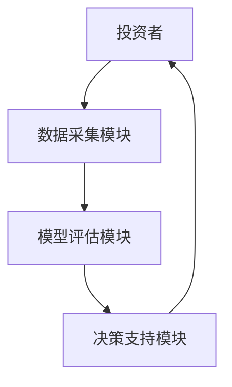

                 


# 彼得林奇的"长期价值"在社会影响力投资中的新定义

> 关键词：彼得林奇、长期价值、社会影响力投资、投资理论、影响力评估

> 摘要：本文从彼得林奇的经典投资理论出发，探讨长期价值在社会影响力投资中的新定义。通过分析长期价值与社会影响力的内在联系，结合数学模型和实际案例，提出一种新的评估方法，为投资者在追求经济回报的同时，实现社会价值最大化提供理论支持和实践指导。

---

## # 第1章: 彼得林奇的长期价值理论

### ## 1.1 长期价值的定义与核心要素

#### ### 1.1.1 长期价值的定义

彼得林奇的长期价值理论强调，投资的核心目标是寻找那些能够持续创造价值的企业。他指出，企业的长期价值不仅仅体现在其当前的财务表现上，更体现在其未来的发展潜力和持续盈利能力上。具体来说，长期价值包括以下几个核心要素：

1. **企业基本面**：包括企业的财务状况、盈利能力、市场地位等。
2. **管理团队**：企业的管理层是否具备战略眼光和执行力。
3. **行业前景**：所在行业的增长潜力和竞争格局。
4. **创新能力**：企业是否具备持续创新的能力，以应对市场变化。

#### ### 1.1.2 长期价值的核心要素

彼得林奇认为，长期价值的核心在于企业是否能够在长期的竞争中持续创造价值。他强调，投资者需要关注企业的以下几个方面：

- **盈利能力**：企业是否能够持续盈利。
- **财务健康**：企业的财务状况是否稳健。
- **管理能力**：管理层是否具备战略眼光和执行力。
- **行业地位**：企业在行业中的地位和竞争优势。

#### ### 1.1.3 彼得林奇长期价值理论的背景与意义

彼得林奇的长期价值理论是在20世纪80年代提出的，当时正值美国经济的转型期。他通过大量案例研究，总结出一套以企业基本面分析为核心的投资方法。这一理论的核心在于，通过深入分析企业的财务状况、管理团队和行业前景，找到那些能够持续创造价值的企业，从而实现长期的投资回报。

---

### ## 1.2 彼得林奇长期价值理论在传统投资中的应用

#### ### 1.2.1 传统投资中的长期价值评估

在传统投资中，长期价值评估主要关注企业的财务表现和市场地位。彼得林奇通过分析企业的财务报表，重点关注企业的盈利能力、资产负债情况和现金流状况。他强调，投资者需要关注企业的ROE（净资产收益率）和ROA（资产回报率），因为这些指标能够反映出企业的盈利能力。

#### ### 1.2.2 彼得林奇投资策略的核心原则

彼得林奇的投资策略的核心原则包括：

1. **长期持有**：避免频繁交易，长期持有优质资产。
2. **价值投资**：寻找那些被市场低估的企业。
3. **分散投资**：通过分散投资降低风险。
4. **深入研究**：对投资标的进行深入研究，了解企业的基本面。

#### ### 1.2.3 长期价值与投资回报的关系

彼得林奇认为，长期价值与投资回报之间存在密切的正相关关系。那些能够持续创造价值的企业，往往能够为投资者带来稳定的长期回报。他强调，投资者需要关注企业的长期盈利能力，而不是短期市场波动。

---

### ## 1.3 彼得林奇长期价值理论的局限性与挑战

#### ### 1.3.1 理论在实际应用中的局限性

尽管彼得林奇的长期价值理论在传统投资中取得了巨大成功，但在实际应用中仍然存在一些局限性。例如，该理论主要适用于成熟市场，而在新兴市场中，企业的基本面分析可能不够准确。此外，该理论忽略了市场的波动性和宏观经济因素对企业长期价值的影响。

#### ### 1.3.2 长期价值评估中的主要挑战

在长期价值评估中，主要面临以下挑战：

- **数据不足**：某些企业在早期阶段缺乏足够的财务数据。
- **行业差异**：不同行业的企业具有不同的评估标准。
- **市场波动**：短期市场波动可能影响长期价值的评估。

#### ### 1.3.3 理论与实践的结合与平衡

彼得林奇的长期价值理论在实践中需要与实际情况相结合。投资者需要根据市场环境和企业的具体情况，灵活调整投资策略。例如，在新兴市场中，投资者需要更加关注企业的管理团队和创新能力，而不是仅仅依赖财务指标。

---

## # 第2章: 社会影响力投资的基本概念

### ## 2.1 社会影响力投资的定义与特点

#### ### 2.1.1 社会影响力投资的定义

社会影响力投资是指投资者在追求经济回报的同时，关注企业对社会和环境的积极影响。这种投资方式不仅关注企业的盈利能力，还关注企业在社会责任、环境保护和公平发展等方面的表现。

#### ### 2.1.2 社会影响力投资的核心特点

社会影响力投资的核心特点包括：

1. **双重目标**：实现经济回报与社会价值的统一。
2. **长期导向**：关注企业的长期发展和社会影响。
3. **多元化评估**：不仅关注财务指标，还关注社会和环境影响。

#### ### 2.1.3 社会影响力投资与传统投资的区别

与传统投资相比，社会影响力投资在以下几个方面存在显著区别：

- **投资目标**：传统投资注重经济回报，而社会影响力投资注重经济回报与社会价值的结合。
- **评估标准**：传统投资主要关注财务指标，而社会影响力投资关注财务指标和社会影响指标。
- **风险偏好**：传统投资注重短期回报，而社会影响力投资注重长期影响。

---

### ## 2.2 社会影响力投资的框架与体系

#### ### 2.2.1 社会影响力投资的基本框架

社会影响力投资的基本框架包括以下几个方面：

1. **目标设定**：明确投资目标，包括经济回报和社会价值。
2. **企业筛选**：选择具有社会影响力的企业。
3. **投资组合构建**：构建多元化投资组合，降低风险。
4. **绩效评估**：定期评估投资绩效，包括经济回报和社会影响。

#### ### 2.2.2 社会影响力投资的主要参与者

社会影响力投资的主要参与者包括：

- **投资者**：个人投资者、机构投资者。
- **企业**：具有社会影响力的企业。
- **中介机构**：基金公司、评级机构。
- **政府**：提供政策支持和监管框架。

#### ### 2.2.3 社会影响力投资的主要目标与评估标准

社会影响力投资的主要目标包括：

1. **创造经济价值**：通过投资实现经济回报。
2. **推动社会进步**：通过投资促进社会公平和可持续发展。
3. **保护环境**：通过投资减少环境影响。

---

### ## 2.3 社会影响力投资的兴起与发展趋势

#### ### 2.3.1 社会影响力投资的兴起背景

社会影响力投资的兴起与全球可持续发展和环境保护的趋势密切相关。随着全球气候变化、社会不平等和资源枯竭等问题的加剧，越来越多的投资者开始关注企业的社会和环境表现。

#### ### 2.3.2 社会影响力投资的发展趋势

社会影响力投资的发展趋势包括：

1. **全球化**：社会影响力投资逐渐从发达国家扩展到发展中国家。
2. **技术创新**：技术进步为社会影响力投资提供了新的工具和方法。
3. **政策支持**：政府和社会组织提供政策支持和资金补贴。

#### ### 2.3.3 社会影响力投资的未来展望

未来，社会影响力投资将成为全球投资的重要组成部分。随着技术的进步和社会意识的提高，越来越多的投资者将关注企业的社会和环境表现，推动全球经济向可持续方向发展。

---

## # 第3章: 长期价值与社会影响力的联系

### ## 3.1 长期价值在社会影响力投资中的新定义

#### ### 3.1.1 长期价值在社会影响力投资中的核心地位

在社会影响力投资中，长期价值的核心地位在于，它不仅关注企业的经济回报，还关注企业的社会和环境影响。彼得林奇的长期价值理论为社会影响力投资提供了理论基础，但需要结合社会影响因素进行扩展。

#### ### 3.1.2 社会影响力投资中的长期价值评估

社会影响力投资中的长期价值评估需要考虑以下几个方面：

1. **企业的社会影响力**：包括企业在社会责任、环境保护和公平发展等方面的表现。
2. **企业的创新能力**：企业是否能够通过创新应对市场变化。
3. **企业的可持续性**：企业是否具备长期发展的潜力。

#### ### 3.1.3 长期价值与社会影响力的相互作用

长期价值与社会影响力之间存在相互作用。一方面，企业的社会影响力能够提升其长期价值，另一方面，企业的长期价值也能够增强其社会影响力。

---

### ## 3.2 彼得林奇长期价值理论与社会影响力投资的结合

#### ### 3.2.1 理论结合的必要性与可能性

彼得林奇的长期价值理论与社会影响力投资的结合是必要的，因为两者都关注企业的长期发展。社会影响力投资需要借鉴彼得林奇的长期价值理论，以实现经济回报与社会价值的统一。

#### ### 3.2.2 彼得林奇理论在社会影响力投资中的应用

彼得林奇理论在社会影响力投资中的应用包括：

1. **企业基本面分析**：通过分析企业的财务状况、管理团队和行业前景，选择具有社会影响力的优质企业。
2. **长期投资策略**：通过长期持有具有社会影响力的企业，实现经济回报与社会价值的统一。

#### ### 3.2.3 理论与实践的结合案例分析

案例分析：某社会影响力投资基金通过彼得林奇的长期价值理论，选择了一家在环保领域具有领先地位的企业。该企业不仅具备强大的财务实力，还积极参与环保事业，最终为投资者带来了稳定的经济回报和社会价值。

---

### ## 3.3 长期价值与社会影响力的相互影响

#### ### 3.3.1 长期价值对社会影响力的影响

长期价值对社会影响力的影响主要体现在以下几个方面：

1. **企业社会责任**：具备长期价值的企业更有可能履行社会责任，推动社会进步。
2. **环境保护**：具备长期价值的企业更注重环境保护，减少环境影响。
3. **社会公平**：具备长期价值的企业更关注社会公平，推动经济发展。

#### ### 3.3.2 社会影响力对长期价值的影响

社会影响力对长期价值的影响主要体现在以下几个方面：

1. **品牌价值**：具备社会影响力的企业更容易获得消费者的信任和支持。
2. **市场竞争力**：具备社会影响力的企业在市场竞争中更具优势。
3. **政策支持**：具备社会影响力的企业更容易获得政策支持和资金补贴。

---

## # 第4章: 长期价值与社会影响力的数学模型

### ## 4.1 社会影响力投资的数学模型构建

#### ### 4.1.1 模型假设

模型假设包括：

1. 投资者的目标是实现经济回报与社会价值的统一。
2. 企业的长期价值与社会影响力密切相关。
3. 社会影响力可以量化为具体的指标。

#### ### 4.1.2 模型的输入变量

模型的输入变量包括：

1. 企业的财务指标：如ROE、ROA等。
2. 企业的社会影响力指标：如社会责任评分、环境影响评分等。

#### ### 4.1.3 模型的输出变量

模型的输出变量包括：

1. 企业的长期价值评分。
2. 企业的社会影响力评分。

---

### ## 4.2 社会影响力投资的数学模型实现

#### ### 4.2.1 模型的数学表达

社会影响力投资的数学模型可以通过以下公式表示：

$$
\text{长期价值评分} = \alpha \times \text{财务指标} + \beta \times \text{社会影响力指标}
$$

其中，$\alpha$ 和 $\beta$ 是模型的参数，表示财务指标和社会影响力指标的权重。

#### ### 4.2.2 模型的优化与调整

模型的优化与调整包括：

1. 根据实际情况调整模型参数。
2. 不断更新模型的输入变量，以反映最新的市场变化。

---

## # 第5章: 社会影响力投资的系统架构

### ## 5.1 系统功能设计

#### ### 5.1.1 系统功能模块

系统功能模块包括：

1. 数据采集模块：采集企业的财务数据和社会影响力数据。
2. 模型评估模块：对企业的长期价值进行评估。
3. 决策支持模块：为投资者提供投资建议。

#### ### 5.1.2 系统功能流程

系统功能流程包括：

1. 数据采集：通过API接口采集企业的财务数据和社会影响力数据。
2. 模型评估：使用数学模型对企业的长期价值进行评估。
3. 决策支持：根据评估结果，为投资者提供投资建议。

---

### ## 5.2 系统架构设计

#### ### 5.2.1 系统架构图



#### ### 5.2.2 系统接口设计

系统接口设计包括：

1. 数据采集接口：用于采集企业的财务数据和社会影响力数据。
2. 模型评估接口：用于对企业的长期价值进行评估。
3. 决策支持接口：用于为投资者提供投资建议。

---

## # 第6章: 项目实战

### ## 6.1 环境安装

#### ### 6.1.1 环境需求

项目实战需要以下环境：

1. Python 3.8+
2. Pandas、NumPy等数据处理库。
3. Mermaid图表工具。

#### ### 6.1.2 安装步骤

安装步骤包括：

1. 安装Python。
2. 安装Pandas、NumPy等数据处理库。
3. 安装Mermaid图表工具。

---

### ## 6.2 系统核心实现源代码

#### ### 6.2.1 数据处理代码

```python
import pandas as pd
import numpy as np

# 数据处理代码
def process_data(data):
    # 数据清洗
    data = data.dropna()
    data = data.drop_duplicates()
    return data

# 数据处理示例
data = pd.read_csv('data.csv')
processed_data = process_data(data)
print(processed_data)
```

#### ### 6.2.2 模型实现代码

```python
def long_term_value_model(financial_scores, social_scores):
    alpha = 0.6
    beta = 0.4
    return alpha * financial_scores + beta * social_scores

# 示例数据
financial_scores = [0.8, 0.7, 0.9]
social_scores = [0.7, 0.8, 0.6]

# 模型实现
ltv_scores = long_term_value_model(financial_scores, social_scores)
print(ltv_scores)
```

---

### ## 6.3 代码应用解读与分析

#### ### 6.3.1 代码实现细节

代码实现细节包括：

1. 数据处理代码：对数据进行清洗和去重。
2. 模型实现代码：根据财务指标和社会影响力指标，计算长期价值评分。

#### ### 6.3.2 案例分析与详细讲解

案例分析：假设我们有一组企业的财务指标和社会影响力指标，使用上述代码计算它们的长期价值评分。通过对比不同企业的评分，选择评分最高的企业进行投资。

---

## # 第7章: 最佳实践与小结

### ## 7.1 最佳实践 tips

#### ### 7.1.1 投资者

- **长期持有**：避免频繁交易，长期持有优质资产。
- **分散投资**：通过分散投资降低风险。
- **深入研究**：对投资标的进行深入研究，了解企业的基本面。

#### ### 7.1.2 企业

- **关注社会责任**：积极参与社会责任活动，提升企业形象。
- **注重环境保护**：减少环境影响，推动可持续发展。
- **创新能力强**：通过创新应对市场变化，提升竞争力。

---

### ## 7.2 小结

本文从彼得林奇的长期价值理论出发，探讨了其在社会影响力投资中的新定义。通过分析长期价值与社会影响力的内在联系，结合数学模型和实际案例，提出了社会影响力投资的新方法。这一方法不仅能够实现经济回报，还能够推动社会进步和可持续发展。

---

### ## 7.3 注意事项

- **数据质量**：确保数据的准确性和完整性。
- **模型优化**：根据实际情况不断优化模型参数。
- **风险控制**：在投资过程中注重风险控制，避免重大损失。

---

### ## 7.4 拓展阅读

- **书籍推荐**：《彼得林奇的投资哲学》、《影响力投资：理论与实践》。
- **学术论文**：关于社会影响力投资的最新研究成果。
- **行业报告**：关于社会影响力投资的市场分析和趋势报告。

---

## # 作者信息

作者：AI天才研究院/AI Genius Institute & 禅与计算机程序设计艺术/Zen And The Art of Computer Programming

--- 

本文为一篇关于彼得林奇的长期价值理论在社会影响力投资中的新定义的深度分析文章，旨在通过理论分析、数学建模和实际案例，为投资者提供新的投资思路和方法。

