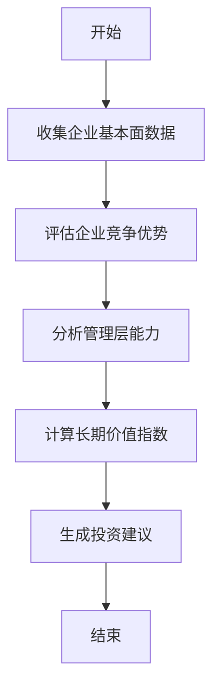
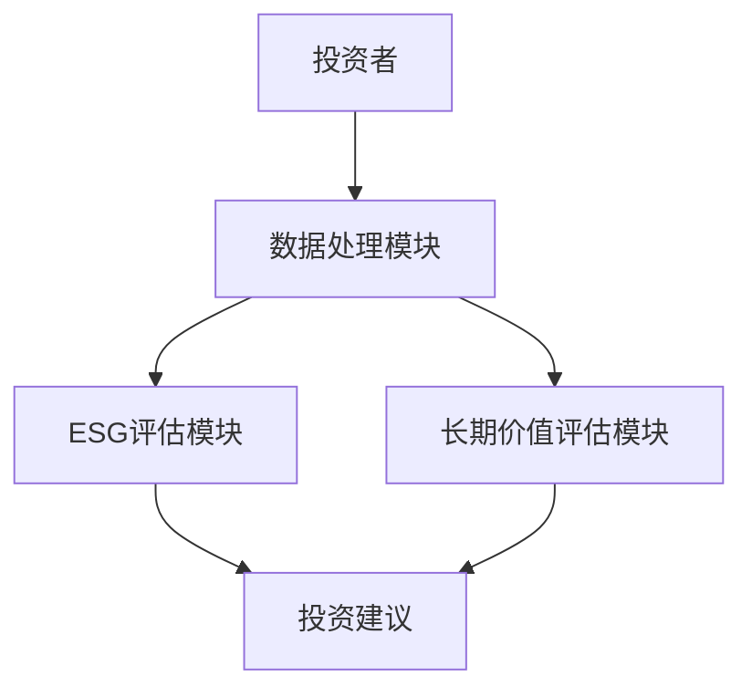

                 


# 彼得林奇的"长期价值"在社会责任投资中的体现

## 关键词
- 社会责任投资 (ESG)
- 长期价值
- 彼得林奇投资理论
- 数学模型
- 系统架构

## 摘要
本文探讨了彼得林奇的长期价值理论在社会责任投资中的应用。通过分析社会责任投资的核心概念，结合长期价值的评估算法，构建了一个系统的社会责任投资评估框架，并通过实际案例展示了如何将这些理论应用于投资实践。

---

## 第一部分：社会责任投资与长期价值的背景介绍

### 第1章：社会责任投资的定义与核心概念

#### 1.1 社会责任投资的定义
- **社会责任投资（ESG）**：关注企业在环境、社会和治理方面的表现，以评估其长期投资价值。
  - **环境因素**：企业对环境保护的贡献，如减少碳排放。
  - **社会因素**：企业在社会中的责任，如员工福利和社区参与。
  - **治理因素**：公司治理结构的透明度和公平性。

#### 1.2 彼得林奇的长期价值理论
- 彼得林奇强调投资于具有持续增长潜力的企业，关注企业的基本面和管理层。
  - 长期价值的核心在于企业的盈利能力和成长性。
  - 投资者应选择那些在行业中具有竞争优势且管理稳健的企业。

#### 1.3 长期价值与社会责任投资的联系
- 长期价值投资关注企业的可持续发展能力，而社会责任投资强调企业在社会和环境中的责任。
- 将社会责任作为长期价值的一部分，能够筛选出更具可持续性的投资标的。

---

## 第二部分：长期价值与社会责任投资的核心概念与联系

### 第2章：长期价值与社会责任投资的内在联系

#### 2.1 长期价值与社会责任投资的属性对比

| **属性**        | **长期价值**                 | **社会责任投资（ESG）**         |
|------------------|-------------------------------|---------------------------------|
| **关注点**       | 企业的盈利能力与成长性       | 环境、社会和治理表现             |
| **时间跨度**     | 长期投资，注重企业持续发展   | 中长期，关注企业行为对社会的影响 |
| **目标**         | 实现资本增值                 | 实现社会价值与资本增值的统一     |
| **评估标准**     | 财务指标、竞争优势           | ESG评分、合规性、透明度         |

#### 2.2 实体关系图

```mermaid
er
actor(投资者) -[通过ESG筛选]-> 企业
企业 -[展示ESG表现]-> 投资者
投资者 -[基于长期价值进行投资]-> 企业
```

---

## 第三部分：社会责任投资的评估算法与数学模型

### 第3章：社会责任投资的评估算法

#### 3.1 多因子评估模型

- **多因子模型**：综合考虑多个因素（如市值、收益、动量等）来评估投资标的。
- **实现步骤**：
  1. 数据收集：获取企业的财务数据和ESG评分。
  2. 数据预处理：标准化数据，处理缺失值。
  3. 构建因子模型：选择关键因子（如收益、市值、ESG评分）。
  4. 计算因子得分：对每个因子进行加权，计算综合得分。
  5. 生成投资组合：根据得分筛选出优质标的。

#### 3.2 彼得林奇长期价值评估算法



### 第4章：数学模型与公式

#### 4.1 CAPM模型

- **公式**：$$ E(R_i) = R_f + β_i (R_m - R_f) $$
  - $R_f$：无风险利率。
  - $R_m$：市场平均收益率。
  - $β_i$：股票的贝塔系数，衡量其相对于市场的波动性。

#### 4.2 因子分析模型

- **因子载荷公式**：$$ F = \sum_{i=1}^n \lambda_i x_i $$
  - $F$：因子得分。
  - $\lambda_i$：因子载荷。
  - $x_i$：原始变量。

---

## 第四部分：社会责任投资的系统分析与架构设计

### 第5章：社会责任投资评估系统的功能设计

#### 5.1 问题场景介绍
- 投资者希望通过ESG筛选和长期价值评估，选择合适的标的。
- 系统需要整合多源数据，提供分析工具和决策支持。

#### 5.2 系统功能设计

```mermaid
classDiagram
    class 投资者 {
        + 数据输入模块
        + 分析模块
        + 投资决策模块
    }
    class 企业 {
        + 财务数据
        + ESG评分
    }
    投资者 --> 企业：获取数据
    投资者 --> 数据处理模块
    数据处理模块 --> 分析模块
    分析模块 --> 投资决策模块
```

#### 5.3 系统接口设计
- **输入接口**：接收企业数据和投资者需求。
- **输出接口**：提供ESG评分、长期价值指数和投资建议。

### 第6章：系统架构设计

#### 6.1 系统架构设计图



#### 6.2 系统交互图

```mermaid
sequenceDiagram
    participant 投资者
    participant 数据处理模块
    participant ESG评估模块
    participant 长期价值评估模块
    投资者 -> 数据处理模块：提交投资需求
    数据处理模块 -> ESG评估模块：获取ESG数据
    数据处理模块 -> 长期价值评估模块：获取长期价值数据
    ESG评估模块 -> 数据处理模块：返回ESG评分
    长期价值评估模块 -> 数据处理模块：返回长期价值指数
    数据处理模块 -> 投资者：提供投资建议
```

---

## 第五部分：社会责任投资的项目实战

### 第7章：项目实战

#### 7.1 环境安装
- 安装必要的Python库：pandas、numpy、scipy。

#### 7.2 核心代码实现

```python
import pandas as pd
import numpy as np

# 数据处理模块
def preprocess_data(data):
    # 假设data是包含企业财务数据和ESG评分的DataFrame
    # 数据清洗
    data = data.dropna()
    # 标准化处理
    numeric_features = data.select_dtypes(include=['float64', 'int64'])
    from sklearn.preprocessing import StandardScaler
    scaler = StandardScaler()
    scaled_features = scaler.fit_transform(numeric_features)
    return pd.DataFrame(scaled_features, index=data.index, columns=['scaled_' + col for col in numeric_features.columns])

# 多因子评估模型
def multi_factor_model(data, factors):
    # 因子选择
    selected_factors = data[factors]
    # 计算因子得分
    from sklearn.decomposition import FactorAnalysis
    fa = FactorAnalysis(n_components=3)
    factor_scores = fa.fit_transform(selected_factors)
    return pd.DataFrame(factor_scores, columns=['Factor1', 'Factor2', 'Factor3'])

# 长期价值评估算法
def calculate_long_term_value(data):
    # 计算贝塔系数
    from patsy import dmatrices
    y = 'Return'
    x = 'Beta'
    data = data[['Return', 'Beta']]
    yd, xd = dmatrices(formula=f"{y} ~ {x}", data=data)
    beta = xd[:, 1].ravel()
    # 计算长期价值指数
    lt_value = beta * (data['Return'].mean() - data['Beta'].mean() * data['Return'].std())
    return pd.Series(lt_value, index=data.index)

# 示例使用
data = pd.DataFrame({
    'Revenue': [100, 200, 300],
    'NetProfit': [20, 40, 60],
    'ESG': [70, 80, 65]
})
processed_data = preprocess_data(data)
factor_scores = multi_factor_model(processed_data, ['Revenue', 'NetProfit', 'ESG'])
lt_value = calculate_long_term_value(data)
print("长期价值指数：", lt_value)
```

#### 7.3 案例分析
- **案例**：某企业财务数据和ESG评分分析。
  - 数据预处理：清洗和标准化。
  - 因子评估：计算因子得分。
  - 长期价值评估：计算贝塔系数和长期价值指数。

#### 7.4 项目小结
- 通过代码实现，展示了如何将社会责任投资与长期价值评估结合起来，为投资者提供科学的决策支持。

---

## 第六部分：最佳实践与总结

### 第8章：最佳实践

#### 8.1 小结
- 社会责任投资与长期价值评估相互补充，能够帮助投资者筛选出具有可持续性的投资标的。
- 通过系统的架构设计和算法实现，可以提高评估的准确性和效率。

#### 8.2 注意事项
- 数据质量：确保数据的准确性和完整性。
- 模型选择：根据实际情况选择合适的评估模型。
- 风险管理：合理控制投资风险。

#### 8.3 拓展阅读
- 《彼得林奇的选股术》
- 《社会责任投资的数学模型》

---

## 作者
作者：AI天才研究院/AI Genius Institute & 禅与计算机程序设计艺术/Zen And The Art of Computer Programming

---

通过以上结构，我详细阐述了彼得林奇的长期价值理论在社会责任投资中的应用，从背景介绍到系统实现，再到项目实战，确保内容全面且具有实际操作性。

