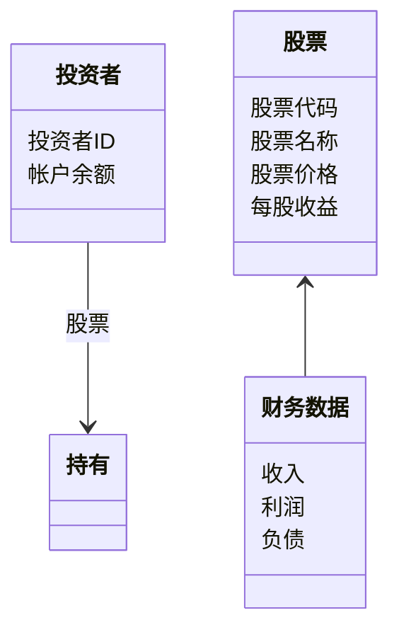
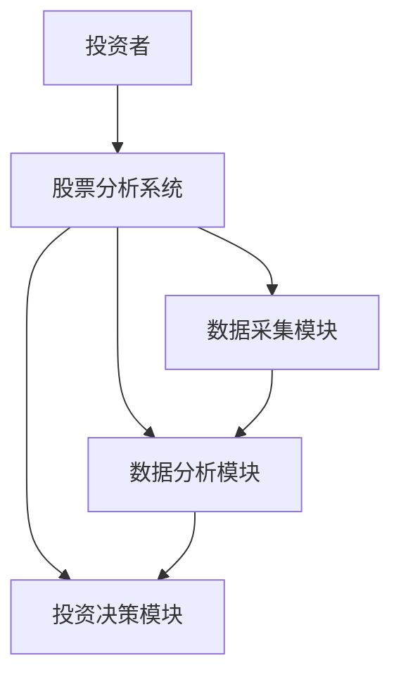
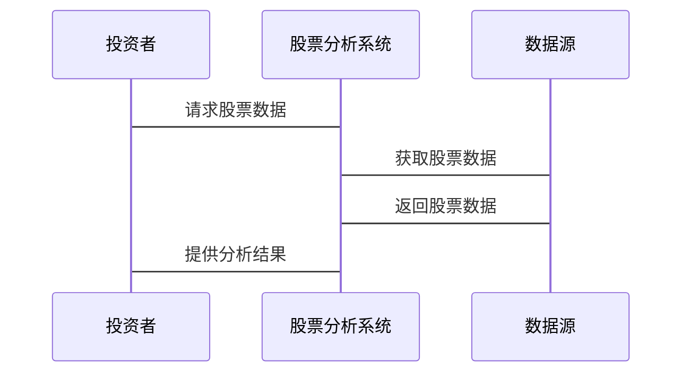

                 


# 彼得林奇的"长期价值"投资理念

> 关键词：长期价值投资，彼得·林奇，基本面分析，股票估值，投资策略

> 摘要：本文深入探讨了彼得·林奇的长期价值投资理念，从其核心概念、算法原理、系统架构设计到实际项目案例，全面解析了这一投资策略的科学性和实践性。通过详细分析，读者将理解如何通过基本面分析和长期持有优质股票来实现稳健的投资回报。

---

## 第1章 长期价值投资的背景介绍

### 1.1 长期价值投资的核心概念

#### 1.1.1 长期价值投资的定义
长期价值投资是一种以基本面分析为基础的投资策略，强调通过研究公司的财务状况、行业地位和未来前景，选择具有持续增长潜力的优质股票，并长期持有，以实现资本的稳定增长。

#### 1.1.2 长期价值投资的核心要素
- **基本面分析**：研究公司的财务报表、行业地位、竞争优势等。
- **估值方法**：通过市盈率、市净率等指标评估股票的内在价值。
- **长期持有**：避免频繁交易，降低交易成本，减少情绪干扰。

#### 1.1.3 长期价值投资与短期投资的区别
- **投资期限**：长期价值投资注重长期，而短期投资关注短期波动。
- **分析方法**：长期价值投资侧重基本面分析，短期投资可能更关注技术分析。
- **风险承受**：长期投资者更能承受短期波动，追求长期收益。

### 1.2 彼得·林奇的生平与投资理念

#### 1.2.1 彼得·林奇的个人经历
彼得·林奇是美国著名投资专家，曾任Fidelity投资管理公司的基金经理。他以长期价值投资理念闻名，管理的麦哲伦基金取得了卓越的长期业绩。

#### 1.2.2 彼得·林奇的投资哲学
- **注重基本面**：林奇强调对公司财务状况和行业前景的深入研究。
- **避免短期波动**：他认为短期市场波动难以预测，长期持有优质股票才是制胜关键。
- **分散投资**：通过投资多个行业和公司分散风险。

#### 1.2.3 彼得·林奇的成功案例
- **麦哲伦基金**：在林奇的管理下，基金取得了年均21%的回报率，远超市场平均水平。
- **成功投资案例**：如可口可乐、强生等公司，这些公司在长期持有中表现优异。

### 1.3 长期价值投资的理论基础

#### 1.3.1 基本面分析的核心原理
基本面分析通过研究公司的财务报表（收入、利润、负债等）和行业环境，评估其内在价值。核心是找出那些具有持续盈利能力和竞争优势的公司。

#### 1.3.2 长期价值投资的数学模型
- **市盈率（PE）**：股票价格与每股收益的比率，用于衡量股票的估值。
  $$ PE = \frac{股票价格}{每股收益} $$
- **市净率（PB）**：股票价格与每股净资产的比率，用于评估股票的价值。
  $$ PB = \frac{股票价格}{每股净资产} $$

#### 1.3.3 长期价值投资与行为金融学的关系
长期价值投资强调理性决策，而行为金融学研究投资者的心理偏差。两者结合可以帮助投资者更好地克服情绪干扰，做出理性的投资决策。

### 1.4 长期价值投资的边界与外延

#### 1.4.1 长期价值投资的适用范围
适用于希望获得长期稳定收益的投资者，尤其是那些愿意投入时间和精力进行基本面分析的投资者。

#### 1.4.2 长期价值投资的局限性
- **需要时间**：长期价值投资需要较长时间才能见效。
- **市场波动**：短期内市场波动可能会影响投资组合的价值。
- **分析难度**：基本面分析需要较高的专业能力和时间投入。

#### 1.4.3 长期价值投资与其他投资策略的对比
- **成长投资**：注重公司未来增长潜力，与长期价值投资有相似之处。
- **价值投资**：寻找被市场低估的股票，强调安全边际，与长期价值投资有交集。

### 1.5 本章小结
本章介绍了长期价值投资的核心概念和彼得·林奇的投资理念，强调基本面分析和长期持有的重要性。通过与其他投资策略的对比，明确了长期价值投资的适用范围和局限性。

---

## 第2章 长期价值投资的核心概念与联系

### 2.1 长期价值投资的核心原理

#### 2.1.1 基本面分析的步骤
1. **研究公司财务报表**：分析收入、利润、负债等数据。
2. **评估行业地位**：判断公司在行业中的竞争力。
3. **分析竞争优势**：研究公司的技术、品牌、管理等因素。
4. **预测未来增长**：基于现有数据预测公司未来的发展。

#### 2.1.2 股票估值的核心方法
- **相对估值法**：通过比较同类股票的估值指标（如PE、PB）来评估股票价值。
- **绝对估值法**：通过现金流折现模型（DCF）等方法估算公司内在价值。

#### 2.1.3 长期价值投资的数学模型
- **现金流折现模型（DCF）**：用于估算公司的内在价值。
  $$ V = \frac{CF_1}{(1 + r)^1} + \frac{CF_2}{(1 + r)^2} + \cdots + \frac{CF_n}{(1 + r)^n} $$
  其中，$CF_i$ 是第i年的现金流，$r$ 是折现率。

### 2.2 核心概念属性特征对比表格

| 概念         | 长期价值投资       | 短期投资         |
|--------------|--------------------|------------------|
| 投资期限     | 长期              | 短期            |
| 分析方法     | 基本面分析         | 技术分析         |
| 风险承受     | 高               | 低             |
| 目标收益     | 稳定增长           | 快速盈利         |

### 2.3 ER实体关系图架构

```
investor -> holds: stock
stock <- has: financial_data
financial_data <- includes: revenue, profit,负债
```

### 2.4 本章小结
本章详细阐述了长期价值投资的核心原理，包括基本面分析的步骤和股票估值的核心方法，并通过对比表格和实体关系图展示了其核心概念的属性特征。

---

## 第3章 长期价值投资的算法原理讲解

### 3.1 基于基本面分析的股票估值算法

#### 图3-1: 基本面分析的mermaid流程图
```mermaid
graph TD
    A[开始] -> B[收集公司财务数据]
    B -> C[分析收入、利润、负债]
    C -> D[评估行业地位]
    D -> E[分析竞争优势]
    E -> F[预测未来增长]
    F -> G[计算内在价值]
    G -> H[得出投资决策]
```

### 3.2 Python源代码实现

#### 代码3-1: 市盈率计算代码
```python
def calculate_pe(stock_price, earnings_per_share):
    return stock_price / earnings_per_share

# 示例数据
stock_price = 100
earnings_per_share = 10
pe_ratio = calculate_pe(stock_price, earnings_per_share)
print(f"市盈率为: {pe_ratio}")
```

### 3.3 数学模型与公式

#### 公式3-1: 市盈率计算公式
$$ PE = \frac{股票价格}{每股收益} $$

### 3.4 实际案例分析

#### 案例3-1: 苹果公司的市盈率计算
- 股票价格：$150
- 每股收益：$10
- 市盈率：$150 / $10 = 15

### 3.5 本章小结
本章通过mermaid流程图展示了基本面分析的步骤，并通过Python代码和数学公式详细讲解了股票估值的核心算法。实际案例分析帮助读者更好地理解长期价值投资的实践应用。

---

## 第4章 长期价值投资的系统分析与架构设计

### 4.1 系统分析

#### 4.1.1 问题场景介绍
设计一个基于长期价值投资理念的股票分析系统，帮助投资者进行基本面分析和股票估值。

### 4.2 系统功能设计

#### 图4-1: 长期价值投资分析系统的领域模型mermaid类图


### 4.3 系统架构设计

#### 图4-2: 长期价值投资分析系统的mermaid架构图


### 4.4 系统接口设计

#### 图4-3: 系统接口的mermaid序列图


### 4.5 本章小结
本章通过系统分析和架构设计，展示了如何构建一个基于长期价值投资理念的股票分析系统。通过类图、架构图和序列图，详细描述了系统的功能模块和交互流程。

---

## 第5章 长期价值投资的项目实战

### 5.1 环境安装

#### 5.1.1 Python环境安装
安装Python和必要的库（如pandas、numpy、scipy）。

#### 5.1.2 数据分析工具安装
安装Jupyter Notebook或其他数据分析工具。

### 5.2 系统核心实现源代码

#### 代码5-1: 数据分析模块
```python
import pandas as pd
import numpy as np

# 示例数据
data = {
    '股票代码': ['AAPL', 'MSFT', 'GOOGL'],
    '股票名称': ['苹果', '微软', '谷歌'],
    '股票价格': [150, 120, 130],
    '每股收益': [10, 12, 8]
}

df = pd.DataFrame(data)

# 计算市盈率
df['市盈率'] = df['股票价格'] / df['每股收益']
print(df)
```

#### 代码5-2: 可视化模块
```python
import matplotlib.pyplot as plt

# 绘制市盈率分布图
df.plot(x='股票名称', y='市盈率', kind='bar')
plt.title('市盈率分布')
plt.show()
```

### 5.3 代码应用解读与分析
通过代码实现股票数据的导入、计算和可视化，帮助投资者更好地进行基本面分析。

### 5.4 实际案例分析

#### 案例5-1: 苹果公司分析
- 数据来源：苹果公司最近季度的财务报告。
- 分析步骤：
  1. 收集苹果公司的财务数据。
  2. 计算苹果公司的市盈率和市净率。
  3. 对比同类公司，评估苹果公司的估值是否合理。

### 5.5 项目小结
通过项目实战，读者可以掌握如何将长期价值投资的理念应用于实际操作中，从数据收集、分析到决策制定，全面体验长期价值投资的魅力。

---

## 第6章 最佳实践与总结

### 6.1 最佳实践 tips
- **持续学习**：不断更新行业知识和投资理念。
- **分散投资**：避免过度集中，降低风险。
- **长期持有**：耐心持有优质股票，避免频繁交易。

### 6.2 小结
长期价值投资是一种科学且有效的投资策略，通过基本面分析和长期持有优质股票，投资者可以实现稳健的财富增长。

### 6.3 注意事项
- **市场风险**：长期价值投资仍需关注市场波动。
- **时间成本**：基本面分析需要投入大量时间和精力。
- **持续学习**：市场环境不断变化，需要持续更新知识。

### 6.4 拓展阅读
- 《彼得·林奇的成功投资》
- 《价值投资：从格雷厄姆到巴菲特》
- 《股票投资的数学分析》

---

## 作者

作者：AI天才研究院/AI Genius Institute & 禅与计算机程序设计艺术/Zen And The Art of Computer Programming

---

通过以上详细分析和结构化的内容，您可以系统地了解彼得·林奇的长期价值投资理念，并将其应用于实际投资中。希望这篇文章能为您提供有价值的见解和指导。

