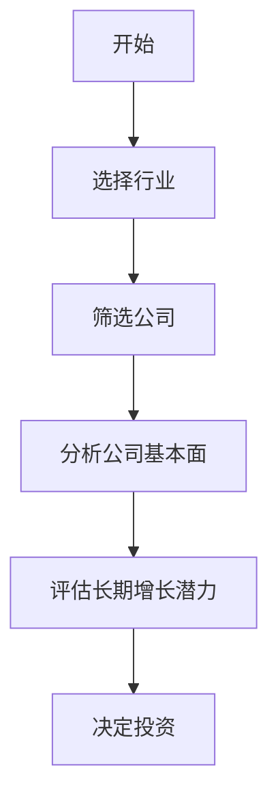
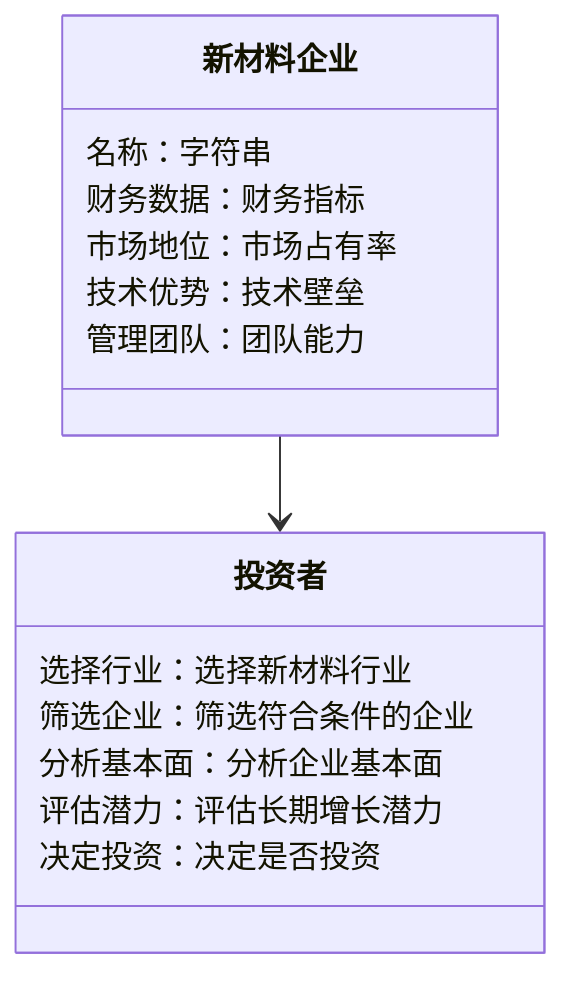
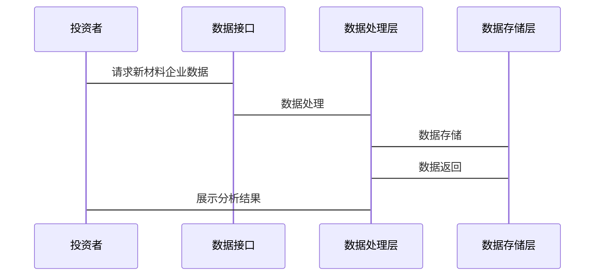

                 


# 彼得林奇的"长期增长"潜力在新材料行业的识别方法

## 关键词：彼得·林奇、长期增长、新材料行业、投资策略、选股标准

## 摘要：本文将深入探讨彼得·林奇的“长期增长”投资理念，并结合新材料行业的特点，系统分析如何识别具有长期增长潜力的新材料企业。文章将从彼得·林奇的投资哲学、选股标准、长期增长潜力的识别方法入手，结合具体的新材料行业案例，提供一套基于彼得·林奇理念的系统化分析方法，帮助投资者在新材料领域中发现具有长期增长潜力的优质企业。

---

# 第一部分: 背景介绍与核心概念

## 第1章: 新材料行业与长期增长潜力概述

### 1.1 新材料行业的定义与特点

新材料是指新出现或通过新工艺制备的材料，具有高技术含量、高附加值和创新性的特点。新材料行业涵盖范围广，包括高性能复合材料、先进陶瓷、新型半导体材料、纳米材料等。其发展受到技术创新、市场需求、政策支持和全球化竞争的多重影响。新材料行业的特点是技术迭代快、研发投入高、市场潜力大，但同时也伴随着较高的风险。

### 1.2 彼得·林奇投资理念的核心要素

彼得·林奇是美国著名投资家，以其长期增长投资策略闻名。他认为，投资成功的前提是选择那些具有持续增长潜力的企业，而不是短期波动的股票。他的选股标准包括以下几个方面：

- **公司基本面**：公司财务健康，盈利能力稳定，具有持续增长的潜力。
- **市场地位**：公司在行业中具有竞争优势，能够长期保持领先地位。
- **管理团队**：管理团队经验丰富，具备战略眼光和执行力。
- **估值合理**：股票估值相对于公司基本面合理，具有长期增值空间。

### 1.3 长期增长潜力在新材料行业的应用前景

新材料行业具有高增长潜力，但也面临着技术替代快、市场竞争激烈等挑战。彼得·林奇的长期增长投资理念为投资者提供了一种系统化的分析框架，帮助识别那些具有持续增长潜力的新材料企业。通过分析公司的财务数据、市场地位、管理团队和竞争优势，投资者可以更好地判断一家公司是否具有长期增长潜力。

---

## 第2章: 彼得·林奇选股标准的详细分析

### 2.1 彼得·林奇选股标准的核心要素

彼得·林奇选股标准的核心在于公司基本面分析。他认为，只有基本面良好的公司才能实现长期增长。以下是彼得·林奇选股标准的核心要素：

- **盈利能力**：公司必须具有稳定的盈利能力，且净利润率和ROE（净资产收益率）较高。
- **成长性**：公司必须具有持续的收入和利润增长，且增长率高于行业平均水平。
- **市场地位**：公司在行业中具有领先地位，且竞争优势明显。
- **管理团队**：管理团队具备丰富的行业经验和良好的声誉。
- **估值合理**：股票估值相对于公司基本面合理，具有长期增值空间。

### 2.2 彼得·林奇投资策略的数学模型

彼得·林奇的投资策略可以通过数学模型进行量化分析。以下是几个关键的数学模型：

#### 净利润增长率公式
$$\text{净利润增长率} = \frac{\text{当年净利润} - \text{上一年净利润}}{\text{上一年净利润}} \times 100\%$$

#### 资产回报率公式
$$\text{资产回报率（ROA）} = \frac{\text{净利润}}{\text{总资产}}$$

#### 净资产收益率公式
$$\text{净资产收益率（ROE）} = \frac{\text{净利润}}{\text{净资产}}$$

### 2.3 彼得·林奇投资策略的 mermaid 流程图

以下是彼得·林奇投资策略的 mermaid 流程图：



---

## 第3章: 长期增长潜力的识别方法

### 3.1 财务指标分析

在识别长期增长潜力时，财务指标分析是关键。以下是几个重要的财务指标：

#### 净利润增长率
$$\text{净利润增长率} = \frac{\text{当年净利润} - \text{上一年净利润}}{\text{上一年净利润}} \times 100\%$$

#### 营业收入增长率
$$\text{营业收入增长率} = \frac{\text{当年营业收入} - \text{上一年营业收入}}{\text{上一年营业收入}} \times 100\%$$

#### 资产回报率
$$\text{资产回报率（ROA）} = \frac{\text{净利润}}{\text{总资产}}$$

### 3.2 行业趋势分析

行业趋势分析是识别长期增长潜力的重要环节。新材料行业的发展受到技术创新、市场需求和政策支持的影响。以下是几个行业趋势分析的关键点：

- **技术创新**：新材料行业的技术进步是推动行业发展的核心动力。
- **市场需求**：新材料在新能源、半导体、高端制造等领域的需求持续增长。
- **政策支持**：政府政策对新材料行业的发展具有重要影响。

### 3.3 竞争优势分析

竞争优势分析是识别长期增长潜力的关键。以下是几个竞争优势分析的关键点：

- **技术壁垒**：公司是否拥有核心技术，技术是否具有领先地位。
- **成本优势**：公司是否具有成本优势，能否在竞争中保持盈利能力。
- **市场占有率**：公司在市场中的占有率是否具有竞争优势。

---

# 第四部分: 系统分析与架构设计

## 第4章: 系统分析与架构设计方案

### 4.1 问题场景介绍

在新材料行业，识别具有长期增长潜力的企业需要系统化的分析方法。本文将基于彼得·林奇的投资理念，构建一个系统化的分析框架。

### 4.2 系统功能设计

以下是系统功能设计的领域模型 mermaid 类图：



### 4.3 系统架构设计

以下是系统架构设计的 mermaid 架构图：


### 4.4 系统交互设计

以下是系统交互设计的 mermaid 序列图：



---

## 第5章: 项目实战

### 5.1 环境安装

为了进行数据分析和建模，需要安装以下工具：

- **Python**：数据分析和编程工具。
- **Pandas**：数据处理库。
- **Matplotlib**：数据可视化库。
- **Scikit-learn**：机器学习库。

### 5.2 核心实现源代码

以下是核心实现源代码：

```python
import pandas as pd
import numpy as np
from sklearn import linear_model

# 示例数据：新材料企业财务数据
data = {
    '公司名称': ['公司A', '公司B', '公司C', '公司D'],
    '营业收入': [100, 150, 200, 250],
    '净利润': [20, 30, 40, 50],
    '市场占有率': [10, 15, 20, 25],
    '技术壁垒': [0.8, 0.7, 0.9, 0.85]
}

df = pd.DataFrame(data)

# 计算净利润增长率
df['净利润增长率'] = df['净利润'].pct_change() * 100

# 计算资产回报率
df['资产回报率'] = df['净利润'] / df['营业收入']

# 构建线性回归模型预测长期增长潜力
model = linear_model.LinearRegression()
model.fit(df[['市场占有率', '技术壁垒']], df['净利润增长率'])

# 预测结果
predictions = model.predict(df[['市场占有率', '技术壁垒']])
```

### 5.3 代码应用解读与分析

以上代码示例展示了如何使用Python和相关库进行数据分析和建模。通过计算净利润增长率和资产回报率，可以初步筛选出具有长期增长潜力的新材料企业。进一步，通过线性回归模型，可以预测企业的长期增长潜力。

### 5.4 实际案例分析

以锂电池材料行业为例，以下是具体分析步骤：

1. **数据收集**：收集锂电池材料行业的财务数据和市场数据。
2. **数据处理**：计算净利润增长率和资产回报率。
3. **模型构建**：使用线性回归模型预测企业的长期增长潜力。
4. **结果分析**：筛选出具有较高长期增长潜力的企业。

### 5.5 项目小结

通过项目实战，我们可以看到，彼得·林奇的长期增长投资理念在新材料行业的应用是可行的。通过数据分析和建模，可以帮助投资者识别出具有长期增长潜力的新材料企业。

---

## 第6章: 最佳实践 tips、小结、注意事项、拓展阅读

### 6.1 最佳实践 tips

- **持续学习**：新材料行业技术更新快，投资者需要持续关注行业动态。
- **风险管理**：投资有风险，投资者需要做好风险管理。
- **分散投资**：不要把所有资金投入到单一行业或企业。

### 6.2 小结

本文深入探讨了彼得·林奇的“长期增长”投资理念，并结合新材料行业的特点，提供了一套系统化的分析方法。通过财务指标分析、行业趋势分析和竞争优势分析，可以帮助投资者识别出具有长期增长潜力的新材料企业。

### 6.3 注意事项

- **数据质量**：数据分析结果依赖于数据质量，投资者需要确保数据来源可靠。
- **模型局限性**：数学模型具有局限性，投资者需要结合实际情况进行分析。
- **市场变化**：市场变化会影响企业的发展，投资者需要灵活调整投资策略。

### 6.4 拓展阅读

- 彼得·林奇的书籍：《彼得·林奇的投资哲学》、《彼得·林奇的成功投资策略》。
- 新材料行业相关书籍：《新材料行业的机遇与挑战》、《新材料技术与市场分析》。

---

# 第五部分: 总结

## 第7章: 总结

本文通过系统化的分析，深入探讨了彼得·林奇的“长期增长”投资理念在新材料行业的应用。通过财务指标分析、行业趋势分析和竞争优势分析，可以帮助投资者识别出具有长期增长潜力的新材料企业。未来，随着新材料行业的不断发展，投资者需要更加关注技术创新和市场动态，以更好地把握投资机会。

---

# 作者

作者：AI天才研究院/AI Genius Institute & 禅与计算机程序设计艺术 /Zen And The Art of Computer Programming

