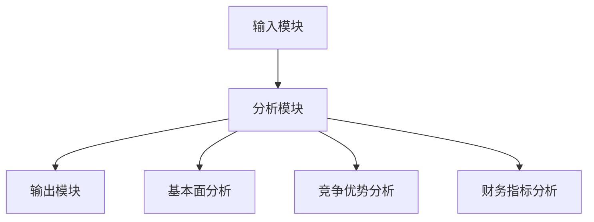

                 

# 彼得林奇的"长期增长"潜力识别方法

## 关键词：
- 彼得林奇
- 长期增长
- 投资潜力识别
- 股票分析
- 价值投资

## 摘要：
本文深入探讨了彼得·林奇的长期增长投资方法，分析其核心理念、分析框架、策略实施和风险管理，结合实际案例和系统架构设计，帮助读者掌握长期增长潜力识别的系统方法。

---

# 第1章 彼得林奇投资理念概述

## 1.1 彼得林奇与长期增长投资

### 1.1.1 彼得林奇的生平简介
彼得·林奇是美国著名投资经理人，被誉为“普通股之神”。他通过基本面分析和长期投资策略，在富达麦哲伦基金创造了辉煌的业绩，为投资者带来了巨额收益。

### 1.1.2 长期增长投资的定义
长期增长投资是指通过投资具有持续增长潜力的公司，以实现资产的长期增值。这种投资策略注重公司的基本面和竞争优势，而非短期市场波动。

### 1.1.3 长期增长投资的核心理念
- **价值投资**：寻找被市场低估的公司。
- **成长投资**：关注具有持续增长潜力的公司。
- **长期持有**：避免频繁交易，降低交易成本。

---

## 1.2 长期增长投资的意义

### 1.2.1 长期增长投资的优势
- **复利效应**：长期持有优质资产，收益呈指数增长。
- **风险分散**：通过投资多样化降低风险。

### 1.2.2 长期增长投资的适用场景
- **市场波动较大时**：长期投资能平滑短期波动。
- **经济周期变化时**：优质公司在周期中持续增长。

### 1.2.3 长期增长投资的局限性
- **流动性不足**：长期持有可能面临资金流动性问题。
- **市场波动风险**：短期市场下跌可能会影响投资者情绪。

---

# 第2章 长期增长潜力识别的核心概念

## 2.1 基本面分析

### 2.1.1 什么是基本面分析
基本面分析是通过研究公司的财务报表、行业地位和市场环境等因素，评估其内在价值。

### 2.1.2 基本面分析的关键指标
- **市盈率（P/E）**：衡量股票价格是否合理。
- **市净率（P/B）**：评估股票价格相对于账面价值的高低。
- **股息率**：衡量公司分红能力。

### 2.1.3 基本面分析的步骤
1. **收集数据**：获取公司的财务报表和行业信息。
2. **计算指标**：使用关键指标评估公司价值。
3. **行业比较**：将公司与同行业公司进行对比。

---

## 2.2 竞争优势分析

### 2.2.1 什么是竞争优势
竞争优势是指公司在市场上独特的优势，如技术、品牌、成本等。

### 2.2.2 竞争优势的类型
- **成本优势**：公司生产成本低于竞争对手。
- **品牌优势**：强大的品牌影响力吸引消费者。
- **技术优势**：拥有独特的技术或专利。

### 2.2.3 如何识别竞争优势
- **分析行业结构**：了解行业内的竞争格局。
- **评估公司资源**：检查公司在资源、技术、品牌等方面的优势。

---

## 2.3 财务指标分析

### 2.3.1 财务指标的分类
- **盈利能力**：净利润率、ROE。
- **成长能力**：收入增长率、净利润增长率。
- **财务健康状况**：资产负债率、流动比率。

### 2.3.2 关键财务指标的解读
- **ROE（净资产收益率）**：衡量公司使用股东资金的效率。
- **收入增长率**：反映公司的市场拓展能力。

### 2.3.3 财务指标与长期增长的关系
- 高ROE和稳定的收入增长是长期增长的基石。

---

# 第3章 彼得林奇的长期增长分析方法

## 3.1 GARP策略

### 3.1.1 GARP策略的定义
GARP策略是结合成长和价值投资的策略，即寻找具有合理估值的成长股。

### 3.1.2 GARP策略的实施步骤
1. **筛选高成长公司**：选择收入和利润持续增长的公司。
2. **评估估值合理性**：使用市盈率、市净率等指标评估股票是否被低估。

### 3.1.3 GARP策略的优缺点
- **优点**：平衡了成长和估值，降低了投资风险。
- **缺点**：可能错过极端成长股，或错失短期估值反弹的机会。

---

## 3.2 相对估值法

### 3.2.1 相对估值法的定义
相对估值法是通过比较公司与行业平均水平或竞争对手的估值指标，评估其投资价值。

### 3.2.2 相对估值法的计算方法
- **市盈率相对行业平均水平**：如果公司市盈率低于行业平均水平，可能被低估。
- **市净率相对行业平均水平**：类似逻辑。

### 3.2.3 相对估值法的应用场景
- **行业比较**：在行业横向比较中发现估值洼地。

---

## 3.3 成长与价值的结合

### 3.3.1 成长与价值的结合策略
彼得林奇强调寻找既有成长潜力又估值合理的公司。

### 3.3.2 成长与价值结合的步骤
1. **筛选高成长公司**：收入和利润持续增长。
2. **评估估值合理性**：确保股票价格不会过高。

---

## 第4章 系统分析与架构设计

### 4.1 系统架构设计
- **输入模块**：获取公司财务数据和市场数据。
- **分析模块**：进行基本面分析、竞争优势分析和财务指标分析。
- **输出模块**：生成投资建议报告。

### 4.2 系统架构图

---

## 第5章 项目实战与案例分析

### 5.1 实际案例分析
以苹果公司为例，分析其长期增长潜力。

---

## 第6章 最佳实践与风险管理

### 6.1 风险管理的重要性
- **风险评估**：定期评估投资组合的风险。
- **止损策略**：设置止损点，避免重大损失。

---

## 第7章 总结与展望

### 7.1 总结
彼得林奇的长期增长投资方法结合了基本面分析和长期持有策略，是实现财富增值的有效方法。

### 7.2 展望
随着技术进步，长期增长潜力识别将更加依赖数据和技术分析，投资者需不断提升自身能力，抓住投资机会。

---

## 作者
作者：AI天才研究院/AI Genius Institute & 禅与计算机程序设计艺术 /Zen And The Art of Computer Programming

---

本文通过详细分析彼得·林奇的长期增长投资方法，结合理论与实践，帮助读者掌握识别投资潜力的核心技巧。希望对您有所帮助！

