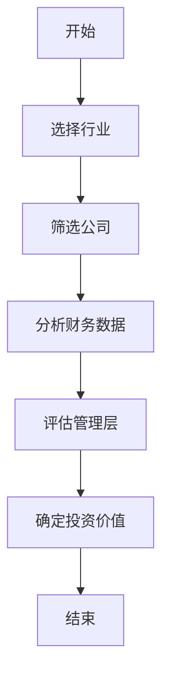

                 

# 彼得林奇的"长期增长"选股策略

**关键词**：彼得林奇、长期增长、选股策略、投资哲学、投资分析

**摘要**：彼得·林奇是美国著名投资经理人，以其独特的"长期增长"选股策略闻名。本文将详细分析彼得林奇的投资理念，解读其选股标准，探讨其策略的数学模型，并通过案例分析展示其应用。文章还将讨论该策略的优缺点，以及如何在实际投资中优化风险管理。最后，文章总结了彼得林奇的投资哲学，为读者提供长期投资的启示。

---

## 第一部分: 彼得林奇的长期增长选股策略背景与核心概念

### 第1章: 彼得林奇投资理念概述

#### 1.1 彼得林奇的个人背景
彼得·林奇（Peter Lynch）是美国著名投资经理人，曾任富达麦哲伦基金的经理，创造了该基金年均29%的复合增长率。他以独特的选股方法闻名，尤其擅长寻找具有长期增长潜力的公司。

#### 1.2 彼得林奇的投资哲学
彼得林奇强调长期投资，认为股票的价值不仅在于当前的价格，更在于公司未来的增长潜力。他主张通过深入分析公司的基本面，选择那些具有持续增长能力的公司。

#### 1.3 彼得林奇的成功案例
彼得林奇成功投资了包括微软、英特尔在内的多家公司，这些公司在其投资期间实现了显著的增长。

---

### 第2章: 长期增长投资的核心要素

#### 2.1 彼得林奇选股标准
- **增长率**：彼得林奇认为公司收入的增长是衡量其潜力的重要指标。
- **利润率**：净利润率高的公司具有更强的盈利能力。
- **股东权益收益率（ROE）**：ROE高的公司能够有效利用股东资金创造收益。

#### 2.2 长期增长投资的误区
- **过度关注短期波动**：彼得林奇提醒投资者不要被短期市场波动影响决策。
- **忽视公司基本面**：选择股票时必须深入分析公司的财务状况和行业地位。
- **依赖市场情绪**：投资决策应基于事实而非市场情绪。

---

## 第二部分: 彼得林奇选股策略的数学模型与分析

### 第3章: 长期增长投资的数学模型

#### 3.1 增长率的计算公式
$$ 增长率 = \frac{当前收入 - 上期收入}{上期收入} $$

#### 3.2 利润率的计算公式
$$ 利润率 = \frac{净利润}{总收入} $$

#### 3.3 股东权益收益率的计算公式
$$ ROE = \frac{净利润}{股东权益} $$

#### 3.4 彼得林奇选股策略的流程图

---

## 第三部分: 风险管理与投资组合优化

### 第4章: 风险管理策略

#### 4.1 评估风险
彼得林奇建议投资者定期评估投资组合的风险，确保其与自身风险承受能力相匹配。

#### 4.2 分散投资
通过投资不同行业的公司，降低投资风险。

#### 4.3 定期调整
根据市场变化和公司基本面，定期调整投资组合。

---

## 第四部分: 投资哲学与实践

### 第5章: 彼得林奇的投资哲学

#### 5.1 长期投资的重要性
彼得林奇强调长期投资，认为市场短期波动不应影响长期决策。

#### 5.2 选择行业与公司
彼得林奇偏好那些具有持续增长潜力的行业和公司，尤其是那些在行业内具有竞争优势的企业。

#### 5.3 投资决策的纪律性
彼得林奇认为，投资决策必须基于事实和分析，避免情绪化决策。

---

## 第五部分: 实际应用与案例分析

### 第6章: 实际案例分析

#### 6.1 微软公司的投资案例
彼得林奇在微软公司早期投资，该公司后来成为科技行业的巨头。

#### 6.2 英特尔公司的投资案例
彼得林奇通过分析英特尔的财务数据，选择了该公司作为投资目标。

---

## 第六部分: 优化与改进

### 第7章: 优化彼得林奇策略

#### 7.1 策略的优缺点
- **优点**：长期增长策略注重公司基本面，适合长期投资者。
- **缺点**：在市场低迷时期，长期策略可能面临较大回撤。

#### 7.2 与其他策略的比较
与短期交易策略相比，长期增长策略更注重公司内在价值，适合风险承受能力较低的投资者。

---

## 第七部分: 总结与展望

### 第8章: 总结

#### 8.1 彼得林奇的遗产
彼得林奇的选股策略对投资界产生了深远影响，其长期增长理念仍被广泛采用。

#### 8.2 对投资者的启示
长期投资需要耐心和纪律，选择优质公司是实现财富增长的关键。

---

## 作者简介

作者：AI天才研究院/AI Genius Institute & 禅与计算机程序设计艺术 /Zen And The Art of Computer Programming

---

**注意事项**：
- 投资有风险，本文内容仅为理论分析，不构成实际投资建议。
- 投资者应根据自身情况和市场变化做出决策。
- 长期增长策略需结合市场环境灵活调整。

