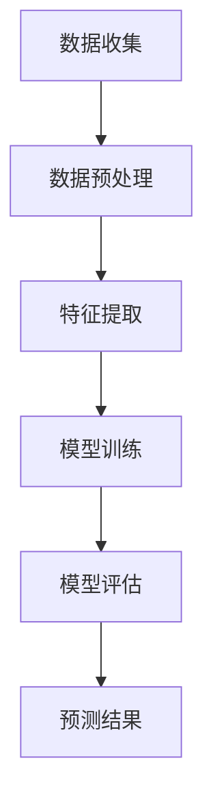
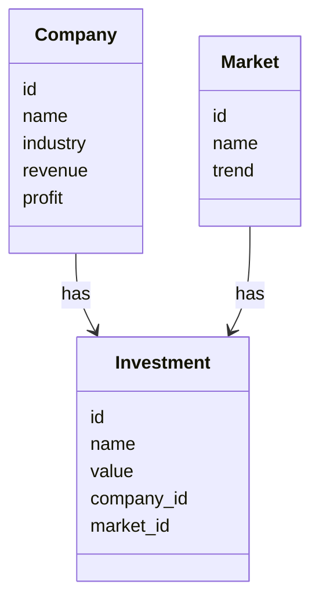

                 


# 彼得林奇的"长期增长"预测方法

> 关键词：彼得林奇，长期增长，投资预测，股票分析，价值投资

> 摘要：本文深入探讨了彼得林奇的长期增长预测方法，结合技术分析与投资策略，详细解析了其核心概念、算法原理和系统架构。通过实际案例分析，展示了如何将理论应用于实践，并总结了最佳实践和注意事项。

---

# 第一部分：彼得林奇的长期增长预测方法概述

## 第1章：彼得林奇的生平与投资理念

### 1.1 彼得林奇的生平简介
彼得·林奇（Peter Lynch）是美国著名的投资专家，曾担任富达麦哲伦基金的经理，管理资产规模超过1000亿美元。他的投资哲学以“价值投资”为核心，强调长期持有优质股票，通过深入研究公司基本面来选择投资标的。

### 1.2 投资理念的核心思想
彼得林奇的投资理念可以总结为以下几点：
1. **价值投资**：寻找被市场低估的公司，关注其长期盈利能力。
2. **长期持有**：避免频繁交易，减少交易成本和情绪干扰。
3. **分散投资**：通过投资多个行业和公司来降低风险。
4. **关注基本面**：重点分析公司的财务报表、行业地位和竞争优势。

---

## 第2章：长期增长预测的基本概念

### 2.1 长期增长预测的定义
长期增长预测是指通过分析公司的财务数据、行业趋势和宏观经济环境，预测公司在未来5年以上的收入和利润增长潜力。这种方法的核心在于识别那些具备持续增长能力的公司。

### 2.2 长期增长预测的核心要素
长期增长预测的核心要素包括：
1. **公司基本面**：收入、利润、毛利率、净利率等财务指标。
2. **行业趋势**：行业的市场规模、增长速度、竞争格局。
3. **宏观经济环境**：GDP增速、利率、通货膨胀等宏观经济因素。
4. **公司管理**：管理层的稳定性、战略规划能力。

---

## 第3章：长期增长预测与其他预测方法的对比

### 3.1 其他预测方法概述
1. **技术分析**：通过股票价格和成交量的变化来预测未来走势。
2. **基本面分析**：侧重于公司财务数据，但通常只关注短期或中期。
3. **市场情绪分析**：通过投资者情绪来预测市场走势，具有较高的不确定性。

### 3.2 长期增长预测的独特性
长期增长预测的独特性在于其注重长期视角，结合公司基本面和行业趋势，预测公司的未来增长潜力。这种方法不仅关注短期数据，还强调公司在未来5年以上的持续增长能力。

---

# 第二部分：长期增长预测的核心概念与联系

## 第4章：长期增长预测的原理

### 4.1 预测模型的构建
长期增长预测模型的构建过程包括以下步骤：
1. **数据收集**：收集目标公司的财务数据、行业数据和宏观经济数据。
2. **数据预处理**：清洗数据，处理缺失值和异常值。
3. **特征提取**：提取关键的财务指标和行业趋势指标。
4. **模型训练**：使用历史数据训练预测模型。
5. **模型评估**：通过回测和交叉验证评估模型的准确性。

### 4.2 彼得林奇预测方法的特点
彼得林奇的预测方法以公司基本面分析为核心，注重以下几点：
1. **财务健康**：关注公司的盈利能力、资产负债情况和现金流。
2. **行业地位**：分析公司在行业中的竞争优势和市场份额。
3. **宏观经济影响**：考虑宏观经济环境对公司未来增长的影响。

---

## 第5章：长期增长预测的属性特征对比

### 5.1 核心概念的属性对比
下表对比了长期增长预测的核心概念及其属性：

| 概念       | 描述                                                                 |
|------------|----------------------------------------------------------------------|
| 市场趋势     | 长期市场走向，包括上升、下降或震荡。                                   |
| 财务健康     | 公司的财务状况，包括收入增长、利润稳定性和现金流健康。             |
| 竞争优势     | 公司在行业中的竞争优势，包括品牌、技术、成本和市场份额。             |

### 5.2 ER实体关系图

```mermaid
entity Investment {
    id
    name
    value
}

entity Company {
    id
    name
    industry
}

entity Market {
    id
    name
    trend
}

relation Investment linked to Company via Investment(companies) {
    investment_id
    company_id
}

relation Company linked to Market via Company_markets {
    company_id
    market_id
}
```

---

## 第6章：长期增长预测的算法原理

### 6.1 预测模型的流程



### 6.2 预测模型的数学模型

长期增长预测模型可以基于ARIMA（自回归积分滑动平均模型）进行构建。以下是ARIMA模型的公式：

$$ ARIMA(p, d, q) $$

其中：
- $p$ 表示自回归阶数。
- $d$ 表示差分阶数。
- $q$ 表示移动平均阶数。

---

## 第7章：长期增长预测的系统架构设计方案

### 7.1 问题场景介绍
我们假设一个投资者希望使用彼得林奇的长期增长预测方法，对多个公司进行投资分析。系统需要支持数据采集、模型训练和结果展示。

### 7.2 系统功能设计

#### 领域模型类图



### 7.3 系统架构设计

#### 系统架构图

```mermaid
container Web前端 {
    HTML
    CSS
    JavaScript
}

container 后端服务 {
    Python
    Flask
    RESTful API
}

container 数据库 {
    MySQL
    MongoDB
}

Web前端 --> 后端服务
后端服务 --> 数据库
```

---

## 第8章：长期增长预测的项目实战

### 8.1 环境安装
安装所需的Python库：
```bash
pip install numpy pandas scikit-learn matplotlib
```

### 8.2 核心代码实现

```python
import numpy as np
import pandas as pd
from sklearn.metrics import mean_squared_error
from statsmodels.tsa.arima_model import ARIMA

def predict_long_term_growth(data, order=(1, 1, 1)):
    model = ARIMA(data, order=order)
    model_fit = model.fit(disp=0)
    forecast = model_fit.forecast(steps=5)
    return forecast

# 示例数据
data = pd.Series([100, 120, 130, 140, 150], index=range(5))
result = predict_long_term_growth(data)
print("预测结果：", result)
```

### 8.3 案例分析
以苹果公司为例，分析其长期增长潜力：
1. **财务数据**：苹果公司近年来收入和利润稳步增长。
2. **行业趋势**：科技行业持续增长，尤其是人工智能和云计算领域。
3. **宏观经济**：全球经济复苏对科技公司有利。

---

## 第9章：总结与最佳实践

### 9.1 最佳实践
1. **数据质量**：确保数据来源可靠，避免数据偏差。
2. **模型优化**：根据实际需求调整模型参数。
3. **持续监控**：定期更新数据和模型，及时调整投资策略。

### 9.2 小结
彼得林奇的长期增长预测方法是一种以基本面分析为核心的预测方法，通过结合公司财务数据、行业趋势和宏观经济环境，帮助投资者识别具备长期增长潜力的公司。

### 9.3 注意事项
1. 长期预测具有不确定性，需结合实际情况进行调整。
2. 避免过度依赖单一模型，建议采用多模型组合进行预测。

### 9.4 拓展阅读
- 彼得林奇的书籍《彼得林奇选股法则》
- 关于ARIMA模型的深入研究

---

# 结语

通过本文的详细分析，我们深入探讨了彼得林奇的长期增长预测方法，从理论到实践，从模型构建到系统设计，为投资者提供了一套完整的预测框架。希望本文能为读者在投资决策中提供有价值的参考。

作者：AI天才研究院/AI Genius Institute & 禅与计算机程序设计艺术/Zen And The Art of Computer Programming

