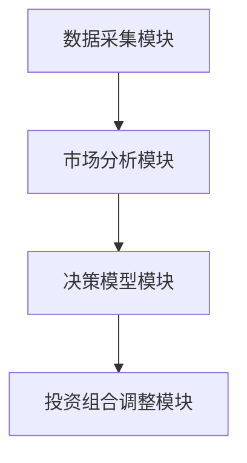
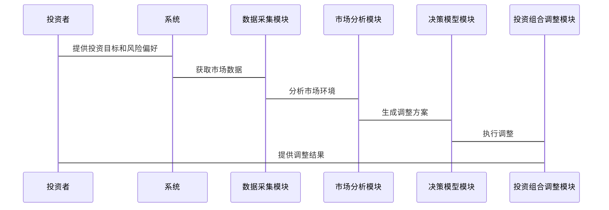

                 


# 彼得林奇的"长期持有"vs"动态调整"在不同市场环境下的选择

## 关键词：彼得林奇，长期持有，动态调整，投资策略，市场环境，风险管理

## 摘要：  
本文探讨了彼得林奇的两种投资策略——“长期持有”和“动态调整”在不同市场环境下的选择。通过分析这两种策略的核心理念、优缺点以及在牛市、熊市和震荡市中的应用，结合数学模型和实际案例，为投资者提供科学的投资决策依据。

---

## 第一部分: 彼得林奇的"长期持有"与"动态调整"投资策略概述

### 第1章: 彼得林奇投资理念的核心思想

#### 1.1 长期持有策略  
长期持有策略的核心理念是选择优质企业进行长期投资，忽略短期市场波动。彼得林奇认为，优质企业的价值会随着时间推移而增长，因此长期持有能够最大化投资收益。  

- **优点**：  
  - 简化决策过程，减少交易成本。  
  - 长期复利效应显著，适合长期投资者。  

- **缺点**：  
  - 在市场剧烈波动时，可能会承受短期亏损的压力。  
  - 无法及时调整投资组合以应对市场变化。  

#### 1.2 动态调整策略  
动态调整策略的核心理念是根据市场环境的变化，及时调整投资组合，以捕捉市场机会或规避风险。彼得林奇认为，市场环境的变化是不可预测的，因此动态调整能够更好地应对不确定性。  

- **优点**：  
  - 灵活性强，能够适应市场变化。  
  - 及时规避风险，减少亏损可能性。  

- **缺点**：  
  - 需要频繁监控市场，增加了交易成本和时间成本。  
  - 可能因为过度交易而导致情绪化决策。  

#### 1.3 长期持有与动态调整的对比分析  
- **主要区别**：  
  - 长期持有注重长期复利效应，而动态调整注重短期市场机会。  
  - 长期持有适用于市场波动较小的情况，而动态调整适用于市场波动较大的情况。  

- **优缺点对比**：  
  | 策略 | 优点 | 缺点 |  
  |------|------|------|  
  | 长期持有 | 简化决策，复利效应显著 | 市场波动时可能亏损 |  
  | 动态调整 | 灵活性强，及时规避风险 | 交易成本高，决策情绪化 |  

---

### 第2章: 不同市场环境下的投资策略选择

#### 2.1 牛市环境下的投资策略选择  
- **牛市环境的特点**：  
  - 市场情绪乐观，股价普遍上涨。  
  - 优质企业股价增长显著。  

- **长期持有策略的应用**：  
  - 在牛市中，长期持有的策略能够充分受益于市场的上涨，尤其是优质企业的股价表现。  

- **动态调整策略的应用**：  
  - 动态调整策略可以在牛市中捕捉短期市场机会，但需要警惕市场的过热和泡沫风险。  

#### 2.2 熊市环境下的投资策略选择  
- **熊市环境的特点**：  
  - 市场情绪悲观，股价普遍下跌。  
  - 投资者面临较大的亏损压力。  

- **长期持有策略的应用**：  
  - 长期持有策略在熊市中可能会承受较大的亏损压力，但优质企业的长期价值仍有可能恢复。  

- **动态调整策略的应用**：  
  - 动态调整策略可以通过及时减仓或清仓来规避市场的大幅下跌风险。  

#### 2.3 震荡市环境下的投资策略选择  
- **震荡市环境的特点**：  
  - 市场波动频繁，股价涨跌交替。  
  - 投资者需要灵活应对市场的不确定性。  

- **长期持有策略的应用**：  
  - 长期持有策略在震荡市中可能会受到短期波动的影响，但优质企业的长期价值仍有可能稳步增长。  

- **动态调整策略的应用**：  
  - 动态调整策略在震荡市中可以灵活调整投资组合，捕捉短期市场机会。  

---

## 第二部分: 彼得林奇策略的数学模型与算法原理

### 第3章: 长期持有策略的数学模型  

#### 3.1 投资组合的构建与优化  
- 投资组合的价值可以通过以下公式计算：  
  $$ V = \sum_{i=1}^{n} w_i \cdot P_i $$  
  其中，\( w_i \) 是第 \( i \) 只股票的权重，\( P_i \) 是第 \( i \) 只股票的价格。  

- 长期持有策略的目标是通过选择优质企业，最大化投资组合的长期收益。  

#### 3.2 风险与收益的数学分析  
- 风险和收益之间的关系可以用以下公式表示：  
  $$ R = \mu - \frac{1}{2} \sigma^2 $$  
  其中，\( R \) 是投资组合的收益，\( \mu \) 是期望收益，\( \sigma \) 是收益的标准差。  

### 第4章: 动态调整策略的数学模型  

#### 4.1 动态调整的参数设定与优化  
- 动态调整策略的核心是根据市场环境的变化，调整投资组合的权重。  
- 调整幅度可以用以下公式表示：  
  $$ \Delta w = \alpha \cdot (P_{\text{当前}} - P_{\text{目标}}) $$  
  其中，\( \alpha \) 是调整系数，\( P_{\text{当前}} \) 是当前市场环境下的股价，\( P_{\text{目标}} \) 是目标股价。  

#### 4.2 市场波动的数学建模  
- 市场波动可以用随机游走模型进行模拟：  
  $$ P_{t+1} = P_t + \epsilon $$  
  其中，\( \epsilon \) 是随机扰动项。  

---

## 第三部分: 系统分析与架构设计方案

### 第5章: 系统分析与架构设计方案  

#### 5.1 问题场景介绍  
- 投资决策系统需要根据市场环境的变化，自动调整投资组合的权重。  

#### 5.2 系统功能设计  
- 数据采集模块：实时采集市场数据。  
- 市场分析模块：分析市场环境并生成决策建议。  
- 决策模型模块：根据市场环境和投资策略生成投资组合调整方案。  

#### 5.3 系统架构设计  


#### 5.4 系统交互设计  


---

## 第四部分: 项目实战与案例分析

### 第6章: 项目实战  

#### 6.1 环境安装与配置  
- 安装Python和相关库（如numpy、pandas、matplotlib）。  

#### 6.2 核心实现代码  
```python
import numpy as np
import pandas as pd
import matplotlib.pyplot as plt

# 长期持有策略
def long_term_hold(portfolio, market_data):
    return portfolio * market_data['price'].values[-1] / market_data['price'].values[0]

# 动态调整策略
def dynamic_adjust(portfolio, market_data):
    target_prices = market_data['price'].values[-1] * 0.95
    return portfolio * (market_data['price'].values[-1] - target_prices)

# 示例数据
market_data = pd.DataFrame({
    'price': [100, 105, 110, 115, 120]
})

# 投资组合
portfolio = 10000

# 应用策略
long_term = long_term_hold(portfolio, market_data)
dynamic_adjusted = dynamic_adjust(portfolio, market_data)

print("长期持有收益:", long_term)
print("动态调整收益:", dynamic_adjusted)
```

---

## 第五部分: 最佳实践与总结

### 第7章: 最佳实践  

- **小结**：  
  - 长期持有策略适用于市场波动较小的情况，能够最大化复利效应。  
  - 动态调整策略适用于市场波动较大的情况，能够及时规避风险。  

- **注意事项**：  
  - 长期持有策略需要选择优质企业，避免盲目投资。  
  - 动态调整策略需要结合市场环境和投资目标，避免情绪化决策。  

- **拓展阅读**：  
  - 彼得林奇的《选股的艺术》  
  - 《投资学》（课本）  

---

## 作者信息：  
作者：AI天才研究院 & 禅与计算机程序设计艺术

