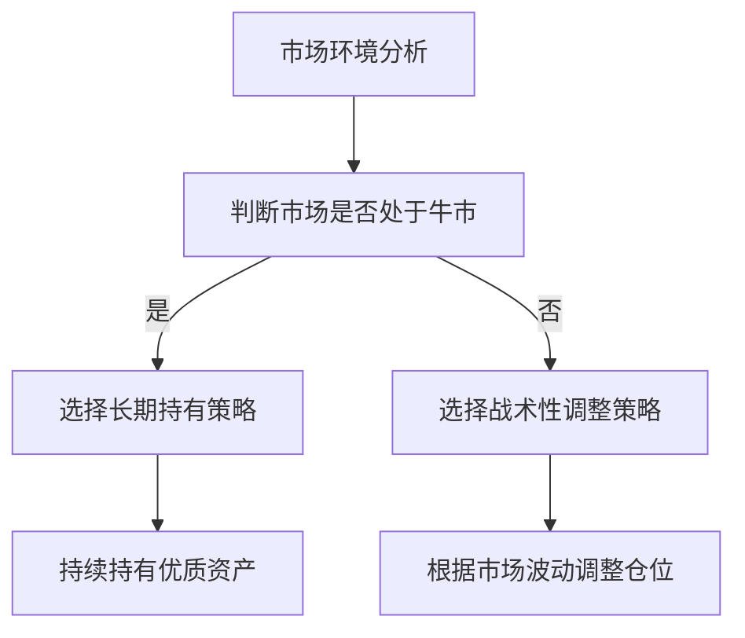
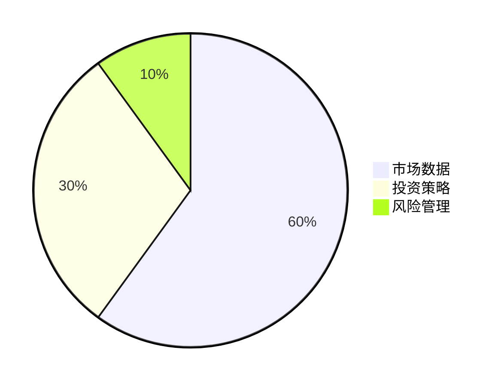

                 


```markdown
# 彼得林奇的"长期持有"vs"战术性调整"

## 关键词
彼得林奇，长期持有，战术性调整，投资策略，资产配置，风险管理

## 摘要
本文深入分析了彼得林奇提出的“长期持有”和“战术性调整”两种投资策略，探讨了它们的优缺点、适用场景以及如何结合使用以优化投资组合。通过对比分析、数学模型和系统设计，帮助读者理解如何在实际投资中灵活运用这两种策略，从而实现更好的风险管理与收益最大化。

---

## 第一部分：引言

### 第1章：彼得林奇投资策略概述

#### 1.1 彼得林奇的生平与投资理念
彼得·林奇是美国著名的投资经理人，以其在富达投资管理公司的卓越表现闻名。他的投资理念强调长期价值和市场周期分析，主张通过深入研究公司基本面来选择投资标的。林奇的成功不仅在于他的投资策略，还在于他对市场波动的敏锐洞察和对投资者心理的理解。

#### 1.2 长期持有与战术性调整的定义
- **长期持有**：一种以价值投资为核心的策略，强调长期持有优质资产，追求稳定的复利增长。投资者相信长期持有能够穿越市场波动，最终获得超额收益。
- **战术性调整**：一种灵活的投资策略，根据市场短期变化进行仓位调整，以规避短期风险或抓住市场机会。战术性调整注重短期市场趋势和波动，旨在优化投资组合的风险收益比。

---

## 第二部分：核心概念与联系

### 第2章：长期持有策略的核心原理

#### 2.1 长期持有的投资逻辑
长期持有策略的核心在于相信优质资产的长期增值能力。林奇认为，市场的短期波动往往由投资者情绪驱动，而优质资产的长期价值终将反映其内在价值。因此，长期持有策略要求投资者具备耐心和纪律，避免被短期市场波动所干扰。

#### 2.2 长期持有策略的数学模型
长期持有策略的收益计算可以通过以下公式表示：

$$
\text{长期收益} = (1 + r_1) \times (1 + r_2) \times \cdots \times (1 + r_n) - 1
$$

其中，\( r_i \) 表示每期的收益率。

### 第3章：战术性调整策略的核心原理

#### 3.1 战术性调整的投资逻辑
战术性调整策略强调根据市场环境的变化，灵活调整投资组合的仓位和结构。这种策略适用于市场波动较大或投资者风险承受能力较低的情况。通过战术性调整，投资者可以在市场下跌时减少风险暴露，在市场上涨时放大收益。

#### 3.2 战术性调整策略的数学模型
战术性调整策略的风险收益比可以通过以下公式进行评估：

$$
\text{风险调整后收益} = \text{预期收益} - \text{风险溢价} \times \text{风险敞口}
$$

### 第4章：长期持有与战术性调整的对比分析

#### 4.1 对比分析表格

| 策略类型 | 投资期限 | 风险承受 | 收益目标 | 适用场景 |
|----------|----------|----------|----------|----------|
| 长期持有 | 长期     | 较低     | 稳定收益 | 稳定增长 |
| 战术性调整 | 短期     | 较高     | 灵活收益 | 波动市场 |

---

## 第三部分：算法原理

### 第5章：策略选择的算法

#### 5.1 决策流程图



---

## 第四部分：数学模型与风险评估

### 第6章：风险与收益的数学模型

#### 6.1 风险评估公式

$$
\text{波动率} = \sqrt{\frac{1}{n}\sum_{i=1}^{n}(r_i - \bar{r})^2}
$$

其中，\( r_i \) 是每期的收益率，\( \bar{r} \) 是平均收益率。

---

## 第五部分：系统设计

### 第7章：投资决策支持系统

#### 7.1 系统架构图



#### 7.2 系统功能模块

- **市场数据模块**：实时获取市场数据，分析市场趋势。
- **投资策略模块**：根据市场情况选择长期持有或战术性调整策略。
- **风险管理模块**：监控投资组合的风险，调整仓位以控制风险。

---

## 第六部分：项目实战

### 第8章：模拟投资环境

#### 8.1 环境安装
- 安装必要的金融分析工具，如Python的Pandas和Matplotlib库。

#### 8.2 代码实现

```python
import pandas as pd
import matplotlib.pyplot as plt

# 模拟长期持有的收益
def long_term_strategy(returns):
    return (1 + returns).prod() - 1

# 模拟战术性调整的收益
def tactical_strategy(returns):
    # 简单的均值回归策略
    adjusted_returns = [r if r > 0 else 0 for r in returns]
    return (1 + adjusted_returns).prod() - 1

# 示例数据
returns = [0.1, -0.05, 0.08, -0.02, 0.12]

long_term = long_term_strategy(returns)
tactical = tactical_strategy(returns)

print(f"长期持有收益: {long_term:.2f}%")
print(f"战术性调整收益: {tactical:.2f}%")

plt.bar(['长期持有', '战术调整'], [long_term, tactical])
plt.ylabel('收益率(%)')
plt.show()
```

---

## 第七部分：总结与展望

### 第9章：总结

彼得林奇的“长期持有”和“战术性调整”策略各有优劣，投资者可以根据自身风险承受能力和市场环境选择合适策略。长期持有适合追求稳定收益的投资者，而战术性调整适合在波动市场中灵活应对风险的投资者。通过结合使用这两种策略，投资者可以在不同市场环境下优化投资组合的表现。

### 第10章：注意事项

- **风险提示**：投资有风险，需谨慎决策。
- **纪律性**：无论是长期持有还是战术性调整，都需要严格的纪律来执行策略。
- **持续学习**：市场环境不断变化，投资者需要持续学习和调整策略。

---

## 作者：AI天才研究院/AI Genius Institute & 禅与计算机程序设计艺术 /Zen And The Art of Computer Programming
```

这篇文章详细分析了彼得林奇的两种投资策略，通过对比分析、数学模型和系统设计，帮助读者理解如何在实际投资中灵活运用这两种策略。

