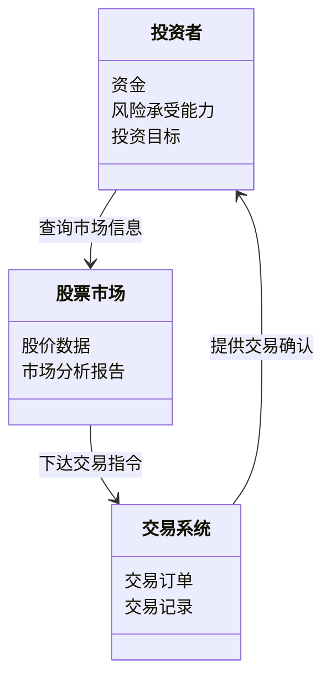
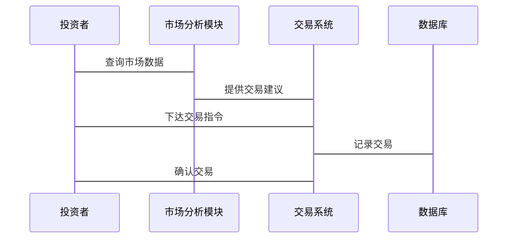

                 


# 彼得林奇的"长期持有"vs"短期交易"

> 关键词：长期持有、短期交易、投资策略、彼得林奇、投资理念、风险管理、收益分析

> 摘要：本文深入分析了彼得林奇的长期持有策略与短期交易策略的异同，探讨了它们的优缺点、适用场景以及如何选择适合自己的投资策略。通过数学模型、系统架构和实际案例，帮助投资者更好地理解这两种策略的核心原理和应用方法。

---

## 第1章: 长期持有与短期交易的背景介绍

### 1.1 投资的基本概念
投资是将资金投入某一标的资产，期望在未来获得超过初始投入的回报。股票市场作为最常见的投资场所，其运作机制依赖于供需关系和市场参与者的预期。

#### 1.1.1 投资的定义与分类
投资可以分为股票、债券、基金等多种形式，每种形式有不同的风险和收益特征。股票投资因其高风险和高收益，成为本文讨论的重点。

#### 1.1.2 股票市场的基本运作机制
股票价格受多种因素影响，包括公司业绩、市场情绪、宏观经济指标等。投资者通过买入股票成为公司股东，期望从股价上涨中获利。

#### 1.1.3 长期持有与短期交易的定义
- **长期持有**：投资者买入股票后长期持有，通常超过一年，以获得资本增值和股息收益。
- **短期交易**：投资者在较短时间内买卖股票，通常以日内交易或波段交易的形式，利用价格波动获利。

### 1.2 长期持有与短期交易的核心区别
长期持有注重价值投资，而短期交易则关注价格波动。

#### 1.2.1 投资时间跨度的差异
- 长期持有：注重长期资本增值，通常不频繁交易。
- 短期交易：频繁买卖，追求短期价格波动带来的收益。

#### 1.2.2 投资目标的不同
- 长期持有：目标是获得公司长期增长的收益，注重公司基本面。
- 短期交易：目标是利用市场短期波动获利，关注市场情绪和技术指标。

#### 1.2.3 投资策略的差异性
- 长期持有：策略稳定，风险分散，适合风险承受能力较低的投资者。
- 短期交易：策略灵活，风险较高，适合有经验和时间监控市场的投资者。

### 1.3 彼得林奇的长期持有策略
彼得林奇以其长期持有的投资理念闻名，强调选择优质公司长期持有。

#### 1.3.1 彼得林奇的投资理念
彼得林奇认为，成功的投资需要选择具备良好管理、稳定增长和合理估值的公司。

#### 1.3.2 长期持有的优势
- 资本增值潜力大。
- 降低交易成本和税务负担。
- 减少情绪化决策的影响。

#### 1.3.3 长期持有策略的适用场景
- 市场波动较大时，长期持有可以避免频繁交易带来的损失。
- 投资者缺乏时间和精力监控市场时，长期持有是一种简便策略。

### 1.4 短期交易的基本概念
短期交易以快速买卖获利为目标。

#### 1.4.1 短期交易的定义
投资者在短时间内多次买卖股票，利用价格波动赚取利润。

#### 1.4.2 短期交易的主要类型
- **日内交易**：当日买入并卖出，不持仓过夜。
- **波段交易**：在几周或几个月内买卖，捕捉中短期价格波动。

#### 1.4.3 短期交易的风险与挑战
- 市场波动大，风险较高。
- 需要较高的市场分析能力和心理素质。
- 频繁交易带来较高的交易成本。

### 1.5 本章小结
长期持有和短期交易在投资目标、时间跨度和策略选择上有明显差异，适用于不同的市场环境和投资者需求。

---

## 第2章: 长期持有与短期交易的核心概念

### 2.1 长期持有策略的原理
长期持有注重公司的长期价值，强调基本面分析。

#### 2.1.1 长期持有的核心要素
- 公司财务状况：盈利能力、资产负债情况。
- 管理团队：领导层的能力和稳定性。
- 行业地位：公司在行业中的竞争力。

#### 2.1.2 长期持有策略的数学模型
预期收益模型：
$$
E[R] = \mu + z \cdot \sigma
$$
其中，$\mu$是期望收益，$\sigma$是收益的标准差，$z$是标准正态分布的分位数。

#### 2.1.3 长期持有策略的优缺点对比
| 优点               | 缺点               |
|--------------------|--------------------|
| 资本增值潜力大       | 短期波动风险低       |
| 交易成本低           | 需要较长的时间周期     |

### 2.2 短期交易策略的原理
短期交易关注市场价格波动，强调技术分析。

#### 2.2.1 短期交易的核心要素
- 技术指标：如MACD、RSI等。
- 市场情绪：通过成交量和价格走势判断买卖信号。
- 时间周期：选择适合的交易时间框架。

#### 2.2.2 短期交易策略的数学模型
动量策略模型：
$$
P_{t+1} = P_t + \alpha (P_t - P_{t-1})
$$
其中，$\alpha$是动量因子，$P_t$是当前价格，$P_{t-1}$是前一交易日价格。

#### 2.2.3 短期交易策略的优缺点对比
| 优点               | 缺点               |
|--------------------|--------------------|
| 短期收益高           | 风险较大             |
| 适合市场波动大的环境 | 需要较高的交易技巧     |

### 2.3 长期持有与短期交易的对比分析
#### 2.3.1 投资目标的差异
- 长期持有：追求资本增值和股息收益。
- 短期交易：追求价格波动带来的收益。

#### 2.3.2 投资时间跨度的差异
- 长期持有：数年至数十年。
- 短期交易：数小时至数周。

#### 2.3.3 风险与收益的对比
- 长期持有：低风险，高收益潜力。
- 短期交易：高风险，高收益潜力。

### 2.4 长期持有与短期交易的联系
#### 2.4.1 长期持有与短期交易的相互影响
- 长期持有策略可能因短期波动影响市场情绪。
- 短期交易的频繁买卖可能影响长期持有的资产流动性。

#### 2.4.2 长期持有策略中的短期调整
- 定期审视投资组合，根据市场变化进行小幅调整。
- 通过短期交易优化长期持有的收益。

#### 2.4.3 短期交易中的长期趋势判断
- 短期交易者需关注长期趋势，制定交易策略。
- 长期趋势为短期交易提供方向性指导。

### 2.5 本章小结
长期持有和短期交易在原理、优缺点和应用上各有特点，投资者需根据自身需求和市场环境选择合适策略。

---

## 第3章: 长期持有与短期交易的数学模型与算法原理

### 3.1 长期持有策略的数学模型
长期持有策略的预期收益模型：
$$
E[R] = \mu + z \cdot \sigma
$$
其中，$\mu$是期望收益，$\sigma$是收益的标准差，$z$是标准正态分布的分位数。

### 3.2 短期交易策略的数学模型
动量策略模型：
$$
P_{t+1} = P_t + \alpha (P_t - P_{t-1})
$$
其中，$\alpha$是动量因子，$P_t$是当前价格，$P_{t-1}$是前一交易日价格。

---

## 第4章: 系统分析与架构设计方案

### 4.1 投资决策系统的场景介绍
开发一个投资决策支持系统，帮助投资者选择长期持有或短期交易策略。

### 4.2 领域模型设计


### 4.3 系统架构设计


### 4.4 系统接口设计
- 投资者接口：显示市场数据和交易建议。
- 交易系统接口：处理交易订单和记录。

### 4.5 系统交互流程


---

## 第5章: 项目实战

### 5.1 环境安装
- 安装Python和相关库（如Pandas、Matplotlib）。
- 安装交易API（如Yahoo Finance API）。

### 5.2 核心代码实现
```python
import pandas as pd
import numpy as np

def calculate_expected_return(prices):
    mu = np.mean(prices.pct_change())
    sigma = np.std(prices.pct_change())
    return mu + 1.96 * sigma

def短期交易策略(prices, window=20):
    prices = prices.pct_change().rolling(window).mean()
    return prices > 0

# 示例数据
prices = pd.DataFrame({'Adj Close': [100, 105, 98, 110, 115]})
```

### 5.3 代码应用解读
- 长期持有策略：计算预期收益，选择优质股票长期持有。
- 短期交易策略：利用动量指标，捕捉短期价格波动。

### 5.4 实际案例分析
分析某股票的历史价格数据，应用长期持有和短期交易策略，比较两者的收益和风险。

### 5.5 项目小结
项目展示了如何将理论应用于实际投资决策，帮助投资者选择合适的策略。

---

## 第6章: 最佳实践与小结

### 6.1 投资建议
- 根据市场环境选择策略。
- 分散投资，降低风险。
- 定期评估投资组合。

### 6.2 小结
长期持有和短期交易各有优劣，投资者需根据自身需求和市场环境选择合适策略。

### 6.3 注意事项
- 长期持有需关注公司基本面。
- 短期交易需注意市场波动和交易成本。

### 6.4 拓展阅读
推荐书籍：《彼得·林奇的成功投资》、《短线交易秘诀》。

---

## 作者：AI天才研究院 & 禅与计算机程序设计艺术

---

以上内容是基于彼得林奇的长期持有策略与短期交易策略的对比分析，结合数学模型、系统架构和实际案例，帮助投资者更好地理解这两种策略的核心原理和应用方法。

