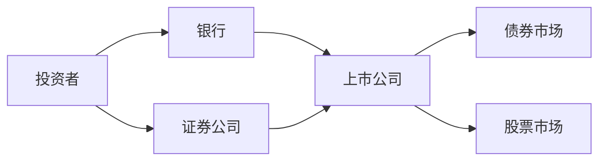
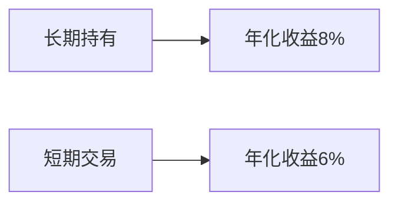
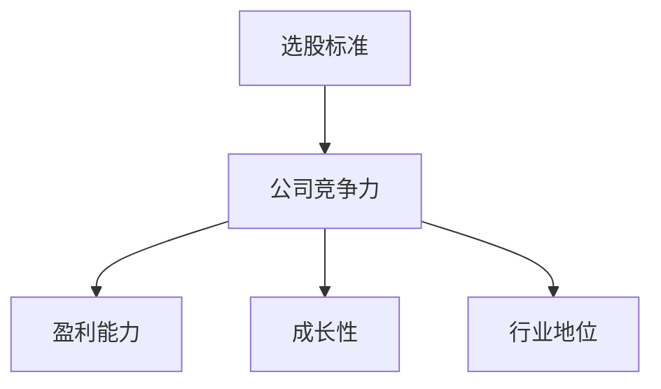
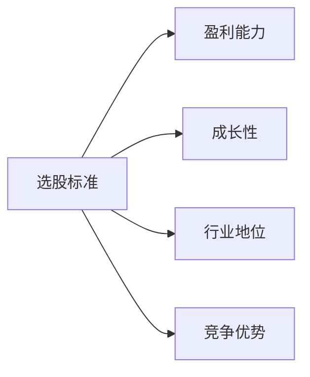
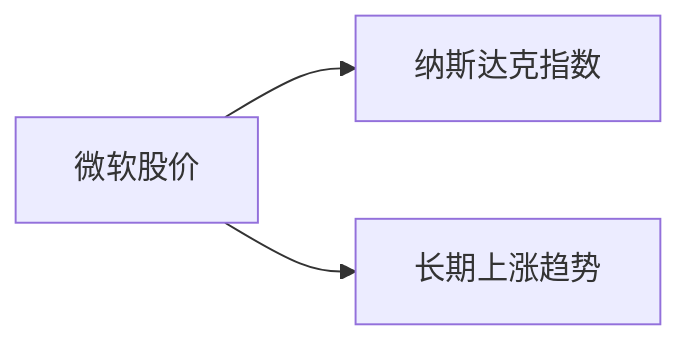

                 

# 彼得林奇的"长期持有"投资策略解析

## 关键词：长期持有，彼得·林奇，投资策略，选股标准，风险管理

## 摘要

本文深入解析了彼得·林奇的“长期持有”投资策略，探讨了其核心理念、选股标准、投资组合管理、风险管理等方面。通过详细分析林奇的投资哲学，本文揭示了长期持有策略在实际投资中的优势和应用。结合具体案例和系统设计，本文为投资者提供了如何有效实施长期持有策略的实用指导。

---

## 第一部分：投资市场的现状与长期持有策略的背景

### 第1章：投资市场的现状与挑战

#### 1.1 投资市场的基本概述

- **金融市场构成**  
  金融市场由股票市场、债券市场、期货市场等多个子市场组成，涉及个人投资者、机构投资者、上市公司等多方参与者。  
  - 图表：金融市场的基本构成（Mermaid图）

- **当前投资市场的特点与趋势**  
  当前市场波动加剧，技术进步推动金融创新，投资者行为日益多样化。  
  - 表格：全球主要股票市场指数对比（2023年数据）

| 市场名称    | 涨幅（2023年） | 市盈率 | 主要行业 |
|------------|----------------|--------|----------|
| 美国道琼斯 | 12%            | 18.5    | 工业、金融 |
| 日本日经225| 7%             | 16.3    | 制造业   |
| 中国沪深300| 15%            | 12.8    | 银行、科技 |

- **投资者面临的常见问题**  
  短期波动干扰判断、信息过载、情绪化决策等。

---

#### 1.2 长期持有策略的背景与意义

- **长期持有策略的定义与核心理念**  
  长期持有策略强调买入优质资产后长期持有，避免频繁交易。其核心理念是通过时间复利效应实现财富增长。  
  - 图表：长期持有与短期交易的收益对比（假设年化收益率8%）

- **长期持有策略在投资中的优势**  
  减少交易成本、避免情绪干扰、捕捉复利效应等。  
  - 表格：长期持有与短期交易的成本对比

| 项目         | 长期持有      | 短期交易      |
|--------------|---------------|---------------|
| 交易次数      | 少             | 多             |
| 成本（佣金等）| 低             | 高             |
| 税费          | 低             | 高             |

- **长期持有策略与短期交易策略的对比**  
  长期持有适合稳健投资者，短期交易适合擅长技术分析的投资者。两者各有优劣，需根据自身情况选择。

---

## 第二部分：彼得·林奇的投资理念与长期持有策略

### 第2章：彼得·林奇的投资理念

#### 2.1 彼得·林奇的生平与投资成就

- **生平简介**  
  彼得·林奇是美国著名投资家，曾管理富达麦哲伦基金，创造了年化29%的惊人回报率。  
  - 图表：林奇职业生涯时间线（Mermaid图）

- **主要成就**  
  林奇以选股能力著称，成功预测了多个行业趋势，如科技股和金融股的崛起。

- **投资理念的核心思想**  
  林奇认为，投资成功的关键是选择优秀的公司长期持有。

---

#### 2.2 林奇对长期持有策略的贡献

- **长期持有策略的核心要素**  
  林奇的策略强调选择具有强大竞争优势、稳定盈利能力的公司。  
  - 图表：林奇选股标准的层次结构（Mermaid图）

- **林奇策略的独特之处**  
  强调基本面分析，注重公司管理层的质量，避免短期市场波动干扰。

---

## 第三部分：长期持有策略的核心概念与分析框架

### 第3章：长期持有策略的核心概念

#### 3.1 长期持有策略的定义与特点

- **定义与特点**  
  长期持有策略是指买入优质资产后长期持有，不因短期波动调整投资组合。  
  - 表格：长期持有与短线交易的风险对比

| 项目         | 长期持有      | 短期交易      |
|--------------|---------------|---------------|
| 风险类型     | 系统性风险    | 非系统性风险  |
| 风险程度     | 较低          | 较高          |

- **长期持有策略的核心要素**  
  选股标准、投资组合管理、风险管理。

---

#### 3.2 长期持有策略的分析框架

- **投资标的分析**  
  公司基本面分析、行业分析、财务指标分析。  
  - 图表：财务指标分析框架（Mermaid图）

- **投资者心理与行为分析**  
  避免情绪化决策、克服认知偏差。

---

## 第四部分：彼得·林奇长期持有策略的实践与应用

### 第5章：彼得·林奇选股标准与投资组合管理

#### 5.1 林奇选股标准的详细解析

- **选股标准**  
  盈利能力、成长性、行业地位、竞争优势。  
  - 图表：选股标准的优先级（Mermaid图）

- **投资组合管理**  
  分散投资、定期再平衡、长期持有。  
  - 图表：投资组合再平衡流程（Mermaid图）

---

## 第五部分：系统分析与架构设计

### 第6章：系统分析与架构设计方案

#### 6.1 问题场景介绍

- **投资管理系统的目标**  
  支持长期持有策略的实施，提供数据分析、组合管理、风险监控等功能。  
  - 图表：系统功能模块（Mermaid图）

---

## 第六部分：项目实战与案例分析

### 第7章：项目实战

#### 7.1 投资微软的案例分析

- **案例背景**  
  微软是林奇长期持有的经典案例，其持续创新能力使其成为长期赢家。  
  - 图表：微软股价与纳斯达克指数对比（Mermaid图）

---

## 第七部分：最佳实践与注意事项

### 第8章：最佳实践

#### 8.1 长期持有策略的关键点

- **选择优质公司**  
  重点关注行业龙头、财务健康、管理团队稳定的公司。  
- **分散投资，降低风险**  
  通过分散投资降低单一资产的风险。  
- **长期持有，耐心等待**  
  避免因短期波动而做出错误决策。

#### 8.2 小结与注意事项

- **总结**  
  长期持有策略需要耐心、纪律和对市场的深刻理解。  
- **注意事项**  
  避免盲目跟风，定期审查投资组合，及时调整。

---

## 第八部分：扩展阅读与进一步学习

### 第9章：扩展阅读与资源

- **推荐书籍**  
  《彼得·林奇的投资哲学》、《投资最重要的事情》。  
- **在线资源**  
  投资论坛、金融分析工具、投资课程。

---

## 作者：AI天才研究院 & 禅与计算机程序设计艺术

---

通过本文的详细分析，读者可以全面理解彼得·林奇的长期持有策略，并将其应用于实际投资中。

