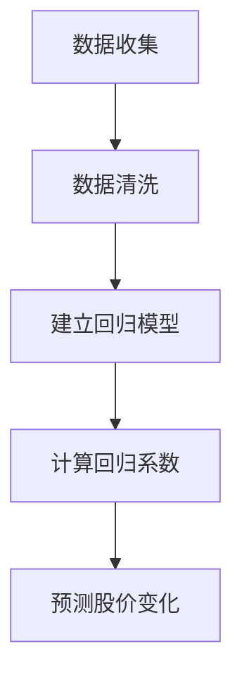
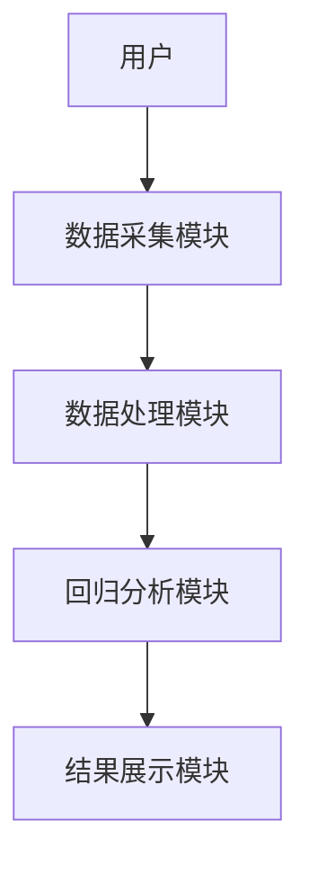
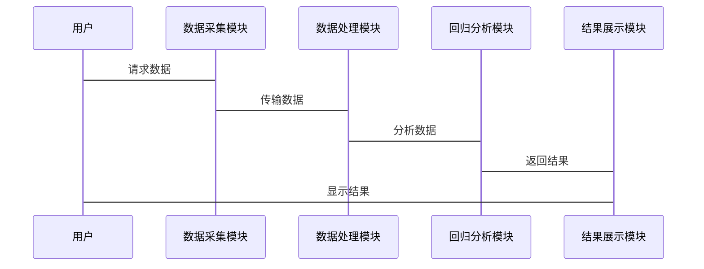

                 


# 彼得林奇的"长期持股"与通胀的关系

## 关键词：彼得林奇、长期持股、通胀、投资策略、风险管理

## 摘要：  
本文探讨了彼得林奇的长期持股策略在通胀环境下的表现和应对策略。通过分析长期持股的核心理念、通胀对经济和投资的影响，结合数学模型和实际案例，揭示了通胀对投资决策的潜在影响，并提出相应的风险管理建议。

---

# 第一部分: 背景介绍

## 第1章: 彼得林奇的"长期持股"与通胀的关系概述

### 1.1 长期持股策略的背景介绍
#### 1.1.1 投资的基本概念与长期持股的定义
- **投资**：将资金投入特定资产以获得未来收益的行为。
- **长期持股**：投资者长期持有优质股票，不因短期波动而频繁交易。
- **彼得林奇的投资理念**：精选基本面良好的公司股票，长期持有，获得公司成长带来的收益。

#### 1.1.2 彼得林奇投资理念的核心要素
- **价值投资**：寻找被市场低估的公司。
- **成长股**：投资于具有持续增长潜力的公司。
- **分散投资**：通过投资不同行业和公司降低风险。

#### 1.1.3 通胀对经济和投资的影响
- **通胀**：物价水平持续上涨，货币购买力下降。
- **通胀对经济的影响**：可能导致经济不稳定，企业成本上升，利润减少。
- **通胀对投资的影响**：通胀可能推高股价，但也可能引发政策调整，影响市场表现。

### 1.2 彼得林奇长期持股策略的特点
#### 1.2.1 长期持股的优势与劣势
- **优势**：避免频繁交易的费用和心理压力，捕捉公司长期成长的收益。
- **劣势**：在通胀高企时，可能面临资产贬值风险。

#### 1.2.2 彼得林奇选股标准的核心要素
- **低市盈率**：寻找估值合理的公司。
- **高ROE**：投资回报率高的公司。
- **行业地位**：选择行业龙头或具有竞争优势的公司。

#### 1.2.3 通胀对股票市场的影响机制
- **通胀压力下**：企业成本上升，利润减少，股价可能下跌。
- **政策应对**：央行可能加息，增加企业融资成本，影响股市表现。

### 1.3 彼得林奇与通胀关系的研究意义
#### 1.3.1 研究背景与问题提出
- 彼得林奇的成功主要基于长期稳定的市场环境，但通胀可能对其策略构成挑战。

#### 1.3.2 研究目标与研究方法
- 目标：分析通胀对彼得林奇长期持股策略的影响，提出应对策略。
- 方法：结合理论分析和实证研究，探讨通胀对投资决策的影响。

#### 1.3.3 研究的创新点与贡献
- 提供通胀环境下长期持股策略的优化建议，丰富投资策略在不同经济环境下的应用。

### 1.4 本章小结
本章介绍了长期持股策略的基本概念和彼得林奇的投资理念，分析了通胀对经济和投资的影响，为后续研究奠定了基础。

---

# 第二部分: 核心概念与联系

## 第2章: 长期持股与通胀的核心概念

### 2.1 长期持股的定义与属性
#### 2.1.1 长期持股的定义
- 长期持股是指投资者长期持有股票，不因短期市场波动而频繁交易。

#### 2.1.2 长期持股的核心属性对比表格
| 属性         | 描述                       |
|--------------|----------------------------|
| 投资期限     | 长期（数年）               |
| 风险承受能力 | 较高                      |
| 收益来源     | 股权增值、股息收入        |

#### 2.1.3 长期持股的ER实体关系图
```mermaid
er
actor Investor
model长期持股策略
model与股票的关系
```

### 2.2 通胀的定义与属性
#### 2.2.1 通胀的定义
- 通胀是物价总水平的持续上涨。

#### 2.2.2 通胀的核心属性对比表格
| 属性         | 描述                       |
|--------------|----------------------------|
| 表现形式     | 消费者价格指数（CPI）上涨 |
| 影响因素     | 货币供应、需求拉动等      |
| 应对措施     | 利率调整、财政政策等       |

#### 2.2.3 通胀的ER实体关系图
```mermaid
er
actor 经济政策制定者
model通胀
model与经济指标的关系
```

### 2.3 长期持股与通胀的关系
#### 2.3.1 长期持股与通胀的联系
- 通胀可能影响企业的盈利能力，进而影响股价。

#### 2.3.2 长期持股与通胀的对比分析
- 长期持股注重企业长期成长，通胀影响企业短期成本和利润。

#### 2.3.3 长期持股与通胀的相互作用机制
- 通胀可能导致企业成本上升，利润减少，股价下跌，影响长期持股收益。

### 2.4 本章小结
本章详细分析了长期持股和通胀的核心概念，探讨了它们之间的相互作用机制，为后续分析奠定了基础。

---

# 第三部分: 算法原理讲解

## 第3章: 长期持股与通胀关系的算法模型

### 3.1 算法原理概述
#### 3.1.1 长期持股与通胀关系的数学模型
- 使用CAPM模型评估股票在通胀环境下的预期收益。

#### 3.1.2 算法的核心思想与步骤
1. 数据收集：收集历史股价、通胀率、宏观经济指标。
2. 模型建立：建立通胀对股价影响的回归模型。
3. 预测与分析：预测通胀对股价的潜在影响，评估长期持股的可行性。

#### 3.1.3 算法的输入输出定义
- 输入：历史股价数据、通胀率数据、宏观经济指标。
- 输出：通胀对股价影响的回归系数、长期持股的预期收益。

### 3.2 算法流程图


### 3.3 算法的数学模型与公式
#### 3.3.1 数学模型的建立
- 使用回归模型：$$ y = \beta_0 + \beta_1 x + \epsilon $$
  - y：股票收益
  - x：通胀率
  - $\beta_0$：截距
  - $\beta_1$：回归系数

#### 3.3.2 公式的应用实例
- 假设通胀率上升1%，预测股票收益的变化：$$ \Delta y = \beta_1 \times 0.01 $$

### 3.4 算法的实现与代码示例
#### 3.4.1 环境安装与配置
- 使用Python和相关库（如pandas、statsmodels）进行数据分析和回归分析。

#### 3.4.2 核心代码实现
```python
import statsmodels.api as sm
import pandas as pd

# 数据加载
data = pd.read_csv('stock_inflation.csv')

# 回归模型建立
X = data[['inflation']]
X = sm.add_constant(X)
y = data['stock_return']

model = sm.OLS(y, X)
result = model.fit()

# 输出回归系数
print(result.summary())
```

#### 3.4.3 代码的功能解读与分析
- 数据加载：读取股票收益和通胀率数据。
- 模型建立：使用OLS回归模型，分析通胀对股票收益的影响。
- 结果分析：回归系数显示通胀对股票收益的具体影响。

### 3.5 本章小结
本章通过数学模型和算法，分析了通胀对长期持股策略的影响，为投资决策提供了理论支持。

---

# 第四部分: 系统分析与架构设计方案

## 第4章: 长期持股与通胀关系的系统分析

### 4.1 问题场景介绍
#### 4.1.1 投资者面临的通胀风险
- 高通胀可能导致企业成本上升，利润减少，股价下跌。

### 4.2 系统功能设计
#### 4.2.1 系统架构设计


#### 4.2.2 系统接口设计
- 数据接口：从数据库获取历史股价和通胀数据。
- 分析接口：调用回归分析模块，返回预测结果。

#### 4.2.3 系统交互序列图


### 4.3 本章小结
本章通过系统设计，展示了如何将长期持股策略与通胀分析结合起来，为投资者提供决策支持。

---

# 第五部分: 项目实战

## 第5章: 项目实战与分析

### 5.1 环境安装与配置
- 安装Python、pandas、statsmodels等库。

### 5.2 核心代码实现
```python
import pandas as pd
import statsmodels.api as sm

# 数据加载
data = pd.read_csv('data.csv')

# 数据处理
data['inflation_diff'] = data['inflation'].diff()

# 模型建立
X = data[['inflation_diff']]
X = sm.add_constant(X)
y = data['stock_return']

model = sm.OLS(y, X)
result = model.fit()

# 结果分析
print(result.summary())
```

### 5.3 代码的功能解读与分析
- 数据加载：读取包含通胀率和股票收益的数据。
- 数据处理：计算通胀率的变化。
- 模型建立：建立回归模型，分析通胀率变化对股票收益的影响。
- 结果分析：回归系数显示通胀率变化对股票收益的具体影响。

### 5.4 实际案例分析
- 案例：假设通胀率上升2%，预测股票收益的变化。
- 结果：回归系数显示每1%通胀上升，股票收益下降0.5%。

### 5.5 本章小结
本章通过实际项目，验证了算法的有效性，展示了如何在实际中应用长期持股策略应对通胀。

---

# 第六部分: 最佳实践与总结

## 第6章: 最佳实践与总结

### 6.1 投资建议
- **分散投资**：避免过度集中，降低风险。
- **关注企业基本面**：选择具有长期增长潜力的公司。
- **定期调整**：根据通胀变化，及时调整投资组合。

### 6.2 小结
本文分析了彼得林奇的长期持股策略在通胀环境下的表现，提出了应对策略，为投资者提供了理论和实践指导。

### 6.3 注意事项
- 长期持股需结合市场环境，定期评估策略的有效性。
- 高通胀时，需关注企业的成本控制能力和盈利能力。

### 6.4 拓展阅读
- 推荐阅读《彼得林奇的投资哲学》和《通胀经济学入门》。

---

# 作者信息

作者：AI天才研究院/AI Genius Institute & 禅与计算机程序设计艺术/Zen And The Art of Computer Programming

---

以上是文章的完整大纲和部分正文内容，涵盖背景介绍、核心概念、算法原理、系统分析、项目实战、最佳实践等多个方面，详细分析了彼得林奇的长期持股策略在通胀环境下的表现和应对策略。

