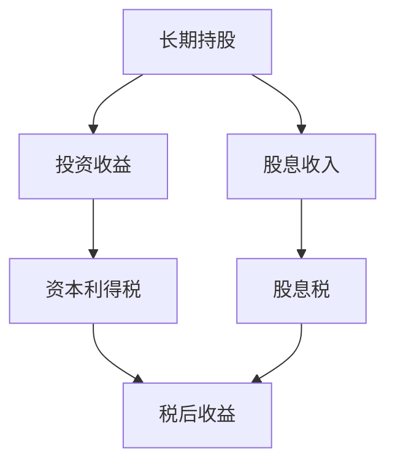
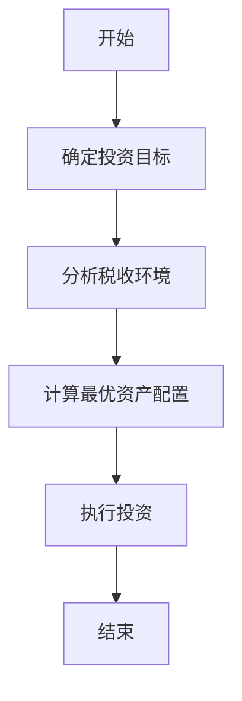
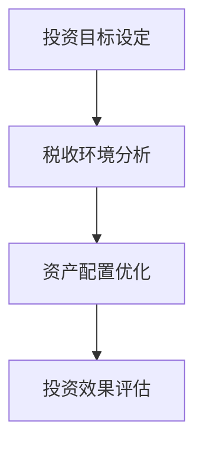
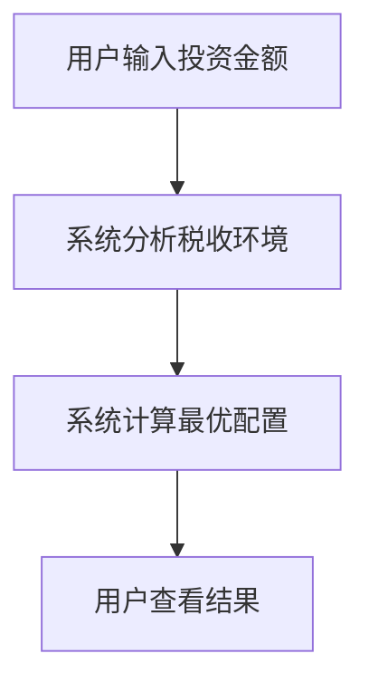

                 


```markdown
# 彼得林奇的"长期持股"在不同税收环境下的优化策略

> 关键词：长期持股、税收环境、投资策略、资本利得税、股息税

> 摘要：本文深入分析了彼得林奇的长期持股策略在不同税收环境下的优化策略，探讨了如何通过调整投资组合和利用税收优惠政策来最大化投资回报。文章结合了理论分析、算法实现和实际案例，为投资者提供了实用的优化建议。

---

## 第一部分：背景介绍

### 第1章：长期持股策略概述
#### 1.1 长期持股的核心概念
- 长期持股的定义与特点
- 投资理念：价值投资与长期持有
- 长期持股与短期交易的区别

#### 1.2 税收环境对投资策略的影响
- 税收环境的定义
- 不同国家的税收政策对比
- 税收环境对企业投资决策的影响

#### 1.3 长期持股与税收环境的关系
- 长期持股在不同税收环境下的表现
- 税收优惠政策对长期持股的影响

---

## 第二部分：核心概念与联系

### 第2章：长期持股的原理与优化策略
#### 2.1 长期持股的核心原理
- 长期持股的收益来源
- 长期持股的风险分析
- 长期持股的市场适应性

#### 2.2 税收优化策略的分析
- 税收优化的基本原理
- 税收计算与投资决策的关系
- 税收环境变化对投资策略的影响

#### 2.3 长期持股与税收优化的结合
- 高税率环境下的优化策略
- 低税率环境下的优化策略
- 税收优惠政策下的优化策略

---

### 第3章：长期持股与税收环境的联系
#### 3.1 长期持股在不同税收环境下的策略对比
- 表格对比不同税收环境下的策略差异

#### 3.2 实体关系图
- 使用 Mermaid 绘制长期持股与税收环境的实体关系图：



---

## 第三部分：算法原理讲解

### 第4章：优化算法的原理与实现
#### 4.1 优化算法的基本原理
- 动态资产配置算法
- 税收影响下的资产分配策略

#### 4.2 算法流程图
- 使用 Mermaid 绘制优化算法流程图：



#### 4.3 算法实现的 Python 代码示例
```python
def optimize_portfolio(tax_rate, holding_period):
    # 计算税后收益
    pre_tax_return = 1.05  # 假设年化收益率为5%
    post_tax_return = pre_tax_return * (1 - tax_rate)
    # 计算持有期的总收益
    total_return = post_tax_return ** holding_period
    return total_return

# 示例：在10%税率下的5年持有期
print(optimize_portfolio(0.10, 5))
```

---

### 第5章：数学模型与公式

#### 5.1 税后收益计算公式
$$ \text{税后收益} = \text{投资收益} \times (1 - \text{税率}) $$

#### 5.2 投资组合优化的数学模型
$$ \max_{w} \left( \mu^T w - \lambda \times \text{Tax}(w) \right) $$
其中，$\mu$ 是资产的预期收益率向量，$w$ 是投资权重向量，$\lambda$ 是风险厌恶系数，$\text{Tax}(w)$ 是税收函数。

---

## 第四部分：系统分析与架构设计

### 第6章：系统功能设计
#### 6.1 系统功能模块
- 投资目标设定
- 税收环境分析
- 资产配置优化
- 投资效果评估

#### 6.2 系统架构设计
- 使用 Mermaid 绘制系统架构图：



---

### 第7章：系统交互设计

#### 7.1 交互流程图
- 使用 Mermaid 绘制系统交互流程图：



---

## 第五部分：项目实战

### 第8章：环境安装与核心代码实现
#### 8.1 环境安装
- Python 3.8+
- NumPy 和 Pandas 库
- Matplotlib 或 Seaborn 绘图库

#### 8.2 核心代码实现
```python
import numpy as np
import pandas as pd

def calculate_tax_optimized_returns(tax_rates, holding_periods):
    returns = []
    for rate in tax_rates:
        for period in holding_periods:
            pre_tax = 1.05 ** period  # 假设年化收益率为5%
            post_tax = pre_tax * (1 - rate)
            returns.append(post_tax)
    return returns

# 示例：计算不同税率和持有期的税后收益
tax_rates = [0.10, 0.15, 0.20]
holding_periods = [1, 2, 3, 4, 5]
returns = calculate_tax_optimized_returns(tax_rates, holding_periods)
print(returns)
```

---

## 第六部分：最佳实践与小结

### 第9章：最佳实践
#### 9.1 税收优惠政策的利用
- 利用税收递减政策
- 优化股息再投资策略

#### 9.2 风险管理与投资组合调整
- 定期评估投资组合
- 根据税收环境变化调整策略

### 第10章：小结与展望
- 本文总结了彼得林奇长期持股策略在不同税收环境下的优化策略
- 展望未来的研究方向：动态税收环境下的投资策略调整

---

## 作者：AI天才研究院/AI Genius Institute & 禅与计算机程序设计艺术 /Zen And The Art of Computer Programming
```

