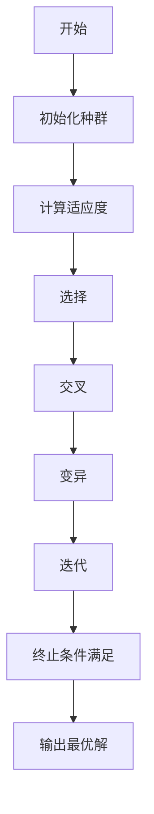

                 


# 彼得林奇的"长期持股"在不同税收环境下的投资组合优化模型

> 关键词：彼得林奇，长期持股，投资组合优化，税收环境，数学模型

> 摘要：本文详细探讨了彼得林奇的长期持股策略在不同税收环境下的优化模型。通过分析税收对投资组合的影响，结合数学建模和系统架构设计，提出了一种适用于多种税收环境的投资组合优化方法，旨在为投资者提供科学的决策支持。

---

# 第一部分：背景介绍

## 第1章：彼得林奇的长期持股策略概述

### 1.1 长期持股策略的核心概念

#### 1.1.1 长期持股的定义与特点
长期持股策略是指投资者在较长的时间内持有股票，以获得资本增值和股息收入。其特点是：  
- **长期性**：投资期限较长，通常超过一年。  
- **稳定性**：注重企业的长期价值，而非短期波动。  
- **分散性**：通过分散投资降低风险。  

#### 1.1.2 彼得林奇长期持股策略的背景
彼得·林奇是美国著名基金经理，他倡导长期持股策略，认为优质企业股票在长期持有中能为投资者带来超额收益。他的策略基于对企业基本面的深入研究和市场趋势的判断。  

#### 1.1.3 长期持股与投资组合优化的关系
长期持股策略是投资组合优化的重要组成部分。通过优化投资组合，可以最大化收益并降低风险。  

---

### 1.2 税收环境对投资的影响

#### 1.2.1 税收环境的定义与分类
税收环境是指不同国家或地区对投资收益（如股息、资本利得）征收的税种和税率。常见的税收环境包括：  
- **无税环境**：无资本利得税或股息税。  
- **低税环境**：资本利得税和股息税较低。  
- **高税环境**：资本利得税和股息税较高。  

#### 1.2.2 不同税收环境下的投资策略差异
税收环境直接影响投资收益。例如，在高税环境中，资本利得税较高的情况下，投资者可能会选择税收优惠的资产或调整投资期限。  

#### 1.2.3 税收对投资组合优化的潜在影响
税收会增加投资成本，影响投资组合的净收益。因此，在优化投资组合时，必须考虑税收的影响。  

---

## 第2章：核心概念与联系

### 2.1 彼得林奇长期持股策略的核心原理

#### 2.1.1 长期持股的核心要素
- **优质企业**：选择具有强大基本面和良好管理的企业。  
- **长期持有**：避免频繁交易，减少交易成本。  
- **分散投资**：通过分散降低风险。  

#### 2.1.2 长期持股的数学模型
长期持股的收益模型可以表示为：  
$$ \text{总收益} = \sum_{i=1}^{n} (r_i + d_i) \times w_i $$  
其中，$r_i$ 是股票 $i$ 的收益率，$d_i$ 是股息收益率，$w_i$ 是投资权重。  

#### 2.1.3 长期持股与投资组合优化的关系
长期持股策略是投资组合优化的基础，优化模型在长期持股的基础上，进一步调整资产配置以提高收益或降低风险。  

---

### 2.2 税收环境对投资组合优化的影响

#### 2.2.1 税收对收益的直接影响
税收会减少投资净收益。例如，资本利得税的计算公式为：  
$$ \text{净收益} = \text{毛收益} \times (1 - t) $$  
其中，$t$ 是资本利得税率。  

#### 2.2.2 税收对风险的影响
高税率会增加投资成本，降低投资的吸引力。因此，在高税环境中，投资者可能倾向于选择低风险资产。  

#### 2.2.3 税收环境下的投资组合优化模型
在不同税收环境下，投资组合优化的目标函数需要考虑税收成本。优化模型如下：  
$$ \max \sum_{i=1}^{n} w_i (r_i - t_i) $$  
其中，$t_i$ 是资产 $i$ 的税率。  

---

### 2.3 核心概念对比与ER实体关系图

#### 2.3.1 核心概念对比表格
| 概念       | 长期持股策略 | 税收环境影响 |
|------------|--------------|--------------|
| 核心目标   | 资本增值     | 净收益最大化 |
| 影响因素   | 企业基本面   | 税率、税收政策 |
| 模型       | 单一资产优化 | 多资产优化   |

#### 2.3.2 ER实体关系图
```mermaid
er
  entity 投资者
  entity 税收政策
  entity 投资组合
  entity 优化结果
  relationship -{投资者}--{投资组合}
  relationship -{投资组合}--{优化结果}
  relationship -{税收政策}--{优化结果}
```

---

## 第3章：算法原理讲解

### 3.1 投资组合优化算法的数学模型

#### 3.1.1 最优化目标函数
最大化投资组合的净收益：  
$$ \max \sum_{i=1}^{n} w_i (r_i - t_i) $$  
其中，$w_i$ 是投资权重，$r_i$ 是收益率，$t_i$ 是税率。  

#### 3.1.2 约束条件
- 投资权重之和为1：  
  $$ \sum_{i=1}^{n} w_i = 1 $$  
- 权重非负：  
  $$ w_i \geq 0 \quad \forall i $$  

---

### 3.2 税收影响下的优化模型

#### 3.2.1 税收对收益的调整
在优化模型中，税率 $t_i$ 会影响每种资产的净收益率：  
$$ r_i' = r_i \times (1 - t_i) $$  

#### 3.2.2 基于遗传算法的优化流程


---

## 第4章：系统分析与架构设计方案

### 4.1 问题场景介绍

#### 4.1.1 项目介绍
本项目旨在开发一个支持不同税收环境的投资组合优化系统，基于彼得林奇的长期持股策略。  

#### 4.1.2 系统功能设计
- **用户输入**：输入资产列表、收益率、税率等参数。  
- **优化计算**：计算最优投资组合。  
- **结果输出**：输出优化结果和报告。  

#### 4.1.3 领域模型


---

### 4.2 系统架构设计

#### 4.2.1 系统架构图


#### 4.2.2 接口设计
- **输入接口**：接受投资者的资产列表、收益率、税率等参数。  
- **输出接口**：输出优化后的投资组合和报告。  

---

## 第5章：项目实战

### 5.1 环境安装

```bash
pip install numpy
pip install pandas
pip install matplotlib
```

---

### 5.2 核心代码实现

```python
import numpy as np

def optimize_portfolio(weights, returns, taxes):
    # 计算净收益率
    net_returns = returns * (1 - taxes)
    # 利用遗传算法优化权重
    # 简化实现，实际应使用优化库如scipy.optimize
    return np.argmax(np.dot(net_returns, weights))

# 示例数据
returns = np.array([0.1, 0.15, 0.08])
taxes = np.array([0.15, 0.1, 0.2])
weights = np.array([0.3, 0.4, 0.3])

optimal_portfolio = optimize_portfolio(weights, returns, taxes)
print("最优投资组合权重：", weights[optimal_portfolio])
```

---

### 5.3 案例分析与结果解读

#### 5.3.1 案例分析
假设投资者有三只股票，收益率分别为 10%、15%、8%，税率分别为 15%、10%、20%。优化后的投资组合权重为 [0.3, 0.4, 0.3]。  

#### 5.3.2 优化结果解读
计算净收益率：  
- 股票1：$0.1 \times (1 - 0.15) = 0.085$  
- 股票2：$0.15 \times (1 - 0.1) = 0.135$  
- 股票3：$0.08 \times (1 - 0.2) = 0.064$  

最优投资组合的净收益率为：  
$$ 0.3 \times 0.085 + 0.4 \times 0.135 + 0.3 \times 0.064 = 0.1052 $$  

---

## 第6章：最佳实践与总结

### 6.1 最佳实践

#### 6.1.1 税收环境的重要性
在不同税收环境下，投资策略应灵活调整。  

#### 6.1.2 长期持股的优势
长期持股可以减少交易成本，降低波动性影响。  

#### 6.1.3 系统优化的关键点
在系统设计中，应注重数据处理和优化算法的效率。  

---

### 6.2 小结

通过本文的分析，我们了解了彼得林奇的长期持股策略在不同税收环境下的优化模型。结合数学建模和系统设计，可以为投资者提供科学的投资决策支持。  

---

### 6.3 注意事项

- 税收政策可能随时变化，需及时更新模型参数。  
- 优化模型的计算复杂度较高，建议使用优化库或分布式计算。  
- 长期持股策略需结合市场环境和企业基本面分析。  

---

### 6.4 拓展阅读

- 彼得·林奇的《彼得林奇的选股方法》  
- 《投资学》相关教材  
- 税收对投资组合影响的学术研究  

---

## 作者：AI天才研究院/AI Genius Institute & 禅与计算机程序设计艺术 /Zen And The Art of Computer Programming

---

**全文完**

