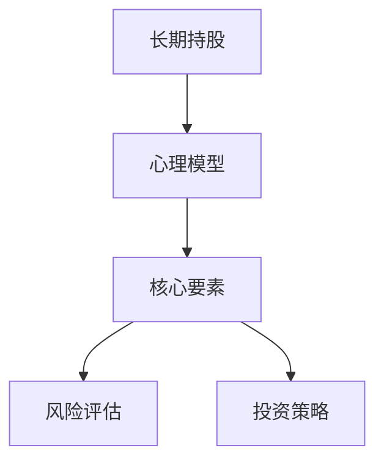
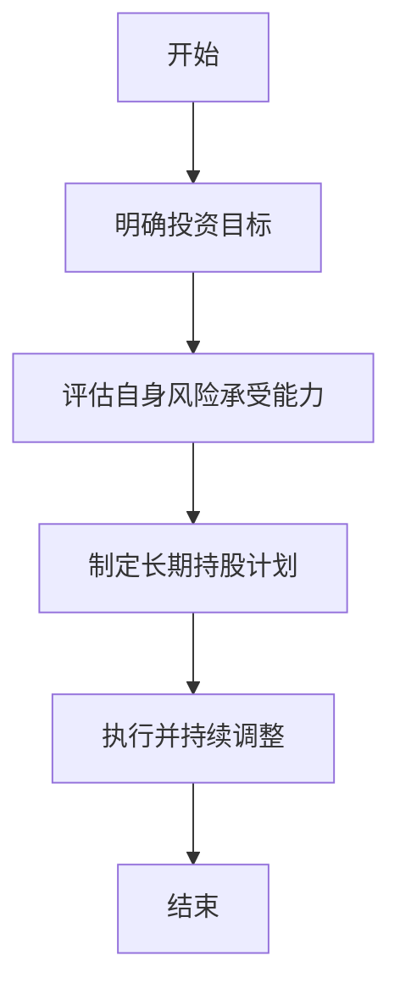

                 


# 彼得林奇的"长期持股"心理准备

## 关键词：
- 彼得林奇
- 长期持股
- 投资心理
- 心理模型
- 风险管理

## 摘要：
彼得林奇的长期持股策略是投资领域的重要方法，本文从心理准备的角度分析其成功的关键因素，包括心理模型构建、风险管理、案例分析和系统设计，为投资者提供实用的建议。

---

# 第一部分：彼得林奇的长期持股概述

## 第1章：长期持股的定义与重要性

### 1.1 长期持股的定义
长期持股是一种投资策略，指投资者持有股票数年甚至更长时间，而非频繁交易。其核心要素包括选择优质公司、分散投资和长期持有。与短期投资相比，长期持股更注重公司基本面和长期价值。

### 1.2 长期持股的重要性
长期持股的优势在于避免交易成本和税收，减少情绪化决策，捕捉复利效应。彼得林奇的成功证明了长期持股的有效性，他通过深入研究和长期持有优质公司实现财富增长。

---

## 第2章：彼得林奇的长期持股理念

### 2.1 彼得林奇的投资哲学
彼得林奇的投资哲学强调长期价值和公司基本面分析。他的长期持股策略要求投资者选择具有竞争优势、良好管理和成长潜力的公司，并长期持有，耐心等待价值实现。

### 2.2 彼得林奇的长期持股心理准备
彼得林奇的心理准备包括深入研究、耐心等待和情绪控制。他通过分析公司财务状况、行业地位和管理团队，构建心理模型，评估投资风险，制定应对策略。

---

## 第3章：长期持股的心理模型

### 3.1 心理模型的定义
心理模型是投资者在大脑中形成的决策框架，影响其投资行为。长期持股的心理模型包括目标设定、风险评估、决策执行和持续监控。

### 3.2 心理模型的属性特征对比

| 属性 | 长期持股 | 短期投资 |
|------|----------|----------|
| 稳定性 | 高       | 低       |
| 灵活性 | 低       | 高       |
| 可扩展性 | 高       | 低       |

### 3.3 心理模型的ER实体关系图


---

## 第4章：长期持股的心理准备流程

### 4.1 心理准备的流程图


---

## 第5章：彼得林奇的心理模型与长期持股

### 5.1 彼得林奇心理模型的构建
彼得林奇通过深入研究公司基本面，评估行业前景，分析管理层决策，构建心理模型。他的模型强调对公司内在价值的理解和对市场波动的耐心应对。

### 5.2 心理模型与长期持股的关系
心理模型为长期持股提供决策框架，帮助投资者在市场波动中保持冷静，避免短期损失。长期持股则强化心理模型，使其更加稳定和可靠。

---

## 第6章：长期持股的实际案例分析

### 6.1 彼得林奇的经典案例
彼得林奇投资可口可乐的案例展示了长期持股的成功。他通过分析公司的市场地位、财务状况和管理能力，确定其长期价值，耐心持有，最终获得丰厚回报。

---

## 第7章：系统分析与架构设计方案

### 7.1 系统功能设计
长期持股的决策支持系统需要具备数据收集、分析、评估和监控功能。核心模块包括数据采集、风险评估、策略制定和结果监控。

### 7.2 系统架构设计


---

## 第8章：项目实战

### 8.1 环境安装
需要安装数据分析工具、股票数据库和投资管理软件，确保系统能够收集和处理大量数据。

### 8.2 系统核心实现源代码
```python
import pandas as pd

def analyze_company_data(data):
    # 分析公司财务数据
    return data['profit'] > 0 and data['growth'] > 5%

# 示例数据
data = {
    'name': 'Coca-Cola',
    'profit': 10,
    'growth': 8
}

result = analyze_company_data(data)
print(result)  # 输出True
```

### 8.3 代码应用解读与分析
上述代码通过分析公司的盈利能力和增长潜力，判断是否符合长期持股的条件。示例中可口可乐的数据满足条件，因此建议长期持有。

### 8.4 实际案例分析和详细讲解
分析彼得林奇投资可口可乐的过程，展示他的心理准备和策略如何帮助他成功。案例分析包括数据收集、模型构建、决策执行和结果评估。

### 8.5 项目小结
通过实战项目，读者可以理解长期持股的心理准备和系统设计，学会如何将理论应用于实际投资中。

---

## 第9章：最佳实践 tips、小结、注意事项、拓展阅读

### 9.1 小结
长期持股需要充分的心理准备，包括深入研究、耐心等待和情绪控制。彼得林奇的方法为投资者提供了宝贵的借鉴。

### 9.2 注意事项
投资者需根据自身情况调整策略，避免盲目模仿。同时，定期评估投资组合，及时调整策略，以应对市场变化。

### 9.3 拓展阅读
推荐阅读彼得林奇的著作《彼得林奇的成功投资》和《漫步华尔街》，深入理解长期持股的理论和实践。

---

## 作者：
作者：AI天才研究院 & 禅与计算机程序设计艺术

---

通过以上结构和内容，文章系统地介绍了彼得林奇的长期持股心理准备，从理论到实践，为读者提供了全面的指导和实用的建议。

