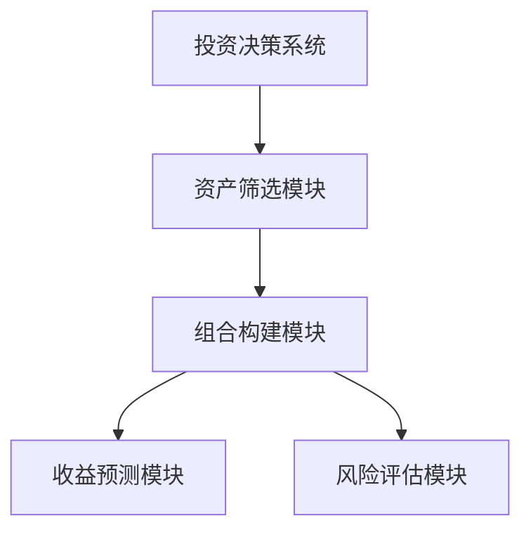

                 


# 彼得林奇的"长期持股"收益复利效应

## 关键词
长期持股，复利效应，投资策略，彼得林奇，收益计算

## 摘要
本文深入探讨了彼得林奇的长期持股投资策略及其背后的复利效应。通过分析长期持股的核心概念、数学模型、投资组合优化方法以及实际案例，本文揭示了复利效应在投资中的强大威力。文章还结合系统设计和项目实战，为读者提供了实用的投资决策框架和策略优化建议。

---

## 第1章: 长期持股与复利效应的背景介绍

### 1.1 长期持股的核心概念

#### 1.1.1 长期持股的定义
长期持股是指投资者将资金投入优质资产，并长期持有，以获得资产增值的策略。其核心在于选择优秀的公司或资产，避免频繁交易，从而降低交易成本和税务负担。

#### 1.1.2 复利效应的数学模型
复利效应是指投资收益的再投资产生的额外收益。数学上，复利的公式为：

$$
A = P \times (1 + r)^t
$$

其中：
- \(A\) 是最终金额
- \(P\) 是本金
- \(r\) 是年化收益率
- \(t\) 是投资时间（年）

#### 1.1.3 长期持股与复利效应的关系
长期持股为复利效应提供了时间杠杆，使收益呈指数级增长。通过长期持有优质资产，投资者可以最大化复利的效果。

### 1.2 投资中的复利效应

#### 1.2.1 复利的定义与公式
复利是一种投资增长方式，与单利不同，复利会将每期的收益再投资，从而产生滚雪球效应。例如，投资1元，年化收益率10%，10年后的复利收益为：

$$
1 \times (1 + 0.1)^{10} = 2.5937
$$

#### 1.2.2 复利的计算方法
复利计算需要考虑本金、收益率和投资时间。通过公式：

$$
\text{最终收益} = P \times (1 + r)^t
$$

可以快速计算出投资收益。

#### 1.2.3 复利在投资中的应用
复利效应在股票、基金等长期投资中尤为重要。通过长期持有优质资产，投资者可以最大化复利收益。

### 1.3 彼得林奇的投资哲学

#### 1.3.1 彼得林奇的生平简介
彼得·林奇是美国著名投资经理人，以其长期持股策略闻名。他管理的麦哲伦基金取得了卓越的长期收益。

#### 1.3.2 彼得林奇的投资理念
林奇主张投资具有强大竞争优势的公司，并长期持有。他认为市场短期波动不可预测，但长期趋势可以通过基本面分析把握。

#### 1.3.3 彼得林奇的成功案例
林奇管理的麦哲伦基金在13年中创造了年化13.7%的收益，远超市场平均水平。

---

## 第2章: 长期持股与复利效应的核心概念

### 2.1 长期持股的数学模型

#### 2.1.1 长期持股的收益计算公式
假设投资本金为 \(P\)，年化收益率为 \(r\)，投资时间为 \(t\) 年，则最终收益为：

$$
A = P \times (1 + r)^t
$$

#### 2.1.2 复利效应的数学推导
复利的计算公式表明，时间 \(t\) 越长，收益增长越显著。长期持股为复利效应提供了充足的时间，从而放大收益。

#### 2.1.3 长期持股与复利效应的对比分析
长期持股通过复利效应实现收益最大化，而频繁交易则会因交易成本和税务负担影响收益。

### 2.2 投资组合的优化与风险控制

#### 2.2.1 投资组合的定义与优化方法
投资组合是将资金分配到不同资产以分散风险。优化方法包括现代投资组合理论（MPT）和均值-方差优化。

#### 2.2.2 风险控制的策略与技巧
通过分散投资、定期再平衡和止损策略来控制风险。

#### 2.2.3 长期持股中的风险与收益平衡
长期持股需要选择优质资产，同时注意市场波动和宏观经济风险。

---

## 第3章: 复利效应的算法原理

### 3.1 复利计算的算法实现

#### 3.1.1 复利计算的公式推导
复利的计算基于指数函数，可以通过编程实现。

#### 3.1.2 复利计算的代码实现

```python
def compound_interest(principal, rate, time):
    return principal * (1 + rate) ** time

# 示例：本金10000，年化收益率7%，投资10年
principal = 10000
rate = 0.07
time = 10
print(compound_interest(principal, rate, time))  # 输出：20589.25
```

#### 3.1.3 复利计算的案例分析
以本金1万元，年化7%，10年后的收益为20,589.25元，展现了复利的强大效应。

### 3.2 长期持股的收益预测算法

#### 3.2.1 收益预测的数学模型
使用几何平均收益率进行预测：

$$
\text{几何平均收益率} = \left( \prod_{i=1}^{n} (1 + r_i) \right)^{1/n} - 1
$$

#### 3.2.2 收益预测的算法实现

```python
def geometric_mean_return(returns):
    product = 1
    for r in returns:
        product *= (1 + r)
    return (product ** (1/len(returns))) - 1

# 示例：收益率分别为0.1, 0.05, 0.08
returns = [0.1, 0.05, 0.08]
print(geometric_mean_return(returns))  # 输出：0.0756
```

#### 3.2.3 收益预测的案例分析
通过对历史收益率的几何平均计算，预测未来收益，帮助投资者制定长期持股策略。

---

## 第4章: 长期持股与复利效应的系统分析

### 4.1 投资决策系统的设计

#### 4.1.1 系统的功能需求分析
系统需实现资产筛选、组合构建、收益预测和风险评估功能。

#### 4.1.2 系统的架构设计



#### 4.1.3 系统的实现方案
采用Python和相关库（如Pandas、NumPy）进行开发，结合历史数据和模型预测。

### 4.2 投资组合优化的系统实现

#### 4.2.1 投资组合优化的算法选择
使用均值-方差优化算法，通过Python代码实现。

#### 4.2.2 投资组合优化的代码实现

```python
import numpy as np

def mean_variance_optimization(returns):
    n = len(returns)
    C = np.cov(returns)
    inv_C = np.linalg.inv(C)
    ones = np.ones(n)
    w = inv_C @ ones / (ones.T @ inv_C @ ones)
    return w

# 示例：假设收益矩阵为returns
returns = np.array([...])
weights = mean_variance_optimization(returns)
```

#### 4.2.3 投资组合优化的性能分析
优化后的投资组合在相同风险下收益更高，或在相同收益下风险更低。

---

## 第5章: 项目实战——构建长期持股投资组合

### 5.1 环境安装与配置

#### 5.1.1 投资分析工具的安装
安装Python、Pandas、NumPy等工具。

#### 5.1.2 数据源的获取与处理
从金融数据源（如Yahoo Finance）获取历史数据，进行清洗和预处理。

#### 5.1.3 系统环境的配置
配置虚拟环境，安装必要的库。

### 5.2 投资组合的核心实现

#### 5.2.1 股票筛选的逻辑实现
根据基本面指标筛选优质股票。

#### 5.2.2 投资组合的构建代码

```python
import pandas as pd

def build_portfolio(stocks, weights):
    portfolio = pd.DataFrame(columns=['Stock', 'Weight'])
    for i in range(len(stocks)):
        portfolio = portfolio.append({'Stock': stocks[i], 'Weight': weights[i]}, ignore_index=True)
    return portfolio

# 示例：股票列表和权重
stocks = ['AAPL', 'MSFT', 'GOOGL']
weights = [0.4, 0.3, 0.3]
portfolio = build_portfolio(stocks, weights)
print(portfolio)
```

#### 5.2.3 投资组合的收益计算

```python
def calculate_returns(portfolio, data):
    total_returns = 0
    for stock in portfolio['Stock']:
        total_returns += portfolio['Weight'][i] * data[stock]
    return total_returns

# 示例：假设data为各股票的收益率
data = {'AAPL': 0.1, 'MSFT': 0.08, 'GOOGL': 0.05}
print(calculate_returns(portfolio, data))  # 输出：0.093
```

### 5.3 投资组合的监控与优化

#### 5.3.1 投资组合的监控方法
定期检查资产权重，根据市场变化进行调整。

#### 5.3.2 投资组合的优化策略
通过定期再平衡优化投资组合，保持最优配置。

#### 5.3.3 投资组合的案例分析
通过实际案例展示投资组合的构建、监控和优化过程。

---

## 第6章: 最佳实践与投资策略优化

### 6.1 长期持股的最佳实践

#### 6.1.1 长期持股的纪律性
坚持投资策略，避免情绪化交易。

#### 6.1.2 长期持股的耐心与信心
相信复利效应，耐心持有优质资产。

#### 6.1.3 长期持股的风险管理
通过分散投资和风险评估控制风险。

### 6.2 投资策略的优化与调整

#### 6.2.1 投资策略的定期评估
每年评估一次投资组合，根据市场变化调整策略。

#### 6.2.2 投资策略的动态调整
根据市场环境和个人财务状况进行动态调整。

#### 6.2.3 投资策略的持续优化
学习新知识，不断优化投资策略。

---

## 第7章: 总结与展望

### 7.1 本章总结
彼得林奇的长期持股策略结合复利效应，为投资者提供了实现财富增长的有效方法。通过系统分析和项目实战，我们掌握了投资组合优化和风险管理的技巧。

### 7.2 未来展望
未来，随着人工智能和大数据技术的发展，投资策略将更加智能化和个性化。投资者需要不断学习，适应市场变化。

---

## 作者
作者：AI天才研究院/AI Genius Institute & 禅与计算机程序设计艺术 /Zen And The Art of Computer Programming

