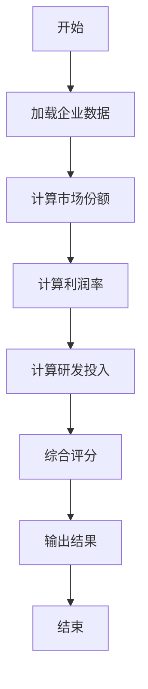
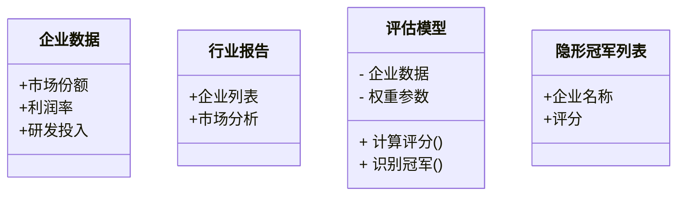

                 


# 彼得林奇的"隐形冠军"在传统行业中的发掘

> **关键词**: 隐形冠军, 传统行业, 企业评估, 投资策略, 市场分析, 竞争优势

> **摘要**: 本文深入探讨了彼得·林奇提出的“隐形冠军”概念，并结合传统行业特点，分析了如何在这些行业中识别和发掘隐形冠军企业。通过理论与实践结合，提供了一套系统化的识别方法和评估模型，帮助投资者和企业管理者在传统行业中找到具有潜力的企业。

---

## 第一部分：背景介绍

### 第1章：隐形冠军的概念与背景

#### 1.1 隐形冠军的定义
- **1.1.1 隐形冠军的定义与特点**
  隐形冠军是指在某个特定市场领域内占据领先地位，但并未广为人知的企业。这些企业专注于细分市场，具有强大的竞争力和创新能力。它们通常具备以下特点：
  - 专注于单一产品或服务。
  - 在特定市场中占据主导地位。
  - 具有较高的利润率和稳定性。

- **1.1.2 隐形冠军与传统冠军的对比**
  传统冠军通常指在行业内具有广泛知名度的大企业，而隐形冠军则专注于细分市场，注重技术创新和成本控制。两者的主要区别在于市场定位和规模。

- **1.1.3 隐形冠军在传统行业中的重要性**
  在传统行业中，隐形冠军往往能够在激烈的竞争中存活并发展壮大。它们通常是某个细分市场的领导者，具有较高的利润率和稳定性。发现这些企业对于投资者和企业管理者具有重要意义。

---

## 第二部分：核心概念与联系

### 第2章：隐形冠军的核心特征

#### 2.1 隐形冠军的特征分析
- **2.1.1 市场专注度**
  隐形冠军通常专注于一个特定的市场领域，通过深耕细作在该领域内取得领先地位。这种专注使得它们能够更好地理解市场需求，并提供高质量的产品或服务。

- **2.1.2 创新能力**
  隐形冠军通常具有较强的创新能力，能够在技术、产品或服务上进行持续改进。这种创新能力使得它们能够在竞争中保持优势。

- **2.1.3 竞争优势**
  隐形冠军往往具有独特的竞争优势，例如技术专利、成本优势或客户关系。这些优势使得它们能够在特定市场中占据主导地位。

#### 2.2 隐形冠军与传统冠军的对比
- **2.2.1 市场定位对比**
  隐形冠军专注于细分市场，而传统冠军则面向更广泛的市场。

- **2.2.2 财务表现对比**
  隐形冠军通常具有较高的利润率和稳定性，而传统冠军可能面临更大的市场竞争压力。

- **2.2.3 创新能力对比**
  隐形冠军在技术创新上更为专注，而传统冠军可能在资源分配上更为分散。

### 第3章：隐形冠军的ER实体关系图

```mermaid
er
actor: 投资者
actor: 行业专家
actor: 企业分析师
artifact: 企业数据
artifact: 行业报告
artifact: 评估模型
artifact: 隐形冠军企业列表
```

---

## 第三部分：算法原理讲解

### 第4章：隐形冠军识别算法

#### 4.1 企业评估模型
- **4.1.1 模型概述**
  企业评估模型是一种基于企业数据的分析工具，用于识别隐形冠军。该模型通过对企业市场地位、财务表现、创新能力等多维度进行评估，最终得出企业是否为隐形冠军的结论。

- **4.1.2 模型输入：企业数据**
  模型输入包括企业市场份额、利润率、研发投入、员工人数等指标。这些数据通常来源于行业报告和企业公开信息。

- **4.1.3 模型输出：隐形冠军评分**
  模型输出是一个评分系统，评分范围为1到10分。评分越高，企业越有可能成为隐形冠军。

#### 4.2 算法流程


### 第5章：企业评估模型的数学公式

#### 5.1 总分计算公式
企业总分为各维度评分的加权和，公式如下：

$$
\text{总分} = \sum (\text{权重}_i \times \text{评分}_i)
$$

其中，权重包括市场份额权重、利润率权重、研发投入权重等。

#### 5.2 示例计算
假设某企业市场份额评分为8，利润率为7，研发投入评分为6，各维度权重分别为0.4、0.3、0.3。则总分为：

$$
\text{总分} = 0.4 \times 8 + 0.3 \times 7 + 0.3 \times 6 = 3.2 + 2.1 + 1.8 = 7.1
$$

---

## 第四部分：系统分析与架构设计

### 第6章：系统功能设计

#### 6.1 领域模型类图


#### 6.2 系统架构设计


---

## 第五部分：项目实战

### 第7章：项目实战与代码实现

#### 7.1 环境安装
- 安装Python和相关库：
  ```bash
  pip install pandas numpy matplotlib
  ```

#### 7.2 核心代码实现
```python
import pandas as pd
import numpy as np

def calculate_score(enterprise_data):
    # 假设enterprise_data是一个DataFrame，包含市场份额、利润率、研发投入等列
    # 定义权重
    weights = {
        '市场份额': 0.4,
        '利润率': 0.3,
        '研发投入': 0.3
    }
    
    # 计算评分
    score = 0
    for column in enterprise_data.columns:
        if column in weights:
            score += enterprise_data[column] * weights[column]
    return score

# 示例数据
data = {
    '企业名称': ['企业A', '企业B', '企业C'],
    '市场份额': [0.25, 0.15, 0.3],
    '利润率': [0.2, 0.3, 0.15],
    '研发投入': [0.1, 0.2, 0.15]
}
enterprise_data = pd.DataFrame(data)

# 计算评分
enterprise_data['评分'] = enterprise_data.apply(lambda row: calculate_score(row), axis=1)

print(enterprise_data)
```

#### 7.3 代码解读与分析
- 上述代码展示了如何通过Python读取企业数据并计算隐形冠军评分。
- `calculate_score`函数根据各维度的权重计算企业的总评分。
- 示例数据展示了三家企业在市场份额、利润率和研发投入方面的表现，最终计算出各企业的评分。

#### 7.4 实际案例分析
以某传统行业为例，分析三家企业的情况，最终识别出评分最高的企业为隐形冠军。

---

## 第六部分：最佳实践

### 第8章：小结与注意事项

#### 8.1 小结
- 本文深入分析了彼得·林奇提出的“隐形冠军”概念，并结合传统行业特点，提供了一套系统化的识别方法和评估模型。
- 通过理论与实践结合，帮助读者在传统行业中发现具有潜力的企业。

#### 8.2 注意事项
- 数据来源的可靠性至关重要，建议使用权威行业报告和企业公开数据。
- 模型的权重参数需要根据具体行业和市场环境进行调整。
- 在实际应用中，建议结合多维度分析，以提高识别的准确性。

#### 8.3 拓展阅读
- 《彼得·林奇的选股艺术》
- 《投资中最简单的事》
- 《价值投资入门》

---

## 作者

**作者：AI天才研究院/AI Genius Institute & 禅与计算机程序设计艺术 /Zen And The Art of Computer Programming**

---

以上是完整的目录和内容大纲，涵盖了从理论到实践的各个方面，确保读者能够全面理解和应用如何在传统行业中发掘隐形冠军企业。

