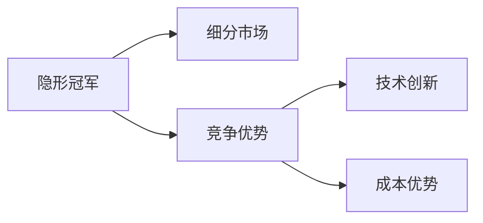
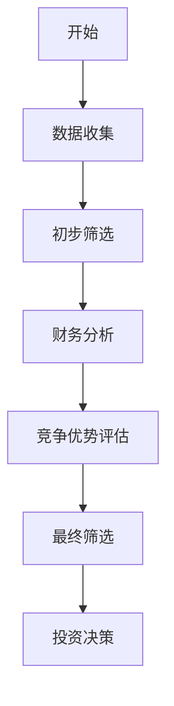
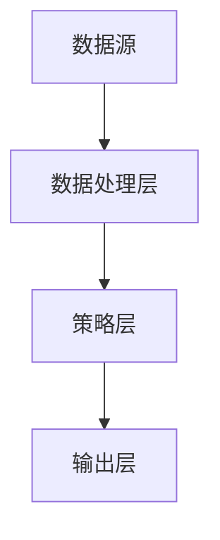
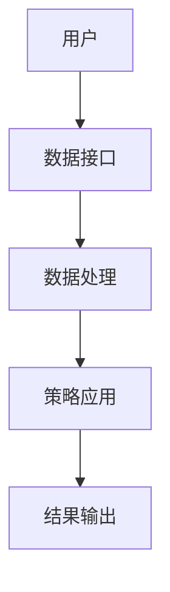

                 


# 彼得林奇的"隐形冠军"在新兴市场中的发掘技巧

## 关键词：彼得林奇、隐形冠军、新兴市场、投资策略、企业识别

## 摘要：  
本文探讨了如何在新兴市场中发现和投资“隐形冠军”企业。通过分析彼得林奇的投资理念，结合隐形冠军企业的定义和特征，本文提供了系统化的识别方法和策略，包括财务指标分析、市场定位评估和竞争优势识别。同时，文章通过实际案例和系统架构设计，详细阐述了在新兴市场中发掘隐形冠军的实战技巧，为投资者提供了实用的指导。

---

## 第一部分：背景介绍

### 第1章：彼得林奇的投资理念

#### 1.1 彼得林奇的投资风格  
彼得林奇是全球著名投资家，以其在富达投资公司的长期任职中创造了卓越的投资业绩而闻名。他强调长期投资、深入研究和选择具有强大竞争优势的企业。他的投资理念以“寻找那些具有持续竞争优势且管理良好的企业”为核心，尤其擅长发现那些在细分市场中占据领先地位的“隐形冠军”。

#### 1.2 隐形冠军的定义  
隐形冠军是指那些在特定细分市场中占据领先地位，但未被广泛认知的企业。这些企业通常专注于某一领域，具有强大的市场竞争力和独特的竞争优势。隐形冠军的关键在于它们在细分市场的统治地位和持续的创新能力。

#### 1.3 新兴市场的特点  
新兴市场通常具有快速的经济增长、多样化的产业结构和大量的未被充分开发的投资机会。这些市场的特点为隐形冠军的出现提供了良好的环境，同时也带来了更多的挑战和不确定性。

---

### 第2章：隐形冠军的核心要素

#### 2.1 隐形冠军的市场定位  
隐形冠军通常专注于某个细分市场，通过专注于特定领域来建立市场领先地位。它们的市场定位不仅限于单一市场，还包括全球化视角下的区域市场。

#### 2.2 隐形冠军的竞争优势  
隐形冠军的核心竞争力在于其独特的商业模式、技术创新能力和成本优势。这些企业在技术研发、供应链管理和客户服务方面具有显著优势。

#### 2.3 隐形冠军的财务特征  
隐形冠军通常表现出健康的财务状况，包括稳定的盈利能力、合理的负债水平和良好的现金流。这些财务指标是判断隐形冠军的重要依据。

---

## 第二部分：核心概念与联系

### 第3章：隐形冠军的核心要素

#### 3.1 隐形冠军的特点  
隐形冠军的特点包括市场专注、竞争优势显著和财务健康。这些特点使其能够在细分市场中持续增长并抵御竞争压力。

#### 3.2 隐形冠军与传统冠军的对比  
| 特性            | 隐形冠军                     | 传统冠军                     |
|-----------------|------------------------------|------------------------------|
| 市场定位         | 细分市场                    | 广泛市场                    |
| 市场地位         | 细分市场领导者               | 广泛市场领导者               |
| 创新能力         | 高                          | 中                          |
| 规模             | 小到中等                    | 大                          |

#### 3.3 实体关系架构  


---

## 第三部分：算法原理

### 第4章：隐形冠军的识别方法

#### 4.1 筛选隐形冠军的指标  
筛选隐形冠军的关键指标包括：
- 净利润率（Net Profit Margin）
- 市盈率（P/E Ratio）
- 市净率（P/B Ratio）
- 负债率（Debt-to-Equity Ratio）

#### 4.2 筛选流程  


#### 4.3 代码实现  
```python
import pandas as pd

def is_invisible_champion(df):
    df = df[df['Market Cap'] < 1000000000]  # 排除大公司
    df = df[df['Net Profit Margin'] > 15]  # 净利润率高于15%
    df = df[df['P/E Ratio'] < 20]  # 市盈率低于20
    df = df[df['Debt-to-Equity Ratio'] < 1]  # 负债率低于1
    return df

# 示例数据
data = {'Company': ['A', 'B', 'C', 'D'],
        'Market Cap': [500000000, 2000000000, 800000000, 100000000],
        'Net Profit Margin': [20, 10, 18, 15],
        'P/E Ratio': [15, 18, 25, 18],
        'Debt-to-Equity Ratio': [0.5, 1.2, 0.8, 0.6]}
df = pd.DataFrame(data)
result = is_invisible_champion(df)
print(result)
```

---

## 第四部分：系统分析与架构设计

### 第5章：系统架构设计

#### 5.1 投资策略分析  
新兴市场的投资策略需要考虑市场波动、政策变化和企业基本面。隐形冠军的识别需要结合定量分析和定性研究。

#### 5.2 系统架构设计  


#### 5.3 接口与交互设计  


---

## 第五部分：项目实战

### 第6章：项目实战

#### 6.1 环境安装  
安装Python和必要的数据处理库：
```bash
pip install pandas numpy matplotlib
```

#### 6.2 核心代码实现  
```python
import pandas as pd

def analyze_invisible_champions(dataframe):
    # 计算ROE
    dataframe['ROE'] = dataframe['Net Income'] / dataframe['Equity']
    # 筛选ROE高于行业平均的公司
    industry_avg = dataframe['ROE'].mean()
    filtered = dataframe[dataframe['ROE'] > industry_avg]
    return filtered

# 示例数据
data = {
    'Company': ['Tech Corp', 'Growth Inc', 'Stable Co'],
    'Net Income': [100, 150, 80],
    'Equity': [500, 600, 400]
}
df = pd.DataFrame(data)
result = analyze_invisible_champions(df)
print(result)
```

#### 6.3 案例分析  
以某新兴市场的科技公司为例，分析其是否为隐形冠军。通过财务指标和市场定位的评估，得出结论。

---

## 第六部分：最佳实践

### 第7章：总结与展望

#### 7.1 小结  
隐形冠军在新兴市场中的投资机会巨大，但需要投资者具备深入的行业分析能力和严谨的投资纪律。

#### 7.2 注意事项  
- 风险控制：避免过度集中投资。
- 数据准确性：确保数据来源可靠。
- 长期视角：耐心持有优质企业。

#### 7.3 拓展阅读  
推荐书籍：《彼得·林奇的成功投资》、《竞争优势》。

---

## 作者：AI天才研究院 & 禅与计算机程序设计艺术

---

通过以上结构和内容，文章系统地介绍了如何在新兴市场中发现和投资隐形冠军企业，结合理论分析和实战案例，为投资者提供了全面的指导。

