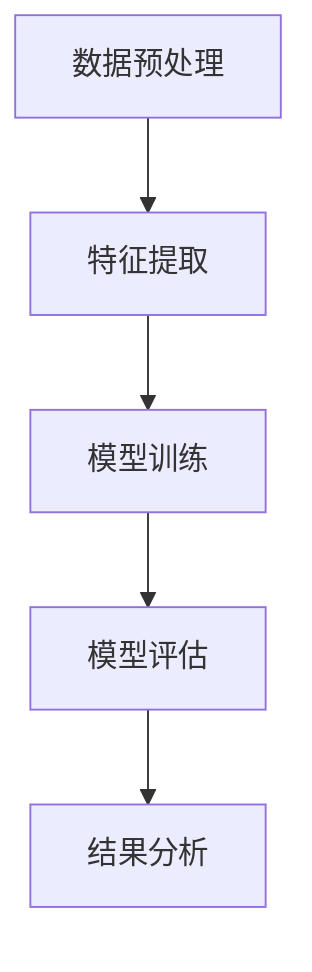
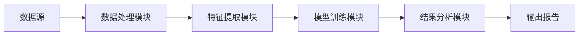
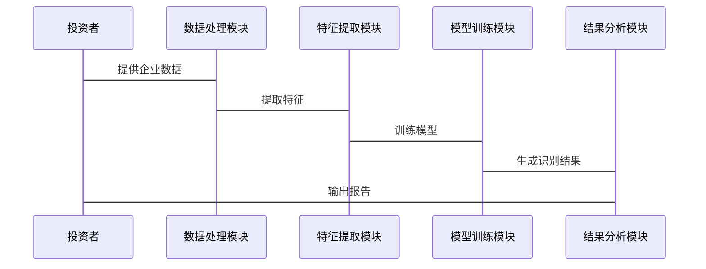

                 


# 彼得林奇的"隐形冠军"在新兴行业的识别

**关键词**：彼得·林奇，隐形冠军，新兴行业，投资策略，数据分析，机器学习

**摘要**：  
本文将探讨如何在新兴行业中识别彼得·林奇所提到的“隐形冠军”企业。通过分析隐形冠军的核心特征、数据挖掘与机器学习算法的应用，以及系统架构设计，本文将提供一种系统化的方法来识别这些企业在新兴市场中的潜在价值。文章结合实际案例，详细解释了从数据预处理到模型构建的全过程，并通过图表和代码示例，帮助读者理解如何在实践中应用这些方法。

---

## 第一部分: 背景介绍

### 第1章: 彼得·林奇与隐形冠军概述

#### 1.1 彼得·林奇的背景与投资理念  
彼得·林奇（Peter Lynch）是全球著名的职业投资人和对冲基金经理，以其在富达投资管理公司的长期任职期间取得了卓越的投资业绩。林奇的投资理念强调长期投资、深入研究和寻找具有持续竞争优势的企业。他认为，成功的投资不在于预测市场波动，而在于选择正确的公司，尤其是在其所属行业中占据领先地位的“隐形冠军”企业。

**隐形冠军**是指那些在特定市场或细分领域中占据领先地位，但并未被广泛认知的中小型企业。这些企业通常专注于某个 niche 市场，具有强大的市场占有率和竞争优势。

#### 1.2 新兴行业中的隐形冠军  
新兴行业是指近年来快速发展的行业，如人工智能、区块链、新能源等。在这些行业中，隐形冠军企业通常具有以下特征：  
1. **专注性**：专注于一个细分市场，深耕细作。  
2. **创新性**：具有独特的技术或商业模式。  
3. **成长性**：在市场中表现出较高的增长率。  
4. **隐蔽性**：尚未被主流市场发现或关注。  

#### 1.3 本章小结  
本章通过介绍彼得·林奇的投资理念，详细阐述了隐形冠军的定义和特征，并分析了其在新兴行业中的重要性。接下来，我们将深入探讨隐形冠军的核心概念与联系。

---

## 第二部分: 核心概念与联系

### 第2章: 隐形冠军的核心概念与联系

#### 2.1 隐形冠军的核心概念原理  
隐形冠军企业的核心在于其专注性和竞争优势。它们通常在某个细分市场中占据领先地位，具有强大的客户粘性和成本优势。与传统冠军企业相比，隐形冠军更注重长期稳健的增长，而非短期的爆发式增长。

**核心要素**：  
- 专注的市场定位。  
- 独特的技术或商业模式。  
- 高质量的产品或服务。  

#### 2.2 隐形冠军的核心属性特征对比  

| **属性**       | **隐形冠军**                     | **非隐形冠军**                     |
|-----------------|----------------------------------|------------------------------------|
| 市场定位         | 细分市场专注                    | 广泛市场覆盖                    |
| 成长性           | 高增长率                        | 增长率平稳或波动大                |
| 竞争优势         | 明显的护城河                    | 竞争优势不明显或同质化竞争        |
| 市场认知度       | 较低                            | 较高                            |

#### 2.3 隐形冠军的ER实体关系图  
```mermaid
er
actor: 投资者
actor: 企业
actor: 市场监管机构
```

---

## 第三部分: 算法原理讲解

### 第3章: 隐形冠军识别的算法原理

#### 3.1 数据挖掘与隐形冠军识别  
数据挖掘是识别隐形冠军的重要工具。通过对企业的财务数据、市场表现和行业趋势进行分析，可以发现潜在的隐形冠军。以下是关键步骤：  
1. **数据预处理**：清洗数据，处理缺失值和异常值。  
2. **特征提取**：提取企业的核心指标，如收入增长率、利润率、市场份额等。  
3. **模型训练**：使用机器学习算法对数据进行分类或回归分析。  

#### 3.2 机器学习算法在隐形冠军识别中的应用  
常用的算法包括：  
- **决策树**：适合分类问题，能够处理非线性关系。  
- **随机森林**：基于决策树的集成方法，具有较高的准确性和鲁棒性。  
- **支持向量机（SVM）**：适合小样本数据的分类问题。  

**算法选择与优化策略**：  
- 根据数据量和特征选择合适的算法。  
- 使用交叉验证评估模型性能。  
- 调参优化，如调整决策树的深度或随机森林的树数。  

#### 3.3 算法流程图  


#### 3.4 算法实现代码示例  
```python
# 示例代码：隐形冠军识别的分类算法
from sklearn.ensemble import RandomForestClassifier
from sklearn.model_selection import train_test_split
import pandas as pd

# 假设我们有一个数据框 df，包含企业的特征和标签（是否为隐形冠军）
df = pd.DataFrame({
    '收入增长率': [0.2, 0.15, 0.3, 0.25],
    '利润率': [0.1, 0.15, 0.08, 0.12],
    '市场份额': [0.05, 0.07, 0.03, 0.06],
    '是否隐形冠军': [1, 1, 0, 1]
})

# 数据分割
X = df.drop(columns='是否隐形冠军')
y = df['是否隐形冠军']
X_train, X_test, y_train, y_test = train_test_split(X, y, test_size=0.2, random_state=42)

# 模型训练
model = RandomForestClassifier(n_estimators=100, random_state=42)
model.fit(X_train, y_train)

# 模型预测
y_pred = model.predict(X_test)
print("预测结果:", y_pred)
print("真实标签:", y_test.values)
```

---

## 第四部分: 系统分析与架构设计

### 第4章: 隐形冠军识别的系统架构设计

#### 4.1 系统功能设计  
- **数据采集**：从多个数据源获取企业信息。  
- **特征提取**：提取企业的核心指标。  
- **模型训练**：构建分类或回归模型。  
- **结果分析**：输出识别结果并生成报告。  

#### 4.2 系统架构设计  


#### 4.3 系统接口设计  
- **输入接口**：接收企业数据和标签。  
- **输出接口**：返回识别结果和报告。  

#### 4.4 系统交互流程图  


---

## 第五部分: 项目实战

### 第5章: 项目实战与案例分析

#### 5.1 项目环境安装  
- 安装必要的库：`scikit-learn`, `pandas`, `mermaid`。  

#### 5.2 项目核心实现代码  
```python
# 示例代码：隐形冠军识别的分类算法
from sklearn.ensemble import RandomForestClassifier
from sklearn.model_selection import train_test_split
import pandas as pd

# 数据加载
df = pd.read_csv('企业数据.csv')

# 数据分割
X = df.drop(columns='是否隐形冠军')
y = df['是否隐形冠军']
X_train, X_test, y_train, y_test = train_test_split(X, y, test_size=0.2, random_state=42)

# 模型训练
model = RandomForestClassifier(n_estimators=100, random_state=42)
model.fit(X_train, y_train)

# 模型预测
y_pred = model.predict(X_test)
print("预测准确率:", model.score(X_test, y_test))
```

#### 5.3 项目小结  
通过实际案例分析，我们展示了如何利用机器学习算法识别隐形冠军企业。从数据预处理到模型训练，再到结果分析，整个过程清晰明了。

---

## 第六部分: 最佳实践

### 第6章: 最佳实践与总结

#### 6.1 小结  
本文通过理论分析和实际案例，详细介绍了如何在新兴行业中识别隐形冠军企业。结合彼得·林奇的投资理念，我们探讨了数据挖掘和机器学习在其中的应用。

#### 6.2 注意事项  
- 数据质量是关键，需确保数据的准确性和完整性。  
- 模型选择需根据实际数据特点进行调整。  
- 结果分析时，需结合行业背景进行验证。  

#### 6.3 拓展阅读  
- Peter Lynch的《投资最重要的事情》  
- 《机器学习实战》  

---

## 结语  
通过本文的系统分析和实践指导，读者可以掌握如何在新兴行业中识别隐形冠军企业，并将其应用于实际投资决策中。希望本文能为读者提供有价值的参考和启发。

---

**作者：AI天才研究院 & 禅与计算机程序设计艺术**

